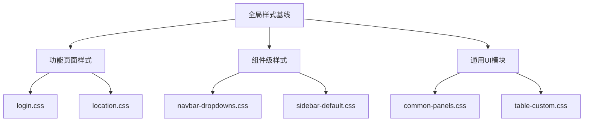
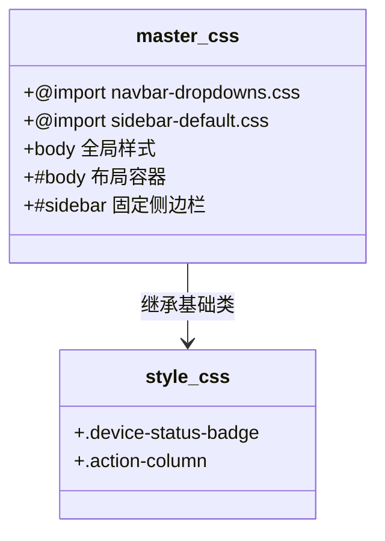
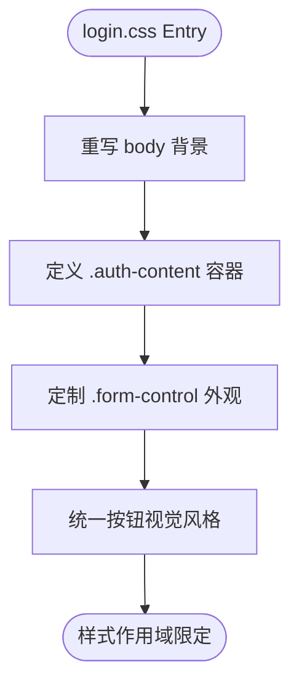
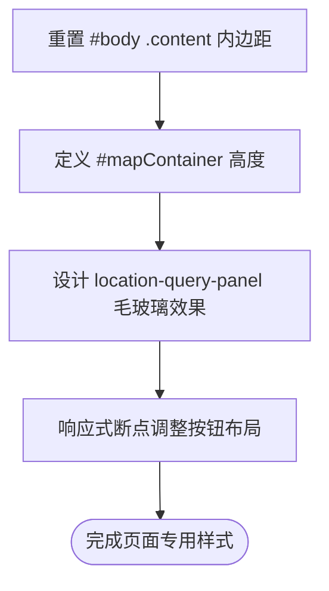
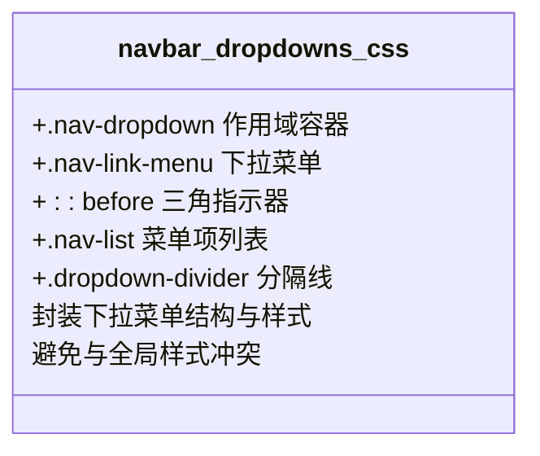
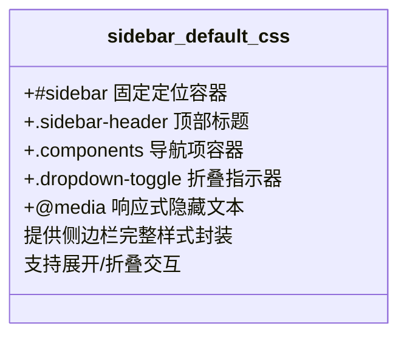
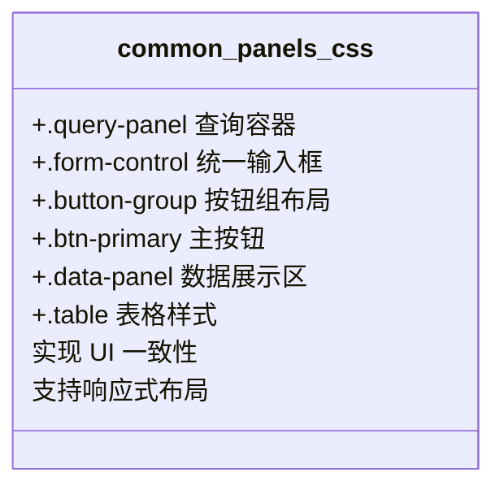
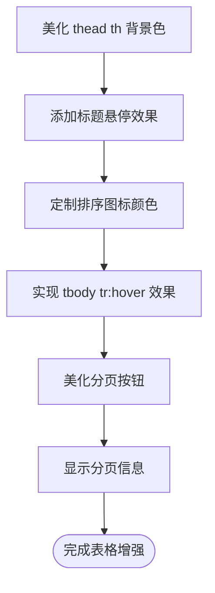
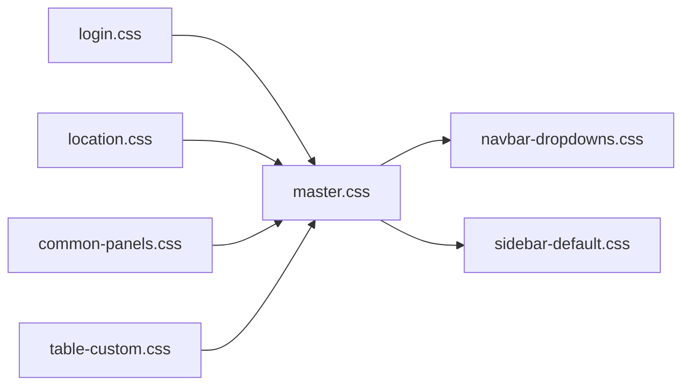

# CSS 架构

<cite>
**本文档引用文件**  
- [style.css](file://priv/assets/css/style.css)
- [master.css](file://priv/assets/css/master.css)
- [login.css](file://priv/assets/css/login.css)
- [location.css](file://priv/assets/css/location.css)
- [navbar-dropdowns.css](file://priv/assets/components/navbar/navbar-dropdowns.css)
- [sidebar-default.css](file://priv/assets/components/sidebar/sidebar-default.css)
- [common-panels.css](file://priv/assets/css/common-panels.css)
- [table-custom.css](file://priv/assets/css/table-custom.css)
</cite>

## 目录
1. [简介](#简介)
2. [项目结构](#项目结构)
3. [核心组件](#核心组件)
4. [架构概述](#架构概述)
5. [详细组件分析](#详细组件分析)
6. [依赖分析](#依赖分析)
7. [性能考虑](#性能考虑)
8. [故障排除指南](#故障排除指南)
9. [结论](#结论)

## 简介
本文档深入分析 eadm 前端项目的 CSS 架构设计，涵盖全局样式基线构建、页面级样式隔离、组件级样式封装、UI 一致性与可复用性设计，以及命名规范与响应式处理策略。

## 项目结构
项目采用模块化 CSS 组织方式，样式文件按功能和组件分离，确保高内聚、低耦合。

```mermaid
graph TB
subgraph "CSS"
master[main.css]
style[style.css]
common[common-panels.css]
table[table-custom.css]
login[login.css]
location[location.css]
end
subgraph "Components"
navbar[navbar-dropdowns.css]
sidebar[sidebar-default.css]
end
master --> |导入| navbar
master --> |导入| sidebar
common --> |定义| query-panel
common --> |定义| data-panel
```

**图示来源**  
- [master.css](file://priv/assets/css/master.css#L10-L11)
- [common-panels.css](file://priv/assets/css/common-panels.css#L1-L216)

**本节来源**  
- [master.css](file://priv/assets/css/master.css#L1-L481)
- [project_structure](file://.)

## 核心组件
分析项目中关键的 CSS 文件及其职责，包括全局样式、组件样式和页面专用样式。

**本节来源**  
- [style.css](file://priv/assets/css/style.css#L1-L38)
- [master.css](file://priv/assets/css/master.css#L1-L481)

## 架构概述
eadm 的 CSS 架构采用分层设计理念，分为全局基线、功能页面、组件封装和通用 UI 模块四个层级，确保样式可维护性和可扩展性。



**图示来源**  
- [master.css](file://priv/assets/css/master.css#L1-L481)
- [common-panels.css](file://priv/assets/css/common-panels.css#L1-L216)

## 详细组件分析

### 全局样式基线
通过 `style.css` 和 `master.css` 构建全局样式基线，定义字体、颜色、布局和默认组件样式。

#### 样式继承与覆盖
`master.css` 通过 `@import` 引入组件样式，并定义全局重置规则和布局容器，形成样式继承链。



**图示来源**  
- [master.css](file://priv/assets/css/master.css#L10-L481)
- [style.css](file://priv/assets/css/style.css#L1-L38)

**本节来源**  
- [master.css](file://priv/assets/css/master.css#L1-L481)
- [style.css](file://priv/assets/css/style.css#L1-L38)

### 页面级样式隔离
使用专用样式表（如 `login.css`、`location.css`）实现页面级样式隔离，避免全局污染。

#### 登录页面样式
`login.css` 重写 `body` 背景、按钮样式和表单控件，专用于登录界面。



**图示来源**  
- [login.css](file://priv/assets/css/login.css#L1-L116)

**本节来源**  
- [login.css](file://priv/assets/css/login.css#L1-L116)

#### 轨迹回放页面样式
`location.css` 覆盖默认内容区域，定义地图容器、查询面板和响应式布局。



**图示来源**  
- [location.css](file://priv/assets/css/location.css#L1-L155)

**本节来源**  
- [location.css](file://priv/assets/css/location.css#L1-L155)

### 组件级样式封装
组件样式（如 `navbar-dropdowns.css`、`sidebar-default.css`）通过作用域类名封装，避免全局冲突。

#### 导航栏下拉菜单
`navbar-dropdowns.css` 使用 `.nav-dropdown` 作为作用域前缀，封装下拉菜单的显示逻辑和视觉样式。



**图示来源**  
- [navbar-dropdowns.css](file://priv/assets/components/navbar/navbar-dropdowns.css#L1-L84)

**本节来源**  
- [navbar-dropdowns.css](file://priv/assets/components/navbar/navbar-dropdowns.css#L1-L84)

#### 侧边栏样式
`sidebar-default.css` 使用 `#sidebar` 作为作用域，定义侧边栏布局、滚动行为和交互反馈。



**图示来源**  
- [sidebar-default.css](file://priv/assets/components/sidebar/sidebar-default.css#L1-L100)

**本节来源**  
- [sidebar-default.css](file://priv/assets/components/sidebar/sidebar-default.css#L1-L100)

### 通用 UI 模块
`common-panels.css` 和 `table-custom.css` 提供可复用的 UI 模块，确保跨页面一致性。

#### 查询与数据面板
`common-panels.css` 定义 `.query-panel` 和 `.data-panel`，统一查询表单和数据表格的视觉风格。



**图示来源**  
- [common-panels.css](file://priv/assets/css/common-panels.css#L1-L216)

**本节来源**  
- [common-panels.css](file://priv/assets/css/common-panels.css#L1-L216)

#### 表格定制样式
`table-custom.css` 增强默认表格样式，提供悬停效果、分页美化和信息显示。



**图示来源**  
- [table-custom.css](file://priv/assets/css/table-custom.css#L1-L102)

**本节来源**  
- [table-custom.css](file://priv/assets/css/table-custom.css#L1-L102)

## 依赖分析
CSS 文件之间存在明确的依赖关系，确保样式加载顺序和作用域正确。



**图示来源**  
- [master.css](file://priv/assets/css/master.css#L10-L11)
- [login.css](file://priv/assets/css/login.css#L1-L116)

**本节来源**  
- [master.css](file://priv/assets/css/master.css#L1-L481)
- [login.css](file://priv/assets/css/login.css#L1-L116)

## 性能考虑
- 使用 `@import` 在主样式表中集中管理组件依赖
- 避免重复定义，通过继承减少 CSS 文件体积
- 响应式断点集中管理，提升维护性

## 故障排除指南
- **样式未生效**：检查作用域类名是否正确，确认文件是否被正确引入
- **样式冲突**：使用浏览器开发者工具检查选择器优先级，避免使用 `!important`
- **响应式失效**：验证媒体查询断点值是否与其他样式冲突

**本节来源**  
- [master.css](file://priv/assets/css/master.css#L450-L480)
- [location.css](file://priv/assets/css/location.css#L140-L155)

## 结论
eadm 的 CSS 架构通过模块化设计实现了良好的可维护性和可扩展性。建议新组件开发遵循 BEM 命名规范，使用 `common-panels.css` 中的通用类，并在专用样式表中定义页面特定样式。