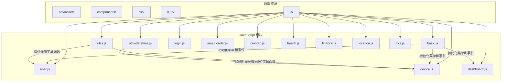
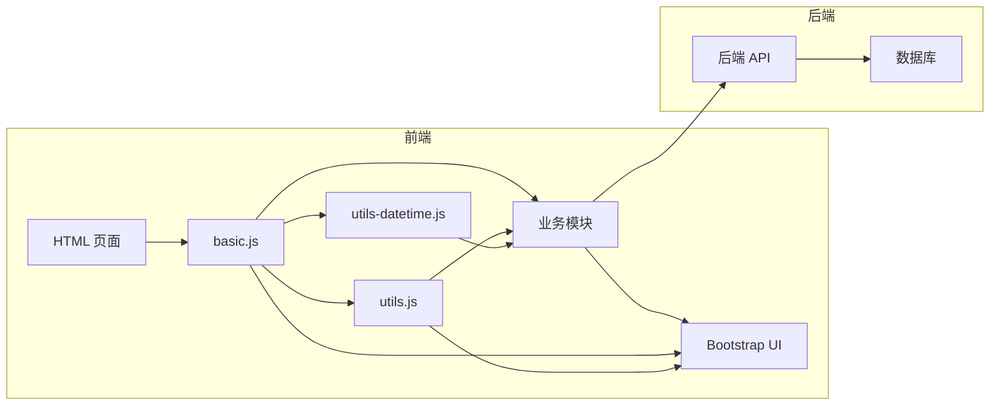
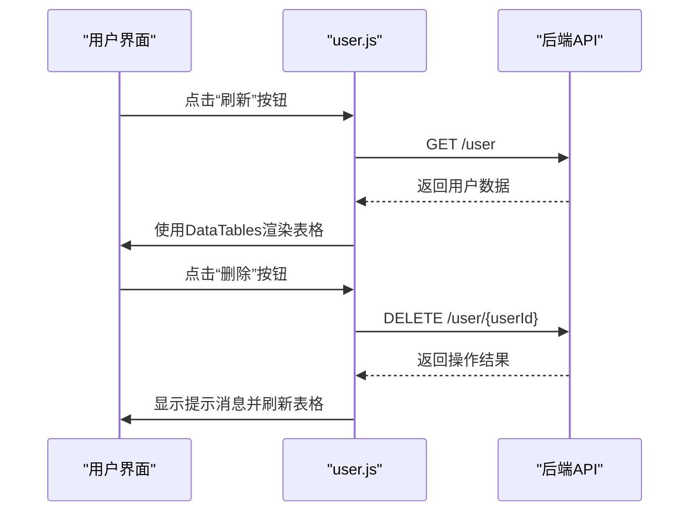
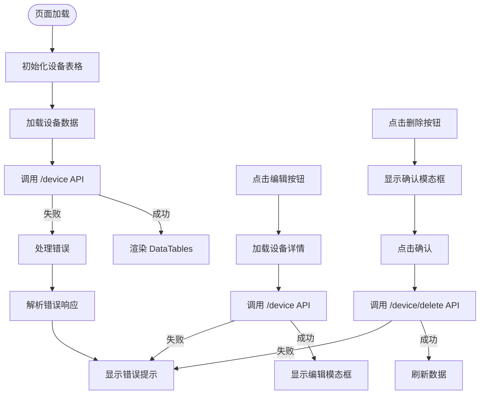
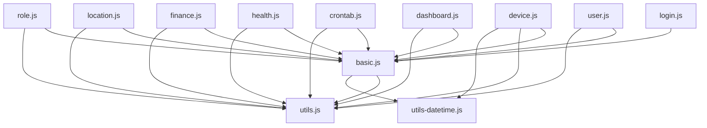

# JavaScript 模块

<cite>
**本文档中引用的文件**  
- [basic.js](file://priv/assets/js/basic.js)
- [utils.js](file://priv/assets/js/utils.js)
- [utils-datetime.js](file://priv/assets/js/utils-datetime.js)
- [user.js](file://priv/assets/js/user.js)
- [device.js](file://priv/assets/js/device.js)
- [dashboard.js](file://priv/assets/js/dashboard.js)
- [login.js](file://priv/assets/js/login.js)
</cite>

## 目录
1. [简介](#简介)
2. [项目结构](#项目结构)
3. [核心组件](#核心组件)
4. [架构概览](#架构概览)
5. [详细组件分析](#详细组件分析)
6. [依赖分析](#依赖分析)
7. [性能考虑](#性能考虑)
8. [故障排除指南](#故障排除指南)
9. [结论](#结论)

## 简介
本文档全面解析 eadm 项目的前端 JavaScript 模块体系。重点阐述 `basic.js` 作为基础加载器和 DOM 初始化的核心职责，以及 `utils.js` 和 `utils-datetime.js` 提供的通用函数（如 AJAX 封装、数据验证、时间格式化）如何被各业务模块复用。分析每个功能模块脚本（`user.js`、`device.js` 等）的结构设计，包括事件绑定、API 调用、数据渲染流程。说明模块间依赖关系与执行上下文管理。提供模块开发模板、异步请求错误处理、前端状态管理的最佳实践，并结合代码示例展示如何新增一个功能 JS 模块。

## 项目结构

**Diagram sources**
- [basic.js](file://priv/assets/js/basic.js#L1-L153)
- [utils.js](file://priv/assets/js/utils.js#L1-L135)
- [utils-datetime.js](file://priv/assets/js/utils-datetime.js#L1-L39)
- [user.js](file://priv/assets/js/user.js#L1-L555)
- [device.js](file://priv/assets/js/device.js#L1-L799)

**Section sources**
- [basic.js](file://priv/assets/js/basic.js#L1-L153)
- [utils.js](file://priv/assets/js/utils.js#L1-L135)
- [utils-datetime.js](file://priv/assets/js/utils-datetime.js#L1-L39)

## 核心组件

`basic.js` 是整个前端应用的入口点，负责初始化 DOM、加载用户权限菜单、绑定全局事件（如侧边栏切换、用户信息操作）以及设置页脚版权信息。它通过 `loadMemu()` 函数从 `/permission` 接口获取用户权限，并动态生成侧边栏导航菜单。`utils.js` 提供了通用的工具函数，如 `formatDateTime` 用于格式化日期时间，以及 `showSuccessToast`、`showWarningToast` 等用于显示不同类型的提示消息。`utils-datetime.js` 专注于时间处理，初始化时间选择器并提供 `formatDateToNearestTenMinutes` 函数用于将时间四舍五入到最近的十分钟。

**Section sources**
- [basic.js](file://priv/assets/js/basic.js#L1-L153)
- [utils.js](file://priv/assets/js/utils.js#L1-L135)
- [utils-datetime.js](file://priv/assets/js/utils-datetime.js#L1-L39)

## 架构概览

**Diagram sources**
- [basic.js](file://priv/assets/js/basic.js#L1-L153)
- [utils.js](file://priv/assets/js/utils.js#L1-L135)
- [utils-datetime.js](file://priv/assets/js/utils-datetime.js#L1-L39)

## 详细组件分析

### 用户管理模块分析

`user.js` 模块负责用户信息的管理，包括用户的增删改查、角色分配和密码重置。它依赖于 `basic.js` 进行页面初始化和事件绑定，依赖于 `utils.js` 进行提示消息的显示和日期格式化。模块通过 `loadUserData()` 函数从 `/user` 接口获取用户数据，并使用 DataTables 插件进行渲染。事件绑定通过 jQuery 的事件委托机制实现，例如 `dataTableUser.on('click', '.delete-user-btn', ...)` 处理删除按钮的点击事件。模块还通过 `loadUserRole()` 和 `loadRoleList()` 函数与角色管理功能进行交互。

**Diagram sources**
- [user.js](file://priv/assets/js/user.js#L1-L555)
- [basic.js](file://priv/assets/js/basic.js#L1-L153)
- [utils.js](file://priv/assets/js/utils.js#L1-L135)

**Section sources**
- [user.js](file://priv/assets/js/user.js#L1-L555)

### 设备管理模块分析

`device.js` 模块负责设备信息的管理，包括设备的增删改查、用户分配和状态切换。它同样依赖于 `basic.js` 和 `utils.js`，并且特别依赖于 `utils-datetime.js` 中的时间格式化函数 `formatDateTime`。模块使用 DataTables 插件初始化设备表格，并通过事件委托处理“编辑”、“删除”、“管理用户”等操作。模块通过 `loadDeviceData()`、`addDevice()`、`editDevice()` 等函数与后端 API 进行交互。错误处理在 `loadDeviceData()` 的 `error` 回调中实现，能够解析不同的 HTTP 状态码并显示相应的错误提示。

**Diagram sources**
- [device.js](file://priv/assets/js/device.js#L1-L799)
- [utils.js](file://priv/assets/js/utils.js#L1-L135)
- [utils-datetime.js](file://priv/assets/js/utils-datetime.js#L1-L39)

**Section sources**
- [device.js](file://priv/assets/js/device.js#L1-L799)

### 信息看板模块分析

`dashboard.js` 模块负责信息看板的数据加载和图表渲染。它依赖于 `basic.js` 进行页面初始化，并依赖于 `utils.js` 进行提示消息的显示。模块通过 `loadChart()` 函数从 `/dashboard` 接口获取数据，并使用 Chart.js 库创建柱状图和折线图来展示里程数和财务数据。数据渲染流程是直接的：获取数据 -> 更新 DOM 文本 -> 创建图表实例。

**Section sources**
- [dashboard.js](file://priv/assets/js/dashboard.js#L1-L115)

### 登录模块分析

`login.js` 模块负责用户登录功能。它依赖于 `basic.js` 进行页面初始化和事件绑定。模块通过 `login()` 函数向 `/login` 接口发送 POST 请求进行身份验证。它实现了良好的用户体验，例如在请求期间禁用登录按钮以防止重复提交，并支持回车键登录。错误处理在 `error` 回调中实现，能够显示网络错误提示。

**Section sources**
- [login.js](file://priv/assets/js/login.js#L1-L75)

## 依赖分析

**Diagram sources**
- [basic.js](file://priv/assets/js/basic.js#L1-L153)
- [utils.js](file://priv/assets/js/utils.js#L1-L135)
- [utils-datetime.js](file://priv/assets/js/utils-datetime.js#L1-L39)
- [user.js](file://priv/assets/js/user.js#L1-L555)
- [device.js](file://priv/assets/js/device.js#L1-L799)
- [dashboard.js](file://priv/assets/js/dashboard.js#L1-L115)
- [login.js](file://priv/assets/js/login.js#L1-L75)

**Section sources**
- [basic.js](file://priv/assets/js/basic.js#L1-L153)
- [utils.js](file://priv/assets/js/utils.js#L1-L135)
- [utils-datetime.js](file://priv/assets/js/utils-datetime.js#L1-L39)

## 性能考虑
- `basic.js` 中使用 `$.ajaxSetup({async:false})` 进行同步 AJAX 请求，这会阻塞 UI 线程，影响用户体验，应避免使用。
- 多个模块在页面加载时都调用 `loadXXXData()` 函数，可以考虑合并请求或使用缓存来优化。
- DataTables 的 `deferRender: true` 配置有助于提升大数据量下的渲染性能。

## 故障排除指南
- **菜单未加载**：检查 `basic.js` 中的 `loadMemu()` 函数是否执行，以及 `/permission` 接口是否返回正确的数据格式。
- **功能按钮无响应**：检查对应的事件绑定代码是否正确，确保 jQuery 选择器能够匹配到目标元素。
- **API 请求失败**：检查浏览器开发者工具的网络面板，查看请求的 URL、方法、参数和响应状态码，根据错误信息进行排查。
- **图表未显示**：检查 `dashboard.js` 中的 `loadChart()` 函数是否执行，以及 Chart.js 库是否正确加载。

## 结论
eadm 项目的前端 JavaScript 模块体系结构清晰，职责分明。`basic.js` 作为核心加载器，统一管理页面初始化和全局功能。`utils.js` 和 `utils-datetime.js` 提供了可复用的通用函数，提高了代码的可维护性。各个业务模块（如 `user.js`、`device.js`）遵循相似的设计模式，通过 AJAX 与后端交互，使用 DataTables 渲染数据，并通过事件委托处理用户交互。整体架构合理，易于扩展和维护。