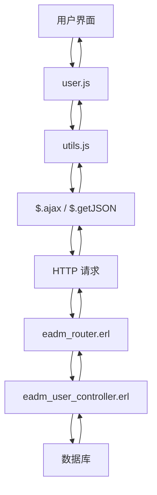
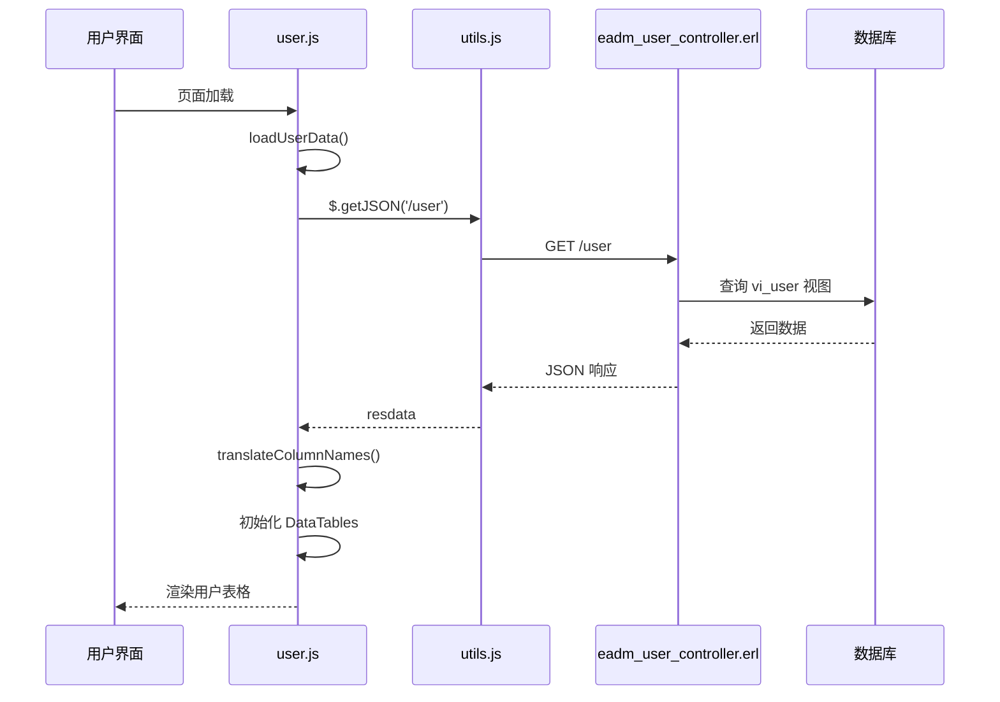
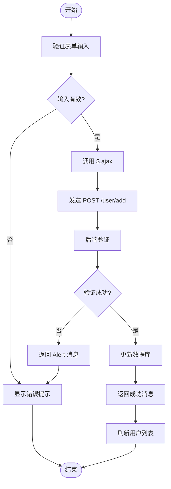
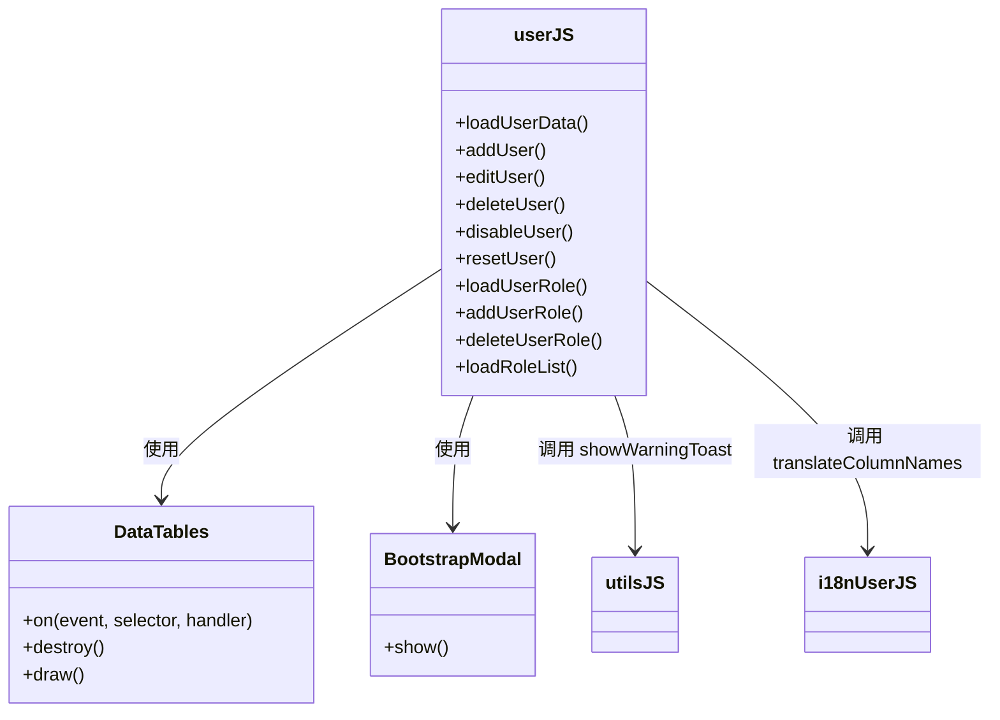
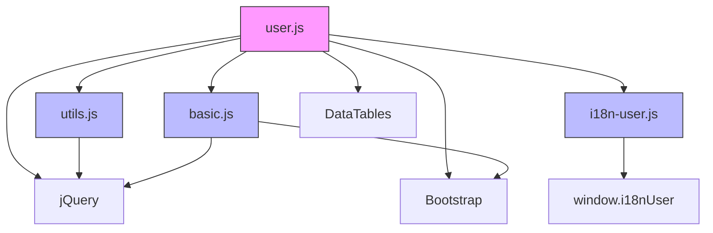

# 用户管理模块 (user.js)

<cite>
**本文档引用的文件**
- [user.js](file://priv/assets/js/user.js)
- [utils.js](file://priv/assets/js/utils.js)
- [basic.js](file://priv/assets/js/basic.js)
- [i18n-user.js](file://priv/assets/i18n/i18n-user.js)
- [eadm_user_controller.erl](file://src/controllers/eadm_user_controller.erl)
- [eadm_router.erl](file://src/eadm_router.erl)
</cite>

## 目录
1. [简介](#简介)
2. [项目结构](#项目结构)
3. [核心组件](#核心组件)
4. [架构概览](#架构概览)
5. [详细组件分析](#详细组件分析)
6. [依赖分析](#依赖分析)
7. [性能考虑](#性能考虑)
8. [故障排除指南](#故障排除指南)
9. [结论](#结论)

## 简介
本模块 `user.js` 是前端用户管理功能的核心实现，负责与后端 `eadm_user_controller.erl` 交互，完成用户列表加载、分页、表单验证、数据编辑回填、角色管理等核心功能。模块依赖 `utils.js` 提供的 AJAX 封装方法，通过 `basic.js` 实现 DOM 操作，并结合 `i18n-user.js` 支持多语言显示。本文档将深入解析其工作机制、事件绑定逻辑、错误处理机制及优化建议。

## 项目结构
用户管理功能分布在前端 JavaScript 模块和后端 Erlang 控制器中，通过 RESTful API 进行通信。

```mermaid
graph TB
subgraph "前端"
userJS[user.js]
utilsJS[utils.js]
basicJS[basic.js]
i18nUserJS[i18n-user.js]
end
subgraph "后端"
userController[eadm_user_controller.erl]
router[eadm_router.erl]
end
userJS --> utilsJS : 使用 AJAX 工具
userJS --> basicJS : 使用 DOM 操作
userJS --> i18nUserJS : 多语言支持
userJS --> userController : HTTP 请求
userController --> router : 路由映射
```

**图示来源**
- [user.js](file://priv/assets/js/user.js)
- [utils.js](file://priv/assets/js/utils.js)
- [basic.js](file://priv/assets/js/basic.js)
- [i18n-user.js](file://priv/assets/i18n/i18n-user.js)
- [eadm_user_controller.erl](file://src/controllers/eadm_user_controller.erl)
- [eadm_router.erl](file://src/eadm_router.erl)

## 核心组件
`user.js` 模块实现了用户管理的完整前端逻辑，包括数据加载、增删改查、状态切换和角色分配。其核心功能通过调用 `$.getJSON` 和 `$.ajax` 与后端交互，并利用 DataTables 插件实现表格渲染与分页。

**本节来源**
- [user.js](file://priv/assets/js/user.js#L1-L555)

## 架构概览
系统采用前后端分离架构，前端通过 REST API 与后端 Erlang 应用通信。前端模块职责分明，`user.js` 负责业务逻辑，`utils.js` 提供通用工具，`basic.js` 提供基础 DOM 支持，`i18n-user.js` 提供多语言翻译。



**图示来源**
- [user.js](file://priv/assets/js/user.js)
- [utils.js](file://priv/assets/js/utils.js)
- [eadm_router.erl](file://src/eadm_router.erl)
- [eadm_user_controller.erl](file://src/controllers/eadm_user_controller.erl)

## 详细组件分析

### 用户列表加载与分页
`loadUserData()` 函数通过 `$.getJSON('/user')` 获取用户数据，动态构建 DataTables 列定义，并根据 `i18n-user.js` 进行列名翻译。分页由 DataTables 插件在前端实现，配置 `pageLength: 10` 表示每页显示 10 条记录。



**图示来源**
- [user.js](file://priv/assets/js/user.js#L13-L55)
- [i18n-user.js](file://priv/assets/i18n/i18n-user.js)
- [eadm_user_controller.erl](file://src/controllers/eadm_user_controller.erl#L48-L69)

**本节来源**
- [user.js](file://priv/assets/js/user.js#L13-L55)
- [eadm_user_controller.erl](file://src/controllers/eadm_user_controller.erl#L48-L69)

### 表单验证与提交
用户新增和编辑功能在前端进行基本的非空验证，但核心验证（如登录名长度、唯一性、邮箱格式、密码强度）由后端 `eadm_user_controller.erl` 的 `add/1` 和 `edit/1` 函数完成。前端通过 `addUser()` 和 `editUser()` 函数提交数据。



**图示来源**
- [user.js](file://priv/assets/js/user.js#L57-L83)
- [eadm_user_controller.erl](file://src/controllers/eadm_user_controller.erl#L71-L158)

**本节来源**
- [user.js](file://priv/assets/js/user.js#L57-L83)
- [eadm_user_controller.erl](file://src/controllers/eadm_user_controller.erl#L71-L158)

### 数据编辑回填
当用户点击“编辑”按钮时，`edit-user-btn` 事件监听器会触发，从当前行的 DOM 元素中提取用户信息（如登录名、用户名、邮箱），并填充到编辑模态框的表单字段中，实现数据回填。

**本节来源**
- [user.js](file://priv/assets/js/user.js#L288-L295)

### 用户操作事件绑定
模块通过 jQuery 事件委托机制，为表格中的操作按钮绑定事件。所有操作（删除、禁用、重置、编辑角色、编辑信息）均通过 AJAX 调用后端 API 完成。



**图示来源**
- [user.js](file://priv/assets/js/user.js)
- [utils.js](file://priv/assets/js/utils.js)
- [i18n-user.js](file://priv/assets/i18n/i18n-user.js)

**本节来源**
- [user.js](file://priv/assets/js/user.js#L250-L348)

### 多语言支持
模块通过 `translateColumnNames()` 函数，利用 `i18n-user.js` 中定义的 `i18nUser.columnName` 对象，根据 `defaultLanguage` 变量（在 `basic.js` 中定义）将英文列名转换为中文或其他语言。

**本节来源**
- [user.js](file://priv/assets/js/user.js#L9-L11)
- [i18n-user.js](file://priv/assets/i18n/i18n-user.js)
- [basic.js](file://priv/assets/js/basic.js#L153)

## 依赖分析
`user.js` 模块具有清晰的依赖关系，确保了功能的模块化和可维护性。



**图示来源**
- [user.js](file://priv/assets/js/user.js)
- [utils.js](file://priv/assets/js/utils.js)
- [basic.js](file://priv/assets/js/basic.js)
- [i18n-user.js](file://priv/assets/i18n/i18n-user.js)

**本节来源**
- [user.js](file://priv/assets/js/user.js)
- [utils.js](file://priv/assets/js/utils.js)
- [basic.js](file://priv/assets/js/basic.js)
- [i18n-user.js](file://priv/assets/i18n/i18n-user.js)

## 性能考虑
当前实现使用前端分页，当用户数据量极大时，一次性加载所有数据可能导致性能问题。建议实现后端分页，仅请求当前页数据。此外，可考虑引入虚拟滚动（Virtual Scrolling）技术，仅渲染可视区域的行，大幅提升大数据量下的渲染性能。

## 故障排除指南
前端错误处理主要依赖后端返回的 `Alert` 字段。当操作失败时（如权限不足、数据验证失败），后端会在响应中包含 `Alert` 消息，前端通过 `showWarningToast()` 函数将其显示为警告提示。例如，当用户权限不足时，`eadm_user_controller.erl` 中的 `add/1` 函数会返回 `{json, [#{<<"Alert">> => "API鉴权失败！"}]}`，前端会显示“API鉴权失败！”的警告。

**本节来源**
- [user.js](file://priv/assets/js/user.js#L68-L73)
- [eadm_user_controller.erl](file://src/controllers/eadm_user_controller.erl#L78-L80)

## 结论
`user.js` 模块成功实现了用户管理的前端功能，通过清晰的 AJAX 调用与后端 `eadm_user_controller.erl` 交互。它有效利用了 `utils.js`、`basic.js` 和 `i18n-user.js` 的功能，构建了一个完整的、支持多语言的用户管理界面。未来优化方向包括实现后端分页和虚拟滚动以提升大数据场景下的性能。