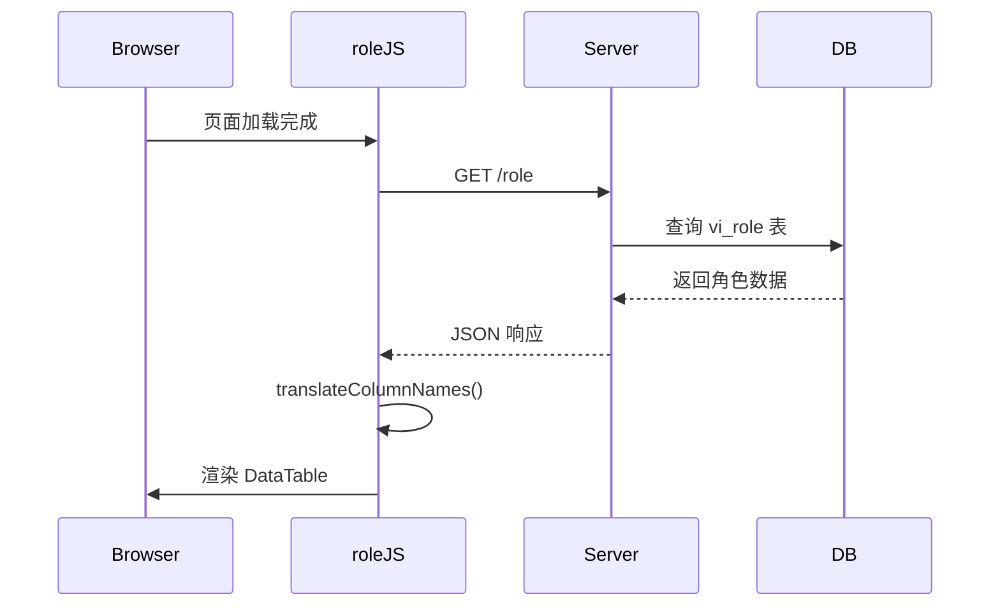
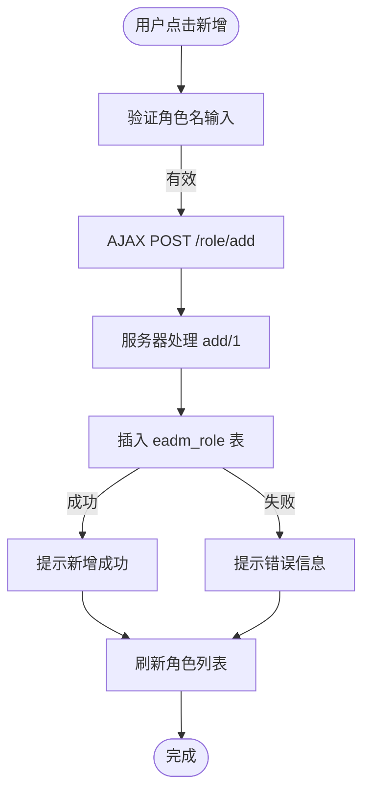
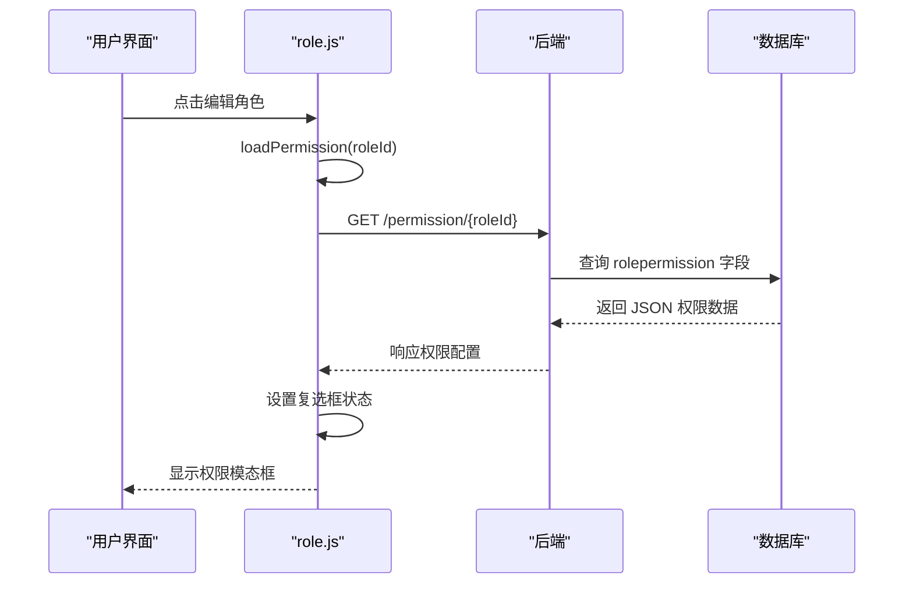
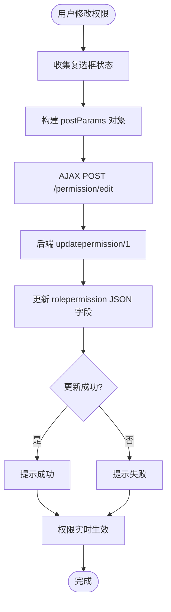
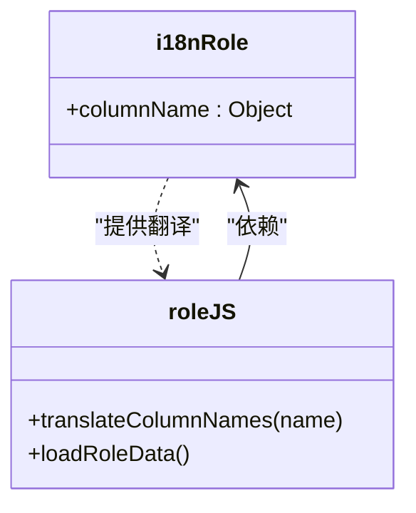
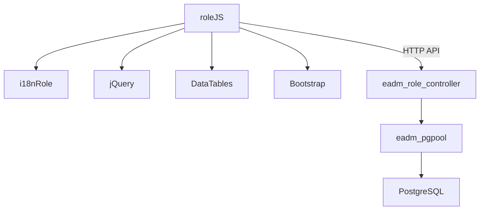

# 角色权限模块 (role.js)

<cite>
**本文档引用的文件**
- [role.js](file://priv/assets/js/role.js)
- [eadm_role_controller.erl](file://src/controllers/eadm_role_controller.erl)
- [i18n-role.js](file://priv/assets/i18n/i18n-role.js)
</cite>

## 目录
1. [简介](#简介)
2. [项目结构](#项目结构)
3. [核心组件](#核心组件)
4. [架构概述](#架构概述)
5. [详细组件分析](#详细组件分析)
6. [依赖分析](#依赖分析)
7. [性能考虑](#性能考虑)
8. [故障排除指南](#故障排除指南)
9. [结论](#结论)

## 简介
本模块 `role.js` 实现了角色的增删改查（CRUD）功能，并支持细粒度权限分配。前端通过 AJAX 与后端 Erlang 控制器 `eadm_role_controller.erl` 通信，加载和提交角色及权限数据。权限以树形结构组织，通过复选框组实现可视化配置，并结合 `i18n-role.js` 支持多语言标签渲染。用户可通过模态框选择角色关联用户，权限变更后实时生效，且具备降级体验设计。

## 项目结构
项目采用前后端分离架构，前端资源位于 `priv/assets` 目录，后端逻辑在 `src/controllers` 中实现。角色管理相关文件分布如下：
- 前端逻辑：`priv/assets/js/role.js`
- 多语言配置：`priv/assets/i18n/i18n-role.js`
- 后端控制器：`src/controllers/eadm_role_controller.erl`

**Section sources**
- [role.js](file://priv/assets/js/role.js#L1-L264)
- [eadm_role_controller.erl](file://src/controllers/eadm_role_controller.erl#L1-L247)
- [i18n-role.js](file://priv/assets/i18n/i18n-role.js#L1-L21)

## 核心组件
`role.js` 提供角色管理的完整前端交互逻辑，包括角色列表加载、新增、编辑、启禁用等功能。权限配置通过复选框实现，数据通过 AJAX 提交至后端。`i18n-role.js` 提供中文字段映射，实现界面多语言支持。

**Section sources**
- [role.js](file://priv/assets/js/role.js#L1-L264)
- [i18n-role.js](file://priv/assets/i18n/i18n-role.js#L1-L21)

## 架构概述
系统采用典型的 MVC 架构，前端通过 RESTful API 与后端交互。前端负责 UI 渲染与用户交互，后端处理业务逻辑与数据库操作。

```mermaid
graph TB
subgraph "前端"
JS[role.js]
I18N[i18n-role.js]
UI[角色管理界面]
end
subgraph "后端"
Controller[eadm_role_controller.erl]
DB[(数据库)]
end
JS --> |GET /role| Controller
JS --> |POST /role/add| Controller
JS --> |POST /permission/edit| Controller
JS --> |GET /permission/{id}| Controller
Controller --> DB
DB --> Controller
Controller --> JS
I18N --> JS
```

**Diagram sources**
- [role.js](file://priv/assets/js/role.js#L1-L264)
- [eadm_role_controller.erl](file://src/controllers/eadm_role_controller.erl#L1-L247)

## 详细组件分析

### 角色管理功能分析
`role.js` 实现了角色的增删改查功能，通过 DataTables 插件渲染角色列表，并绑定操作按钮事件。

#### 角色数据加载


**Diagram sources**
- [role.js](file://priv/assets/js/role.js#L15-L50)
- [eadm_role_controller.erl](file://src/controllers/eadm_role_controller.erl#L45-L65)

#### 角色新增流程


**Diagram sources**
- [role.js](file://priv/assets/js/role.js#L52-L65)
- [eadm_role_controller.erl](file://src/controllers/eadm_role_controller.erl#L75-L95)

### 权限分配功能分析
权限配置采用树形结构，通过复选框组实现细粒度控制。

#### 权限加载逻辑


**Diagram sources**
- [role.js](file://priv/assets/js/role.js#L90-L115)
- [eadm_role_controller.erl](file://src/controllers/eadm_role_controller.erl#L125-L145)

#### 权限提交逻辑


**Diagram sources**
- [role.js](file://priv/assets/js/role.js#L117-L140)
- [eadm_role_controller.erl](file://src/controllers/eadm_role_controller.erl#L155-L185)

### 多语言支持分析
通过 `i18n-role.js` 实现列名的多语言映射。



**Diagram sources**
- [i18n-role.js](file://priv/assets/i18n/i18n-role.js#L1-L21)
- [role.js](file://priv/assets/js/role.js#L10-L14)

**Section sources**
- [i18n-role.js](file://priv/assets/i18n/i18n-role.js#L1-L21)
- [role.js](file://priv/assets/js/role.js#L10-L14)

## 依赖分析
模块间依赖关系清晰，前端依赖后端 API 提供数据服务。



**Diagram sources**
- [role.js](file://priv/assets/js/role.js#L1-L264)
- [eadm_role_controller.erl](file://src/controllers/eadm_role_controller.erl#L1-L247)

**Section sources**
- [role.js](file://priv/assets/js/role.js#L1-L264)
- [eadm_role_controller.erl](file://src/controllers/eadm_role_controller.erl#L1-L247)

## 性能考虑
- 使用 `DataTable` 的 `deferRender` 和 `stateSave` 提升渲染性能
- AJAX 请求异步加载数据，避免页面阻塞
- 权限数据按需加载（编辑时才请求）
- 前端缓存列名翻译结果

## 故障排除指南
常见问题及解决方案：

| 问题现象 | 可能原因 | 解决方案 |
|--------|--------|--------|
| 角色列表为空 | 后端查询失败 | 检查数据库连接和 vi_role 视图 |
| 权限无法保存 | 参数类型错误 | 确保复选框值正确转换为布尔值 |
| 中文标签未显示 | i18n 文件未加载 | 检查 i18n-role.js 是否引入 |
| 启禁用无反应 | roleId 获取失败 | 检查 DataTable 行数据绑定 |

**Section sources**
- [role.js](file://priv/assets/js/role.js#L150-L260)
- [eadm_role_controller.erl](file://src/controllers/eadm_role_controller.erl#L45-L240)

## 结论
`role.js` 模块实现了完整的角色权限管理功能，通过清晰的前后端分离架构，结合多语言支持和用户友好的界面设计，提供了高效的角色配置体验。权限变更通过 AJAX 实时提交，后端以 JSON 格式存储权限树，具备良好的扩展性和维护性。建议未来增加权限变更日志和批量操作功能以进一步提升用户体验。