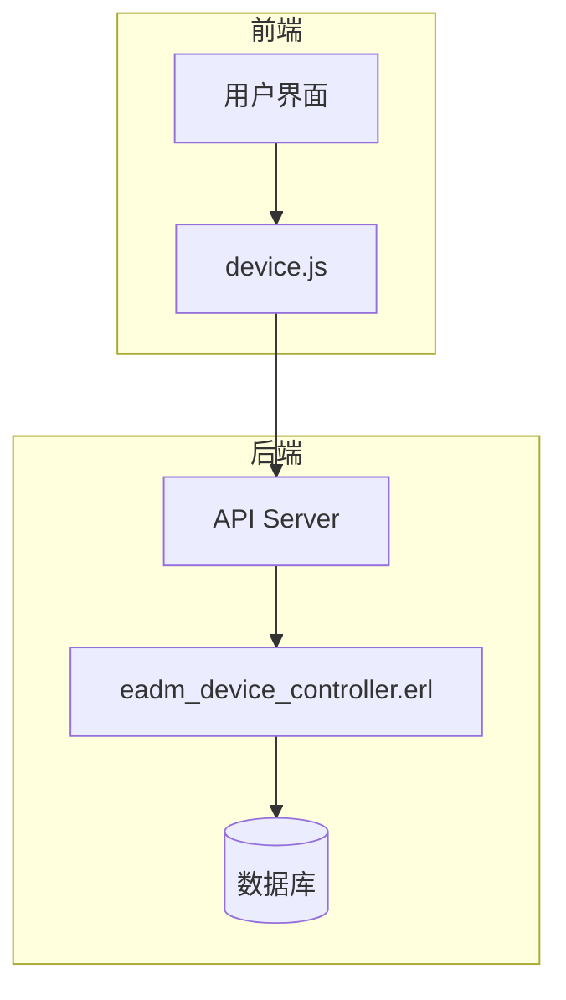
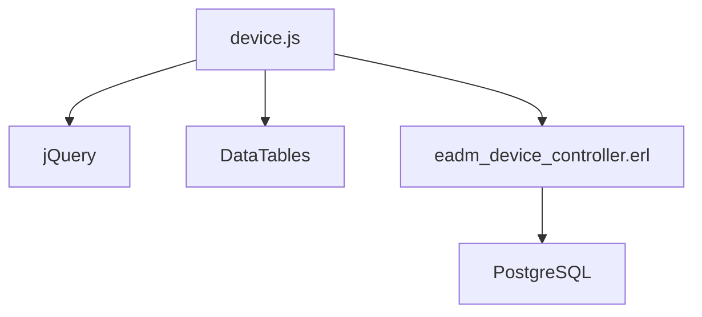

# 设备管理模块 (device.js)

<cite>
**本文档引用的文件**
- [device.js](file://priv\assets\js\device.js)
- [eadm_device_controller.erl](file://src\controllers\eadm_device_controller.erl)
</cite>

## 目录
1. [简介](#简介)
2. [项目结构](#项目结构)
3. [核心组件](#核心组件)
4. [架构概述](#架构概述)
5. [详细组件分析](#详细组件分析)
6. [依赖分析](#依赖分析)
7. [性能考虑](#性能考虑)
8. [故障排除指南](#故障排除指南)
9. [结论](#结论)

## 简介
本文件旨在全面阐述 `device.js` 模块的代码结构与功能实现，涵盖设备列表的异步加载、状态轮询更新、设备详情查看及配置修改。文档将分析其如何通过轮询机制获取设备实时状态，并在前端表格中动态刷新。同时，将描述设备搜索、筛选和高级查询的实现方式，说明表单提交设备信息的校验规则与后端 `eadm_device_controller.erl` 的交互流程。此外，还将提供设备状态异常时的前端告警提示方案及性能优化建议。

## 项目结构
`device.js` 文件位于 `priv\assets\js\` 目录下，是设备管理页面的主要 JavaScript 文件。该文件负责处理设备的增删改查操作、用户分配、状态切换等功能。后端控制器 `eadm_device_controller.erl` 位于 `src\controllers\` 目录下，负责处理来自前端的请求并执行相应的数据库操作。

## 核心组件
`device.js` 文件中的核心组件包括设备表格初始化、设备数据加载、设备详情加载、设备添加、编辑、删除、用户分配等操作。这些组件通过 AJAX 请求与后端 `eadm_device_controller.erl` 进行交互，实现设备管理的各项功能。

**Section sources**
- [device.js](file://priv\assets\js\device.js#L0-L809)

## 架构概述
`device.js` 模块采用前端与后端分离的架构设计。前端通过 jQuery 和 DataTables 插件实现设备列表的展示和交互，后端通过 Erlang 编写的 `eadm_device_controller.erl` 处理业务逻辑和数据库操作。前后端通过 RESTful API 进行通信，确保了系统的可维护性和扩展性。

**Diagram sources**
- [device.js](file://priv\assets\js\device.js#L0-L809)
- [eadm_device_controller.erl](file://src\controllers\eadm_device_controller.erl#L0-L390)

## 详细组件分析

### 设备表格初始化
`initDeviceTable` 函数负责初始化设备表格，使用 DataTables 插件配置表格的各项属性，如分页、排序、响应式设计等。表格的列定义包括设备号、IMEI、SIM卡号、备注、状态和操作按钮。

**Section sources**
- [device.js](file://priv\assets\js\device.js#L25-L100)

### 设备数据加载
`loadDeviceData` 函数通过 AJAX 请求从后端获取设备数据，并将数据填充到 DataTables 表格中。该函数支持按设备号查询，能够动态刷新表格内容。

**Section sources**
- [device.js](file://priv\assets\js\device.js#L248-L284)

### 设备详情加载
`loadDeviceDetail` 函数用于加载指定设备的详细信息，并将其显示在编辑模态框中。该函数通过 AJAX 请求获取设备详情，并设置表单字段的值。

**Section sources**
- [device.js](file://priv\assets\js\device.js#L300-L350)

### 设备添加与编辑
`addDevice` 和 `editDevice` 函数分别处理设备的添加和编辑操作。这两个函数通过 AJAX 请求将表单数据发送到后端，后端验证数据后执行相应的数据库操作。

**Section sources**
- [device.js](file://priv\assets\js\device.js#L352-L450)

### 设备删除与状态切换
`deleteDevice` 和 `toggleDeviceStatus` 函数分别处理设备的删除和状态切换操作。删除操作通过 DELETE 请求发送到后端，状态切换通过 POST 请求发送到后端，后端更新数据库中的设备状态。

**Section sources**
- [device.js](file://priv\assets\js\device.js#L452-L550)

### 用户分配
`addDeviceUser` 和 `unassignDeviceUser` 函数处理设备与用户的分配和取消分配操作。这些操作通过 POST 和 DELETE 请求与后端交互，确保设备与用户之间的关联关系正确更新。

**Section sources**
- [device.js](file://priv\assets\js\device.js#L552-L650)

## 依赖分析
`device.js` 模块依赖于 jQuery 和 DataTables 插件，用于实现前端的交互和表格展示。后端 `eadm_device_controller.erl` 依赖于 PostgreSQL 数据库，通过 `eadm_pgpool` 模块执行数据库操作。前后端通过 RESTful API 进行通信，确保了系统的解耦和可维护性。

**Diagram sources**
- [device.js](file://priv\assets\js\device.js#L0-L809)
- [eadm_device_controller.erl](file://src\controllers\eadm_device_controller.erl#L0-L390)

## 性能考虑
为了提高性能，`device.js` 模块采用了分页策略，每页默认显示 10 条记录，避免一次性加载大量数据导致页面卡顿。此外，通过 AJAX 异步加载数据，减少了页面刷新次数，提升了用户体验。后端通过数据库索引优化查询性能，确保在大数据量下仍能快速响应请求。

## 故障排除指南
当设备管理模块出现问题时，可以按照以下步骤进行排查：
1. 检查网络连接是否正常。
2. 查看浏览器控制台是否有 JavaScript 错误。
3. 检查后端日志，查看是否有数据库操作错误。
4. 确认数据库连接配置是否正确。
5. 验证 API 接口是否正常工作。

**Section sources**
- [device.js](file://priv\assets\js\device.js#L785-L807)
- [eadm_device_controller.erl](file://src\controllers\eadm_device_controller.erl#L206-L229)

## 结论
`device.js` 模块通过前端与后端的紧密协作，实现了设备管理的各项功能。通过合理的架构设计和性能优化，确保了系统的稳定性和高效性。未来可以通过引入 WebSocket 实现更实时的状态更新，进一步提升用户体验。