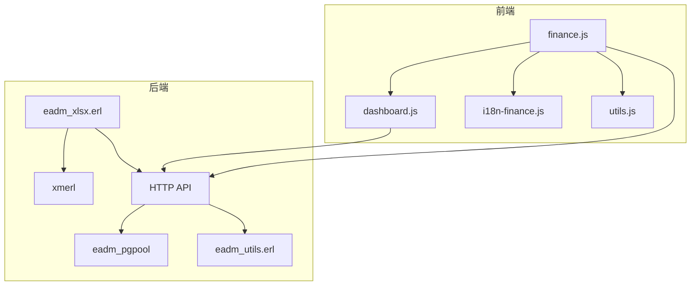
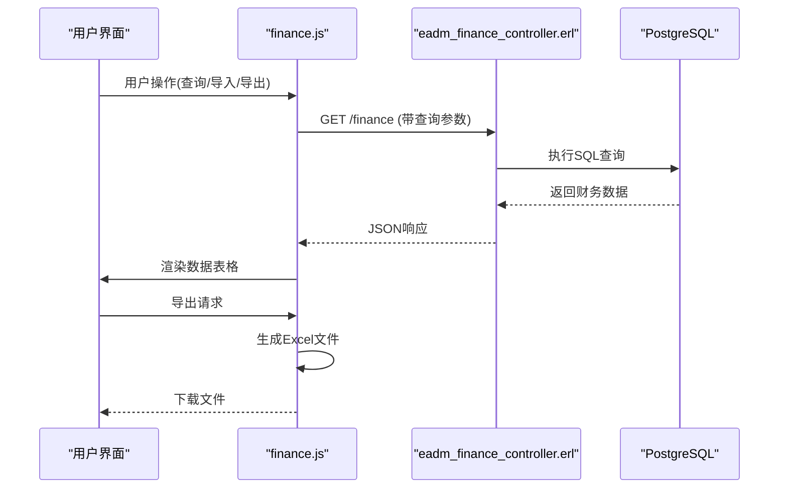

# 财务统计模块 (finance.js)

<cite>
**本文档引用的文件**   
- [finance.js](file://priv/assets/js/finance.js)
- [eadm_finance_controller.erl](file://src/controllers/eadm_finance_controller.erl)
- [eadm_xlsx.erl](file://src/eadm_xlsx.erl)
- [i18n-finance.js](file://priv/assets/i18n/i18n-finance.js)
- [dashboard.js](file://priv/assets/js/dashboard.js)
</cite>

## 目录
1. [简介](#简介)
2. [项目结构](#项目结构)
3. [核心组件](#核心组件)
4. [架构概览](#架构概览)
5. [详细组件分析](#详细组件分析)
6. [依赖分析](#依赖分析)
7. [性能考量](#性能考量)
8. [故障排除指南](#故障排除指南)
9. [结论](#结论)

## 简介
本项目是一个基于Erlang/OTP平台的财务管理系统前端模块，主要通过`finance.js`实现财务数据的可视化展示与统计分析。系统通过调用后端Erlang控制器`eadm_finance_controller.erl`获取收支记录，并支持按时间范围、类型等条件筛选数据。前端使用Chart.js生成统计图表，支持数据导出为Excel文件（通过`eadm_xlsx.erl`处理）。系统还实现了多语言支持和数据导入功能，能够处理来自支付宝、微信、银行等多种来源的财务数据。

## 项目结构

**图表来源**
- [finance.js](file://priv/assets/js/finance.js)
- [eadm_finance_controller.erl](file://src/controllers/eadm_finance_controller.erl)
- [eadm_xlsx.erl](file://src/eadm_xlsx.erl)
- [dashboard.js](file://priv/assets/js/dashboard.js)

**章节来源**
- [finance.js](file://priv/assets/js/finance.js)
- [project_structure](file://project_structure#L1-L50)

## 核心组件

`finance.js`是财务模块的核心前端脚本，负责数据加载、表格渲染、文件导入导出等功能。`eadm_finance_controller.erl`是后端控制器，处理所有财务相关的API请求。`eadm_xlsx.erl`负责解析上传的Excel文件。`i18n-finance.js`提供财务相关的多语言支持。

**章节来源**
- [finance.js](file://priv/assets/js/finance.js#L1-L50)
- [eadm_finance_controller.erl](file://src/controllers/eadm_finance_controller.erl#L1-L20)

## 架构概览

**图表来源**
- [finance.js](file://priv/assets/js/finance