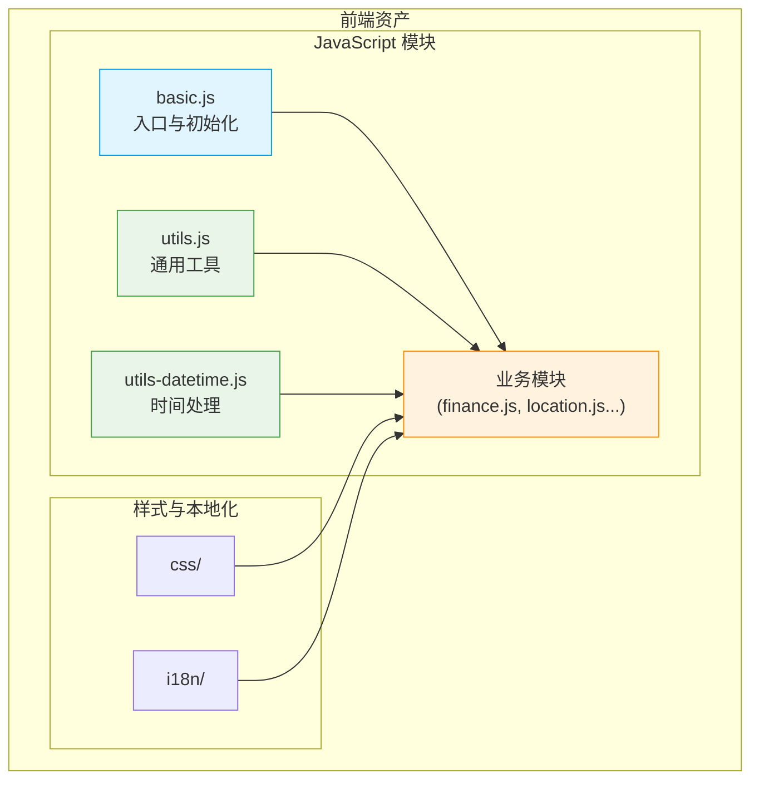
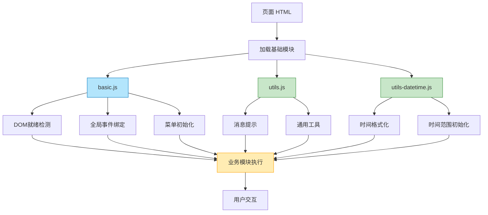
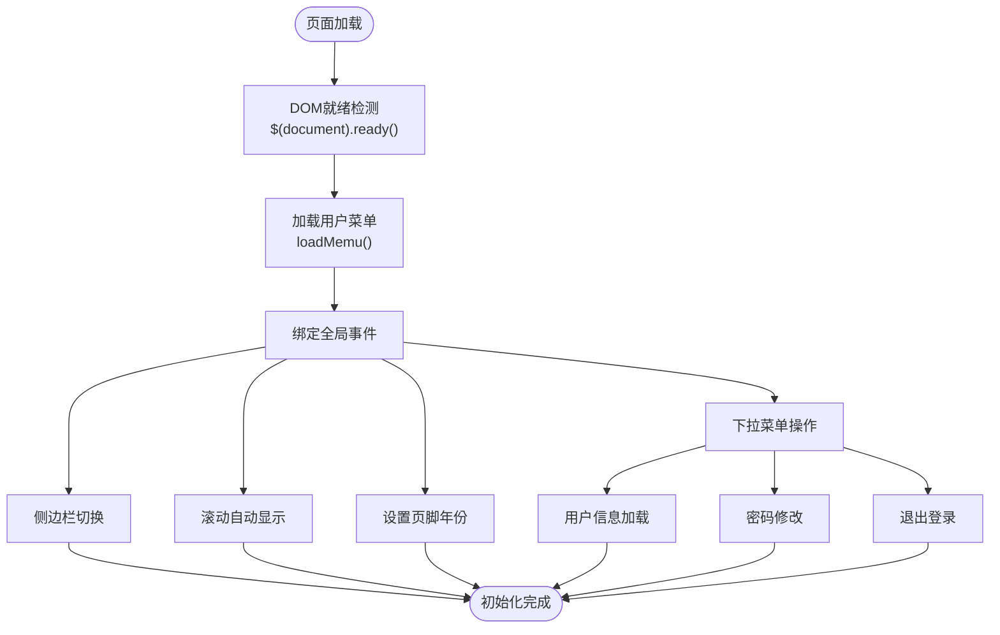
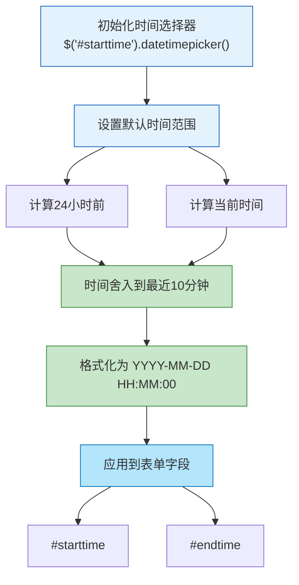
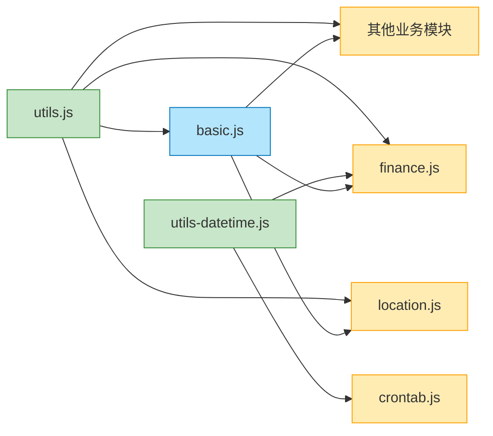

# 基础工具模块

<cite>
**本文档引用文件**  
- [basic.js](file://priv/assets/js/basic.js)
- [utils.js](file://priv/assets/js/utils.js)
- [utils-datetime.js](file://priv/assets/js/utils-datetime.js)
- [login.js](file://priv/assets/js/login.js)
- [location.js](file://priv/assets/js/location.js)
- [finance.js](file://priv/assets/js/finance.js)
- [src/eadm_utils.erl](file://src/eadm_utils.erl)
</cite>

## 目录
1. [简介](#简介)
2. [项目结构](#项目结构)
3. [核心组件](#核心组件)
4. [架构概览](#架构概览)
5. [详细组件分析](#详细组件分析)
6. [依赖分析](#依赖分析)
7. [性能考虑](#性能考虑)
8. [故障排除指南](#故障排除指南)
9. [结论](#结论)

## 简介
本文档深入解析 eadm 前端基础 JavaScript 模块，重点分析 `basic.js` 作为页面初始化入口的核心作用，`utils.js` 中封装的通用工具函数，以及 `utils-datetime.js` 提供的时间处理能力。文档将结合代码示例说明模块的复用模式、扩展方法和加载策略，为开发者提供全面的技术参考。

## 项目结构
前端基础模块位于 `priv/assets/js/` 目录下，主要包括三个核心文件：`basic.js`、`utils.js` 和 `utils-datetime.js`。这些模块为所有业务脚本（如 `dashboard.js`, `finance.js`）提供初始化支持和通用功能。



**Diagram sources**
- [basic.js](file://priv/assets/js/basic.js#L1-L153)
- [utils.js](file://priv/assets/js/utils.js#L1-L135)
- [utils-datetime.js](file://priv/assets/js/utils-datetime.js#L1-L39)

**Section sources**
- [basic.js](file://priv/assets/js/basic.js#L1-L153)
- [utils.js](file://priv/assets/js/utils.js#L1-L135)
- [utils-datetime.js](file://priv/assets/js/utils-datetime.js#L1-L39)

## 核心组件
`basic.js` 作为所有页面的执行入口，负责 DOM 就绪检测、全局事件绑定和菜单初始化。`utils.js` 提供了包括消息提示、日期格式化在内的核心工具函数。`utils-datetime.js` 专注于处理与时间相关的业务需求，如时间范围选择和格式化。

**Section sources**
- [basic.js](file://priv/assets/js/basic.js#L1-L153)
- [utils.js](file://priv/assets/js/utils.js#L1-L135)
- [utils-datetime.js](file://priv/assets/js/utils-datetime.js#L1-L39)

## 架构概览
前端基础模块采用分层设计，`basic.js` 位于最顶层，负责应用的启动和全局配置。`utils.js` 和 `utils-datetime.js` 作为底层支撑库，被 `basic.js` 和所有业务模块所依赖。这种设计确保了功能的高内聚和低耦合。



**Diagram sources**
- [basic.js](file://priv/assets/js/basic.js#L1-L153)
- [utils.js](file://priv/assets/js/utils.js#L1-L135)
- [utils-datetime.js](file://priv/assets/js/utils-datetime.js#L1-L39)

## 详细组件分析

### basic.js 分析
`basic.js` 是前端应用的初始化入口，通过 `$(document).ready()` 确保 DOM 完全加载后执行初始化逻辑。

#### 初始化流程


**Diagram sources**
- [basic.js](file://priv/assets/js/basic.js#L15-L153)

**Section sources**
- [basic.js](file://priv/assets/js/basic.js#L15-L153)

### utils.js 分析
`utils.js` 封装了前端应用中广泛复用的核心工具函数，通过 `window.utils` 对象进行模块化导出。

#### 工具函数分类
```mermaid
classDiagram
class ToastUtils {
+showSuccessToast(message)
+showWarningToast(message)
+showErrorToast(message)
+showInfoToast(message)
}
class FormatUtils {
+formatDateTime(dateTimeStr)
+padZero(num)
}
class GlobalExports {
+window.utils
+window.formatDateTime
+window.showSuccessToast
+...
}
ToastUtils <|-- GlobalExports
FormatUtils <|-- GlobalExports
note right of ToastUtils
提供四种颜色编码的
消息提示功能
成功(绿)、警告(黄)
错误(红)、信息(蓝)
end note
note right of FormatUtils
提供日期格式化和
数字补零的辅助函数
end note
note bottom of GlobalExports
为兼容现有代码
同时暴露到全局作用域
end note
```

**Diagram sources**
- [utils.js](file://priv/assets/js/utils.js#L8-L134)

**Section sources**
- [utils.js](file://priv/assets/js/utils.js#L8-L134)

### utils-datetime.js 分析
`utils-datetime.js` 专注于处理与时间相关的业务需求，特别是在财务和定时任务模块中。

#### 时间处理流程


**Diagram sources**
- [utils-datetime.js](file://priv/assets/js/utils-datetime.js#L6-L39)

**Section sources**
- [utils-datetime.js](file://priv/assets/js/utils-datetime.js#L6-L39)

## 依赖分析
基础模块之间存在明确的依赖关系，`basic.js` 依赖于 `utils.js` 中的 `showWarningToast` 函数，而 `utils-datetime.js` 独立运行。所有业务模块均依赖这些基础模块。



**Diagram sources**
- [basic.js](file://priv/assets/js/basic.js#L1-L153)
- [utils.js](file://priv/assets/js/utils.js#L1-L135)
- [utils-datetime.js](file://priv/assets/js/utils-datetime.js#L1-L39)

**Section sources**
- [basic.js](file://priv/assets/js/basic.js#L1-L153)
- [utils.js](file://priv/assets/js/utils.js#L1-L135)
- [utils-datetime.js](file://priv/assets/js/utils-datetime.js#L1-L39)

## 性能考虑
- **模块加载顺序**：确保 `utils.js` 在 `basic.js` 之前加载，以避免 `showWarningToast` 未定义的错误。
- **事件委托**：`basic.js` 使用 `$('body').on('click', ...)` 进行事件委托，提高了动态内容的事件处理效率。
- **AJAX 同步问题**：`userinfo-submit-btn` 事件中使用了 `$.ajaxSetup({async:false})`，这会阻塞 UI 线程，建议改为异步处理。

## 故障排除指南
- **菜单不显示**：检查 `/permission` 接口返回数据结构是否符合预期，确保 `resdata[0].data` 存在。
- **时间选择器不工作**：确认 `utils-datetime.js` 已正确加载，且 jQuery 和 datetimepicker 插件可用。
- **消息提示不显示**：检查页面中是否存在 `.toast` 元素，`showXxxToast` 函数依赖于这些 DOM 元素。
- **函数未定义错误**：确保 `utils.js` 在调用其函数的脚本之前加载。

**Section sources**
- [basic.js](file://priv/assets/js/basic.js#L1-L153)
- [utils.js](file://priv/assets/js/utils.js#L1-L135)
- [utils-datetime.js](file://priv/assets/js/utils-datetime.js#L1-L39)

## 结论
`basic.js`、`utils.js` 和 `utils-datetime.js` 构成了 eadm 前端应用的基石。`basic.js` 负责应用的启动和全局配置，`utils.js` 提供了通用的功能支持，`utils-datetime.js` 解决了特定的业务时间需求。这种模块化设计提高了代码的可维护性和复用性。建议未来将这些模块迁移到现代模块系统（如 ES6 Modules），并移除对全局作用域的污染。