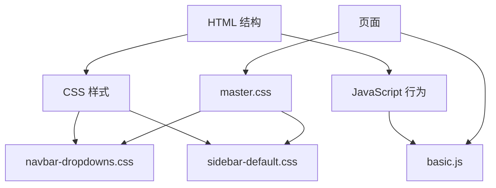
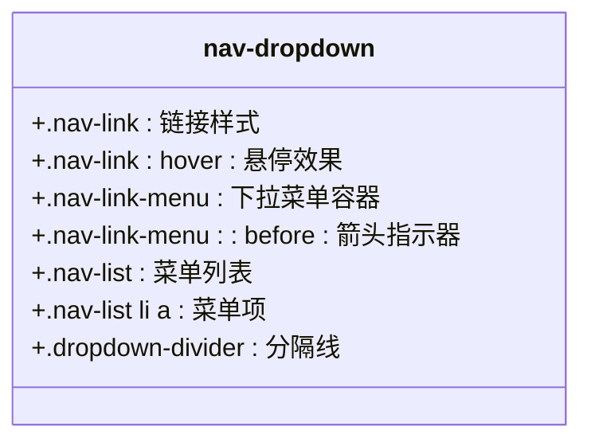
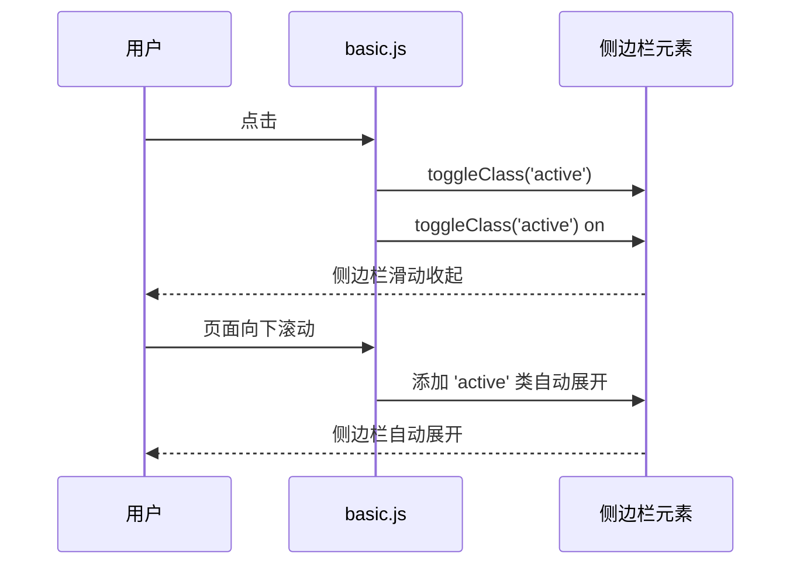
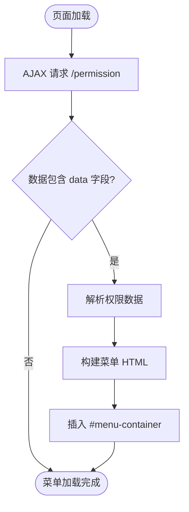
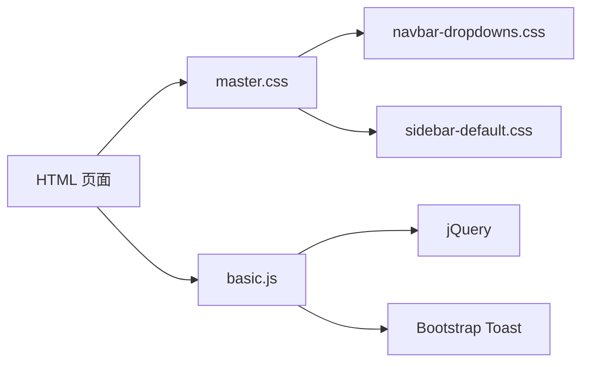

# UI 组件

<cite>
**本文档中引用的文件**  
- [navbar-dropdowns.css](file://priv/assets/components/navbar/navbar-dropdowns.css)
- [sidebar-default.css](file://priv/assets/components/sidebar/sidebar-default.css)
- [basic.js](file://priv/assets/js/basic.js)
- [master.css](file://priv/assets/css/master.css)
</cite>

## 目录
1. [简介](#简介)
2. [项目结构](#项目结构)
3. [核心组件](#核心组件)
4. [架构概述](#架构概述)
5. [详细组件分析](#详细组件分析)
6. [依赖分析](#依赖分析)
7. [性能考虑](#性能考虑)
8. [故障排除指南](#故障排除指南)
9. [结论](#结论)

## 简介
本文档详细描述了 eadm 项目中可复用的 UI 组件设计与实现，重点聚焦于导航栏（navbar）和侧边栏（sidebar）的结构、样式封装、交互逻辑、可配置性、状态管理及响应式行为。文档还涵盖组件使用示例、自定义扩展方法、无障碍访问支持，并指导开发者如何基于现有模式开发新的通用 UI 组件。

## 项目结构
项目中的 UI 组件按功能模块化组织，核心 UI 组件位于 `priv/assets/components/` 目录下，包括 `navbar` 和 `sidebar` 两个独立组件。每个组件拥有独立的 CSS 文件进行样式隔离。JavaScript 逻辑由 `basic.js` 统一初始化，全局样式通过 `master.css` 导入组件样式。

```mermaid
graph TB
subgraph "UI Components"
Navbar[navbar]
Sidebar[sidebar]
end
subgraph "Styles"
master_css[master.css]
navbar_css[navbar-dropdowns.css]
sidebar_css[sidebar-default.css]
end
subgraph "Scripts"
basic_js[basic.js]
end
master_css --> |@import| navbar_css
master_css --> |@import| sidebar_css
basic_js --> |初始化| Navbar
basic_js --> |初始化| Sidebar
```

**Diagram sources**
- [master.css](file://priv/assets/css/master.css#L1-L60)
- [navbar-dropdowns.css](file://priv/assets/components/navbar/navbar-dropdowns.css#L1-L84)
- [sidebar-default.css](file://priv/assets/components/sidebar/sidebar-default.css#L1-L100)
- [basic.js](file://priv/assets/js/basic.js#L1-L154)

**Section sources**
- [master.css](file://priv/assets/css/master.css#L1-L60)
- [components/](file://priv/assets/components/)

## 核心组件
导航栏和侧边栏是 eadm 系统的核心 UI 组件，提供主要的导航功能。它们通过独立的 CSS 文件实现样式隔离，确保组件的可复用性和维护性。交互逻辑由 `basic.js` 中的函数统一管理，包括菜单动态加载、侧边栏展开/收起等。

**Section sources**
- [navbar-dropdowns.css](file://priv/assets/components/navbar/navbar-dropdowns.css#L1-L84)
- [sidebar-default.css](file://priv/assets/components/sidebar/sidebar-default.css#L1-L100)
- [basic.js](file://priv/assets/js/basic.js#L1-L154)

## 架构概述
系统采用模块化前端架构，UI 组件独立封装，通过全局主样式文件 `master.css` 进行集成。`basic.js` 作为入口脚本，在 DOM 加载完成后初始化所有交互功能。组件的 HTML 结构与样式、行为分离，符合关注点分离原则。



**Diagram sources**
- [master.css](file://priv/assets/css/master.css#L1-L60)
- [basic.js](file://priv/assets/js/basic.js#L32-L71)

## 详细组件分析

### 导航栏（Navbar）分析
导航栏采用下拉菜单模式，通过 CSS 类 `.nav-dropdown` 实现。其样式独立封装在 `navbar-dropdowns.css` 中，包含链接样式、悬停效果、下拉菜单定位及箭头指示器。响应式设计在 `master.css` 中通过媒体查询实现。

#### 样式结构


**Diagram sources**
- [navbar-dropdowns.css](file://priv/assets/components/navbar/navbar-dropdowns.css#L1-L84)

**Section sources**
- [navbar-dropdowns.css](file://priv/assets/components/navbar/navbar-dropdowns.css#L1-L84)
- [master.css](file://priv/assets/css/master.css#L98-L164)

### 侧边栏（Sidebar）分析
侧边栏作为主要导航区域，具有固定宽度和滚动能力。其核心样式定义在 `sidebar-default.css` 中，通过 `#sidebar` ID 选择器确保样式隔离。组件支持展开/收起状态切换，通过 `active` 类控制。

#### 交互逻辑


**Diagram sources**
- [basic.js](file://priv/assets/js/basic.js#L32-L71)
- [sidebar-default.css](file://priv/assets/components/sidebar/sidebar-default.css#L1-L100)

**Section sources**
- [basic.js](file://priv/assets/js/basic.js#L32-L71)
- [sidebar-default.css](file://priv/assets/components/sidebar/sidebar-default.css#L1-L100)

### 可配置性与动态加载
导航菜单项通过 `loadMemu()` 函数从 `/permission` 接口动态加载，根据用户权限决定显示哪些菜单项。此机制实现了菜单的可配置性，无需修改前端代码即可调整用户可见功能。



**Diagram sources**
- [basic.js](file://priv/assets/js/basic.js#L1-L30)

**Section sources**
- [basic.js](file://priv/assets/js/basic.js#L1-L30)

### 状态管理与响应式行为
侧边栏的状态（展开/收起）通过 CSS 类 `active` 管理。在移动端，当用户向下滚动时，侧边栏会自动收起以节省屏幕空间，提升用户体验。响应式断点在 `master.css` 中定义。

**Section sources**
- [basic.js](file://priv/assets/js/basic.js#L32-L71)
- [master.css](file://priv/assets/css/master.css#L408-L479)

### 使用示例与自定义扩展
开发者可通过修改 `sidebar-default.css` 或 `navbar-dropdowns.css` 中的变量（如颜色、尺寸）来自定义组件外观。建议创建新的 CSS 文件并覆盖特定样式，以保持原组件的完整性。

**Section sources**
- [sidebar-default.css](file://priv/assets/components/sidebar/sidebar-default.css#L1-L100)
- [navbar-dropdowns.css](file://priv/assets/components/navbar/navbar-dropdowns.css#L1-L84)

### 无障碍访问（a11y）支持
当前组件使用标准的 HTML 元素和 ARIA 属性（如 `aria-expanded`），提供了基本的无障碍支持。下拉菜单的展开状态通过 `aria-expanded` 属性正确传达，确保屏幕阅读器用户能够理解当前状态。

**Section sources**
- [sidebar-default.css](file://priv/assets/components/sidebar/sidebar-default.css#L55-L98)
- [basic.js](file://priv/assets/js/basic.js#L32-L71)

### 新组件开发指导
开发者应遵循现有模式创建新组件：将 HTML 结构、CSS 样式、JavaScript 行为分离；为组件创建独立的 CSS 文件并放置在 `components/` 目录下；在 `master.css` 中使用 `@import` 引入新样式；交互逻辑在 `basic.js` 中初始化。

**Section sources**
- [master.css](file://priv/assets/css/master.css#L1-L60)
- [basic.js](file://priv/assets/js/basic.js#L1-L154)

## 依赖分析
UI 组件依赖于 jQuery 和 Bootstrap 相关库。`basic.js` 依赖 jQuery 进行 DOM 操作和 AJAX 请求。样式文件通过 `@import` 指令相互依赖，最终由 `master.css` 统一管理。



**Diagram sources**
- [master.css](file://priv/assets/css/master.css#L1-L60)
- [basic.js](file://priv/assets/js/basic.js#L1-L154)

**Section sources**
- [master.css](file://priv/assets/css/master.css#L1-L60)
- [basic.js](file://priv/assets/js/basic.js#L1-L154)

## 性能考虑
组件采用按需加载策略，菜单数据在页面加载后异步获取，避免阻塞主渲染流程。CSS 文件经过合理组织，避免了全局样式的污染。JavaScript 代码在 DOM 加载完成后执行，确保了执行时机的正确性。

## 故障排除指南
常见问题包括菜单不显示、侧边栏无法切换等。检查 `/permission` 接口是否返回正确数据，确认 `basic.js` 是否正确加载，验证 jQuery 是否可用。样式问题可通过浏览器开发者工具检查 CSS 优先级和类名拼写。

**Section sources**
- [basic.js](file://priv/assets/js/basic.js#L1-L154)
- [master.css](file://priv/assets/css/master.css#L1-L60)

## 结论
eadm 的 UI 组件设计体现了模块化、可复用和可维护的原则。通过独立的 CSS 文件实现样式隔离，使用统一的 JavaScript 文件管理交互逻辑，结合动态加载和响应式设计，为开发者提供了清晰的开发模式和良好的用户体验。