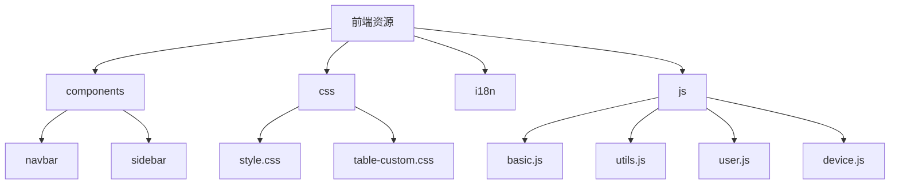
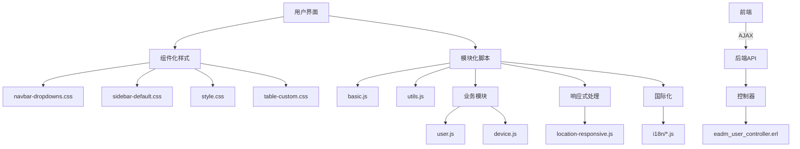
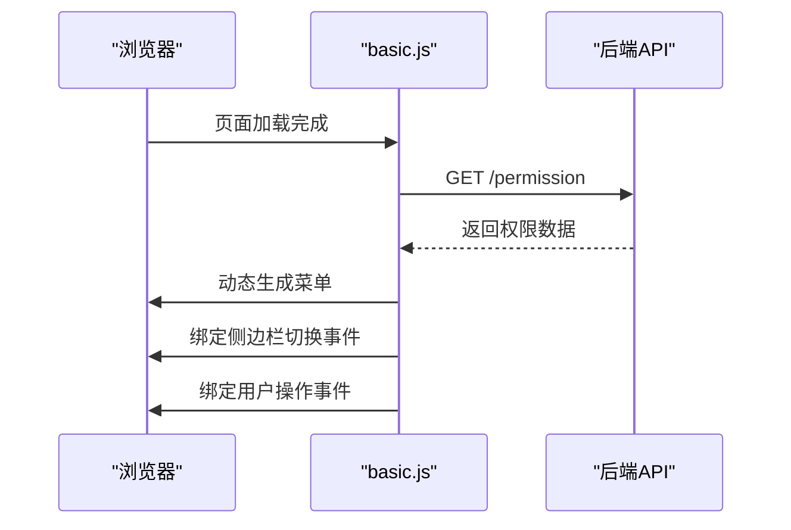
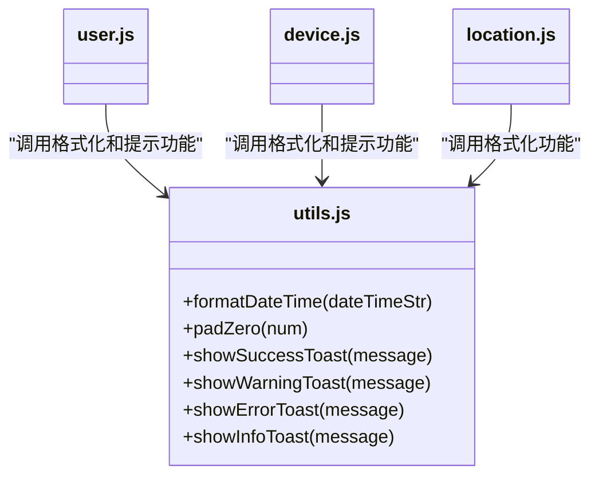
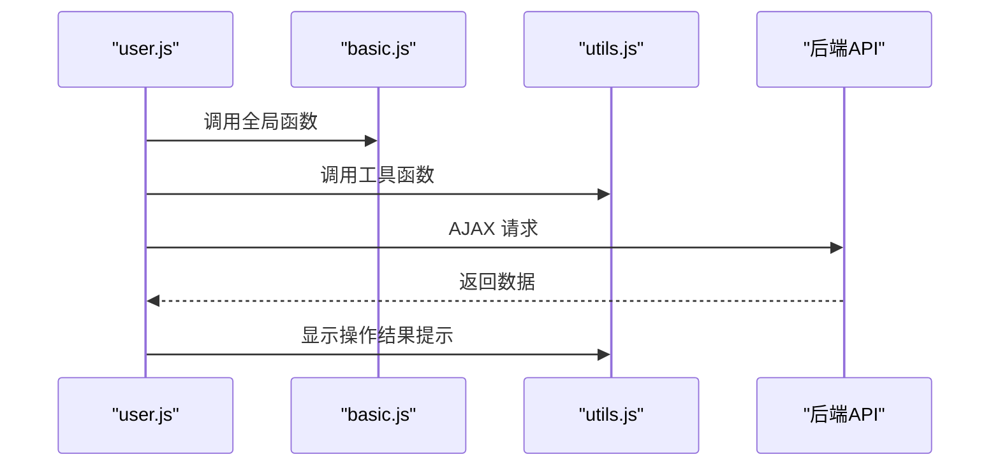
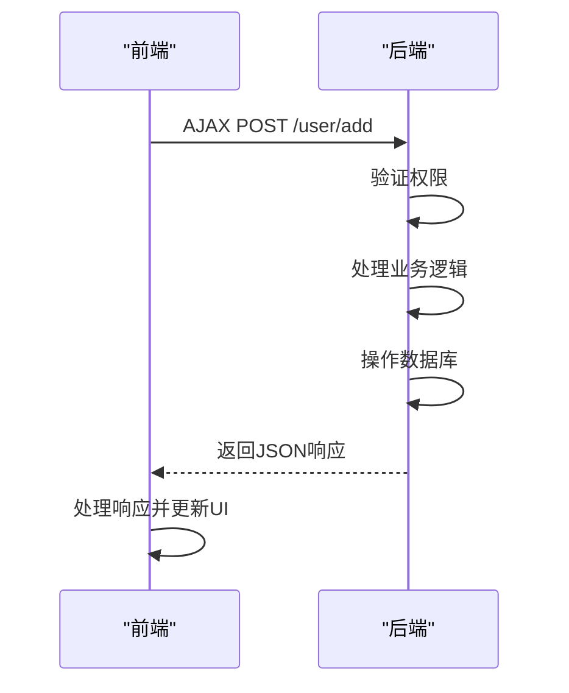
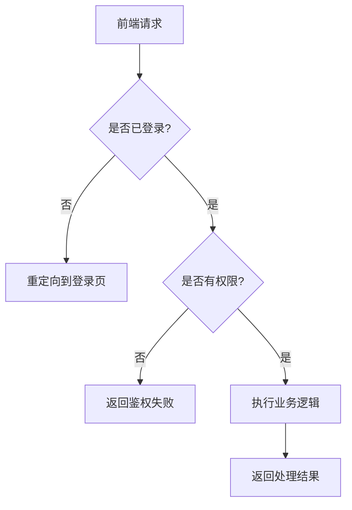
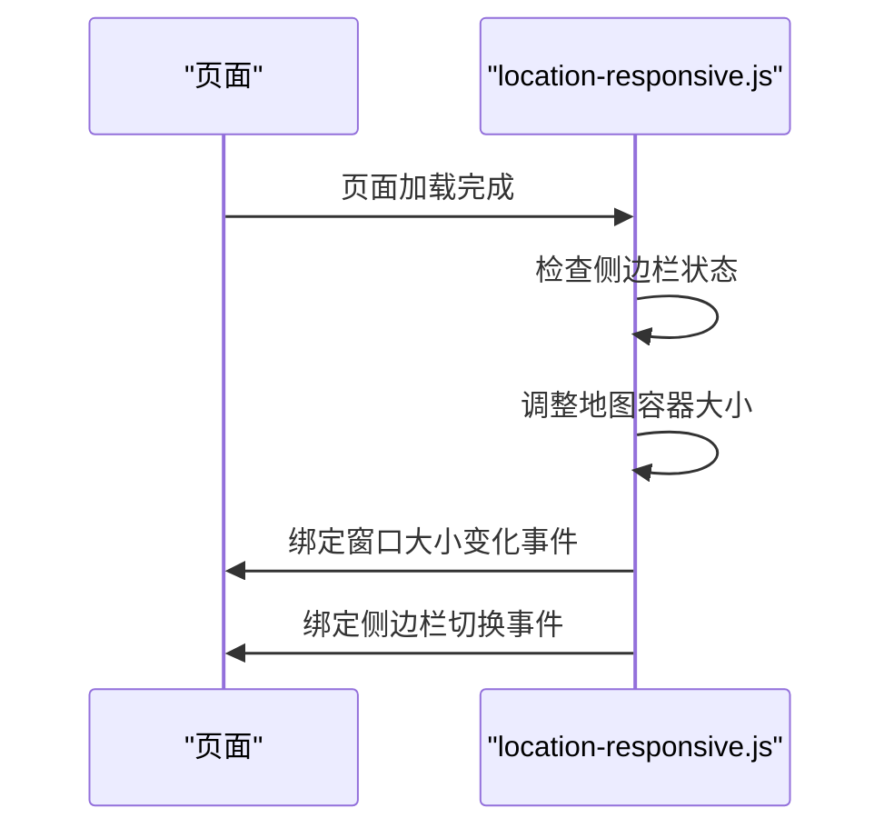
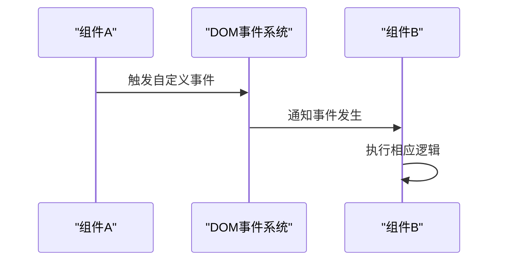
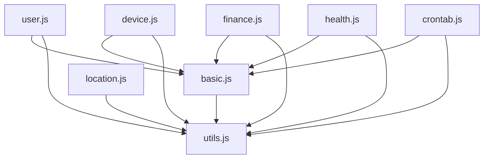

# 前端架构

<cite>
**本文档中引用的文件**  
- [basic.js](file://priv/assets/js/basic.js)
- [utils.js](file://priv/assets/js/utils.js)
- [user.js](file://priv/assets/js/user.js)
- [device.js](file://priv/assets/js/device.js)
- [location-responsive.js](file://priv/assets/js/location-responsive.js)
- [style.css](file://priv/assets/css/style.css)
- [table-custom.css](file://priv/assets/css/table-custom.css)
- [navbar-dropdowns.css](file://priv/assets/components/navbar/navbar-dropdowns.css)
- [sidebar-default.css](file://priv/assets/components/sidebar/sidebar-default.css)
- [eadm_user_controller.erl](file://src/controllers/eadm_user_controller.erl)
</cite>

## 目录
1. [简介](#简介)
2. [项目结构](#项目结构)
3. [核心组件](#核心组件)
4. [架构概览](#架构概览)
5. [详细组件分析](#详细组件分析)
6. [依赖分析](#依赖分析)
7. [性能考虑](#性能考虑)
8. [故障排除指南](#故障排除指南)
9. [结论](#结论)

## 简介
本文件深入阐述 eadm 项目的前端架构设计，涵盖 CSS 架构、JavaScript 模块化设计、前后端交互模式、响应式布局实现以及组件间通信机制。通过分析核心文件和模块，为前端开发者提供开发规范和最佳实践指导。

## 项目结构



**图示来源**  
- [priv/assets](file://priv/assets)

## 核心组件

本项目前端架构由多个核心组件构成，包括基础功能模块（basic.js）、工具函数模块（utils.js）、业务功能模块（user.js、device.js）以及样式组件（navbar、sidebar）。这些组件通过模块化设计实现了高内聚、低耦合的架构特性。

**组件来源**  
- [basic.js](file://priv/assets/js/basic.js)
- [utils.js](file://priv/assets/js/utils.js)
- [user.js](file://priv/assets/js/user.js)
- [device.js](file://priv/assets/js/device.js)

## 架构概览



**图示来源**  
- [basic.js](file://priv/assets/js/basic.js)
- [utils.js](file://priv/assets/js/utils.js)
- [user.js](file://priv/assets/js/user.js)
- [device.js](file://priv/assets/js/device.js)
- [location-responsive.js](file://priv/assets/js/location-responsive.js)
- [eadm_user_controller.erl](file://src/controllers/eadm_user_controller.erl)

## 详细组件分析

### CSS 架构分析

#### 组件化样式设计
项目采用组件化CSS架构，将导航栏和侧边栏样式分别封装在独立的组件目录中，实现了样式的可维护性和复用性。

```mermaid
classDiagram
class navbar-dropdowns.css {
+.nav-dropdown
+.nav-link
+.nav-link-menu
+.nav-list
}
class sidebar-default.css {
+#sidebar
+.sidebar-header
+.components
+.dropdown-toggle
}
navbar-dropdowns.css --> style.css : "继承基础样式"
sidebar-default.css --> style.css : "继承基础样式"
```

**图示来源**  
- [navbar-dropdowns.css](file://priv/assets/components/navbar/navbar-dropdowns.css)
- [sidebar-default.css](file://priv/assets/components/sidebar/sidebar-default.css)
- [style.css](file://priv/assets/css/style.css)

#### 通用样式表设计
通用样式表通过定义可复用的CSS类，实现了跨页面的样式一致性。

```mermaid
classDiagram
class style.css {
+.device-status-badge
+.device-status-enabled
+.device-status-disabled
+.action-column
}
class table-custom.css {
+.table thead th
+.table tbody tr : hover
+.table-striped
+.dataTables_wrapper
+.paginate_button
}
user.js --> style.css : "使用设备状态样式"
device.js --> style.css : "使用设备状态样式"
user.js --> table-custom.css : "使用表格定制样式"
device.js --> table-custom.css : "使用表格定制样式"
```

**图示来源**  
- [style.css](file://priv/assets/css/style.css)
- [table-custom.css](file://priv/assets/css/table-custom.css)
- [user.js](file://priv/assets/js/user.js)
- [device.js](file://priv/assets/js/device.js)

### JavaScript 模块化设计

#### 基础功能模块
`basic.js` 提供了应用的基础功能，包括菜单加载、侧边栏切换、用户信息管理等核心交互逻辑。



**图示来源**  
- [basic.js](file://priv/assets/js/basic.js)

#### 工具函数模块
`utils.js` 封装了通用的工具函数，为各功能模块提供基础支持。



**图示来源**  
- [utils.js](file://priv/assets/js/utils.js)
- [user.js](file://priv/assets/js/user.js)
- [device.js](file://priv/assets/js/device.js)

#### 业务功能模块
业务功能模块（如 user.js、device.js）实现了具体的业务逻辑，通过复用基础模块和工具函数，提高了代码的可维护性。



**图示来源**  
- [user.js](file://priv/assets/js/user.js)
- [basic.js](file://priv/assets/js/basic.js)
- [utils.js](file://priv/assets/js/utils.js)

### 前后端交互模式

#### AJAX 调用机制
前端通过 AJAX 调用后端控制器 API，实现数据的异步获取和操作。



**图示来源**  
- [user.js](file://priv/assets/js/user.js)
- [eadm_user_controller.erl](file://src/controllers/eadm_user_controller.erl)

#### 权限验证流程
系统实现了完整的权限验证机制，确保只有授权用户才能访问特定功能。



**图示来源**  
- [eadm_user_controller.erl](file://src/controllers/eadm_user_controller.erl)

### 响应式设计实现

#### 响应式布局处理
`location-responsive.js` 负责处理地图页面的响应式布局，确保在不同设备上都能正常显示。



**图示来源**  
- [location-responsive.js](file://priv/assets/js/location-responsive.js)

### 组件间通信机制

#### 事件驱动通信
系统采用事件驱动的通信机制，通过 DOM 事件实现组件间的交互。



**图示来源**  
- [basic.js](file://priv/assets/js/basic.js)
- [user.js](file://priv/assets/js/user.js)

## 依赖分析



**图示来源**  
- [basic.js](file://priv/assets/js/basic.js)
- [utils.js](file://priv/assets/js/utils.js)
- [user.js](file://priv/assets/js/user.js)
- [device.js](file://priv/assets/js/device.js)

## 性能考虑

本项目前端架构在性能方面考虑了以下几点：
- 采用模块化设计，按需加载脚本
- 使用事件委托减少事件监听器数量
- 通过 AJAX 异步加载数据，避免页面刷新
- 利用浏览器缓存机制提高加载速度
- 优化 CSS 选择器，提高渲染性能

## 故障排除指南

当遇到前端问题时，可参考以下排查步骤：
1. 检查浏览器控制台是否有 JavaScript 错误
2. 确认网络请求是否正常，查看是否有 404 或 500 错误
3. 验证 CSS 文件是否正确加载
4. 检查模块间的依赖关系是否正确
5. 确认后端 API 是否正常响应

**故障排除来源**  
- [basic.js](file://priv/assets/js/basic.js)
- [utils.js](file://priv/assets/js/utils.js)
- [user.js](file://priv/assets/js/user.js)

## 结论

eadm 项目的前端架构采用了组件化和模块化的设计理念，通过合理的 CSS 架构和 JavaScript 模块化设计，实现了代码的高可维护性和可复用性。系统通过 AJAX 与后端进行交互，采用事件驱动的通信机制，确保了组件间的松耦合。响应式设计的实现保证了应用在不同设备上的良好用户体验。整体架构清晰，为后续开发和维护提供了良好的基础。