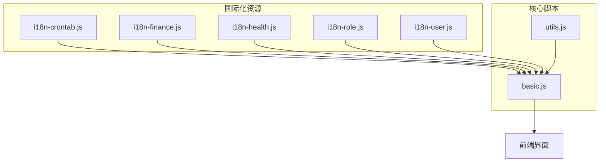
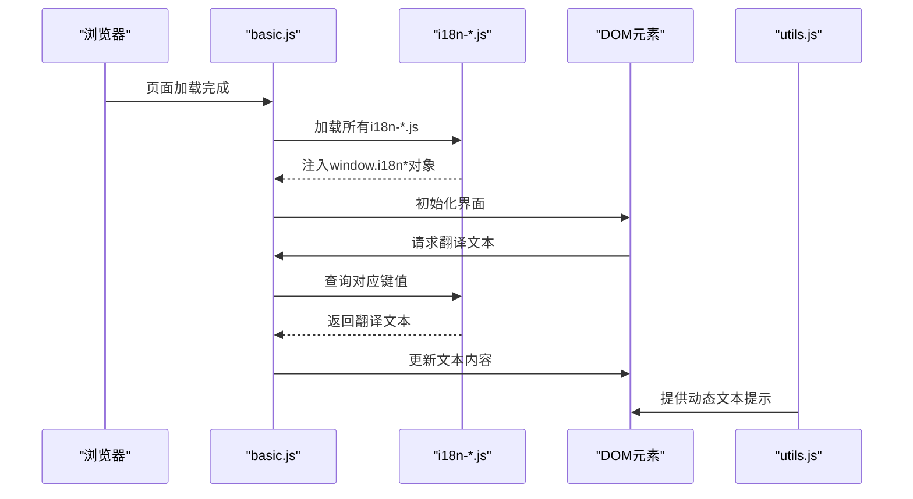
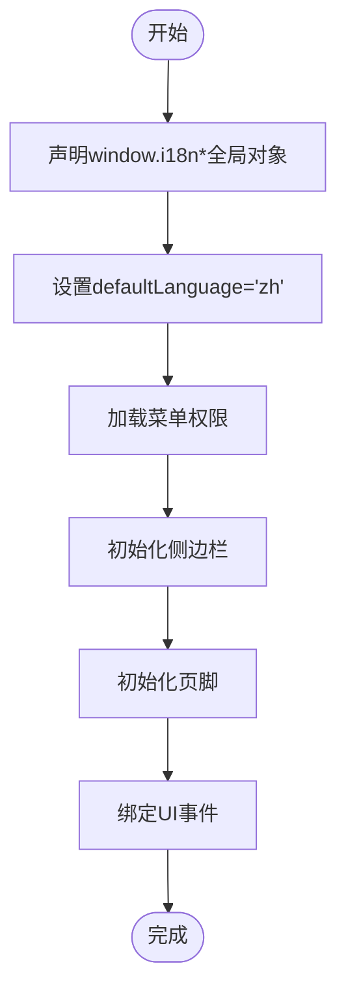
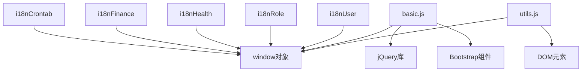

# 国际化实现

<cite>
**本文档引用的文件**  
- [i18n-crontab.js](file://priv/assets/i18n/i18n-crontab.js)
- [i18n-finance.js](file://priv/assets/i18n/i18n-finance.js)
- [i18n-health.js](file://priv/assets/i18n/i18n-health.js)
- [i18n-role.js](file://priv/assets/i18n/i18n-role.js)
- [i18n-user.js](file://priv/assets/i18n/i18n-user.js)
- [basic.js](file://priv/assets/js/basic.js)
- [utils.js](file://priv/assets/js/utils.js)
</cite>

## 目录
1. [项目结构](#项目结构)
2. [核心组件](#核心组件)
3. [架构概述](#架构概述)
4. [详细组件分析](#详细组件分析)
5. [依赖分析](#依赖分析)
6. [性能考虑](#性能考虑)
7. [故障排除指南](#故障排除指南)
8. [结论](#结论)

## 项目结构

`eadm` 项目的前端国际化资源集中存放在 `priv/assets/i18n/` 目录下，每个功能模块对应一个独立的 `i18n-*.js` 文件。这些文件与 `priv/assets/js/` 目录下的业务逻辑脚本（如 `crontab.js`, `finance.js` 等）一一对应，实现了按功能模块组织多语言资源的设计。



**图示来源**
- [i18n-crontab.js](file://priv/assets/i18n/i18n-crontab.js#L1-L40)
- [i18n-finance.js](file://priv/assets/i18n/i18n-finance.js#L1-L44)
- [i18n-health.js](file://priv/assets/i18n/i18n-health.js#L1-L37)
- [i18n-role.js](file://priv/assets/i18n/i18n-role.js#L1-L21)
- [i18n-user.js](file://priv/assets/i18n/i18n-user.js#L1-L36)
- [basic.js](file://priv/assets/js/basic.js#L1-L153)

**本节来源**
- [i18n-crontab.js](file://priv/assets/i18n/i18n-crontab.js#L1-L40)
- [i18n-finance.js](file://priv/assets/i18n/i18n-finance.js#L1-L44)
- [i18n-health.js](file://priv/assets/i18n/i18n-health.js#L1-L37)
- [i18n-role.js](file://priv/assets/i18n/i18n-role.js#L1-L21)
- [i18n-user.js](file://priv/assets/i18n/i18n-user.js#L1-L36)

## 核心组件

`eadm` 前端国际化系统由三大核心组件构成：模块化的语言包文件（`i18n-*.js`）、主框架加载器（`basic.js`）以及工具函数（`utils.js`）。这些组件协同工作，实现多语言支持。

**本节来源**
- [i18n-crontab.js](file://priv/assets/i18n/i18n-crontab.js#L1-L40)
- [basic.js](file://priv/assets/js/basic.js#L1-L153)
- [utils.js](file://priv/assets/js/utils.js#L1-L135)

## 架构概述

`eadm` 的国际化架构采用模块化设计，将不同功能模块的语言资源分离，通过全局对象注入的方式在运行时提供翻译服务。



**图示来源**
- [i18n-crontab.js](file://priv/assets/i18n/i18n-crontab.js#L1-L40)
- [basic.js](file://priv/assets/js/basic.js#L1-L153)
- [utils.js](file://priv/assets/js/utils.js#L1-L135)

## 详细组件分析

### 国际化语言包分析

`i18n-*.js` 文件采用统一的命名规范，文件名格式为 `i18n-{模块名}.js`，与后端功能模块保持一致。每个文件通过 `window.i18n{模块名}` 全局对象暴露翻译资源。

#### 语言包结构
```mermaid
classDiagram
class i18nCrontab {
+columnName : Object
}
class i18nFinance {
+columnName : Object
+sourceType : Object
}
class i18nHealth {
+columnName : Object
+sleepType : Object
}
class i18nRole {
+columnName : Object
}
class i18nUser {
+columnName : Object
}
i18nCrontab : columnName.zh : Object
i18nFinance : columnName.zh : Object
i18nHealth : columnName.zh : Object
i18nRole : columnName.zh : Object
i18nUser : columnName.zh : Object
```

**图示来源**
- [i18n-crontab.js](file://priv/assets/i18n/i18n-crontab.js#L1-L40)
- [i18n-finance.js](file://priv/assets/i18n/i18n-finance.js#L1-L44)
- [i18n-health.js](file://priv/assets/i18n/i18n-health.js#L1-L37)
- [i18n-role.js](file://priv/assets/i18n/i18n-role.js#L1-L21)
- [i18n-user.js](file://priv/assets/i18n/i18n-user.js#L1-L36)

#### 键值结构设计
语言包采用分层结构，顶层为功能模块（如 `columnName`），第二层为语言代码（如 `zh`），第三层为具体的键值对。部分模块还包含枚举值翻译（如 `sourceType`, `sleepType`）。

**本节来源**
- [i18n-crontab.js](file://priv/assets/i18n/i18n-crontab.js#L1-L40)
- [i18n-finance.js](file://priv/assets/i18n/i18n-finance.js#L1-L44)
- [i18n-health.js](file://priv/assets/i18n/i18n-health.js#L1-L37)
- [i18n-role.js](file://priv/assets/i18n/i18n-role.js#L1-L21)
- [i18n-user.js](file://priv/assets/i18n/i18n-user.js#L1-L36)

### 主框架加载机制分析

`basic.js` 是前端主框架脚本，负责初始化页面和加载国际化资源。它通过预设的全局变量 `defaultLanguage` 来确定默认语言（当前为中文 `zh`）。

#### 加载流程


**图示来源**
- [basic.js](file://priv/assets/js/basic.js#L1-L153)

**本节来源**
- [basic.js](file://priv/assets/js/basic.js#L1-L153)

### 工具函数分析

`utils.js` 文件提供了通用的工具函数，虽然当前版本未直接实现文本替换和动态插值，但其设计模式为国际化功能提供了基础支持。

#### 工具函数结构
```mermaid
classDiagram
class utils {
+formatDateTime(dateTimeStr)
+padZero(num)
+showSuccessToast(message)
+showWarningToast(message)
+showErrorToast(message)
+showInfoToast(message)
}
utils : window.utils : Object
utils : 全局函数暴露 : window.*
```

**图示来源**
- [utils.js](file://priv/assets/js/utils.js#L1-L135)

**本节来源**
- [utils.js](file://priv/assets/js/utils.js#L1-L135)

## 依赖分析

国际化系统依赖于前端框架的全局作用域和 DOM 操作能力。



**图示来源**
- [i18n-crontab.js](file://priv/assets/i18n/i18n-crontab.js#L1-L40)
- [basic.js](file://priv/assets/js/basic.js#L1-L153)
- [utils.js](file://priv/assets/js/utils.js#L1-L135)

**本节来源**
- [i18n-crontab.js](file://priv/assets/i18n/i18n-crontab.js#L1-L40)
- [basic.js](file://priv/assets/js/basic.js#L1-L153)
- [utils.js](file://priv/assets/js/utils.js#L1-L135)

## 性能考虑

当前国际化方案采用预加载所有语言包的方式，优点是翻译响应迅速，缺点是增加了初始页面加载体积。建议在语言包较大时采用按需加载策略。

## 故障排除指南

当发现国际化文本未正确显示时，请按以下步骤排查：
1. 检查 `i18n-*.js` 文件是否正确加载（浏览器开发者工具 Network 面板）
2. 检查全局对象 `window.i18n*` 是否存在且包含预期的键值
3. 检查 DOM 元素的文本更新逻辑是否正确调用翻译函数
4. 确认 `defaultLanguage` 变量值是否正确

**本节来源**
- [basic.js](file://priv/assets/js/basic.js#L1-L153)
- [i18n-crontab.js](file://priv/assets/i18n/i18n-crontab.js#L1-L40)

## 结论

`eadm` 前端国际化系统采用模块化、分层化的设计，通过 `i18n-*.js` 文件组织多语言资源，由 `basic.js` 负责加载和初始化，`utils.js` 提供辅助功能。该架构清晰、易于维护，开发者可遵循相同模式添加新语言或扩展翻译词条。未来可考虑实现动态语言切换和按需加载以优化性能。