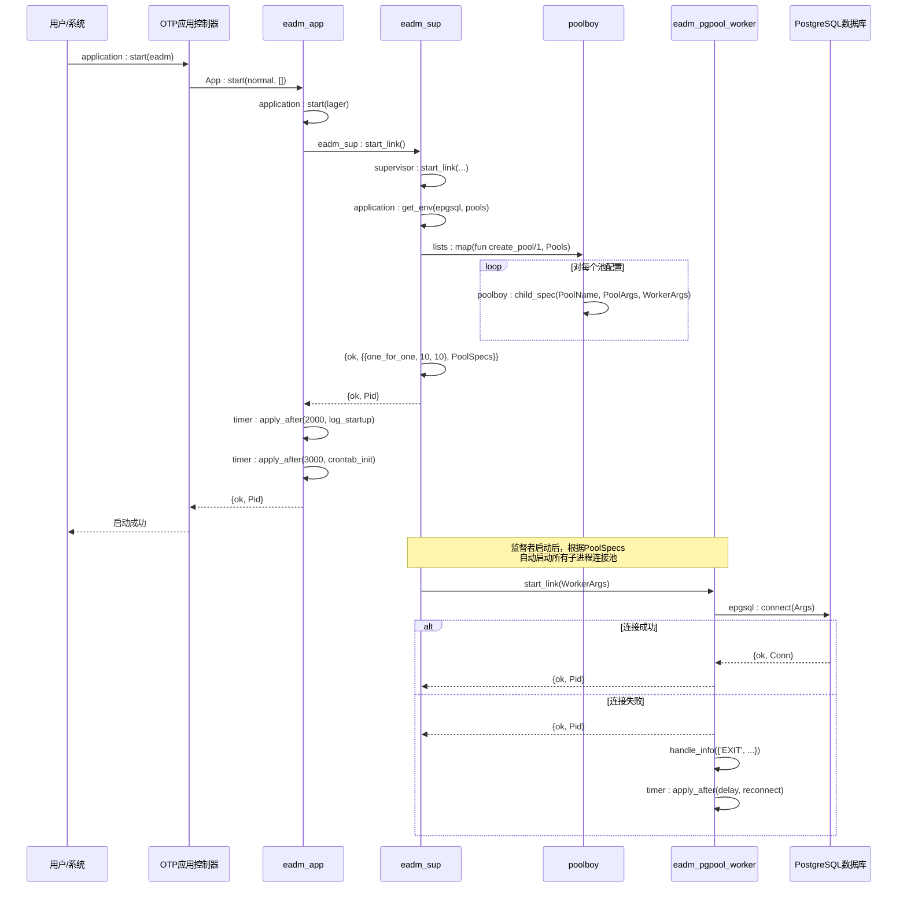

# OTP应用结构

<cite>
**Referenced Files in This Document**   
- [eadm_app.erl](file://src/eadm_app.erl)
- [eadm_sup.erl](file://src/eadm_sup.erl)
- [eadm_pgpool_worker.erl](file://src/eadm_pgpool_worker.erl)
- [db.config](file://config/db.config)
</cite>

## 目录
1. [应用入口与启动流程](#应用入口与启动流程)
2. [顶级监督者设计](#顶级监督者设计)
3. [数据库连接池管理](#数据库连接池管理)
4. [OTP行为模式实现](#otp行为模式实现)
5. [系统启动时序图](#系统启动时序图)
6. [进程树结构](#进程树结构)

## 应用入口与启动流程

`eadm_app` 模块作为应用程序的入口点，实现了 Erlang/OTP 的 `application` 行为模式。该模块通过 `start/2` 回调函数定义了应用的启动逻辑，当系统调用 `application:start/1` 或 `application:start/2` 时，此函数将被自动执行。

`start/2` 函数首先启动日志系统 `lager`，然后通过调用 `eadm_sup:start_link()` 启动应用的顶级监督者进程。成功启动监督者后，函数使用 `timer:apply_after/2` 和 `timer:apply_after/4` 分别在 2 秒和 3 秒后调度两个异步任务：一个用于打印应用启动成功的日志信息，另一个用于初始化定时任务控制器 `eadm_crontab_controller`。这种延迟调度机制确保了在应用核心组件完全启动后再执行相关初始化操作。

`stop/1` 函数则负责应用的优雅关闭，它会停止 `lager` 日志应用，执行必要的清理工作。

**Section sources**
- [eadm_app.erl](file://src/eadm_app.erl#L35-L50)

## 顶级监督者设计

`eadm_sup` 模块是应用的顶级监督者（supervisor），它实现了 OTP 的 `supervisor` 行为模式。该模块的设计遵循了 OTP 的监督者规范，负责启动、监控和重启其管理的子进程，从而确保应用的高可用性和容错性。

监督者采用 `one_for_one` 策略，这意味着当其管理的某个子进程终止时，只有该特定的子进程会被重启，而不会影响其他兄弟进程。这种策略适用于子进程之间相互独立的场景，能够最大限度地减少故障影响范围。监督策略的参数为 `{10, 10}`，表示在 10 秒的时间窗口内，如果子进程的重启次数超过 10 次，则整个监督者进程将被终止，从而触发更高级别的故障恢复机制。

`init/1` 函数是监督者的核心，它负责返回子进程的规范列表。该函数从应用环境变量 `epgsql` 中读取 `pools` 配置，动态生成数据库连接池的子进程规范。

**Section sources**
- [eadm_sup.erl](file://src/eadm_sup.erl#L35-L50)

## 数据库连接池管理

应用通过 `poolboy` 库实现了高效的数据库连接池管理。`eadm_sup` 模块在初始化时，会根据 `db.config` 配置文件中的 `pools` 定义，动态创建连接池。

配置文件定义了一个名为 `pool_pg` 的连接池，其大小（`size`）为 2，最大溢出（`max_overflow`）为 10。`eadm_sup:init/1` 函数通过 `lists:map/2` 遍历配置，为每个池构建 `PoolArgs` 和 `WorkerArgs`。`PoolArgs` 指定了连接池的本地注册名和工作进程模块（`eadm_pgpool_worker`），而 `WorkerArgs` 包含了数据库连接的具体参数（主机、端口、数据库名、用户名、密码）。

`poolboy:child_spec/3` 函数被用来生成符合 OTP 规范的子进程规范（Child Specification），该规范随后被传递给监督者，由监督者负责启动和监控这些连接池工作进程。此外，`add_pool/3` 函数提供了在运行时动态添加新连接池的能力。

`eadm_pgpool_worker` 模块作为连接池的工作进程，实现了 `gen_server` 和 `poolboy_worker` 行为模式。它封装了 `epgsql` 库的数据库操作，并实现了健壮的错误处理和自动重连机制。当数据库连接意外断开时，工作进程会捕获 `EXIT` 信号，并使用指数退避算法（`calculate_delay/1`）进行延迟重连，以避免在网络故障期间对数据库造成过大压力。

**Section sources**
- [eadm_sup.erl](file://src/eadm_sup.erl#L40-L50)
- [eadm_pgpool_worker.erl](file://src/eadm_pgpool_worker.erl#L100-L200)
- [db.config](file://config/db.config#L2-L16)

## OTP行为模式实现

本应用是 Erlang/OTP 设计原则的典型实践，清晰地展示了两种核心行为模式（behaviour）的应用。

`eadm_app` 模块通过 `-behaviour(application).` 声明实现了 `application` 行为模式。该模式要求模块必须导出 `start/2` 和 `stop/1` 回调函数。`start/2` 函数的职责是启动应用的监督树，通常通过启动顶级监督者来完成。`stop/1` 函数则用于执行清理工作。这种模式将应用的生命周期管理标准化，使其可以被 OTP 的应用控制器统一管理。

`eadm_sup` 模块通过 `-behaviour(supervisor).` 声明实现了 `supervisor` 行为模式。该模式要求模块导出 `init/1` 回调函数。`init/1` 函数必须返回一个 `{ok, {SupFlags, ChildSpecs}}` 元组，其中 `SupFlags` 定义了监督策略和强度，`ChildSpecs` 是一个子进程规范列表。每个子进程规范定义了如何启动和监控一个子进程。这种模式将进程的创建和监控逻辑分离，极大地简化了容错系统的构建。

`eadm_pgpool_worker` 模块则实现了 `gen_server` 行为模式，这是 OTP 中最常用的服务器行为，用于构建健壮的、状态化的服务器进程。

**Section sources**
- [eadm_app.erl](file://src/eadm_app.erl#L15-L20)
- [eadm_sup.erl](file://src/eadm_sup.erl#L15-L20)

## 系统启动时序图



**Diagram sources**
- [eadm_app.erl](file://src/eadm_app.erl#L35-L50)
- [eadm_sup.erl](file://src/eadm_sup.erl#L35-L50)
- [eadm_pgpool_worker.erl](file://src/eadm_pgpool_worker.erl#L200-L240)

## 进程树结构

```mermaid
graph TD
A[应用进程树] --> B[eadm_sup <br/> (顶级监督者)]
B --> C[pool_pg <br/> (连接池监督者)]
C --> D1[eadm_pgpool_worker <br/> (工作进程 1)]
C --> D2[eadm_pgpool_worker <br/> (工作进程 2)]
C --> D3[... <br/> (溢出工作进程)]
style B fill:#f9f,stroke:#333
style C fill:#bbf,stroke:#333
style D1 fill:#dfd,stroke:#333
style D2 fill:#dfd,stroke:#333
style D3 fill:#dfd,stroke:#333
classDef supervisor fill:#f9f,stroke:#333;
classDef pool fill:#bbf,stroke:#333;
classDef worker fill:#dfd,stroke:#333;
class B supervisor
class C pool
class D1,D2,D3 worker
subgraph "说明"
S1["one_for_one" 策略]
S2["Size: 2, MaxOverflow: 10"]
S3["每个工作进程独立连接数据库"]
end
```

**Diagram sources**
- [eadm_sup.erl](file://src/eadm_sup.erl#L40-L50)
- [eadm_pgpool_worker.erl](file://src/eadm_pgpool_worker.erl#L1-L10)