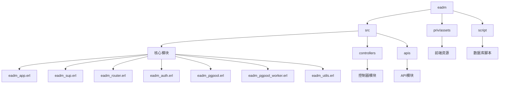
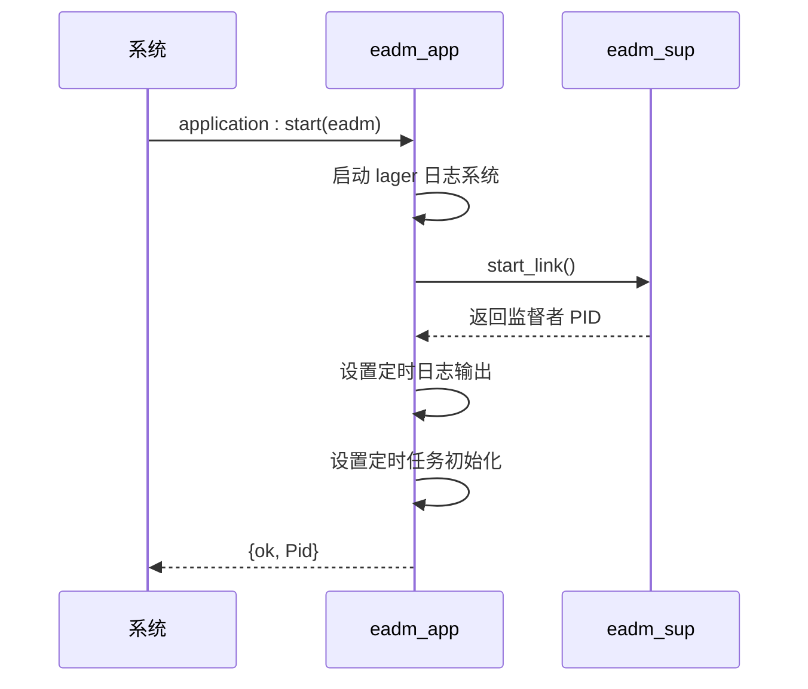
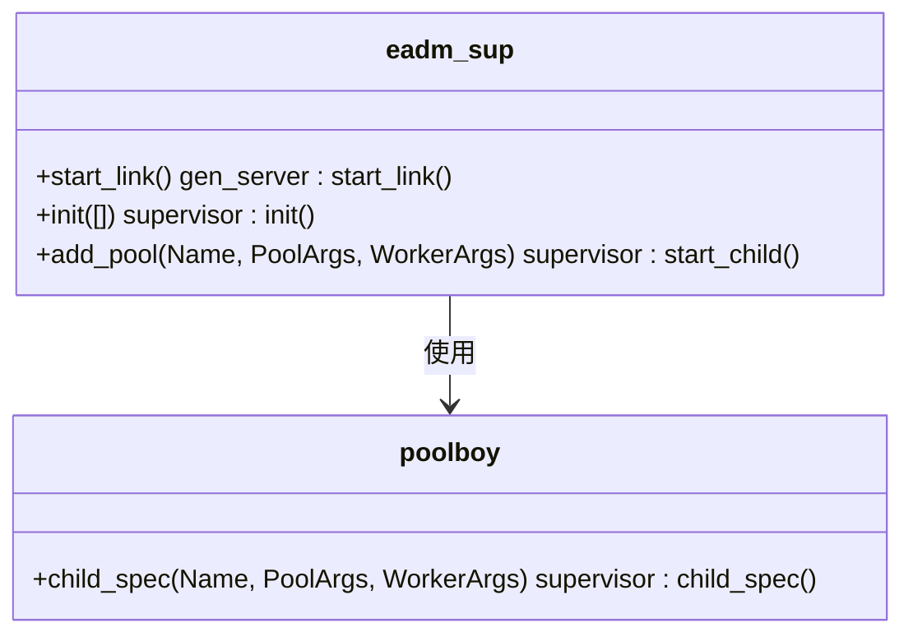
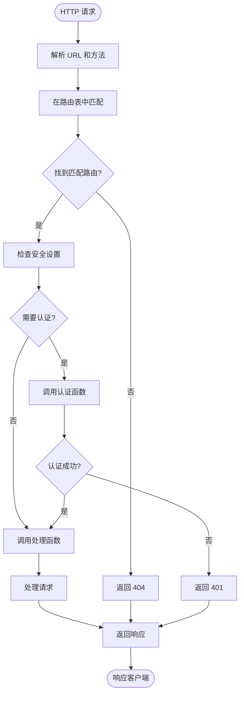
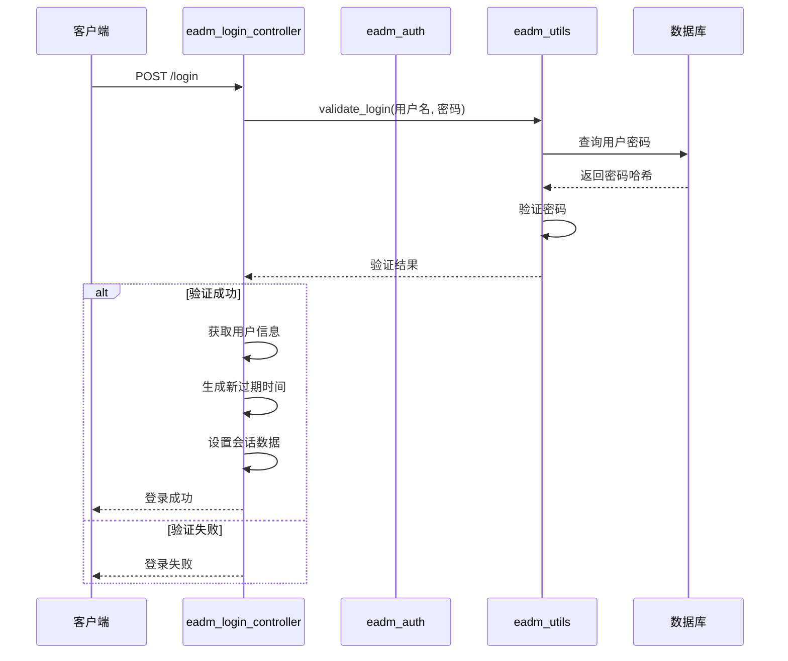
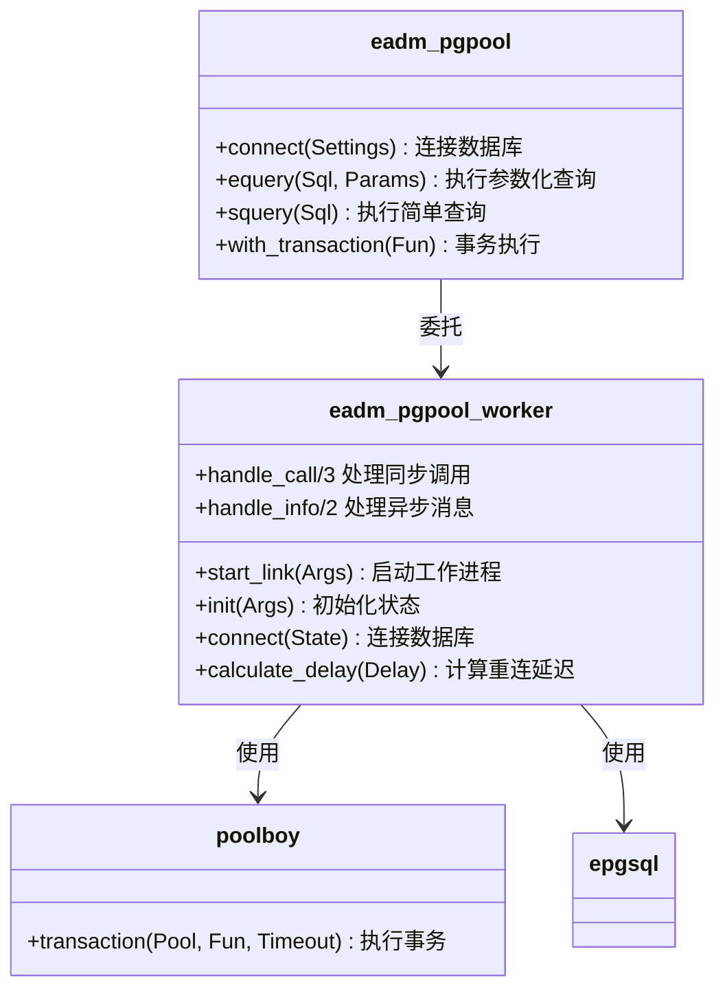
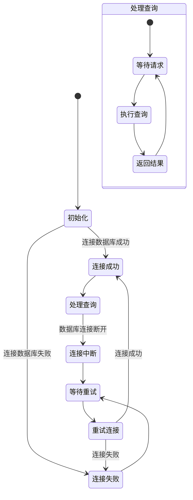

# 后端架构

<cite>
**本文档引用的文件**
- [eadm_app.erl](file://src/eadm_app.erl)
- [eadm_sup.erl](file://src/eadm_sup.erl)
- [eadm_router.erl](file://src/eadm_router.erl)
- [eadm_auth.erl](file://src/eadm_auth.erl)
- [eadm_pgpool.erl](file://src/eadm_pgpool.erl)
- [eadm_pgpool_worker.erl](file://src/eadm_pgpool_worker.erl)
- [eadm_login_controller.erl](file://src/controllers/eadm_login_controller.erl)
- [eadm_utils.erl](file://src/eadm_utils.erl)
</cite>

## 目录
1. [项目结构](#项目结构)
2. [应用启动流程](#应用启动流程)
3. [监督者与数据库连接池管理](#监督者与数据库连接池管理)
4. [路由机制与请求分发](#路由机制与请求分发)
5. [认证与会话管理](#认证与会话管理)
6. [数据库连接抽象与多数据库支持](#数据库连接抽象与多数据库支持)
7. [进程模型与错误处理](#进程模型与错误处理)
8. [可扩展性设计](#可扩展性设计)

## 项目结构

**图示来源**
- [eadm_app.erl](file://src/eadm_app.erl#L1-L55)
- [eadm_sup.erl](file://src/eadm_sup.erl#L1-L61)
- [eadm_router.erl](file://src/eadm_router.erl#L1-L164)

**本节来源**
- [eadm_app.erl](file://src/eadm_app.erl#L1-L55)
- [eadm_sup.erl](file://src/eadm_sup.erl#L1-L61)
- [eadm_router.erl](file://src/eadm_router.erl#L1-L164)

## 应用启动流程

`eadm_app` 模块作为 OTP 应用的入口点，实现了 `application` 行为模式。其启动流程遵循标准的 OTP 应用生命周期。

当系统调用 `application:start(eadm)` 时，会触发 `eadm_app:start/2` 函数。该函数首先启动日志系统 `lager`，然后通过 `eadm_sup:start_link()` 启动顶级监督者进程。启动成功后，系统会在2秒后输出启动成功的日志信息，并在3秒后初始化定时任务控制器。

**图示来源**
- [eadm_app.erl](file://src/eadm_app.erl#L38-L48)

**本节来源**
- [eadm_app.erl](file://src/eadm_app.erl#L38-L48)

## 监督者与数据库连接池管理

`eadm_sup` 模块作为系统的顶级监督者，负责管理所有子进程，特别是数据库连接池。它实现了 `supervisor` 行为模式，采用 `one_for_one` 重启策略，允许在10秒内最多重启10次子进程。

### 静态连接池初始化

在 `init/1` 函数中，监督者从应用配置中读取数据库连接池参数，并为每个配置的池创建子进程规范。这些参数通过 `application:get_env(epgsql, pools, [])` 获取，然后使用 `poolboy:child_spec/3` 创建连接池的子进程规范。

### 动态连接池创建

`eadm_sup` 提供了 `add_pool/3` API，允许在运行时动态添加新的数据库连接池。该函数接受连接池名称、池参数和工作进程参数，使用 `poolboy:child_spec/3` 创建子进程规范，然后通过 `supervisor:start_child/2` 将其添加到监督者树中。

**图示来源**
- [eadm_sup.erl](file://src/eadm_sup.erl#L41-L60)

**本节来源**
- [eadm_sup.erl](file://src/eadm_sup.erl#L41-L60)

## 路由机制与请求分发

`eadm_router` 模块实现了 `nova_router` 行为模式，负责定义系统的 URL 路由规则。它通过 `routes/1` 函数返回一个路由配置列表，每个配置项包含前缀、安全设置和具体的路由规则。

### 路由配置结构

路由配置采用嵌套的映射结构，每个路由组包含：
- `prefix`: URL 前缀
- `security`: 安全验证函数
- `routes`: 具体的路由规则列表

### 安全验证机制

路由系统集成了安全验证机制。对于需要认证的路由，`security` 字段指定验证模块和函数。例如，`{eadm_auth, auth}` 表示使用 `eadm_auth` 模块的 `auth/1` 函数进行验证。

### 路由匹配流程

当 HTTP 请求到达时，Nova 框架会根据请求的 URL 和方法在路由表中进行匹配，找到对应的处理函数并调用。静态资源路由（如 `/assets/[...]`）直接映射到文件系统中的资源目录。

**图示来源**
- [eadm_router.erl](file://src/eadm_router.erl#L38-L164)

**本节来源**
- [eadm_router.erl](file://src/eadm_router.erl#L38-L164)

## 认证与会话管理

`eadm_auth` 模块负责系统的用户认证和会话管理。它实现了与 Nova 框架集成的认证接口，通过 `auth/1` 函数验证用户会话的有效性。

### 认证流程

1. 从请求中获取会话中的过期时间 (`exp`)
2. 检查过期时间是否存在且未过期
3. 如果会话有效，刷新过期时间并返回认证成功信息
4. 如果会话无效或已过期，返回认证失败

### 会话刷新机制

系统采用会话刷新机制来延长用户登录状态。每次成功认证时，都会生成新的过期时间并更新会话，从而实现"保持登录"功能。过期时间通过 `eadm_utils:get_exp_bin/0` 函数计算，基于当前时间加上配置的会话超时时间。

### 登录流程

`eadm_login_controller:login/1` 处理用户登录请求。它验证用户名和密码，如果验证成功，则在会话中设置用户信息和新的过期时间。

**图示来源**
- [eadm_auth.erl](file://src/eadm_auth.erl#L21-L48)
- [eadm_login_controller.erl](file://src/controllers/eadm_login_controller.erl#L15-L78)
- [eadm_utils.erl](file://src/eadm_utils.erl#L100-L130)

**本节来源**
- [eadm_auth.erl](file://src/eadm_auth.erl#L21-L48)
- [eadm_login_controller.erl](file://src/controllers/eadm_login_controller.erl#L15-L78)
- [eadm_utils.erl](file://src/eadm_utils.erl#L100-L130)

## 数据库连接抽象与多数据库支持

`eadm_pgpool` 模块提供了对数据库连接的高级抽象，封装了 `poolboy` 连接池和 `epgsql` 驱动的复杂性，为上层应用提供了简洁的数据库操作接口。

### 连接池管理

`eadm_pgpool` 通过 `connect/1` 和 `connect/2` 函数管理数据库连接池。这些函数最终调用 `eadm_sup:add_pool/3` 在监督者下创建新的连接池。连接池的大小和溢出限制可以通过参数配置。

### 查询接口

模块提供了多种查询函数：
- `equery/2,3,4`: 执行参数化查询
- `squery/1,2,3`: 执行简单查询
- `with_transaction/1,2,3`: 在事务中执行函数

这些函数最终委托给 `eadm_pgpool_worker` 模块处理。

### 工作进程实现

`eadm_pgpool_worker` 模块实现了 `gen_server` 和 `poolboy_worker` 行为模式，作为连接池中的工作进程。它维护与数据库的连接状态，并处理重连逻辑。

#### 连接管理

工作进程在 `init/1` 时尝试连接数据库。如果连接失败，它会启动一个定时器，在指数退避的延迟后尝试重新连接。重连延迟从500毫秒开始，每次加倍，最大不超过5分钟。

#### 错误处理

当数据库连接进程退出时，`handle_info/2` 会捕获 `EXIT` 消息，取消现有的重连定时器（如果存在），并安排新的重连尝试。这种设计确保了数据库连接的高可用性。

**图示来源**
- [eadm_pgpool.erl](file://src/eadm_pgpool.erl#L1-L146)
- [eadm_pgpool_worker.erl](file://src/eadm_pgpool_worker.erl#L1-L245)

**本节来源**
- [eadm_pgpool.erl](file://src/eadm_pgpool.erl#L1-L146)
- [eadm_pgpool_worker.erl](file://src/eadm_pgpool_worker.erl#L1-L245)

## 进程模型与错误处理

系统采用 OTP 的监督者-工作者模式构建健壮的进程模型。`eadm_sup` 作为顶级监督者，管理所有关键子进程，确保系统的稳定性和容错能力。

### 监督策略

`eadm_sup` 使用 `one_for_one` 重启策略，这意味着当某个子进程终止时，只有该进程会被重启，不影响其他子进程。这种策略适用于子进程之间相对独立的场景。

### 错误传播与处理

系统实现了多层次的错误处理机制：
1. **工作进程层**: `eadm_pgpool_worker` 捕获数据库连接错误，尝试自动重连
2. **应用层**: 控制器函数使用 `try...catch` 处理数据库操作异常
3. **框架层**: Nova 框架处理 HTTP 请求层面的错误

### 异常监控

`eadm_pgpool_worker` 使用 `spawn_monitor` 创建监控进程来执行数据库事务。这种方法可以捕获超时和其他异常情况，并以统一的方式返回错误信息。

**图示来源**
- [eadm_sup.erl](file://src/eadm_sup.erl#L1-L61)
- [eadm_pgpool_worker.erl](file://src/eadm_pgpool_worker.erl#L114-L155)

**本节来源**
- [eadm_sup.erl](file://src/eadm_sup.erl#L1-L61)
- [eadm_pgpool_worker.erl](file://src/eadm_pgpool_worker.erl#L114-L155)

## 可扩展性设计

系统在架构设计上充分考虑了可扩展性，支持动态添加数据库连接池、灵活的路由配置和模块化的控制器设计。

### 动态数据库连接

通过 `eadm_sup:add_pool/3` 和 `eadm_pgpool:connect/2`，系统可以在运行时动态添加新的数据库连接池，支持多租户或多数据库架构。

### 模块化控制器

控制器被组织在 `controllers` 目录下，每个功能模块有独立的控制器文件。这种设计使得添加新功能变得简单，只需创建新的控制器模块并在路由中添加相应的规则。

### 配置驱动

系统的许多行为通过应用配置控制，如会话超时时间、连接池大小等。这种配置驱动的设计使得系统行为可以在不修改代码的情况下调整。

### 工具函数库

`eadm_utils` 模块提供了丰富的工具函数，包括数据转换、密码加密、时间处理等，这些通用功能的集中管理提高了代码的可重用性和一致性。

**本节来源**
- [eadm_sup.erl](file://src/eadm_sup.erl#L55-L60)
- [eadm_pgpool.erl](file://src/eadm_pgpool.erl#L25-L35)
- [eadm_utils.erl](file://src/eadm_utils.erl#L1-L383)