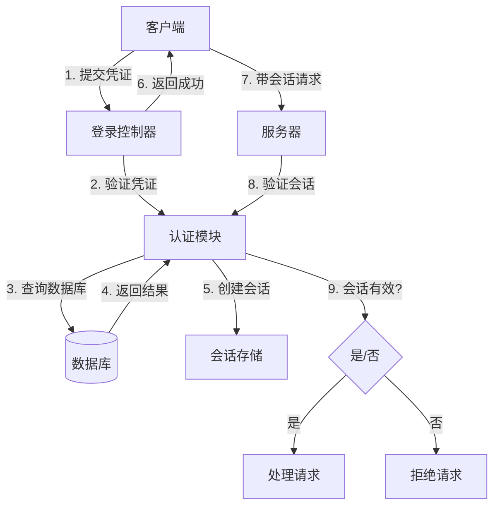
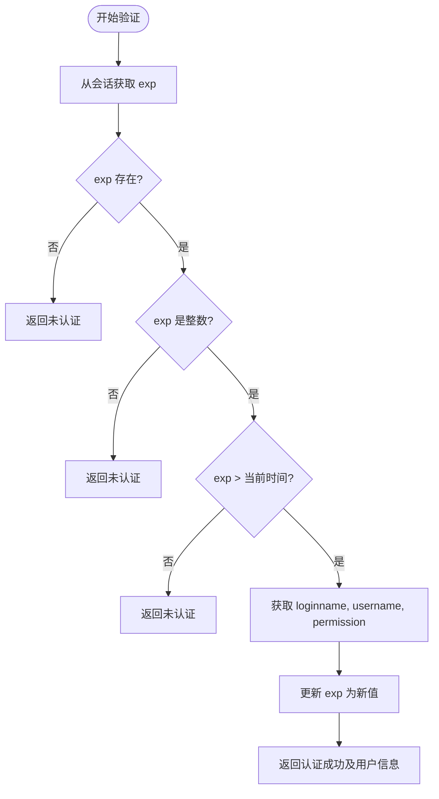
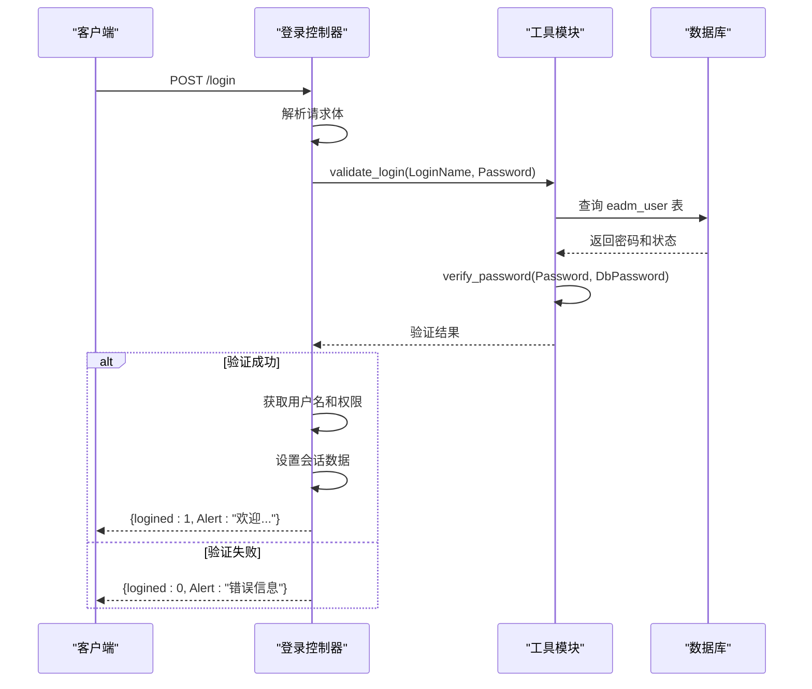
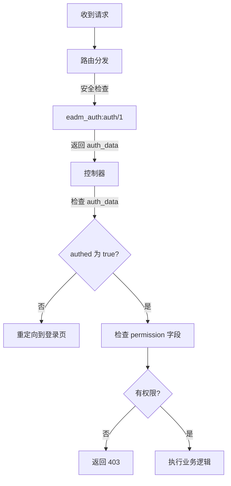
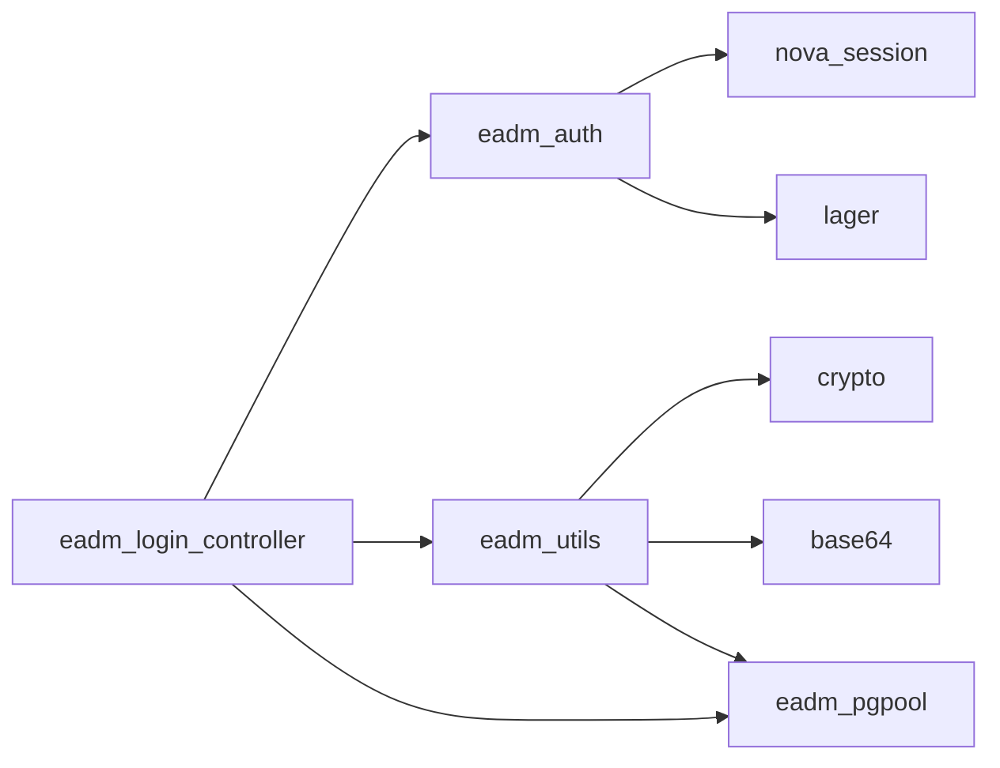

# 认证与授权

<cite>
**本文档中引用的文件**  
- [eadm_auth.erl](file://src/eadm_auth.erl)
- [eadm_login_controller.erl](file://src/controllers/eadm_login_controller.erl)
- [eadm_utils.erl](file://src/eadm_utils.erl)
- [eadm_router.erl](file://src/eadm_router.erl)
- [datastruct.sql](file://script/postgres/datastruct.sql)
</cite>

## 目录
1. [简介](#简介)
2. [项目结构](#项目结构)
3. [核心组件](#核心组件)
4. [架构概述](#架构概述)
5. [详细组件分析](#详细组件分析)
6. [依赖分析](#依赖分析)
7. [性能考虑](#性能考虑)
8. [故障排除指南](#故障排除指南)
9. [结论](#结论)

## 简介
本文档全面阐述了 `eadm` 系统中的认证与授权机制，重点围绕 `eadm_auth` 模块展开。文档详细描述了用户会话的创建、验证和销毁流程，基于角色的访问控制（RBAC）模型的实现方式，以及登录控制器如何与认证模块交互。同时涵盖了认证令牌的生成与管理、会话超时策略、密码安全存储机制和安全防护措施，并为开发者提供了集成自定义认证方式的指导。

## 项目结构
`eadm` 项目采用典型的Erlang/OTP架构，核心认证与授权功能集中在 `src` 目录下。`eadm_auth.erl` 是认证逻辑的核心模块，`controllers` 目录下的 `eadm_login_controller.erl` 负责处理用户登录请求。数据库表结构定义在 `script/postgres/datastruct.sql` 中，前端交互逻辑位于 `priv/assets/js` 目录。

**Section sources**
- [eadm_auth.erl](file://src/eadm_auth.erl)
- [eadm_login_controller.erl](file://src/controllers/eadm_login_controller.erl)
- [datastruct.sql](file://script/postgres/datastruct.sql)

## 核心组件
核心组件包括 `eadm_auth` 模块（负责会话验证）、`eadm_login_controller` 模块（负责登录处理）和 `eadm_utils` 模块（提供密码加密等工具函数）。这些组件协同工作，实现了完整的认证与授权流程。

**Section sources**
- [eadm_auth.erl](file://src/eadm_auth.erl#L1-L48)
- [eadm_login_controller.erl](file://src/controllers/eadm_login_controller.erl#L1-L244)
- [eadm_utils.erl](file://src/eadm_utils.erl#L1-L383)

## 架构概述
系统采用基于会话（Session）的认证机制。用户登录后，服务器创建一个包含用户信息和过期时间的会话。后续请求通过验证会话的有效性来判断用户身份。权限控制通过RBAC模型实现，用户的权限信息在登录时被加载并存储在会话中。

**Diagram sources**
- [eadm_auth.erl](file://src/eadm_auth.erl#L1-L48)
- [eadm_login_controller.erl](file://src/controllers/eadm_login_controller.erl#L1-L244)

## 详细组件分析

### 认证模块 (eadm_auth) 分析
`eadm_auth` 模块是整个系统认证的核心。其 `auth/1` 函数负责验证请求中的会话是否有效。

#### 会话验证流程
该模块通过检查会话中的 `exp`（过期时间）字段来判断会话是否有效。如果会话存在且未过期，则更新其过期时间并返回包含用户信息的认证数据。

**Diagram sources**
- [eadm_auth.erl](file://src/eadm_auth.erl#L1-L48)

**Section sources**
- [eadm_auth.erl](file://src/eadm_auth.erl#L1-L48)

### 登录控制器 (eadm_login_controller) 分析
`eadm_login_controller` 模块处理用户的登录、登出和密码修改等操作。

#### 用户登录流程
当用户提交登录请求时，控制器首先验证HTTP方法，然后从请求体中提取用户名和密码。接着调用 `eadm_utils:validate_login/2` 函数进行凭证验证。验证通过后，将用户信息写入会话，并返回登录成功响应。

**Diagram sources**
- [eadm_login_controller.erl](file://src/controllers/eadm_login_controller.erl#L1-L244)

**Section sources**
- [eadm_login_controller.erl](file://src/controllers/eadm_login_controller.erl#L1-L244)

### 基于角色的访问控制 (RBAC) 分析
系统的权限控制采用RBAC模型，通过 `eadm_router.erl` 中的路由配置和控制器内的权限检查来实现。

#### 权限校验流程
在 `eadm_router.erl` 中，大多数路由都配置了 `{eadm_auth, auth}` 作为安全检查。这意味着每次请求都会先经过 `eadm_auth:auth/1` 的验证。此外，控制器内部会检查 `auth_data` 中的 `permission` 字段来决定用户是否有权执行特定操作。

**Diagram sources**
- [eadm_router.erl](file://src/eadm_router.erl#L110-L141)
- [eadm_role_controller.erl](file://src/controllers/eadm_role_controller.erl#L1-L33)

**Section sources**
- [eadm_router.erl](file://src/eadm_router.erl#L110-L141)
- [eadm_role_controller.erl](file://src/controllers/eadm_role_controller.erl#L1-L81)

## 依赖分析
`eadm_auth` 模块依赖于 `nova_session` 库来管理会话，依赖于 `lager` 进行日志记录。`eadm_login_controller` 依赖于 `eadm_auth` 进行会话管理，依赖于 `eadm_utils` 进行密码验证和数据库查询，依赖于 `eadm_pgpool` 与PostgreSQL数据库交互。

**Diagram sources**
- [eadm_auth.erl](file://src/eadm_auth.erl#L1-L48)
- [eadm_login_controller.erl](file://src/controllers/eadm_login_controller.erl#L1-L244)
- [eadm_utils.erl](file://src/eadm_utils.erl#L1-L383)

**Section sources**
- [eadm_auth.erl](file://src/eadm_auth.erl#L1-L48)
- [eadm_login_controller.erl](file://src/controllers/eadm_login_controller.erl#L1-L244)
- [eadm_utils.erl](file://src/eadm_utils.erl#L1-L383)

## 性能考虑
会话验证是一个高频操作，`eadm_auth:auth/1` 函数的设计简洁高效，避免了不必要的数据库查询。会话数据存储在内存中，读取速度快。密码验证使用了SHA256哈希算法，虽然计算量较大，但通过 `verify_password/2` 函数的优化实现，保证了安全性与性能的平衡。

## 故障排除指南
- **用户无法登录**：检查用户名和密码是否正确，确认用户状态是否为“启用”，检查数据库连接是否正常。
- **登录后立即要求重新登录**：检查 `session_expire` 配置项是否过短，确认服务器系统时间是否正确。
- **权限不足**：检查用户的角色是否被正确分配，确认角色的权限设置是否包含所需功能。
- **密码修改失败**：检查新密码是否符合长度（6-36位）和字符集（英文、数字、,._-）要求。

**Section sources**
- [eadm_login_controller.erl](file://src/controllers/eadm_login_controller.erl#L1-L244)
- [eadm_utils.erl](file://src/eadm_utils.erl#L1-L383)

## 结论
`eadm` 系统的认证与授权机制设计合理，实现了安全、高效的用户身份验证和权限控制。通过 `eadm_auth` 模块和 `eadm_login_controller` 模块的紧密配合，结合RBAC模型，为系统提供了坚实的安全基础。开发者可以基于现有架构，通过扩展 `eadm_utils` 模块来集成更复杂的认证方式。