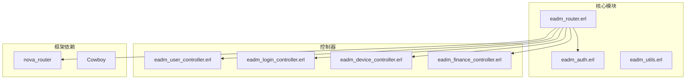
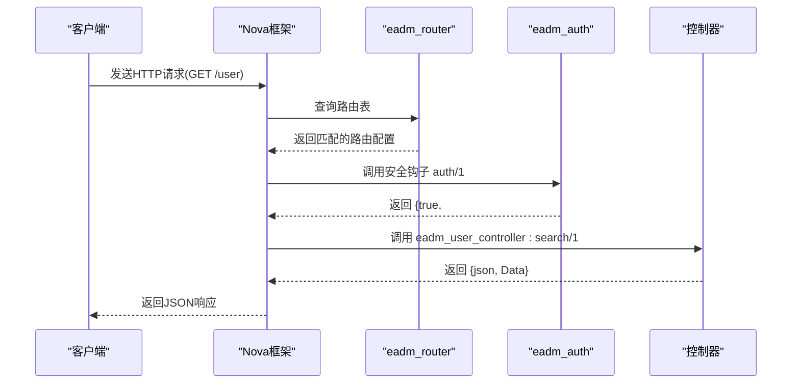
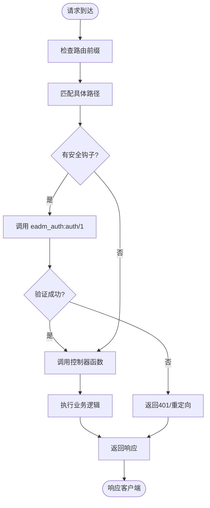
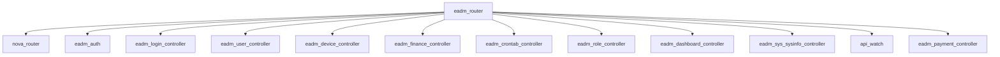

# 路由机制

<cite>
**本文档中引用的文件**  
- [eadm_router.erl](file://src/eadm_router.erl)
- [eadm_user_controller.erl](file://src/controllers/eadm_user_controller.erl)
- [eadm_auth.erl](file://src/eadm_auth.erl)
- [routing.md](file://_build/default/lib/nova/guides/routing.md)
</cite>

## 目录
1. [简介](#简介)
2. [项目结构](#项目结构)
3. [核心组件](#核心组件)
4. [架构概述](#架构概述)
5. [详细组件分析](#详细组件分析)
6. [依赖分析](#依赖分析)
7. [性能考量](#性能考量)
8. [故障排查指南](#故障排查指南)
9. [结论](#结论)

## 简介
本文档深入分析 `eadm` 系统中的 `eadm_router` 模块，详细说明其如何定义和管理 HTTP 请求的路由规则。文档涵盖路由表的结构设计、路径匹配机制、HTTP 方法处理、控制器回调绑定、前缀分组、安全钩子调用等核心功能，并通过具体流程展示请求从进入系统到被分发至控制器（如 `eadm_user_controller`）的完整过程。同时提供路由配置的最佳实践、性能优化建议和常见错误排查方法。

## 项目结构
`eadm` 是一个基于 Erlang 的 Web 应用，其核心路由机制由 `src/eadm_router.erl` 模块实现。项目结构清晰地分离了控制器（`controllers/`）、核心逻辑（`src/`）和静态资源（`priv/assets/`）。路由模块作为 Nova 框架的一部分，负责将 HTTP 请求映射到相应的控制器函数。

**图示来源**
- [eadm_router.erl](file://src/eadm_router.erl#L1-L20)
- [eadm_auth.erl](file://src/eadm_auth.erl#L1-L10)
- [eadm_user_controller.erl](file://src/controllers/eadm_user_controller.erl#L1-L10)

**本节来源**
- [eadm_router.erl](file://src/eadm_router.erl#L1-L50)
- [eadm_auth.erl](file://src/eadm_auth.erl#L1-L10)

## 核心组件
`eadm_router` 模块是整个系统请求分发的核心。它通过实现 `nova_router` 行为（behaviour）来定义路由规则。其核心功能是 `routes/1` 函数，该函数返回一个路由配置列表，每条配置定义了请求前缀、安全钩子和具体的路由规则。

**本节来源**
- [eadm_router.erl](file://src/eadm_router.erl#L15-L30)

## 架构概述
`eadm` 的路由机制采用分组配置模式，将具有相同前缀和安全策略的路由规则组织在一起。当一个 HTTP 请求到达时，Nova 框架的路由引擎会根据请求的 URL 路径，依次匹配路由表中的规则。匹配成功后，会先执行该路由组的安全钩子函数进行权限验证，验证通过后再将请求分发给对应的控制器回调函数处理。

**图示来源**
- [eadm_router.erl](file://src/eadm_router.erl#L16-L164)
- [eadm_auth.erl](file://src/eadm_auth.erl#L10-L48)
- [eadm_user_controller.erl](file://src/controllers/eadm_user_controller.erl#L50-L100)

## 详细组件分析
### 路由表结构与匹配机制
`eadm_router` 的路由表由一个映射列表构成，每个映射代表一个路由组。每个路由组包含三个关键字段：
- **prefix**: 字符串类型，定义该组路由的公共前缀。空字符串 `""` 表示根路径。
- **security**: 布尔值或元组 `{Module, Function}`，定义该组路由的安全验证函数。`false` 表示无需验证。
- **routes**: 列表类型，包含该组内的具体路由规则。

每条具体路由规则是一个三元组：`{Path, ControllerCallback, Options}`。
- **Path**: 字符串，定义URL路径，支持 `:param` 形式的路径参数（如 `/:userId`）。
- **ControllerCallback**: 函数引用，指向处理该请求的控制器函数。
- **Options**: 映射，包含 `methods` 键，指定允许的HTTP方法（如 `[get, post]`）。

路由匹配遵循从上到下的顺序，一旦找到匹配的组和路径，即停止搜索。

**本节来源**
- [eadm_router.erl](file://src/eadm_router.erl#L30-L164)

### 安全钩子（Security Hook）机制
安全钩子是 `eadm` 实现权限控制的核心。当路由组的 `security` 字段被设置为 `{eadm_auth, auth}` 时，Nova 框架会在调用控制器之前，自动调用 `eadm_auth:auth/1` 函数。

`eadm_auth:auth/1` 函数的实现逻辑如下：
1.  从请求会话（`nova_session`）中获取过期时间 `Exp`。
2.  检查 `Exp` 是否存在且未过期。
3.  如果验证通过，从会话中提取用户信息（如 `loginname`, `username`, `permission`），并刷新会话过期时间，返回 `{true, AuthData}`。
4.  如果验证失败（会话不存在或已过期），返回 `{true, #{<<"authed">> => false}}` 或 `false`。

控制器函数通过模式匹配 `#{auth_data := AuthMap}` 来获取安全钩子传递的用户数据，并据此进行业务逻辑判断和权限控制。

**图示来源**
- [eadm_router.erl](file://src/eadm_router.erl#L37-L164)
- [eadm_auth.erl](file://src/eadm_auth.erl#L10-L48)
- [routing.md](file://_build/default/lib/nova/guides/routing.md#L103-L149)

**本节来源**
- [eadm_router.erl](file://src/eadm_router.erl#L16-L164)
- [eadm_auth.erl](file://src/eadm_auth.erl#L10-L48)

### 请求分发流程：以 `/user` 为例
以下是一个请求从进入系统到被 `eadm_user_controller` 处理的完整流程：

1.  **请求发起**：客户端向 `/user` 发起一个 `GET` 请求。
2.  **路由匹配**：`nova_router` 在 `eadm_router:routes/1` 返回的列表中查找。它会匹配到 `prefix => ""` 且包含 `{"/user", fun eadm_user_controller:search/1, #{methods => [get]}}` 的路由组。
3.  **安全验证**：由于该路由组的 `security` 为 `{eadm_auth, auth}`，框架调用 `eadm_auth:auth/1` 进行验证。如果用户已登录，函数返回 `{true, #{<<"authed">> => true, <<"permission">> => #{<<"usermanage">> => true}}}`。
4.  **控制器调用**：框架将请求和 `auth_data` 一起传递给 `eadm_user_controller:search/1` 函数。
5.  **权限检查**：`search/1` 函数通过模式匹配确认用户具有 `usermanage` 权限。
6.  **业务处理**：函数调用 `eadm_pgpool:equery/3` 执行数据库查询。
7.  **响应生成**：查询结果通过 `eadm_utils:pg_as_json/2` 转换为 JSON 格式，并通过 `{json, Response}` 返回给框架。
8.  **响应返回**：框架将 JSON 响应发送回客户端。

**本节来源**
- [eadm_router.erl](file://src/eadm_router.erl#L60-L65)
- [eadm_user_controller.erl](file://src/controllers/eadm_user_controller.erl#L50-L80)

## 依赖分析
`eadm_router` 模块与系统中的多个组件紧密耦合。

**图示来源**
- [eadm_router.erl](file://src/eadm_router.erl#L30-L164)

**本节来源**
- [eadm_router.erl](file://src/eadm_router.erl#L1-L164)

## 性能考量
- **路由匹配效率**：路由表是线性列表，匹配效率为 O(n)。应将最常用的路由规则放在列表前面。
- **安全钩子开销**：每次请求都需要访问会话存储（如内存或数据库），这是主要的性能开销点。确保会话存储高效。
- **数据库查询**：控制器中的数据库操作是性能瓶颈。应使用连接池（如 `poolboy`）和优化 SQL 查询。
- **静态资源**：`/assets/[...]` 路由直接由 Nova 框架处理，效率很高，适合托管前端资源。

## 故障排查指南
- **404 错误**：检查请求路径是否拼写正确，是否与 `eadm_router.erl` 中定义的路径完全匹配（包括前缀）。
- **401/403 权限错误**：检查 `security` 配置是否正确。如果需要登录，确保用户已登录且会话未过期。检查 `eadm_auth:auth/1` 的日志输出。
- **500 服务器错误**：查看 `lager` 日志，通常由控制器中的异常（如数据库查询失败）引起。检查 `try...catch` 块中的错误信息。
- **路由不生效**：确认 `eadm_router` 模块已正确加载，并且 `routes/1` 函数返回了预期的路由列表。检查 `nova` 应用的配置。

**本节来源**
- [eadm_router.erl](file://src/eadm_router.erl#L1-L164)
- [eadm_auth.erl](file://src/eadm_auth.erl#L10-L48)
- [eadm_user_controller.erl](file://src/controllers/eadm_user_controller.erl#L50-L480)

## 结论
`eadm` 的路由机制通过 `eadm_router` 模块实现了清晰、灵活的请求分发。它利用 Nova 框架的 `nova_router` 行为，通过分组配置、前缀管理和安全钩子，有效地组织了系统的 API。`eadm_auth` 模块提供的安全钩子是实现权限控制的关键，它将认证信息无缝传递给控制器。整个机制设计合理，易于维护和扩展，为 `eadm` 系统的稳定运行提供了坚实的基础。