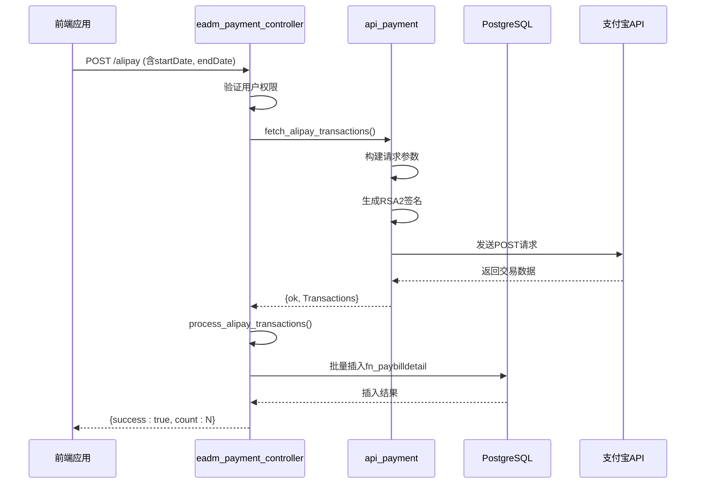
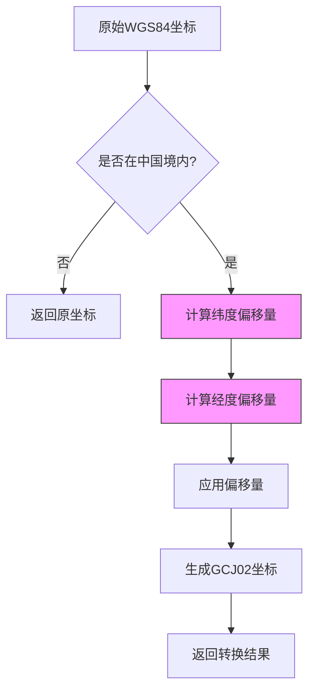

# 外部集成

<cite>
**本文档引用的文件**
- [eadm_wechat.erl](file://src/eadm_wechat.erl)
- [api_payment.erl](file://src/apis/api_payment.erl)
- [eadm_payment_controller.erl](file://src/controllers/eadm_payment_controller.erl)
- [amaploader.js](file://priv/assets/js/amaploader.js)
- [eadm_geo.erl](file://src/eadm_geo.erl)
</cite>

## 目录
1. [简介](#简介)
2. [微信集成](#微信集成)
3. [支付接口设计](#支付接口设计)
4. [高德地图集成](#高德地图集成)
5. [最佳实践与开发者指南](#最佳实践与开发者指南)

## 简介
本系统通过多个模块实现了与外部服务的深度集成，涵盖微信消息推送、第三方支付平台（支付宝和微信支付）以及高德地图地理信息服务。这些集成能力为系统提供了自动化通知、财务数据同步和地理位置处理等关键功能。本文档详细说明各集成模块的实现机制、配置方式和调用流程，为开发者提供清晰的技术参考。

## 微信集成

`eadm_wechat.erl` 模块实现了企业微信机器人消息推送功能，支持向指定群组发送文本消息。该模块通过 Webhook 接口与企业微信进行通信，利用预配置的密钥完成身份验证。

消息发送流程如下：调用 `send_msg/1` 函数传入二进制格式的中文内容，模块内部将其封装为 JSON 数据包，通过 HTTP POST 请求发送至企业微信 API 端点。请求头中指定内容类型为 `application/json`，并携带由 `wx_key` 构成的安全密钥。若发送失败，系统将记录错误日志并返回失败状态。

此功能可用于系统告警、任务完成通知等场景，实现关键事件的实时推送。

**Section sources**
- [eadm_wechat.erl](file://src/eadm_wechat.erl#L1-L51)

## 支付接口设计

支付功能由 `api_payment.erl` 和 `eadm_payment_controller.erl` 两个模块协同实现，分别负责底层 API 通信和上层请求处理。

### 支付网关支持

系统支持 **支付宝** 和 **微信支付** 两大主流支付平台。每个平台通过独立的配置项管理其 API 凭据：

- **支付宝**：需配置 `alipay_app_id`、`alipay_private_key`、`alipay_public_key`
- **微信支付**：需配置 `wechat_app_id`、`wechat_mch_id`、`wechat_api_key`、`wechat_api_v3_key`、`wechat_serial_no`、`wechat_private_key`

所有配置均通过 `application:get_env/3` 从应用环境读取，支持运行时动态设置。

### API 签名机制

#### 支付宝签名
采用 RSA2 签名算法。系统首先按字典序拼接请求参数生成待签名字符串，然后使用商户私钥进行签名，并将结果以 `sign` 参数附加到请求中。

#### 微信支付签名
采用 `WECHATPAY2-SHA256-RSA2048` 签名方案。签名字符串由 HTTP 方法、请求路径、时间戳、随机数和空行组成。使用商户私钥签名后，通过 `Authorization` 请求头传递认证信息，包含商户号、序列号、随机数、时间戳和签名值。

### 回调与数据同步

`eadm_payment_controller.erl` 提供了 `/alipay` 和 `/wechat` 两个 REST 接口，用于触发交易数据同步。请求需携带起止日期参数，并经过权限验证（`auth_data` 中需具备 `finance.finlist` 权限）。

后端调用 `api_payment:fetch_alipay_transactions/2` 或 `fetch_wechat_transactions/2` 获取交易记录，随后通过 `process_alipay_transactions/1` 或 `process_wechat_transactions/1` 将数据标准化并插入 `fn_paybilldetail` 表。系统还支持定时任务 `schedule_transaction_sync/0`，每日自动同步前一日交易数据。

配置接口 `/config` 允许通过 JSON 请求体动态更新支付网关配置，调用 `save_alipay_config/1` 或 `save_wechat_config/1` 将配置写入应用环境。

**Diagram sources**
- [api_payment.erl](file://src/apis/api_payment.erl#L1-L257)
- [eadm_payment_controller.erl](file://src/controllers/eadm_payment_controller.erl#L1-L258)

**Section sources**
- [api_payment.erl](file://src/apis/api_payment.erl#L1-L257)
- [eadm_payment_controller.erl](file://src/controllers/eadm_payment_controller.erl#L1-L258)

## 高德地图集成

系统通过前端 `amaploader.js` 和后端 `eadm_geo.erl` 模块实现高德地图服务的集成。

### 地图加载机制

`amaploader.js` 使用高德官方 `AMapLoader` 异步加载地图 SDK。初始化时配置以下参数：
- **Web API Key**：`8ed6fc7322bad71471c034af8b681cb6`
- **安全密钥**：通过 `_AMapSecurityConfig.securityJsCode` 设置为 `641af2cc3789991d5408e3429e29bb11`
- **插件列表**：包括比例尺、工具栏、定位、标记点、轨迹纠偏等
- **UI 组件**：加载 `SimpleMarker` 等 AMapUI 插件

加载成功后，创建地图实例并绑定至 `mapContainer` DOM 元素，设置默认中心点（经度 120.527112，纬度 36.411864）、缩放级别（13）和地图样式。同时自动添加比例尺、缩放控件和定位功能。

### 地理编码服务

`eadm_geo.erl` 模块提供 WGS84 坐标系（国际标准）到 GCJ02 坐标系（中国火星坐标系）的转换功能，确保与高德地图坐标的兼容性。

核心函数 `wgs84_to_gcj02/1` 接收 `{经度, 纬度}` 元组作为输入。首先判断坐标是否位于中国境内（经度 73.66~135.05，纬度 3.86~53.55），若不在则直接返回原坐标。对于境内坐标，通过一系列数学变换（包括正弦扰动算法）计算偏移量，最终生成符合高德地图要求的 GCJ02 坐标。

该服务可用于将 GPS 设备采集的原始坐标转换为地图可正确显示的位置。

**Diagram sources**
- [amaploader.js](file://priv/assets/js/amaploader.js#L1-L63)
- [eadm_geo.erl](file://src/eadm_geo.erl#L1-L87)

**Section sources**
- [amaploader.js](file://priv/assets/js/amaploader.js#L1-L63)
- [eadm_geo.erl](file://src/eadm_geo.erl#L1-L87)

## 最佳实践与开发者指南

### 集成第三方服务的建议
1. **配置管理**：敏感信息（如 API 密钥）应通过环境变量注入，避免硬编码。
2. **错误处理**：所有外部 API 调用必须包含异常捕获，记录详细日志以便排查。
3. **权限控制**：对外接口需验证用户身份和权限，防止未授权访问。
4. **数据转换**：从第三方获取的数据应进行标准化处理后再入库，确保数据一致性。
5. **异步处理**：大数据量同步（如账单下载）应采用异步任务，避免阻塞主线程。

### 开发参考实现
- **微信消息推送**：参考 `eadm_wechat:send_msg/1` 的实现，确保 JSON 格式正确且字符编码为二进制。
- **支付 API 集成**：遵循 `api_payment.erl` 的签名和请求构造逻辑，特别注意微信支付的头部认证格式。
- **地图坐标处理**：在将 GPS 坐标传递给高德地图前，务必调用 `eadm_geo:wgs84_to_gcj02/1` 进行转换。

通过以上模块的设计与实现，系统构建了一套稳定、安全且易于维护的外部服务集成框架，为后续扩展更多第三方服务提供了良好范例。