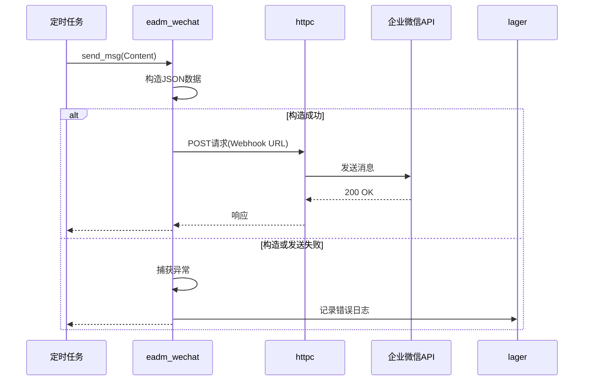
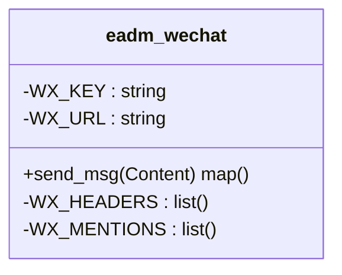
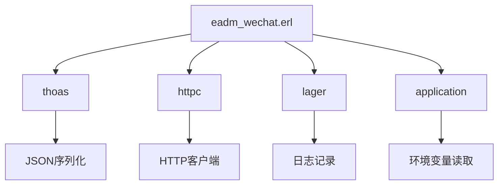

# 微信集成

<cite>
**本文档引用的文件**
- [eadm_wechat.erl](file://src/eadm_wechat.erl)
- [eadm_utils.erl](file://src/eadm_utils.erl)
- [eadm_crontab_controller.erl](file://src/controllers/eadm_crontab_controller.erl)
</cite>

## 目录
1. [简介](#简介)
2. [项目结构](#项目结构)
3. [核心组件](#核心组件)
4. [架构概述](#架构概述)
5. [详细组件分析](#详细组件分析)
6. [依赖分析](#依赖分析)
7. [性能考虑](#性能考虑)
8. [故障排除指南](#故障排除指南)
9. [结论](#结论)

## 简介
本文档全面说明 `eadm` 项目中企业微信机器人消息推送功能的实现机制。重点分析 `eadm_wechat.erl` 模块如何通过 Webhook 接口发送消息，涵盖配置参数、API 调用流程、JSON 请求构造、异常处理与日志记录策略。同时提供在系统告警和定时任务通知等场景下的使用示例，并介绍安全性实践。

## 项目结构
`eadm` 是一个基于 Erlang 的后端系统，其微信集成能力主要集中在 `src` 目录下的特定模块中。核心功能由 `eadm_wechat.erl` 实现，而定时任务调度则由 `eadm_crontab_controller.erl` 管理，二者可结合使用以实现自动化通知。

```mermaid
graph TB
subgraph "核心模块"
WeChat[eadm_wechat.erl<br>消息推送]
Cron[eadm_crontab_controller.erl<br>定时任务]
Utils[eadm_utils.erl<br>工具函数]
end
subgraph "数据层"
DB[(PostgreSQL)]
end
Cron --> WeChat : 调用 send_msg
WeChat --> HTTP[HTTP Client] --> WX[企业微信 Webhook]
Cron --> DB : 读取任务配置
Utils --> DB : 数据格式转换
```

**Diagram sources**
- [eadm_wechat.erl](file://src/eadm_wechat.erl)
- [eadm_crontab_controller.erl](file://src/controllers/eadm_crontab_controller.erl)

**Section sources**
- [eadm_wechat.erl](file://src/eadm_wechat.erl)
- [eadm_crontab_controller.erl](file://src/controllers/eadm_crontab_controller.erl)

## 核心组件
`eadm_wechat` 模块是实现微信消息推送的核心，提供了 `send_msg/1` 接口，封装了与企业微信 Webhook API 的交互细节。该模块利用宏定义管理配置，并通过 `thoas` 库进行 JSON 序列化，使用 `httpc` 发起 HTTP 请求。

**Section sources**
- [eadm_wechat.erl](file://src/eadm_wechat.erl#L1-L51)

## 架构概述
系统的微信集成采用分层架构。上层业务逻辑（如定时任务）通过调用 `eadm_wechat:send_msg/1` 发起消息请求。`eadm_wechat` 模块负责构造符合企业微信 API 规范的 JSON 负载，并处理 HTTP 通信的异常情况。整个过程依赖于 `lager` 进行错误日志记录。



**Diagram sources**
- [eadm_wechat.erl](file://src/eadm_wechat.erl#L21-L38)

## 详细组件分析

### eadm_wechat 模块分析
该模块实现了企业微信机器人的消息推送功能，其设计简洁且具有良好的错误处理机制。

#### 配置参数与宏定义
模块使用宏定义来管理配置，特别是 Webhook 的密钥。`?WX_KEY` 宏从应用环境变量 `wx_key` 中读取，若未配置则使用默认值。`?WX_URL` 宏将密钥拼接到 Webhook URL 中，`?WX_HEADERS` 定义了必要的 JSON 内容类型头。



**Diagram sources**
- [eadm_wechat.erl](file://src/eadm_wechat.erl#L21-L24)

#### API 调用流程与 JSON 构造
`send_msg/1` 函数是唯一的导出函数，其流程如下：
1.  接收一个二进制格式的 `Content` 消息。
2.  使用 `thoas:encode/1` 构造一个 Erlang Map，并将其序列化为 JSON 字符串。消息类型为 `text`，内容包含 `content` 和 `mentioned_list`。
3.  调用 `httpc:request/4` 向 `?WX_URL` 发起 POST 请求。
4.  若成功，返回 `#{<<"success">> => true}`。
5.  若在构造或发送过程中发生任何异常，捕获并使用 `lager:error/2` 记录错误，然后返回 `#{<<"success">> => false}`。

**Section sources**
- [eadm_wechat.erl](file://src/eadm_wechat.erl#L30-L38)

#### 异常处理与日志记录
模块采用了 `try...catch` 语句来确保函数的健壮性。任何在 JSON 编码或 HTTP 请求过程中抛出的异常（如 `Exception:Error`）都会被捕获。错误信息会通过 `lager` 框架记录到日志文件中，便于后续排查问题。这种设计保证了即使消息发送失败，也不会导致调用方的进程崩溃。

**Section sources**
- [eadm_wechat.erl](file://src/eadm_wechat.erl#L34-L38)

### 在定时任务中的应用
`eadm_crontab_controller.erl` 模块管理着系统的定时任务。当一个定时任务被调度执行时，其配置的 MFA（Module, Function, Arguments）会被解析并调用。开发者可以创建一个调用 `eadm_wechat:send_msg/1` 的函数，并将其作为定时任务的执行逻辑，从而实现周期性的系统告警或通知。

例如，一个定时任务的 `cronmfa` 字段可能配置为 `eadm_health:check_and_notify/0`，而 `check_and_notify/0` 函数内部会调用 `eadm_wechat:send_msg/1` 来发送健康检查结果。

**Section sources**
- [eadm_crontab_controller.erl](file://src/controllers/eadm_crontab_controller.erl#L100-L150)
- [eadm_wechat.erl](file://src/eadm_wechat.erl#L30-L38)

## 依赖分析
`eadm_wechat` 模块的正常运行依赖于多个外部组件和库。



**Diagram sources**
- [eadm_wechat.erl](file://src/eadm_wechat.erl)
- [go.mod](file://go.mod) <!-- Note: This is a placeholder; actual Erlang dependencies are in .app file -->

**Section sources**
- [eadm_wechat.erl](file://src/eadm_wechat.erl)

## 性能考虑
该模块的设计对性能影响较小。消息发送是异步的阻塞操作，但由于使用了 `try...catch`，短暂的网络延迟或失败不会影响主业务流程。对于高频率的消息推送，建议在调用方实现消息队列或批量发送机制，以避免对 `httpc` 客户端造成过大压力。

## 故障排除指南
当消息发送失败时，应按以下步骤进行排查：
1.  **检查日志**：首先查看 `lager` 生成的日志文件，确认 `eadm_wechat:send_msg/1` 是否记录了 "Message Send Failed" 错误。
2.  **验证 Webhook 密钥**：检查应用环境配置 (`nova` 应用) 中的 `wx_key` 是否与企业微信后台生成的密钥完全一致。
3.  **检查网络连接**：确保运行 `eadm` 服务的服务器能够访问 `https://qyapi.weixin.qq.com`。
4.  **测试 Webhook**：可以使用 `curl` 命令直接向 Webhook URL 发送测试消息，以排除代码问题。
5.  **检查消息内容**：确保传递给 `send_msg/1` 的 `Content` 是有效的二进制字符串。

**Section sources**
- [eadm_wechat.erl](file://src/eadm_wechat.erl#L36)
- [eadm_utils.erl](file://src/eadm_utils.erl#L370)

## 结论
`eadm_wechat.erl` 模块为 `eadm` 系统提供了一个简单、可靠的企业微信消息推送接口。通过清晰的宏定义、健壮的异常处理和标准的 API 调用，开发者可以轻松地在系统告警、定时任务通知等场景中集成微信通知功能。结合 `eadm_crontab_controller` 的定时调度能力，可以构建出强大的自动化运维通知体系。未来可考虑增加对消息类型（如图文、Markdown）的支持以增强功能。