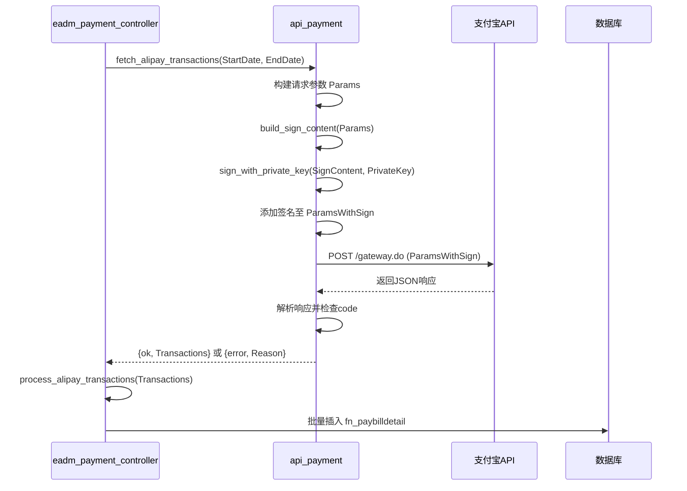
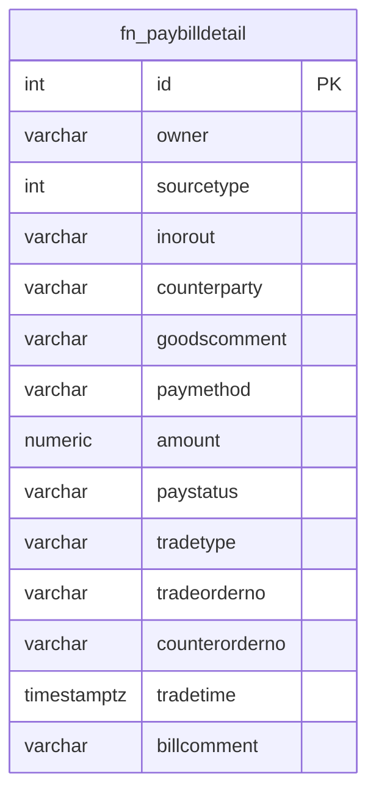

# 支付宝集成

<cite>
**本文档引用文件**  
- [api_payment.erl](file://src/apis/api_payment.erl)
- [eadm_payment_controller.erl](file://src/controllers/eadm_payment_controller.erl)
- [datastruct.sql](file://script/kingbase/datastruct.sql)
</cite>

## 目录
1. [简介](#简介)
2. [核心组件](#核心组件)
3. [请求参数构建与签名机制](#请求参数构建与签名机制)
4. [控制器权限验证与调用流程](#控制器权限验证与调用流程)
5. [前端触发方式](#前端触发方式)
6. [配置项加载机制](#配置项加载机制)
7. [交易数据持久化流程](#交易数据持久化流程)
8. [常见错误排查](#常见错误排查)

## 简介
本文档深入文档化 eadm 系统中支付宝支付的集成实现。重点分析 `api_payment.erl` 模块中的 `fetch_alipay_transactions/2` 函数如何构建符合支付宝开放平台规范的请求参数，并详细说明签名生成、权限控制、数据处理及错误处理等关键流程。

## 核心组件

本系统涉及的核心模块包括：
- `api_payment.erl`：负责与支付宝和微信支付API通信，封装请求构建、签名、发送和响应解析。
- `eadm_payment_controller.erl`：提供HTTP接口，处理前端请求，验证用户权限并调用底层API。
- `fn_paybilldetail` 表：用于持久化存储从第三方支付平台同步的交易明细。

**Section sources**
- [api_payment.erl](file://src/apis/api_payment.erl#L1-L257)
- [eadm_payment_controller.erl](file://src/controllers/eadm_payment_controller.erl#L1-L258)

## 请求参数构建与签名机制

`fetch_alipay_transactions/2` 函数负责构建符合支付宝开放平台规范的请求参数，并生成数字签名以确保请求完整性。

### 请求参数构建
函数首先检查 `alipay_app_id` 是否已配置，若未设置则返回错误。随后，使用以下关键字段构造请求参数：
- `app_id`：通过 `?ALIPAY_APP_ID` 宏从应用环境获取。
- `method`：固定为 `"alipay.trade.query"`，表示查询交易记录。
- `charset`：设置为 `"utf-8"`。
- `sign_type`：指定为 `"RSA2"`，表示使用RSA-SHA256算法进行签名。
- `timestamp`：调用 `format_datetime/1` 格式化当前时间为 `"YYYY-MM-DD HH:MM:SS"`。
- `version`：固定为 `"1.0"`。
- `biz_content`：包含业务参数（`start_time` 和 `end_time`）的JSON字符串。

### 签名生成流程
签名是确保请求安全性的核心步骤，流程如下：
1. **构造待签字符串**：调用 `build_sign_content/1` 函数，将上述参数按特定规则（如按参数名字典序排序、拼接等）生成待签名的字符串。当前代码中该函数为占位实现，需补充完整逻辑。
2. **执行私钥签名**：调用 `sign_with_private_key/2` 函数，使用从 `alipay_private_key` 配置项加载的应用私钥对待签字符串进行RSA2签名。该函数同样为占位实现。
3. **附加签名至请求**：将生成的签名值添加到请求参数 `Params` 中，形成最终的 `ParamsWithSign`。

### 发送请求
使用 `httpc:request/4` 发送POST请求至支付宝网关（默认URL为 `https://openapi.alipay.com/gateway.do`），内容类型为 `application/x-www-form-urlencoded`，请求体为参数列表的URL编码形式。

### 响应处理
解析返回的JSON响应，检查 `alipay_trade_query_response` 字段是否存在以及 `code` 是否为 `"10000"`（表示成功），否则返回相应的错误信息。



**Diagram sources**
- [api_payment.erl](file://src/apis/api_payment.erl#L30-L100)

**Section sources**
- [api_payment.erl](file://src/apis/api_payment.erl#L30-L100)

## 控制器权限验证与调用流程

`eadm_payment_controller.erl` 模块中的 `alipay/1` 函数是处理前端请求的入口点，负责权限验证和业务逻辑调度。

### 权限验证
函数通过模式匹配检查请求上下文中的 `auth_data`：
- 首先验证用户是否已登录（`<<"authed">> := true`）。
- 其次验证用户是否具有财务模块的查看权限（`<<"permission">> := #{<<"finance">> := #{<<"finlist">> := true}}`）。
- 若未登录，则重定向至 `/login`。
- 若已登录但无权限，则返回 `API鉴权失败` 错误。

### 调用与响应处理
当权限验证通过后，函数执行以下操作：
1. **调用API**：使用 `bindings` 中提取的 `startDate` 和 `endDate` 参数，调用 `api_payment:fetch_alipay_transactions/2`。
2. **处理结果**：
   - 若返回 `{ok, Transactions}`，则调用 `process_alipay_transactions/1` 处理并保存数据，返回成功JSON。
   - 若返回 `{error, Reason}`，则直接返回包含错误信息的失败JSON。
3. **异常捕获**：使用 `try...catch` 捕获运行时异常，记录错误日志并返回通用失败信息。

**Section sources**
- [eadm_payment_controller.erl](file://src/controllers/eadm_payment_controller.erl#L1-L50)

## 前端触发方式

前端通过发送HTTP GET请求至 `/api/payment/alipay` 接口来触发支付宝交易同步。请求需包含以下查询参数：
- `startDate`：查询起始日期，格式为 `YYYY-MM-DD`。
- `endDate`：查询结束日期，格式为 `YYYY-MM-DD`。

例如：
```
GET /api/payment/alipay?startDate=2025-05-15&endDate=2025-05-16
```

后端控制器 `alipay/1` 会从请求的 `bindings` 中提取这两个参数，并传递给底层API函数。

**Section sources**
- [eadm_payment_controller.erl](file://src/controllers/eadm_payment_controller.erl#L1-L20)

## 配置项加载机制

系统通过Erlang应用环境（application environment）管理支付宝相关的敏感配置。关键配置项包括：
- `alipay_app_id`：支付宝应用ID。
- `alipay_private_key`：应用私钥，用于请求签名。
- `alipay_public_key`：支付宝公钥，用于验证响应签名（当前代码中未使用）。

这些配置项在 `api_payment.erl` 中通过 `application:get_env/3` 宏（如 `?ALIPAY_APP_ID`）在运行时动态获取。默认值为空字符串，实际值需在 `sys.config` 或其他配置文件中定义。

此外，`eadm_payment_controller.erl` 提供了 `config/1` 接口，允许通过API动态更新这些配置。`save_alipay_config/1` 函数会将前端传入的 `appId`、`privateKey`、`publicKey` 通过 `application:set_env/3` 写入应用环境，实现配置的热更新。

**Section sources**
- [api_payment.erl](file://src/apis/api_payment.erl#L10-L25)
- [eadm_payment_controller.erl](file://src/controllers/eadm_payment_controller.erl#L222-L230)

## 交易数据持久化流程

成功获取支付宝交易数据后，系统会将其持久化存储到数据库的 `fn_paybilldetail` 表中。

### 数据处理
`process_alipay_transactions/1` 函数遍历API返回的每一条交易记录：
1. **数据转换**：调用 `convert_alipay_transaction/1` 将支付宝的原始交易数据结构映射为符合数据库表结构的Erlang map。当前该函数为占位实现，返回默认值。
2. **数据库插入**：使用 `eadm_pgpool:equery/3` 执行SQL `INSERT` 语句，将转换后的数据插入 `fn_paybilldetail` 表。

### 数据库表结构
`fn_paybilldetail` 表用于存储所有来源的支付账单明细，其关键字段如下：
- `id`：自增主键。
- `owner`：来源人（姓名）。
- `sourcetype`：来源类型，1表示支付宝，2表示微信。
- `inorout`：收/支。
- `counterparty`：交易对方。
- `goodscomment`：商品说明。
- `amount`：金额。
- `paymethod`：收/付款方式。
- `paystatus`：交易状态。
- `tradetime`：交易时间。
- `tradeorderno`：交易订单号。
- `counterorderno`：商家订单号。
- `billcomment`：交易备注。



**Diagram sources**
- [datastruct.sql](file://script/kingbase/datastruct.sql#L764-L830)
- [eadm_payment_controller.erl](file://src/controllers/eadm_payment_controller.erl#L100-L150)

**Section sources**
- [datastruct.sql](file://script/kingbase/datastruct.sql#L764-L830)
- [eadm_payment_controller.erl](file://src/controllers/eadm_payment_controller.erl#L100-L150)

## 常见错误排查

### 签名失败
- **现象**：API返回 `sign error` 或类似错误码。
- **排查步骤**：
  1. 检查 `alipay_private_key` 配置项是否正确，确保私钥格式（通常是PKCS#8 PEM格式）无误且未包含多余的换行或空格。
  2. 确认 `sign_type` 设置为 `"RSA2"`。
  3. 验证待签字符串的生成逻辑（`build_sign_content/1`）是否与支付宝官方文档完全一致（如参数排序、编码规则等）。
  4. 检查系统时间是否准确，时间偏差过大可能导致签名验证失败。

### API限流
- **现象**：API返回 `ACCESS_FORBIDDEN` 或 HTTP 429 状态码。
- **排查步骤**：
  1. 检查支付宝开放平台后台，确认当前应用的API调用频率是否超过限制。
  2. 优化调用策略，避免短时间内发起大量请求，可考虑增加重试机制和退避策略。
  3. 如业务需要高频调用，可申请提升配额。

### 配置未设置
- **现象**：系统直接返回 `支付宝API配置未设置`。
- **排查步骤**：
  1. 检查 `sys.config` 文件或配置管理界面，确认 `alipay_app_id`、`alipay_private_key` 等关键配置项已正确填写。
  2. 确认应用启动时加载了正确的配置文件。

### 数据库插入失败
- **现象**：日志中出现 `保存支付宝交易数据失败` 的错误。
- **排查步骤**：
  1. 检查数据库连接是否正常。
  2. 验证 `fn_paybilldetail` 表结构是否与插入语句匹配。
  3. 检查待插入数据是否存在类型不匹配或违反约束（如非空字段为null）的情况。

**Section sources**
- [api_payment.erl](file://src/apis/api_payment.erl#L40-L50)
- [eadm_payment_controller.erl](file://src/controllers/eadm_payment_controller.erl#L120-L130)