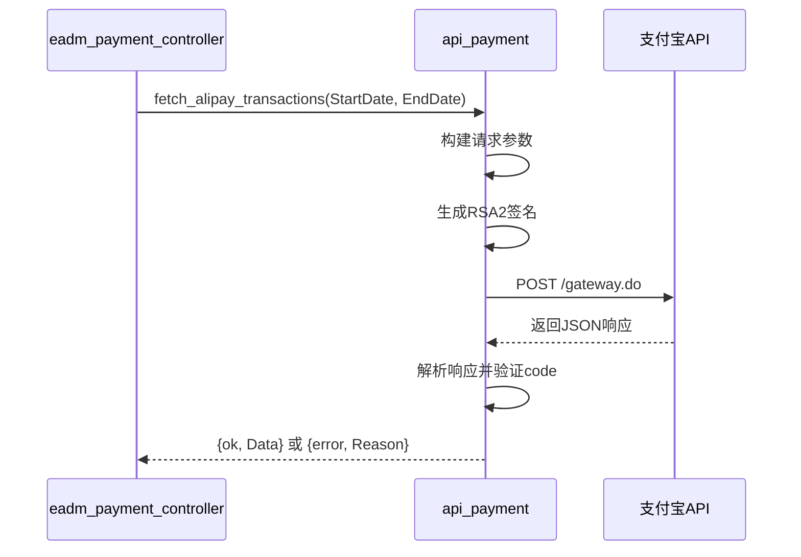
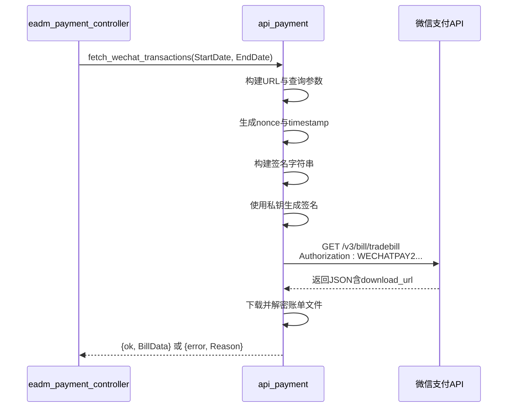
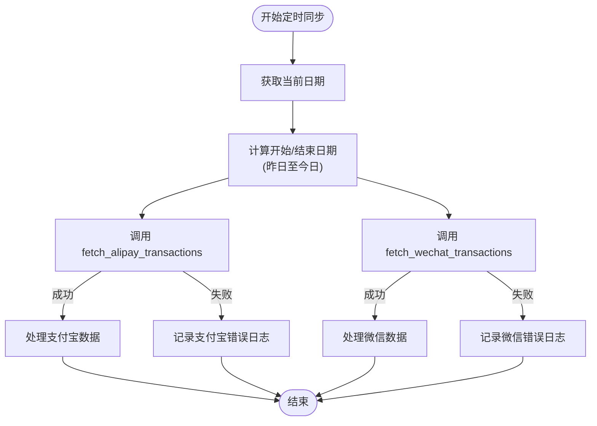
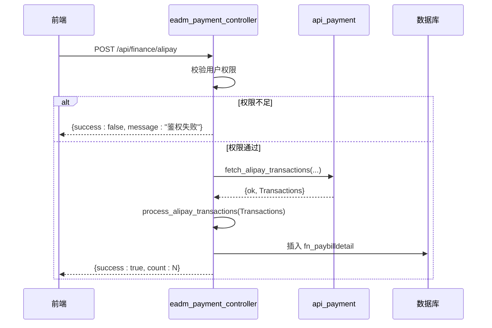
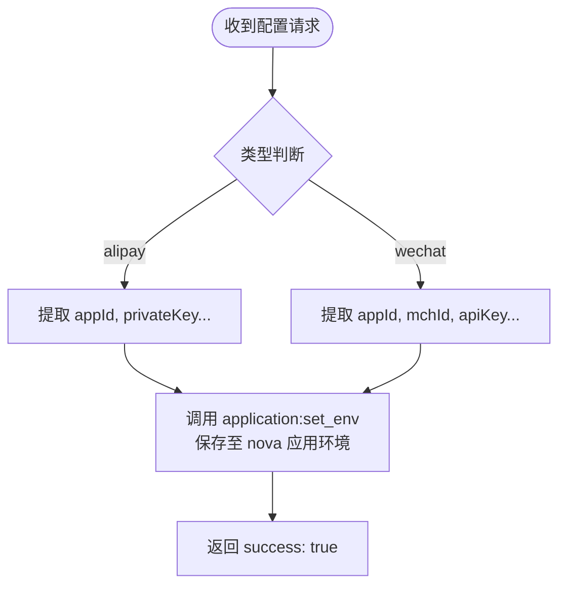
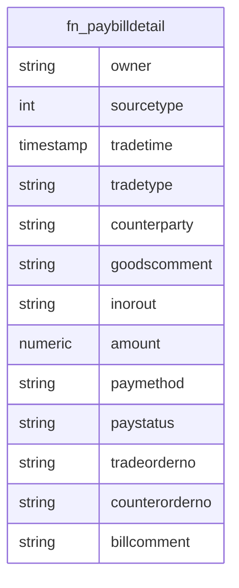
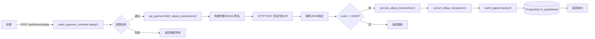

# 支付接口集成

<cite>
**本文档引用的文件**  
- [api_payment.erl](file://src/apis/api_payment.erl)
- [eadm_payment_controller.erl](file://src/controllers/eadm_payment_controller.erl)
- [eadm_pgpool.erl](file://src/eadm_pgpool.erl)
- [eadm_utils.erl](file://src/eadm_utils.erl)
</cite>

## 目录
1. [简介](#简介)
2. [核心组件](#核心组件)
3. [API 鉴权与请求流程](#api-鉴权与请求流程)
4. [定时任务同步机制](#定时任务同步机制)
5. [前端 RESTful API 触发流程](#前端-restful-api-触发流程)
6. [支付网关配置动态管理](#支付网关配置动态管理)
7. [数据库持久化流程](#数据库持久化流程)
8. [错误处理策略](#错误处理策略)
9. [调用链路分析](#调用链路分析)
10. [附录](#附录)

## 简介
`eadm` 系统的支付接口集成模块实现了与支付宝和微信支付平台的交易数据同步功能。通过 `api_payment.erl` 模块封装了与第三方支付网关的通信逻辑，支持基于 RSA2 签名和 WECHATPAY2-SHA256-RSA2048 认证头的安全鉴权机制。系统提供定时任务自动同步交易记录，并允许前端通过 RESTful 接口手动触发同步操作。所有交易数据最终持久化至 `fn_paybilldetail` 表中，确保财务数据的一致性与可追溯性。

## 核心组件

本系统支付功能的核心由以下模块构成：

- `api_payment.erl`：负责与支付宝和微信支付 API 的直接交互，包括请求构建、签名生成、响应解析及数据同步调度。
- `eadm_payment_controller.erl`：提供 RESTful 控制器接口，处理来自前端的支付相关请求，执行权限校验并调用底层服务。
- `eadm_pgpool.erl`：数据库连接池管理模块，用于将获取的交易数据写入 PostgreSQL 数据库。
- `eadm_utils.erl`：通用工具函数库，提供日期格式化、时间转换、日志记录等辅助功能。

**本节来源**  
- [api_payment.erl](file://src/apis/api_payment.erl#L1-L257)
- [eadm_payment_controller.erl](file://src/controllers/eadm_payment_controller.erl#L1-L258)
- [eadm_pgpool.erl](file://src/eadm_pgpool.erl#L1-L147)
- [eadm_utils.erl](file://src/eadm_utils.erl#L1-L384)

## API 鉴权与请求流程

### 支付宝交易数据获取（`fetch_alipay_transactions/2`）

该函数实现支付宝开放平台的交易查询接口调用，采用 RSA2 非对称加密算法进行签名认证。

1. **参数构建**：构造包含 `app_id`、`method`、`sign_type`（固定为 RSA2）、`timestamp`、`version` 和 `biz_content` 的请求参数映射。
2. **签名生成**：
   - 调用 `build_sign_content/1` 生成待签名字符串（按参数名升序拼接）。
   - 使用私钥调用 `sign_with_private_key/2` 执行 SHA256 with RSA 签名。
3. **HTTP 请求**：
   - 发送 POST 请求至 `https://openapi.alipay.com/gateway.do`。
   - 请求头设置为 `application/x-www-form-urlencoded;charset=utf-8`。
   - 请求体为 URL 编码的参数列表，包含生成的 `sign` 字段。
4. **响应解析**：
   - 使用 `thoas:decode/1` 解析 JSON 响应。
   - 检查 `alipay_trade_query_response.code` 是否为 `"10000"`（表示成功）。
   - 成功则返回交易数据，否则返回错误信息。

**图示来源**  
- [api_payment.erl](file://src/apis/api_payment.erl#L41-L101)

### 微信支付交易数据获取（`fetch_wechat_transactions/2`）

该函数对接微信支付 V3 API，使用平台证书序列号与私钥签名实现 `WECHATPAY2-SHA256-RSA2048` 认证机制。

1. **URL 构建**：请求路径为 `/v3/bill/tradebill`，参数包含 `bill_date` 和 `bill_type=ALL`。
2. **签名字符串生成**：
   - 方法（GET）+ 换行符 + 路径 + 换行符 + 时间戳 + 换行符 + 随机串 + 换行符 + 空消息体 + 换行符。
3. **认证头构造**：
   - 使用私钥对签名字符串执行 SHA256 with RSA 签名。
   - 构造 `Authorization` 头：`WECHATPAY2-SHA256-RSA2048 mchid="...",nonce_str="...",signature="...",timestamp="...",serial_no="..."`。
4. **HTTP 请求**：
   - 发送带 `Authorization` 和 `Accept: application/json` 头的 GET 请求。
5. **账单下载**：
   - 若响应含 `download_url`，则使用相同认证头下载加密账单文件（待实现）。

**图示来源**  
- [api_payment.erl](file://src/apis/api_payment.erl#L102-L169)

## 定时任务同步机制

`scheduled_transaction_sync/0` 函数用于每日定时同步前一日的交易数据。

### 执行逻辑

1. 获取当前本地时间，计算：
   - `StartDate`：昨日日期（格式：`YYYY-MM-DD`）
   - `EndDate`：今日日期
2. 并行调用：
   - `fetch_alipay_transactions(StartDate, EndDate)`
   - `fetch_wechat_transactions(StartDate, EndDate)`
3. 结果处理：
   - 成功：分别调用 `process_alipay_transactions/1` 和 `process_wechat_transactions/1` 处理数据。
   - 失败：记录错误日志（使用 `?LOG_ERROR`）。

该函数通常由系统定时任务框架（如 `ecron`）每日触发执行，确保交易数据的准实时同步。

**图示来源**  
- [api_payment.erl](file://src/apis/api_payment.erl#L170-L195)

## 前端 RESTful API 触发流程

前端通过 `eadm_payment_controller.erl` 提供的 REST 接口触发支付数据同步。

### 接口定义

| 接口 | 方法 | 路径 | 参数 |
|------|------|------|------|
| 支付宝同步 | POST | `/api/finance/alipay` | `startDate`, `endDate` |
| 微信同步 | POST | `/api/finance/wechat` | `startDate`, `endDate` |
| 配置保存 | POST | `/api/finance/config` | `type`, `appId`, `privateKey` 等 |

### 请求处理流程（以支付宝为例）

1. **权限校验**：
   - 检查 `auth_data` 中用户是否已登录（`authed=true`）且拥有财务权限（`finance.finlist=true`）。
   - 未通过则返回 `{success: false, message: "API鉴权失败"}` 或重定向至登录页。
2. **调用支付 API**：
   - 解析 `bindings` 中的 `startDate` 和 `endDate`。
   - 调用 `api_payment:fetch_alipay_transactions/2`。
3. **结果处理与持久化**：
   - 成功：调用 `process_alipay_transactions/1` 将数据写入数据库，返回成功响应。
   - 失败：返回错误信息。
4. **异常捕获**：任何异常均被捕获并记录日志，返回通用错误。

**图示来源**  
- [eadm_payment_controller.erl](file://src/controllers/eadm_payment_controller.erl#L25-L48)

## 支付网关配置动态管理

`config/1` 函数允许管理员通过 API 动态更新支付宝和微信支付的配置信息。

### 配置保存流程

1. **权限校验**：同上，需具备财务权限。
2. **类型判断**：根据 `json.type` 字段区分 `alipay` 或 `wechat`。
3. **配置提取与保存**：
   - **支付宝**：提取 `appId`, `privateKey`, `publicKey`，调用 `application:set_env/3` 存入应用环境。
   - **微信**：提取 `appId`, `mchId`, `apiKey`, `apiV3Key`, `serialNo`, `privateKey`，同样存入应用环境。
4. **运行时生效**：后续 `api_payment` 模块通过 `application:get_env/3` 读取最新配置，无需重启服务。

此机制实现了支付参数的热更新，提升了系统运维灵活性。

**图示来源**  
- [eadm_payment_controller.erl](file://src/controllers/eadm_payment_controller.erl#L70-L105)

## 数据库持久化流程

交易数据通过 `eadm_pgpool` 模块持久化至 PostgreSQL 数据库。

### 数据处理与插入

1. **数据转换**：
   - `convert_alipay_transaction/1` 和 `convert_wechat_transaction/1` 将第三方平台的交易记录映射为统一的内部数据结构。
   - 字段包括：`Owner`, `Source`, `TradeTime`, `Amount`, `PayMethod` 等。
2. **数据库插入**：
   - 使用 `eadm_pgpool:equery/4` 执行参数化 SQL 插入语句。
   - 支付宝和微信使用略有不同的 `INSERT` 语句，但均写入 `fn_paybilldetail` 表。
   - 采用 `lists:foreach/2` 遍历所有交易记录，逐条插入。

### 数据库表结构（`fn_paybilldetail`）

| 字段名 | 类型 | 说明 |
|--------|------|------|
| owner | VARCHAR | 所属用户/系统 |
| sourcetype | INTEGER | 来源（1=支付宝，2=微信） |
| tradetime | TIMESTAMP | 交易时间 |
| tradetype | VARCHAR | 交易类型 |
| counterparty | VARCHAR | 交易对方 |
| goodscomment | VARCHAR | 商品说明 |
| inorout | VARCHAR | 收入/支出 |
| amount | NUMERIC | 金额 |
| paymethod | VARCHAR | 支付方式 |
| paystatus | VARCHAR | 支付状态 |
| tradeorderno | VARCHAR | 交易订单号 |
| counterorderno | VARCHAR | 对方订单号 |
| billcomment | VARCHAR | 账单备注 |

**图示来源**  
- [eadm_payment_controller.erl](file://src/controllers/eadm_payment_controller.erl#L110-L160)
- [eadm_pgpool.erl](file://src/eadm_pgpool.erl#L1-L147)

## 错误处理策略

系统在多个层级实现了完善的错误处理机制。

### 异常捕获

- **控制器层**：使用 `try...catch` 捕获所有运行时异常，记录 `?LOG_ERROR` 日志，返回用户友好的错误信息。
- **API 层**：同样使用 `try...catch`，区分配置缺失（如 APP ID 为空）与网络/解析错误。

### 错误分类

| 错误类型 | 处理方式 |
|----------|----------|
| 配置缺失 | 返回明确提示（如“支付宝API配置未设置”） |
| 网络请求失败 | 记录详细异常，返回“获取交易记录失败” |
| 响应解析错误 | 检查 JSON 结构，返回“API返回格式错误” |
| 数据库写入失败 | 捕获异常并记录 `?LOG_ERROR`，不影响其他记录处理 |
| 权限不足 | 返回“API鉴权失败”或重定向登录 |

### 日志记录

- 使用 `lager` 框架记录 `INFO` 和 `ERROR` 级别日志。
- 定时任务日志通过 `eadm_utils:log_info/1` 同时写入文件和 `sys_cronlog` 数据库表，便于审计。

**本节来源**  
- [api_payment.erl](file://src/apis/api_payment.erl#L48-L50)
- [api_payment.erl](file://src/apis/api_payment.erl#L109-L111)
- [eadm_payment_controller.erl](file://src/controllers/eadm_payment_controller.erl#L29-L32)
- [eadm_utils.erl](file://src/eadm_utils.erl#L345-L383)

## 调用链路分析

完整的支付数据同步调用链路如下：

**图示来源**  
- [eadm_payment_controller.erl](file://src/controllers/eadm_payment_controller.erl#L25-L48)
- [api_payment.erl](file://src/apis/api_payment.erl#L41-L101)
- [eadm_pgpool.erl](file://src/eadm_pgpool.erl#L1-L147)

## 附录

### 常量定义（`api_payment.erl`）

| 常量 | 说明 |
|------|------|
| `?ALIPAY_API_URL` | 支付宝网关地址 |
| `?ALIPAY_APP_ID` | 支付宝应用ID |
| `?ALIPAY_PRIVATE_KEY` | 支付宝应用私钥 |
| `?WECHAT_API_URL` | 微信支付API基础URL |
| `?WECHAT_MCH_ID` | 微信商户号 |
| `?WECHAT_SERIAL_NO` | 证书序列号 |
| `?WECHAT_PRIVATE_KEY` | 微信API私钥 |

### 工具函数（`eadm_utils.erl`）

- `yesterday_date_binary/0`：生成昨日日期字符串，用于定时任务。
- `log_info/1`：统一日志记录接口，支持文件与数据库双写。
- `pg_as_map/2`：将数据库查询结果转换为 Erlang map，便于处理。

**本节来源**  
- [api_payment.erl](file://src/apis/api_payment.erl#L15-L35)
- [eadm_utils.erl](file://src/eadm_utils.erl#L150-L170)