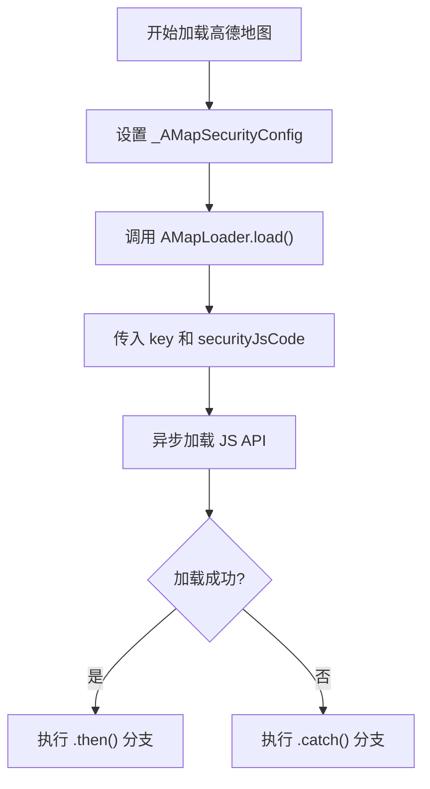
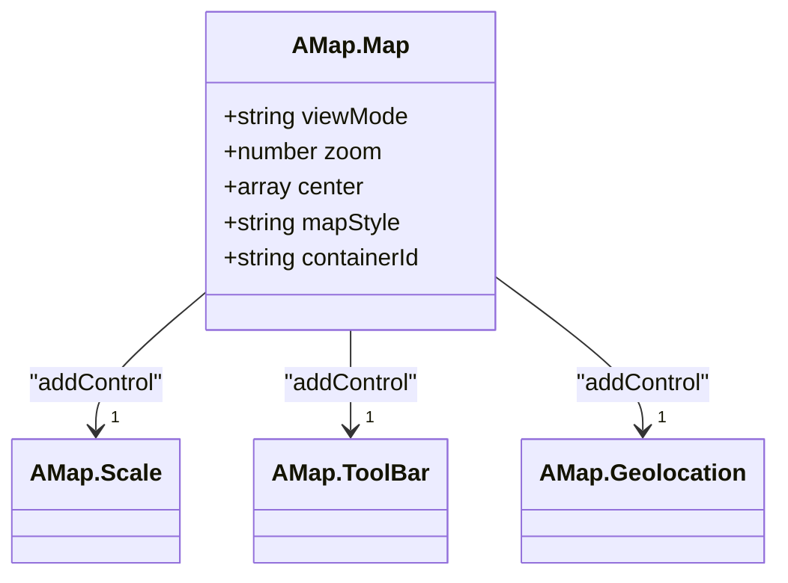
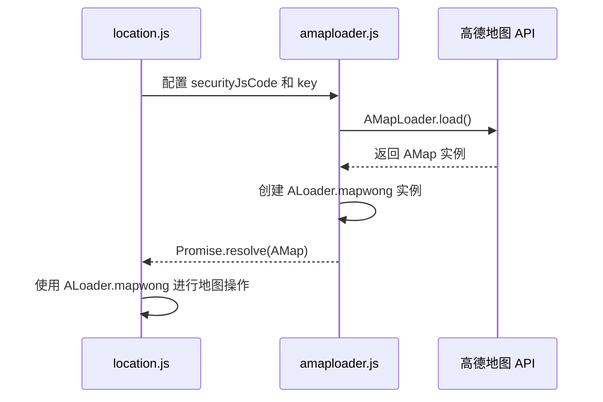

# 前端地图集成

<cite>
**本文档引用文件**  
- [amaploader.js](file://priv/assets/js/amaploader.js)
- [location.js](file://priv/assets/js/location.js)
- [location.css](file://priv/assets/css/location.css)
</cite>

## 目录
1. [简介](#简介)
2. [高德地图加载器实现](#高德地图加载器实现)
3. [API密钥与安全配置](#api密钥与安全配置)
4. [插件加载与功能说明](#插件加载与功能说明)
5. [地图实例化配置](#地图实例化配置)
6. [地图初始化后行为](#地图初始化后行为)
7. [前端调用示例](#前端调用示例)
8. [错误处理与调试建议](#错误处理与调试建议)

## 简介
本文档详细说明 eadm 项目中高德地图的前端集成实现。重点分析 `amaploader.js` 模块如何通过 AMapLoader 异步加载高德 JS API，并描述地图在 `location.js` 中的实际应用。涵盖 API 密钥配置、安全机制、插件加载、地图初始化参数及交互功能等核心内容。

## 高德地图加载器实现

`amaploader.js` 文件实现了高德地图 SDK 的异步加载机制，通过全局对象 `window.ALoader` 提供地图实例的统一访问入口。该模块采用 Promise 模式确保地图资源加载完成后再进行后续操作。

**Section sources**
- [amaploader.js](file://priv/assets/js/amaploader.js#L1-L63)

## API密钥与安全配置

系统通过以下方式配置高德地图 API 访问凭证：

- **API Key**: `8ed6fc7322bad71471c034af8b681cb6`，用于标识应用身份并启用 Web 端服务
- **安全密钥 (securityJsCode)**: `641af2cc3789991d5408e3429e29bb11`，通过 `window._AMapSecurityConfig` 全局配置对象注入，防止 API Key 被盗用

此安全机制确保即使 API Key 泄露，攻击者也无法在其他域名下使用该密钥，有效提升系统安全性。

**Diagram sources**
- [amaploader.js](file://priv/assets/js/amaploader.js#L7-L10)
- [amaploader.js](file://priv/assets/js/amaploader.js#L12-L34)

## 插件加载与功能说明

加载器配置了多个高德地图插件，以支持丰富的地图交互功能：

| 插件名称 | 功能用途 |
|--------|--------|
| AMap.Scale | 显示地图比例尺，帮助用户判断实际距离 |
| AMap.ToolBar | 提供缩放控制工具条，支持放大、缩小、复位操作 |
| AMap.Geolocation | 获取用户当前位置并提供定位功能 |
| AMap.Marker | 支持在地图上添加标记点 |
| AMap.Pixel | 像素坐标处理工具 |
| AMap.Polyline | 绘制折线路径，用于轨迹展示 |
| AMap.LngLat | 经纬度对象处理工具 |
| AMap.convertFrom | 坐标系转换功能，支持 WGS84 到 GCJ02 的转换 |
| AMap.GraspRoad | 轨迹纠偏算法，优化 GPS 轨迹数据 |

此外，还加载了 AMapUI 组件库中的 `overlay/SimpleMarker` 插件，用于创建自定义标记。

**Section sources**
- [amaploader.js](file://priv/assets/js/amaploader.js#L18-L28)

## 地图实例化配置

地图实例通过以下参数进行初始化配置：

- **容器 ID**: `mapContainer`，对应 HTML 中的 `
` 元素
- **初始中心点**: `[120.527112, 36.411864]`，设定地图初始显示区域
- **缩放级别**: `11`，控制地图初始缩放程度
- **地图样式**: `amap://styles/fresh`，使用高德预设的清新风格地图样式
- **视图模式**: `2D`，采用二维平面视图

这些配置在 `AMap.Map` 构造函数中定义，确保地图按预期方式呈现。

**Diagram sources**
- [amaploader.js](file://priv/assets/js/amaploader.js#L36-L42)

## 地图初始化后行为

地图初始化后执行一系列增强操作：

1. **动态缩放**: 通过 `setZoomAndCenter(13, currentCenter, false, 2000)` 将地图级别从 11 平滑缩放到 13
2. **添加比例尺控件**: `addControl(new AMap.Scale())`
3. **添加工具条控件**: `addControl(new AMap.ToolBar({position: 'LT'}))`，置于左上角
4. **添加定位控件**: `addControl(new AMap.Geolocation())`，支持快速定位

这些操作提升了地图的可用性和用户体验。

**Section sources**
- [amaploader.js](file://priv/assets/js/amaploader.js#L44-L53)

## 前端调用示例

在 `location.js` 模块中，通过 `ALoader.mapwong` 实例安全使用已加载的地图对象。该模块同样配置了相同的安全密钥和 API Key，确保地图功能一致性。

**Diagram sources**
- [location.js](file://priv/assets/js/location.js#L7-L35)
- [amaploader.js](file://priv/assets/js/amaploader.js#L7-L10)

## 错误处理与调试建议

系统实现了完善的错误捕获机制：

- 使用 `.catch((e) => { console.error(e); })` 捕获加载失败异常
- 在控制台输出详细错误信息，便于定位问题
- 建议检查网络连接、API Key 有效性及安全密钥配置

当加载失败时，前端应提供友好的用户提示，并记录错误日志用于后续分析。

**Section sources**
- [amaploader.js](file://priv/assets/js/amaploader.js#L61-L63)
- [location.js](file://priv/assets/js/location.js#L362-L364)