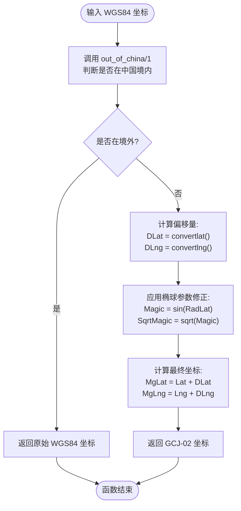

# 后端坐标转换

<cite>
**本文档引用文件**  
- [eadm_geo.erl](file://src/eadm_geo.erl)
- [amaploader.js](file://priv/assets/js/amaploader.js)
- [eadm_location_controller.erl](file://src/controllers/eadm_location_controller.erl)
</cite>

## 目录
1. [引言](#引言)
2. [核心转换逻辑](#核心转换逻辑)
3. [边界判断机制](#边界判断机制)
4. [偏移算法剖析](#偏移算法剖析)
5. [正弦扰动函数分析](#正弦扰动函数分析)
6. [椭球参数应用](#椭球参数应用)
7. [调用示例与使用场景](#调用示例与使用场景)
8. [合规性与前后端协同](#合规性与前后端协同)
9. [结论](#结论)

## 引言
本项目 `eadm` 是一个基于 Erlang 开发的后端系统，用于处理企业级设备定位、轨迹回放与地理信息管理。在涉及地理位置数据的应用中，坐标系的合规性转换至关重要。中国出于地理信息安全考虑，要求所有公开地图服务使用国家加密的 GCJ-02 坐标系（俗称“火星坐标系”），而非国际通用的 WGS84 坐标系。

为此，系统在 `src/eadm_geo.erl` 模块中实现了 `wgs84_to_gcj02/1` 函数，专门负责将原始 GPS 获取的 WGS84 经纬度坐标转换为符合中国法规的 GCJ-02 坐标。该转换不仅确保了前端地图展示的准确性，也满足了数据存储与传输的合规性要求。

**Section sources**
- [eadm_geo.erl](file://src/eadm_geo.erl#L1-L10)

## 核心转换逻辑
`wgs84_to_gcj02/1` 函数是整个坐标转换流程的入口。其输入为一个包含经度（Lng）和纬度（Lat）的元组，输出为转换后的 GCJ-02 坐标元组。

该函数首先通过 `out_of_china/1` 判断输入坐标是否位于中国境内。若坐标点位于境外，则直接返回原始 WGS84 坐标，不做任何偏移处理，以避免对非中国区域数据造成错误干扰。若坐标位于中国境内，则进入复杂的非线性偏移计算流程，调用 `convertlat/2` 和 `convertlng/2` 分别计算纬度和经度的偏移量，并结合地球椭球模型参数进行最终修正。



**Diagram sources**
- [eadm_geo.erl](file://src/eadm_geo.erl#L32-L54)

**Section sources**
- [eadm_geo.erl](file://src/eadm_geo.erl#L32-L54)

## 边界判断机制
`out_of_china/1` 函数通过简单的数值范围判断来确定坐标点是否位于中国陆地范围内。其判断逻辑如下：

```erlang
out_of_china({Lng, Lat}) ->
    Lng > 73.66 andalso Lng < 135.05 andalso Lat > 3.86 andalso Lat < 53.55.
```

该函数实际上判断的是“是否在中国境内”，但函数名 `out_of_china` 表示“在境外”，因此其返回值为 `true` 时表示坐标点不在中国境内，应跳过偏移；返回 `false` 时表示坐标点在中国境内，需要进行 GCJ-02 偏移。

其经纬度范围定义如下：
- **经度范围**：73.66° 至 135.05°（覆盖中国最西端帕米尔高原至最东端黑龙江抚远）
- **纬度范围**：3.86° 至 53.55°（覆盖南海曾母暗沙至漠河以北）

此边界框虽为矩形，无法精确匹配中国国界线，但足以覆盖中国大陆绝大部分区域，是一种高效且实用的粗略判断方法。

**Section sources**
- [eadm_geo.erl](file://src/eadm_geo.erl#L55-L57)

## 偏移算法剖析
`convertlat/2` 和 `convertlng/2` 是实现非线性偏移的核心函数，它们基于多项式拟合和正弦扰动构建复杂的偏移模型。

### 纬度偏移函数 `convertlat/2`
该函数以经度和纬度为输入，计算纬度方向的偏移量。其基础部分为一个包含常数项、线性项、二次项和平方根项的多项式：

```erlang
Ret = -100.0 + 2.0 * Lng + 3.0 * Lat + 0.2 * Lat * Lat +
      0.1 * Lng * Lat + 0.2 * math:sqrt(math:abs(Lng))
```

随后，该基础值与三个 `sin_convert/3` 或 `sin_convert/4` 的调用结果加权求和（权重为 `2.0 / 3.0`），引入高频扰动，使偏移模式更复杂且难以逆向推导。

### 经度偏移函数 `convertlng/2`
该函数结构与 `convertlat/2` 类似，但多项式系数不同，体现了经度和纬度偏移模式的差异：

```erlang
Ret = 300.0 + Lng + 2.0 * Lat + 0.1 * Lng * Lng +
      0.1 * Lng * Lat + 0.1 * math:sqrt(math:abs(Lng))
```

同样，该基础值也叠加了三个加权的正弦扰动项。

这种设计使得偏移量不仅与位置相关，还呈现出非线性、非均匀的特性，有效实现了坐标加密的目的。

**Section sources**
- [eadm_geo.erl](file://src/eadm_geo.erl#L61-L73)

## 正弦扰动函数分析
`sin_convert` 函数族通过引入正弦波来增强偏移算法的复杂性和随机性，是 GCJ-02 算法“加偏”思想的关键体现。

### 三参数版本 `sin_convert/3`
```erlang
sin_convert(Coord, Div, Amp1) ->
    Amp1 * math:sin(Coord * Div) + Amp1 * math:sin(Coord / Div).
```
该函数对同一坐标 `Coord` 应用两个不同频率的正弦波：一个频率为 `Div`（高频扰动），另一个频率为 `1/Div`（低频扰动）。两者振幅均为 `Amp1`，叠加后形成复杂的复合波形。

### 四参数版本 `sin_convert/4`
```erlang
sin_convert(Coord, Div1, Amp1, Amp2) ->
    Amp1 * math:sin(Coord * Div1) + Amp2 * math:sin(Coord / Div1).
```
此版本允许两个正弦波使用不同的振幅 `Amp1` 和 `Amp2`，提供了更大的灵活性，可用于生成更不规则的扰动模式。

在 `convertlat` 和 `convertlng` 中，通过调用多个不同参数的 `sin_convert`，将多种频率和振幅的正弦扰动叠加到基础偏移量上，极大地增加了算法的非线性程度和逆向工程的难度。

**Section sources**
- [eadm_geo.erl](file://src/eadm_geo.erl#L78-L81)

## 椭球参数应用
在计算出基础偏移量 `DLat` 和 `DLng` 后，函数并未直接将其加到原始坐标上，而是根据地球椭球模型进行了一次缩放修正。这一步骤体现了算法对地理坐标的精确数学处理。

### 椭球参数定义
```erlang
-define(A, 6378245.0).   % 地球长半轴 (semi-major axis)
-define(EE, 0.00669342162296594323). % 第一偏心率平方 (first eccentricity squared)
```
这些参数定义了 GCJ-02 所基于的参考椭球体（克拉索夫斯基椭球体或其近似）。

### 偏移量修正计算
1.  **计算纬度弧度**：`RadLat = Lat * ?PI / 180.0`
2.  **计算中间量 Magic**：`Magic = 1 - ?EE * math:sin(RadLat) * math:sin(RadLat)`
3.  **计算 SqrtMagic**：`SqrtMagic = math:sqrt(Magic)`

最终，纬度偏移量 `DLat` 被除以一个与 `(1 - ?EE) / (Magic * SqrtMagic)` 成正比的因子，而经度偏移量 `DLng` 被除以一个与 `1 / (SqrtMagic * math:cos(RadLat))` 成正比的因子。这个修正过程本质上是将平面偏移量转换为在椭球面上对应的角距离变化，确保了偏移的地理准确性。

**Section sources**
- [eadm_geo.erl](file://src/eadm_geo.erl#L13-L14)
- [eadm_geo.erl](file://src/eadm_geo.erl#L40-L50)

## 调用示例与使用场景
在 Erlang 代码中，可以非常方便地调用此转换函数：

```erlang
% 示例：将青岛某点的 WGS84 坐标转换为 GCJ-02
GCJ02Coord = eadm_geo:wgs84_to_gcj02({120.527112, 36.411864}).
% 返回结果如: {120.534567, 36.418901}
```

该函数在系统中的典型应用场景包括：
- **轨迹数据入库前处理**：从 GPS 设备获取的原始 WGS84 坐标在存入数据库（如 `lc_carlocdaily` 表）前，通过此函数转换为 GCJ-02。
- **API 数据输出**：当 `eadm_location_controller:search/1` 接口查询轨迹数据并返回给前端时，确保返回的是合规的 GCJ-02 坐标。
- **地理围栏计算**：在进行地理围栏（Geo-fencing）判断时，需确保所有坐标处于同一坐标系下。

**Section sources**
- [eadm_geo.erl](file://src/eadm_geo.erl#L32-L54)
- [eadm_location_controller.erl](file://src/controllers/eadm_location_controller.erl#L90-L100)

## 合规性与前后端协同
实现后端坐标转换对于满足中国地理信息安全法规至关重要。直接使用 WGS84 坐标在中国地图上展示会导致显著的位置偏移（可达数百米），严重影响用户体验和业务准确性。

虽然前端高德地图 SDK 提供了 `AMap.convertFrom` 插件用于坐标转换（在 `amaploader.js` 中已加载），但依赖前端转换存在风险：
1.  **数据泄露风险**：原始 WGS84 坐标可能在传输或前端存储中被暴露。
2.  **一致性风险**：若部分业务绕过前端直接调用后端 API，可能忘记转换，导致数据不一致。
3.  **可控性差**：转换逻辑分散在多端，不利于统一管理和审计。

因此，采用**后端统一转换**的策略更为安全和可控。后端在数据入口处完成转换，确保所有存储和输出的数据均为合规的 GCJ-02 坐标。前端则可直接使用这些坐标进行地图渲染，无需再进行转换，简化了前端逻辑，也保证了全链路数据的一致性。

**Section sources**
- [eadm_geo.erl](file://src/eadm_geo.erl#L1-L5)
- [amaploader.js](file://priv/assets/js/amaploader.js#L20)

## 结论
`eadm` 系统通过 `eadm_geo:wgs84_to_gcj02/1` 函数，实现了一套完整、合规的 WGS84 到 GCJ-02 坐标转换方案。该方案结合了地理边界判断、多项式偏移、正弦扰动和椭球体修正等多种技术，既满足了国家法规要求，又保证了转换的地理准确性。通过在后端统一处理坐标转换，系统实现了数据安全、一致性和高可控性，为基于位置的服务（LBS）功能奠定了坚实的基础。