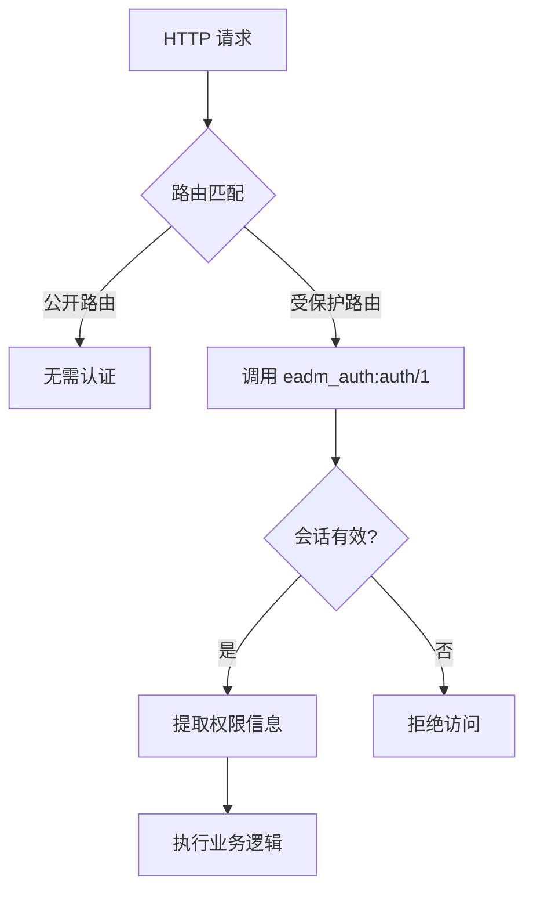
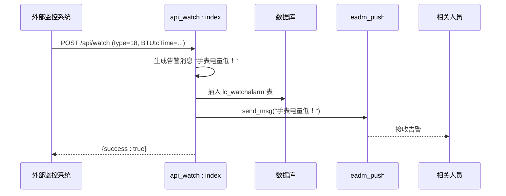

# 安全与监控

<cite>
**本文档引用的文件**
- [eadm_auth.erl](file://src/eadm_auth.erl)
- [api_watch.erl](file://src/apis/api_watch.erl)
- [sec.erl](file://script/sec.erl)
- [eadm_router.erl](file://src/eadm_router.erl)
</cite>

## 目录
1. [简介](#简介)
2. [认证与权限控制机制](#认证与权限控制机制)
3. [监控接口与告警机制](#监控接口与告警机制)
4. [安全脚本与密码生成](#安全脚本与密码生成)
5. [安全审计关键点](#安全审计关键点)
6. [安全加固建议](#安全加固建议)

## 简介
本文件系统性地阐述 eadm 系统的安全机制与监控能力。重点分析 `eadm_auth.erl` 模块的认证流程、会话管理与权限控制实现，评估其安全性；说明 `api_watch.erl` 提供的外部监控接口及其在健康检查与告警中的应用；并提及 `script/sec.erl` 中用于密码加密的安全脚本。为安全审计人员提供关键控制点与防范建议。

## 认证与权限控制机制

`eadm_auth.erl` 模块实现了基于会话（Session）的用户认证机制，是系统安全访问的核心控制点。

### 认证流程分析
该模块通过 `auth/1` 函数实现认证逻辑，其流程如下：
1. 从 HTTP 请求中获取名为 `exp` 的会话项，该值代表会话的过期时间戳。
2. 检查 `exp` 是否存在且为整数，并验证其值是否大于当前系统时间（以秒为单位）。
3. 若会话未过期，则从会话中提取 `loginname`（登录名）、`username`（用户名）和 `permission`（权限信息）。
4. 调用 `eadm_utils:get_exp_bin()` 生成新的过期时间，并更新会话中的 `exp` 值，实现会话的自动续期。
5. 返回包含认证成功标志及用户信息的映射（map）。
6. 若会话不存在或已过期，则返回认证失败的响应。

此机制实现了基于时间的会话有效性验证，有效防止了长期有效的会话令牌带来的安全风险。

### 权限控制（RBAC）实现
虽然 `eadm_auth.erl` 模块本身不直接处理权限的分配，但它通过从会话中读取 `permission` 字段，将权限信息传递给上层应用。结合 `eadm_router.erl` 的路由配置，系统实现了基于角色的访问控制（RBAC）：

**图示来源**
- [eadm_auth.erl](file://src/eadm_auth.erl#L15-L34)
- [eadm_router.erl](file://src/eadm_router.erl#L37-L63)

在 `eadm_router.erl` 中，大多数路由（如 `/menu` 前缀下的所有路由）都配置了 `security => {eadm_auth, auth}`，这意味着访问这些路由前必须通过 `eadm_auth:auth/1` 函数的认证。这构成了系统级的权限控制网关。

**本节来源**
- [eadm_auth.erl](file://src/eadm_auth.erl#L15-L34)
- [eadm_router.erl](file://src/eadm_router.erl#L37-L63)

## 监控接口与告警机制

`api_watch.erl` 模块提供了关键的监控接口，用于接收外部设备（如智能手表）上报的数据，并触发相应的告警。

### 监控接口功能
`api_watch:index/1` 函数是该模块的入口，通过 `type` 参数区分不同类型的上报数据。其主要功能包括：
- **数据采集**：接收并存储来自设备的多种健康与状态数据，如心率（`type=6`）、血压（`type=8`）、血糖（`type=10`）、定位（`type=16`）、睡眠（`type=58`）等。
- **告警触发**：当接收到特定类型的告警信息（如 `type=18` 电量低、`type=19` 紧急预警、`type=110` 手表跌落等）时，系统会执行以下操作：
    1. 生成预设的告警消息内容。
    2. 将告警信息写入数据库表 `lc_watchalarm`。
    3. 调用 `eadm_push:send_msg/1` 函数，将告警消息推送给相关人员。

### 外部健康检查应用
该接口设计为通过 HTTP POST 请求接收数据，使其非常适合作为外部健康检查的端点。外部监控系统可以：
1. **模拟数据上报**：定期向 `/api/watch` 发送测试数据包，验证接口的可用性和响应时间。
2. **验证告警链路**：发送特定的告警类型（如 `type=18`），检查数据库是否记录以及推送服务是否正常工作，从而端到端地验证告警机制的完整性。

**图示来源**
- [api_watch.erl](file://src/apis/api_watch.erl#L18-L24)
- [api_watch.erl](file://src/apis/api_watch.erl#L230-L240)

**本节来源**
- [api_watch.erl](file://src/apis/api_watch.erl#L18-L496)

## 安全脚本与密码生成

`script/sec.erl` 文件包含了一个用于生成加密密码的脚本模块 `eadm_sec`。

### 密码加密机制
该模块通过 `generate_sec/1` 函数实现密码加密：
1. 获取应用配置中的 `secret_key`（密钥）。
2. 将密钥与待加密的字符串（`SecString`）进行二进制拼接。
3. 使用 SHA-256 算法对拼接后的数据进行哈希运算。
4. 将哈希结果进行 Base64 编码，生成最终的加密字符串。

此方法结合了密钥（salt）和强哈希算法，能够有效防止彩虹表攻击，提升了密码存储的安全性。该脚本可能被用于用户密码的存储或API密钥的生成。

**本节来源**
- [sec.erl](file://script/sec.erl#L1-L29)

## 安全审计关键点

为安全审计人员提供以下关键控制点：

1.  **会话管理**：审计 `exp` 字段的生成和验证逻辑，确保会话超时时间设置合理，且无法被客户端篡改。
2.  **权限传递**：审查 `permission` 字段在会话中的存储和使用，确保权限信息在传输和存储过程中的机密性与完整性。
3.  **监控接口暴露**：`/api/watch` 接口无认证（`security => false`），需审计其输入验证逻辑，防范SQL注入和拒绝服务攻击。
4.  **密码加密**：验证 `eadm_sec:generate_sec/1` 的实现，确保 `secret_key` 的安全存储和管理，防止密钥泄露。
5.  **日志审计**：检查 `lager:info` 和 `lager:error` 的日志输出，确保关键操作（如认证失败、数据写入失败）被完整记录，便于事后追溯。

**本节来源**
- [eadm_auth.erl](file://src/eadm_auth.erl#L15-L34)
- [api_watch.erl](file://src/apis/api_watch.erl#L18-L496)
- [sec.erl](file://script/sec.erl#L1-L29)
- [eadm_router.erl](file://src/eadm_router.erl#L139-L163)

## 安全加固建议

1.  **增强会话安全**：考虑在会话中加入IP绑定或User-Agent校验，增加会话劫持的难度。
2.  **最小权限原则**：在 `eadm_router.erl` 中，应明确每个路由所需的最小权限，避免权限过度分配。
3.  **监控接口保护**：对于 `/api/watch` 接口，建议增加简单的认证机制（如API Token），或限制访问IP，以降低滥用风险。
4.  **密钥管理**：确保 `secret_key` 存储在安全的配置文件中，避免硬编码在代码里，并定期轮换。
5.  **输入验证**：在 `api_watch:index/1` 中，应对所有 `maps:get` 获取的参数进行更严格的类型和范围校验，防止异常数据导致服务异常。