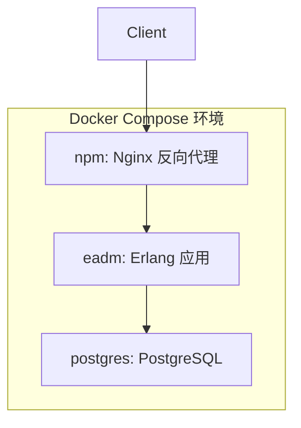

# 技术栈与依赖

<cite>
**本文档引用的文件**
- [Dockerfile](file://Dockerfile)
- [docker-compose.yml](file://docker-compose.yml)
- [README.md](file://README.md)
- [README.Docker.md](file://README.Docker.md)
- [eadm_pgpool.erl](file://src/eadm_pgpool.erl)
- [eadm_auth.erl](file://src/eadm_auth.erl)
- [eadm_router.erl](file://src/eadm_router.erl)
</cite>

## 目录
1. [简介](#简介)
2. [后端技术栈](#后端技术栈)
3. [前端技术栈](#前端技术栈)
4. [数据库支持](#数据库支持)
5. [部署架构](#部署架构)
6. [依赖项作用说明](#依赖项作用说明)
7. [多数据库支持实现机制](#多数据库支持实现机制)
8. [版本信息与安装方式](#版本信息与安装方式)
9. [总结](#总结)

## 简介
`eadm` 是一个基于 Erlang 构建的个人后台管理系统，旨在提供日常数据统计与查询功能。系统采用模块化设计，结合现代部署技术（Docker），支持多种主流数据库，并通过清晰的路由与权限控制机制实现安全访问。本文档详细记录项目所使用的技术栈及其依赖关系，为开发者提供完整的技术全景图。

## 后端技术栈
`eadm` 的后端完全基于 Erlang 语言构建，使用 `Cowboy` 作为底层 HTTP 服务器，并通过 `nova` 框架进行 Web 路由与控制器管理。日志系统采用 `Lager`，数据库连接池由 `Poolboy` 实现，数据库驱动使用 `epgsql` 与 PostgreSQL 交互。

- **Erlang**: 项目核心语言，版本为 27.2.3（由 Dockerfile 指定）。
- **Cowboy**: 轻量级 HTTP 服务器，由 `nova` 框架封装使用。
- **Lager**: 用于结构化日志输出，如 `eadm_auth.erl` 中的 `lager:info` 调用。
- **Poolboy**: 用于管理数据库连接池，确保高并发下的连接复用。
- **epgsql**: Erlang 的 PostgreSQL 客户端驱动，直接与数据库交互。

**Section sources**
- [Dockerfile](file://Dockerfile#L1)
- [eadm_auth.erl](file://src/eadm_auth.erl#L15)
- [eadm_pgpool.erl](file://src/eadm_pgpool.erl#L1)

## 前端技术栈
前端采用经典的 JavaScript + CSS 技术栈，结合 jQuery 和 Bootstrap 5 实现响应式界面。地图功能通过高德地图 JS API 集成，支持地理位置展示与交互。

- **JavaScript**: 前端逻辑控制，位于 `priv/assets/js/` 目录下，如 `dashboard.js`、`user.js` 等。
- **CSS**: 样式定义，使用 Bootstrap 5 框架，并通过自定义 CSS 文件（如 `style.css`、`login.css`）进行扩展。
- **高德地图 JS API**: 通过 `amaploader.js` 加载，用于 `location.js` 中的地图渲染与交互。

**Section sources**
- [priv/assets/js/amaploader.js](file://priv/assets/js/amaploader.js)
- [priv/assets/css/style.css](file://priv/assets/css/style.css)
- [priv/assets/js/location.js](file://priv/assets/js/location.js)

## 数据库支持
`eadm` 支持多种数据库，包括 PostgreSQL、MySQL、Oracle、TiDB、Kingbase 和 DB2。尽管系统当前主要使用 PostgreSQL（由 `docker-compose.yml` 配置），但项目结构中包含多个数据库的初始化脚本，表明其设计上支持多数据库适配。

- **PostgreSQL**: 主要运行数据库，由 `docker-compose.yml` 中的 `postgres` 服务提供。
- **MySQL**: 提供 `DATASTRUCT.sql` 等初始化脚本。
- **Oracle**: 提供 `DATASTRUCT.sql` 和存储过程脚本。
- **TiDB**: 兼容 MySQL 协议，提供 `datastruct.sql`。
- **Kingbase**: 国产数据库，提供完整的建表与存储过程脚本。
- **DB2**: 提供 `DATASTRUCT.sql` 脚本。

**Section sources**
- [docker-compose.yml](file://docker-compose.yml#L3)
- [script/postgres/datastruct.sql](file://script/postgres/datastruct.sql)
- [script/mysql/DataStruct.sql](file://script/mysql/DataStruct.sql)
- [script/oracle/DATASTRUCT.sql](file://script/oracle/DATASTRUCT.sql)
- [script/tidb/datastruct.sql](file://script/tidb/datastruct.sql)
- [script/kingbase/datastruct.sql](file://script/kingbase/datastruct.sql)
- [script/db2/DATASTRUCT.sql](file://script/db2/DATASTRUCT.sql)

## 部署架构
`eadm` 使用 Docker 和 Docker Compose 进行容器化部署，确保环境一致性与可移植性。

- **Docker**: 通过 `Dockerfile` 构建应用镜像，基于 `erlang:27.2.3-alpine` 镜像。
- **Docker Compose**: 定义多服务架构，包括：
  - `postgres`: PostgreSQL 数据库服务。
  - `eadm`: 主应用服务，暴露 8080 端口。
  - `npm`: Nginx 反向代理服务，处理前端请求。

资源限制配置包括内存限制（1G）、保留内存（500M），并禁用 OOM Killer 以提高稳定性。



**Diagram sources**
- [Dockerfile](file://Dockerfile#L1)
- [docker-compose.yml](file://docker-compose.yml#L1)

**Section sources**
- [Dockerfile](file://Dockerfile#L1)
- [docker-compose.yml](file://docker-compose.yml#L1)

## 依赖项作用说明
### Poolboy：数据库连接池管理
`Poolboy` 用于管理数据库连接池，避免频繁创建和销毁连接。在 `eadm_pgpool.erl` 中，通过 `connect/2` 函数创建连接池，参数包括 `size`（连接数）和 `max_overflow`（溢出连接数），由 `eadm_sup` 添加到监督树中。

### Lager：日志处理
`Lager` 提供结构化日志输出。在 `eadm_auth.erl` 中，`lager:info` 用于记录认证成功或失败的日志，便于调试与监控。

### Cowboy：HTTP 请求处理
`Cowboy` 作为底层 HTTP 服务器，由 `nova` 框架封装。`eadm_router.erl` 定义了所有路由规则，如 `/login`、`/dashboard` 等，每个路由绑定到对应的控制器函数，由 `Cowboy` 分发请求。

**Section sources**
- [eadm_pgpool.erl](file://src/eadm_pgpool.erl#L25)
- [eadm_auth.erl](file://src/eadm_auth.erl#L15)
- [eadm_router.erl](file://src/eadm_router.erl#L30)

## 多数据库支持实现机制
尽管 `eadm` 当前主要使用 PostgreSQL，但其设计支持多数据库。实现路径如下：

1. **SQL 脚本分离**：不同数据库的建表与初始化脚本分别存放于 `script/` 目录下的子目录中（如 `mysql/`、`oracle/`）。
2. **连接配置抽象**：`db.config` 文件用于配置数据库连接参数，可通过挂载不同配置文件切换数据库。
3. **驱动适配层**：当前代码使用 `epgsql` 与 PostgreSQL 交互，若需支持其他数据库，需引入对应驱动（如 `odbc` 或 `emysql`）并封装统一接口。
4. **条件编译或运行时切换**：可通过环境变量或配置项决定使用哪个数据库连接池。

该设计允许在不修改核心业务逻辑的前提下，通过替换 SQL 脚本和驱动实现数据库迁移。

**Section sources**
- [script/mysql/DataStruct.sql](file://script/mysql/DataStruct.sql)
- [script/oracle/DATASTRUCT.sql](file://script/oracle/DATASTRUCT.sql)
- [docker-compose.yml](file://docker-compose.yml#L20)
- [eadm_pgpool.erl](file://src/eadm_pgpool.erl#L25)

## 版本信息与安装方式
### 版本信息
- **Erlang**: 27.2.3（Dockerfile 指定）
- **Rebar3**: 3.24.0（README.Docker.md 提及）
- **Nova**: 0.10.4（README.Docker.md 提及）
- **Bootstrap**: 5.3.3
- **jQuery**: 3.6.0

### 安装方式
1. **Docker 部署（推荐）**：
   ```shell
   docker-compose up -d
   ```
   依赖 `docker-compose.yml` 文件，自动拉取镜像并启动服务。

2. **手动构建**：
   - 安装 Erlang 27.2.3 和 Rebar3。
   - 执行 `rebar3 as prod release` 构建发布包。
   - 配置 `db.config` 和 `sys.config.src`。
   - 启动应用。

**Section sources**
- [Dockerfile](file://Dockerfile#L1)
- [README.Docker.md](file://README.Docker.md#L1)
- [docker-compose.yml](file://docker-compose.yml#L1)

## 总结
`eadm` 项目采用 Erlang 作为后端语言，结合 `Cowboy`、`Lager`、`Poolboy` 和 `epgsql` 构建高性能、高可用的管理系统。前端使用 JavaScript、CSS 和高德地图 API 实现丰富交互。系统支持多种数据库，通过脚本分离和配置抽象实现多数据库兼容。部署方面，采用 Docker 和 Docker Compose 实现容器化，确保环境一致性。整体架构清晰，模块职责明确，为开发者提供了良好的扩展性与维护性。