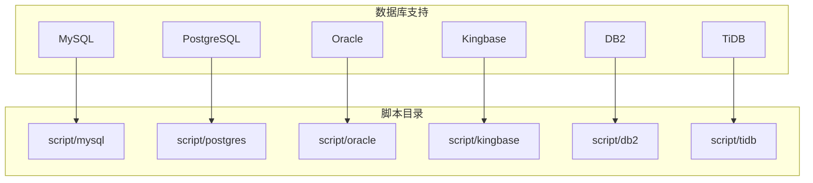

# 多数据库支持策略

<cite>
**本文档引用的文件**
- [mysql/DataStruct.sql](file://script/mysql/DataStruct.sql)
- [postgres/datastruct.sql](file://script/postgres/datastruct.sql)
- [oracle/DATASTRUCT.sql](file://script/oracle/DATASTRUCT.sql)
- [kingbase/datastruct.sql](file://script/kingbase/datastruct.sql)
- [db2/DATASTRUCT.sql](file://script/db2/DATASTRUCT.sql)
- [tidb/datastruct.sql](file://script/tidb/datastruct.sql)
</cite>

## 目录
1. [引言](#引言)
2. [多数据库支持架构](#多数据库支持架构)
3. [核心数据库语法差异分析](#核心数据库语法差异分析)
4. [建表语句适配策略](#建表语句适配策略)
5. [主键与序列生成机制](#主键与序列生成机制)
6. [时间戳与时区处理](#时间戳与时区处理)
7. [数据类型映射与约束定义](#数据类型映射与约束定义)
8. [索引与性能优化](#索引与性能优化)
9. [存储过程与触发器实现](#存储过程与触发器实现)
10. [配置建议与初始化指南](#配置建议与初始化指南)

## 引言

eadm 项目采用多数据库支持策略，为 MySQL、PostgreSQL、Oracle、TiDB、Kingbase 和 DB2 六种主流数据库分别提供独立的 SQL 初始化脚本。这种设计源于不同数据库管理系统在 SQL 语法、数据类型、序列生成、时间处理等方面的显著差异。通过为每种数据库定制专属的 DDL（数据定义语言）和 DML（数据操作语言）脚本，项目确保了在不同数据库环境下的兼容性、性能和功能一致性。本文档深入分析这一策略的技术选型与权衡，揭示语法差异如何影响脚本设计，并提供实际的建表语句适配方案和配置建议。

## 多数据库支持架构

项目在 `script` 目录下为每种支持的数据库创建了独立的子目录，如 `mysql`、`postgres`、`oracle`、`kingbase`、`db2` 和 `tidb`。每个子目录包含一套完整的 SQL 脚本，用于初始化数据库 schema、创建表、视图、序列、触发器和存储过程。这种物理隔离的架构避免了在单个脚本中使用复杂的条件逻辑或数据库特定的注释来处理兼容性问题，从而保证了脚本的清晰性、可维护性和执行的可靠性。



**图表来源**
- [script/mysql/DataStruct.sql](file://script/mysql/DataStruct.sql#L1-L357)
- [script/postgres/datastruct.sql](file://script/postgres/datastruct.sql#L1-L799)
- [script/oracle/DATASTRUCT.sql](file://script/oracle/DATASTRUCT.sql#L1-L799)
- [script/kingbase/datastruct.sql](file://script/kingbase/datastruct.sql#L1-L799)
- [script/db2/DATASTRUCT.sql](file://script/db2/DATASTRUCT.sql#L1-L799)
- [script/tidb/datastruct.sql](file://script/tidb/datastruct.sql#L1-L357)

## 核心数据库语法差异分析

不同数据库在核心 SQL 语法上存在显著差异，这些差异是项目必须为每种数据库提供独立脚本的根本原因。主要差异体现在以下几个方面：

### 分页查询语法
虽然建表脚本中不直接体现，但分页是应用层常见的操作。MySQL 和 TiDB 使用 `LIMIT offset, count`；PostgreSQL 和 Kingbase 使用 `LIMIT count OFFSET offset`；Oracle 使用 `ROWNUM` 伪列或 `ROW_NUMBER()` 窗口函数；DB2 使用 `FETCH FIRST count ROWS ONLY` 和 `OFFSET offset ROWS`。应用代码必须根据数据库类型生成不同的分页语句。

### 序列与自增主键
这是建表脚本中差异最明显的部分。MySQL 和 TiDB 使用 `AUTO_INCREMENT` 关键字实现自增列。PostgreSQL、Kingbase 和 DB2 使用 `GENERATED ALWAYS AS IDENTITY` 或 `SERIAL` 类型。Oracle 使用 `GENERATED ALWAYS AS IDENTITY`。而 MySQL 和 TiDB 的脚本中，项目并未使用 `AUTO_INCREMENT`，而是通过一个名为 `sys_sequence` 的表和 `fn_nextval` 函数来模拟序列，这体现了项目在主键生成策略上的统一设计。

### 存储过程与函数定义
各数据库的存储过程和函数语法差异巨大。MySQL 使用 `CREATE FUNCTION` 和 `BEGIN...END` 块，参数声明方式独特。PostgreSQL 和 Kingbase 使用 `CREATE OR REPLACE FUNCTION`，并指定 `LANGUAGE plpgsql`，使用 `$$` 作为分隔符。Oracle 使用 `CREATE OR REPLACE FUNCTION`，声明为 `LANGUAGE SQL` 或 `PL/SQL`，使用 `IS` 或 `AS` 开始函数体。DB2 使用 `CREATE OR REPLACE FUNCTION` 并指定 `LANGUAGE SQL`，使用 `BEGIN ATOMIC` 块。这些差异使得无法编写跨数据库的通用存储过程。

### 数据类型
各数据库对相同概念的数据类型命名和行为不同。例如，布尔类型在 MySQL 中是 `TINYINT(1)` 或 `BOOLEAN`，在 PostgreSQL、Kingbase 和 DB2 中是 `BOOLEAN`，在 Oracle 中通常用 `NUMBER(1)` 或 `CHAR(1)` 模拟。JSON 类型在 MySQL、PostgreSQL 和 TiDB 中原生支持，在 Oracle 中使用 `CLOB`，在 DB2 中使用 `BLOB` 或 `CLOB`。

## 建表语句适配策略

项目通过为每种数据库编写完全独立的 `datastruct.sql` 脚本来实现建表语句的适配。以下以 `sys_dict`（系统字典信息表）为例，对比不同数据库的实现：

### MySQL/TiDB 实现
```sql
CREATE TABLE `sys_dict` (
  `Id` CHAR(12) NOT NULL PRIMARY KEY COMMENT '自定义主键(SD)',
  `DictNo` VARCHAR(50) NOT NULL,
  `DictName` VARCHAR(100) NOT NULL,
  `ParentId` CHAR(12) DEFAULT NULL,
  `Deleted` TINYINT NOT NULL DEFAULT 0,
  ...
) ENGINE=InnoDB ROW_FORMAT=DYNAMIC COMMENT='系统_字典信息表';
```
**特点**：使用反引号引用标识符，`TINYINT` 表示布尔值，`CHAR` 作为主键，通过 `COMMENT` 添加注释。

### PostgreSQL/Kingbase 实现
```sql
create table sys_dict (
  id char(12) default ('sd' || lpad((nextval('sd')::varchar), 10, '0')),
  dictno varchar(50) not null,
  dictname varchar(100) not null,
  parentid char(12),
  deleted boolean not null default false,
  ...
);
```
**特点**：使用小写标识符，通过 `nextval('sd')` 函数和字符串拼接生成主键，`boolean` 类型表示布尔值，使用 `default` 子句在列定义中设置默认值。

### Oracle 实现
```sql
CREATE TABLE SYS_DICT (
  ID CHAR(12) NOT NULL,
  DICTNO VARCHAR2(50) NOT NULL,
  DICTNAME VARCHAR2(100) NOT NULL,
  PARENTID CHAR(12),
  DELETED INTEGER DEFAULT 0,
  ...
);
ALTER TABLE SYS_DICT ADD CONSTRAINT PK_SYSDICT_ID PRIMARY KEY (ID);
```
**特点**：使用大写标识符，将主键约束与表定义分离，使用 `INTEGER` 模拟布尔值，日期类型为 `TIMESTAMP WITH LOCAL TIME ZONE`。

### DB2 实现
```sql
CREATE TABLE SYS_DICT (
  ID CHAR(12) NOT NULL DEFAULT ,
  DICTNO VARCHAR(50) NOT NULL,
  DICTNAME VARCHAR(100) NOT NULL,
  PARENTID CHAR(12),
  DELETED BOOLEAN NOT NULL DEFAULT FALSE,
  ...
);
ALTER TABLE SYS_DICT ADD CONSTRAINT PK_SYSDICT_ID PRIMARY KEY (ID);
```
**特点**：与 Oracle 类似，约束与表定义分离，使用 `BOOLEAN` 类型，主键通过触发器 `TR_SYS_DICT_ID` 生成。

**本节来源**
- [script/mysql/DataStruct.sql](file://script/mysql/DataStruct.sql#L40-L60)
- [script/postgres/datastruct.sql](file://script/postgres/datastruct.sql#L10-L30)
- [script/oracle/DATASTRUCT.sql](file://script/oracle/DATASTRUCT.sql#L10-L30)
- [script/kingbase/datastruct.sql](file://script/kingbase/datastruct.sql#L10-L30)
- [script/db2/DATASTRUCT.sql](file://script/db2/DATASTRUCT.sql#L10-L30)
- [script/tidb/datastruct.sql](file://script/tidb/datastruct.sql#L40-L60)

## 主键与序列生成机制

项目在主键生成策略上展现了高度的统一性和灵活性。对于使用 `AUTO_INCREMENT` 的数据库（MySQL、TiDB），项目并未直接使用该特性，而是选择了一种更通用的“自定义序列”模式。

### MySQL/TiDB 的自定义序列
项目创建了一个名为 `sys_sequence` 的表，其中包含 `SeqNo`（序列前缀，如 'SD'）、`CurrentValue`（当前值）等字段。通过一个名为 `fn_nextval` 的函数来获取下一个序列值。该函数会更新 `sys_sequence` 表中的 `CurrentValue`，并返回一个由前缀和填充后的数字组成的字符串（如 'SD0000000001'）。所有需要主键的表（如 `sys_dict`）的 `Id` 字段都通过调用 `fn_nextval('SD')` 来填充。

### PostgreSQL/Kingbase 的序列
PostgreSQL 和 Kingbase 使用数据库原生的 `SEQUENCE` 对象。脚本中会先创建一个序列（如 `sd`），然后在表的 `id` 列定义中使用 `nextval('sd')` 函数，并通过字符串拼接生成主键值（如 `'sd' || lpad((nextval('sd')::varchar), 10, '0')`）。

### Oracle/DB2 的序列与触发器
Oracle 和 DB2 也使用原生的 `SEQUENCE`。但主键的生成是通过 `BEFORE INSERT` 触发器实现的。当插入新行时，触发器会检查 `ID` 是否为空，如果为空，则从序列中获取下一个值并拼接前缀后赋给 `ID` 字段。

这种设计的权衡在于：牺牲了部分数据库原生自增功能的简洁性，换取了跨数据库主键生成逻辑的一致性。应用层代码无需关心底层数据库类型，只需调用统一的序列函数或依赖触发器即可获得格式统一的主键。

**本节来源**
- [script/mysql/DataStruct.sql](file://script/mysql/DataStruct.sql#L15-L35)
- [script/postgres/datastruct.sql](file://script/postgres/datastruct.sql#L5-L10)
- [script/oracle/DATASTRUCT.sql](file://script/oracle/DATASTRUCT.sql#L5-L10)
- [script/kingbase/datastruct.sql](file://script/kingbase/datastruct.sql#L5-L10)
- [script/db2/DATASTRUCT.sql](file://script/db2/DATASTRUCT.sql#L5-L10)
- [script/tidb/datastruct.sql](file://script/tidb/datastruct.sql#L15-L35)

## 时间戳与时区处理

时间处理是另一个关键的差异点。项目在不同数据库中采用了相应的最佳实践来处理时区。

### MySQL/TiDB
使用 `DATETIME` 类型，并通过 `DEFAULT CURRENT_TIMESTAMP()` 和 `ON UPDATE CURRENT_TIMESTAMP()` 来自动填充创建和更新时间。脚本中注释了关于字符集和排序规则的设置，但未直接设置时区，通常依赖于数据库服务器的全局设置。

### PostgreSQL/Kingbase
使用 `timestamptz`（带时区的时间戳）类型，这是处理时区的推荐方式。通过 `DEFAULT current_timestamp` 设置默认值。脚本开头明确执行 `set time zone 'asia/shanghai';` 来设置会话时区，确保时间戳的正确性。

### Oracle
使用 `TIMESTAMP WITH LOCAL TIME ZONE` 类型，它会将存储的时间转换为数据库时区。通过 `DEFAULT SYSTIMESTAMP` 设置默认值。脚本开头执行 `ALTER SESSION SET TIME_ZONE='ASIA/SHANGHAI';` 来设置会话时区。

### DB2
使用 `TIMESTAMP` 类型，并通过 `WITH DEFAULT CURRENT TIMESTAMP` 设置默认值。DB2 的时间戳类型可以包含时区信息，但脚本中未显式设置，可能依赖于实例配置。

这种差异化的处理方式确保了在不同数据库中，时间数据都能被正确地记录和解释，避免了因时区问题导致的数据错误。

**本节来源**
- [script/mysql/DataStruct.sql](file://script/mysql/DataStruct.sql#L50-L60)
- [script/postgres/datastruct.sql](file://script/postgres/datastruct.sql#L5-L10)
- [script/oracle/DATASTRUCT.sql](file://script/oracle/DATASTRUCT.sql#L5-L10)
- [script/kingbase/datastruct.sql](file://script/kingbase/datastruct.sql#L5-L10)
- [script/db2/DATASTRUCT.sql](file://script/db2/DATASTRUCT.sql#L5-L10)

## 数据类型映射与约束定义

项目在数据类型的选择上，力求在不同数据库间找到最接近的映射。

### 布尔类型
- **MySQL/TiDB**: 使用 `TINYINT(1)` 或 `BOOLEAN`，脚本中为 `TINYINT NOT NULL DEFAULT 0`。
- **PostgreSQL/Kingbase/DB2**: 使用原生的 `BOOLEAN` 类型，值为 `true`/`false`。
- **Oracle**: 使用 `INTEGER` 或 `NUMBER(1)`，值为 `0`/`1`。

### JSON 类型
- **MySQL/PostgreSQL/TiDB**: 使用原生的 `JSON` 类型。
- **Oracle**: 使用 `CLOB`（字符大对象）来存储 JSON 字符串。
- **DB2**: 使用 `CLOB` 或 `BLOB`。

### 字符串类型
普遍使用 `VARCHAR` 或 `VARCHAR2`，长度定义一致。主键使用 `CHAR(12)` 以保证固定长度。

### 约束定义
约束的定义方式也有所不同。MySQL 和 TiDB 允许在 `CREATE TABLE` 语句中直接定义主键和唯一约束。而 Oracle 和 DB2 则倾向于先创建表，再使用 `ALTER TABLE ... ADD CONSTRAINT` 语句添加约束。PostgreSQL 和 Kingbase 两种方式都支持，脚本中采用了在 `CREATE TABLE` 中定义的方式。

**本节来源**
- [script/mysql/DataStruct.sql](file://script/mysql/DataStruct.sql#L50-L60)
- [script/postgres/datastruct.sql](file://script/postgres/datastruct.sql#L10-L30)
- [script/oracle/DATASTRUCT.sql](file://script/oracle/DATASTRUCT.sql#L10-L30)
- [script/kingbase/datastruct.sql](file://script/kingbase/datastruct.sql#L10-L30)
- [script/db2/DATASTRUCT.sql](file://script/db2/DATASTRUCT.sql#L10-L30)
- [script/tidb/datastruct.sql](file://script/tidb/datastruct.sql#L50-L60)

## 索引与性能优化

索引的创建是性能优化的关键。项目为关键查询字段创建了索引。

### 索引语法
- **MySQL/TiDB**: 使用 `KEY` 或 `INDEX` 关键字，如 `KEY IDX-LoginName (LoginName)`。
- **PostgreSQL/Kingbase**: 使用 `CREATE INDEX` 语句，如 `create index non_user_loginname on eadm_user using btree (loginname asc nulls last);`。
- **Oracle/DB2**: 使用 `CREATE INDEX` 语句，如 `CREATE INDEX NON_USER_LOGINNAME ON EADM_USER (LOGINNAME ASC);`。

### 索引策略
项目为外键（如 `TenantId`）、唯一字段（如 `LoginName`）和频繁查询的字段（如 `UpdatedAt`）创建了索引。在 PostgreSQL 和 Kingbase 的脚本中，索引定义包含了 `ASC NULLS LAST` 等更详细的排序规则，这体现了对特定数据库优化特性的利用。

## 存储过程与触发器实现

为了实现数据的自动更新（如 `UpdatedAt` 字段），项目使用了触发器。

### 触发器实现
- **MySQL**: 脚本中未显式创建触发器，`ON UPDATE CURRENT_TIMESTAMP` 是列级别的自动行为。
- **PostgreSQL/Kingbase**: 创建一个名为 `lastupdate` 的函数，然后为每个需要自动更新的表创建一个 `BEFORE UPDATE` 触发器，调用该函数。
- **Oracle/DB2**: 为每个表创建一个 `BEFORE UPDATE` 触发器，直接在触发器体中设置 `NEW.UPDATEDAT := SYSTIMESTAMP;`（Oracle）或通过 `UPDATE` 语句更新（DB2）。

这种差异化的实现方式确保了 `UpdatedAt` 字段在所有数据库中都能被正确更新，尽管底层机制不同。

**本节来源**
- [script/mysql/DataStruct.sql](file://script/mysql/DataStruct.sql#L50-L60)
- [script/postgres/datastruct.sql](file://script/postgres/datastruct.sql#L5-L20)
- [script/oracle/DATASTRUCT.sql](file://script/oracle/DATASTRUCT.sql#L5-L20)
- [script/kingbase/datastruct.sql](file://script/kingbase/datastruct.sql#L5-L20)
- [script/db2/DATASTRUCT.sql](file://script/db2/DATASTRUCT.sql#L5-L20)

## 配置建议与初始化指南

为了正确初始化 schema，用户应根据所选数据库执行相应的脚本。

### 选择正确的脚本
- **MySQL**: 执行 `script/mysql/DataStruct.sql`。
- **PostgreSQL**: 执行 `script/postgres/datastruct.sql`。
- **Oracle**: 执行 `script/oracle/DATASTRUCT.sql`。
- **TiDB**: 执行 `script/tidb/datastruct.sql`。
- **Kingbase**: 执行 `script/kingbase/datastruct.sql`。
- **DB2**: 执行 `script/db2/DATASTRUCT.sql`。

### 初始化步骤
1.  **确认数据库版本**：确保数据库版本与脚本兼容。
2.  **设置字符集**：对于 MySQL 和 TiDB，建议在执行脚本前确认数据库的字符集为 `utf8mb4`。
3.  **设置时区**：对于 PostgreSQL、Kingbase 和 Oracle，脚本已包含设置时区的命令，确保其正确执行。
4.  **执行脚本**：使用数据库客户端工具（如 `mysql`、`psql`、`sqlplus`、`db2` 命令行）连接到目标数据库，并执行对应的 SQL 脚本。
5.  **验证结果**：检查关键表（如 `sys_dict`、`eadm_tenant`）是否创建成功，并包含预期的初始数据。

通过遵循此指南，用户可以确保 eadm 项目在所选数据库上正确、高效地运行。

**本节来源**
- [script/mysql/DataStruct.sql](file://script/mysql/DataStruct.sql#L1-L10)
- [script/postgres/datastruct.sql](file://script/postgres/datastruct.sql#L1-L10)
- [script/oracle/DATASTRUCT.sql](file://script/oracle/DATASTRUCT.sql#L1-L10)
- [script/kingbase/datastruct.sql](file://script/kingbase/datastruct.sql#L1-L10)
- [script/db2/DATASTRUCT.sql](file://script/db2/DATASTRUCT.sql#L1-L10)
- [script/tidb/datastruct.sql](file://script/tidb/datastruct.sql#L1-L10)