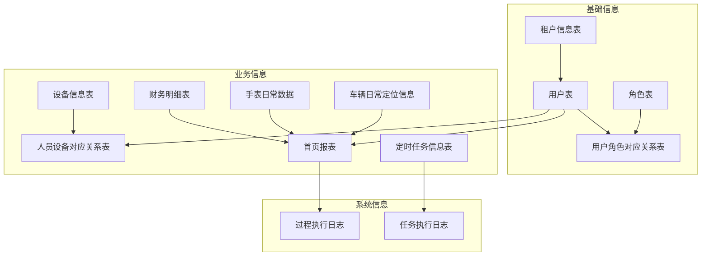

# 数据库设计

<cite>
**本文档引用的文件**
- [DataStruct.sql](file://script/mysql/DataStruct.sql)
- [datastruct.sql](file://script/postgres/datastruct.sql)
- [datastruct.sql](file://script/kingbase/datastruct.sql)
- [DATASTRUCT.sql](file://script/oracle/DATASTRUCT.sql)
- [proc_DashBoard.sql](file://script/mysql/proc_DashBoard.sql)
- [proc_dashboard.sql](file://script/postgres/proc_dashboard.sql)
</cite>

## 目录
1. [多数据库支持策略](#多数据库支持策略)
2. [核心表结构](#核心表结构)
3. [存储过程说明](#存储过程说明)
4. [数据库 Schema 图](#数据库-schema-图)
5. [关键业务实体关系图](#关键业务实体关系图)

## 多数据库支持策略

`eadm` 系统采用多数据库支持策略，为不同的数据库管理系统（如 MySQL、PostgreSQL、Kingbase、Oracle 等）提供独立的 SQL 脚本。这种设计的主要原因包括：

1. **语法差异**：不同数据库在 SQL 语法、数据类型、函数和存储过程定义等方面存在显著差异。例如，MySQL 使用 `AUTO_INCREMENT` 实现自增主键，而 PostgreSQL 使用 `SERIAL` 或 `GENERATED ALWAYS AS IDENTITY`。
2. **特性支持**：各数据库对特定功能的支持程度不同。例如，JSON 数据类型在 MySQL 和 PostgreSQL 中的实现方式和性能表现可能不同。
3. **性能优化**：针对特定数据库进行优化可以提高查询性能和系统稳定性。通过为每个数据库编写专门的脚本，可以充分利用其特有的优化技术。
4. **兼容性**：确保系统能够在多种数据库环境中正常运行，满足不同客户的需求。

通过为不同数据库提供独立的 SQL 脚本，`eadm` 系统能够灵活适应各种部署环境，同时保证数据一致性和系统可靠性。

**Section sources**
- [DataStruct.sql](file://script/mysql/DataStruct.sql#L1-L357)
- [datastruct.sql](file://script/postgres/datastruct.sql#L1-L831)
- [datastruct.sql](file://script/kingbase/datastruct.sql#L1-L831)
- [DATASTRUCT.sql](file://script/oracle/DATASTRUCT.sql#L1-L822)

## 核心表结构

### 用户表 (eadm_user)

- **Id**: CHAR(12)，自定义主键(EU)，非空，主键
- **TenantId**: CHAR(12)，租户Id，非空，外键引用 `eadm_tenant.Id`
- **LoginName**: VARCHAR(50)，用户登录名，非空，唯一索引
- **UserName**: VARCHAR(50)，用户姓名，非空
- **Email**: VARCHAR(20)，用户邮件
- **CryptoGram**: VARCHAR(50)，密码，非空
- **UserStatus**: TINYINT，用户状态(0启用1禁用)，默认值0
- **CreatedUser**: VARCHAR(50)，创建人
- **CreatedAt**: DATETIME，数据写入时间，默认值 CURRENT_TIMESTAMP()
- **UpdatedUser**: VARCHAR(50)，更新人
- **UpdatedAt**: DATETIME，更新时间，默认值 CURRENT_TIMESTAMP() ON UPDATE CURRENT_TIMESTAMP()
- **DeletedUser**: VARCHAR(50)，删除人
- **DeletedAt**: DATETIME，删除时间
- **Deleted**: TINYINT，是否删除(0否1是)，默认值0

**索引**:
- IDX-TenantId (`TenantId`)
- IDX-LoginName (`LoginName`)
- IDX-UpdatedAt (`UpdatedAt`)

### 角色表 (eadm_role)

- **Id**: CHAR(12)，自定义主键(ER)，非空，主键
- **RoleName**: VARCHAR(50)，角色名称，非空
- **RolePermission**: JSON，角色权限，非空
- **RoleStatus**: TINYINT，角色状态(0启用1禁用)，默认值0
- **CreatedUser**: VARCHAR(50)，创建人
- **CreatedAt**: DATETIME，数据写入时间，默认值 CURRENT_TIMESTAMP()
- **UpdatedUser**: VARCHAR(50)，更新人
- **UpdatedAt**: DATETIME，更新时间，默认值 CURRENT_TIMESTAMP() ON UPDATE CURRENT_TIMESTAMP()
- **DeletedUser**: VARCHAR(50)，删除人
- **DeletedAt**: DATETIME，删除时间
- **Deleted**: TINYINT，是否删除(0否1是)，默认值0

**索引**:
- IDX-RoleName (`RoleName`)

### 设备表 (eadm_device)

- **Id**: CHAR(12)，自定义主键(ED)，非空，主键
- **DeviceNo**: VARCHAR(50)，设备号
- **Imei**: VARCHAR(50)，设备IMEI
- **SimNo**: VARCHAR(50)，SIM卡号
- **Remark**: VARCHAR(200)，设备描述
- **CreatedUser**: VARCHAR(50)，创建人
- **CreatedAt**: DATETIME，数据写入时间，默认值 CURRENT_TIMESTAMP()
- **UpdatedUser**: VARCHAR(50)，更新人
- **UpdatedAt**: DATETIME，更新时间，默认值 CURRENT_TIMESTAMP() ON UPDATE CURRENT_TIMESTAMP()
- **DeletedUser**: VARCHAR(50)，删除人
- **DeletedAt**: DATETIME，删除时间
- **Deleted**: TINYINT，是否删除(0否1是)，默认值0

**索引**:
- NON-DeviceNo (`DeviceNo`)
- NON-SimNo (`SimNo`)

### 财务表 (fn_paybilldetail)

- **Id**: INT，自增主键
- **Owner**: VARCHAR(50)，来源人(姓名)
- **SourceType**: INT，来源类型
- **InOrOut**: VARCHAR(10)，收支类型
- **Counterparty**: VARCHAR(100)，交易对方
- **CounterBank**: VARCHAR(100)，对方银行
- **CounterAccount**: VARCHAR(50)，对方账号
- **GoodsComment**: VARCHAR(200)，商品备注
- **PayMethod**: VARCHAR(50)，支付方式
- **Amount**: NUMERIC(18,2)，金额
- **Balance**: NUMERIC(18,2)，余额
- **Currency**: VARCHAR(50)，币种
- **PayStatus**: VARCHAR(50)，支付状态
- **TradeType**: VARCHAR(50)，交易类型
- **TradeOrderNo**: VARCHAR(100)，交易订单号
- **CounterOrderNo**: VARCHAR(100)，对方订单号
- **TradeTime**: TIMESTAMP WITH LOCAL TIME ZONE，交易时间
- **BillComment**: VARCHAR(500)，账单备注
- **InsertTime**: TIMESTAMP WITH LOCAL TIME ZONE，数据写入时间，默认值 SYSTIMESTAMP
- **DeletedUser**: VARCHAR(50)，删除人
- **DeletedAt**: TIMESTAMP WITH LOCAL TIME ZONE，删除时间
- **Deleted**: INTEGER，是否删除(0否1是)，默认值0

**索引**:
- NON_PAYBILLDETAIL_SOURCE (`SourceType` ASC)
- NON_PAYBILLDETAIL_INOROUT (`InOrOut` ASC)
- NON_PAYBILLDETAIL_PAYMETHOD (`PayMethod` ASC)
- NON_PAYBILLDETAIL_PAYSTATUS (`PayStatus` ASC)
- NON_PAYBILLDETAIL_TRADETYPE (`TradeType` ASC)
- NON_PAYBILLDETAIL_TRADETIME (`TradeTime` ASC)

### 定时任务表 (eadm_crontab)

- **Id**: BIGINT，自增主键
- **CronName**: VARCHAR(50)，任务名称，非空
- **CronExp**: VARCHAR(50)，定时表达式，非空
- **CronMFA**: VARCHAR(50)，任务备注，非空
- **StartDateTime**: DATETIME，任务开始时间
- **EndDateTime**: DATETIME，任务结束时间
- **CronStatus**: TINYINT，任务状态(0启用1禁用)，默认值0
- **CreatedUser**: VARCHAR(50)，创建人
- **CreatedAt**: DATETIME，数据写入时间，默认值 CURRENT_TIMESTAMP()
- **UpdatedUser**: VARCHAR(50)，更新人
- **UpdatedAt**: DATETIME，更新时间，默认值 CURRENT_TIMESTAMP() ON UPDATE CURRENT_TIMESTAMP()
- **DeletedUser**: VARCHAR(50)，删除人
- **DeletedAt**: DATETIME，删除时间
- **Deleted**: TINYINT，是否删除(0否1是)，默认值0

**索引**:
- IDX-CronName (`CronName`)

**Section sources**
- [DataStruct.sql](file://script/mysql/DataStruct.sql#L1-L357)
- [datastruct.sql](file://script/postgres/datastruct.sql#L1-L831)
- [datastruct.sql](file://script/kingbase/datastruct.sql#L1-L831)
- [DATASTRUCT.sql](file://script/oracle/DATASTRUCT.sql#L1-L822)

## 存储过程说明

### proc_DashBoard (MySQL)

该存储过程用于生成首页报表，根据输入日期计算周平均心率、步数、睡眠、里程以及年度平均心率、步数、睡眠、总里程，并更新每月里程、收入和支出数据。

**调用方式**:
```sql
CALL proc_DashBoard('2024-04-03');
```

### proc_dashboard (PostgreSQL)

与 MySQL 版本类似，该存储过程用于生成首页报表，但使用 PostgreSQL 特有的语法和函数。

**调用方式**:
```sql
CALL proc_dashboard('2024-04-03');
```

**Section sources**
- [proc_DashBoard.sql](file://script/mysql/proc_DashBoard.sql#L1-L213)
- [proc_dashboard.sql](file://script/postgres/proc_dashboard.sql#L1-L207)

## 数据库 Schema 图

```mermaid
erDiagram
eadm_tenant ||--o{ eadm_user : "租户-用户"
eadm_user ||--o{ eadm_userrole : "用户-角色对应"
eadm_role ||--o{ eadm_userrole : "角色-用户对应"
eadm_user ||--o{ eadm_userdevice : "用户-设备对应"
eadm_device ||--o{ eadm_userdevice : "设备-用户对应"
eadm_user ||--o{ eadm_dashboard : "用户-看板报表"
eadm_crontab ||--o{ sys_cronlog : "定时任务-日志"
fn_paybilldetail ||--o{ eadm_dashboard : "财务明细-看板报表"
lc_watchdaily ||--o{ eadm_dashboard : "手表数据-看板报表"
lc_carlocdaily ||--o{ eadm_dashboard : "车辆定位-看板报表"
eadm_tenant {
char(12) Id PK
varchar(20) TenantName UK
varchar(100) Remark
boolean Enable
varchar(50) CreatedUser
timestamptz CreatedAt
varchar(50) UpdatedUser
timestamptz UpdatedAt
varchar(50) DeletedUser
timestamptz DeletedAt
boolean Deleted
}
eadm_user {
char(12) Id PK
char(12) TenantId FK
varchar(50) LoginName UK
varchar(50) UserName
varchar(20) Email
varchar(50) Passwd
smallint UserStatus
varchar(50) CreatedUser
timestamptz CreatedAt
varchar(50) UpdatedUser
timestamptz UpdatedAt
varchar(50) DeletedUser
timestamptz DeletedAt
boolean Deleted
}
eadm_role {
char(12) Id PK
varchar(50) RoleName
json RolePermission
smallint RoleStatus
varchar(50) CreatedUser
timestamptz CreatedAt
varchar(50) UpdatedUser
timestamptz UpdatedAt
varchar(50) DeletedUser
timestamptz DeletedAt
boolean Deleted
}
eadm_userrole {
serial Id PK
char(12) UserId FK
char(12) RoleId FK
varchar(50) CreatedUser
timestamptz CreatedAt
varchar(50) UpdatedUser
timestamptz UpdatedAt
varchar(50) DeletedUser
timestamptz DeletedAt
boolean Deleted
}
eadm_device {
varchar(50) DeviceNo PK
varchar(50) Imei
varchar(50) SimNo
boolean Enable
varchar(200) Remark
varchar(50) CreatedUser
timestamptz CreatedAt
varchar(50) UpdatedUser
timestamptz UpdatedAt
varchar(50) DeletedUser
timestamptz DeletedAt
boolean Deleted
}
eadm_userdevice {
serial Id PK
char(12) UserId FK
varchar(50) LoginName FK
varchar(50) DeviceNo FK
varchar(50) CreatedUser
timestamptz CreatedAt
varchar(50) UpdatedUser
timestamptz UpdatedAt
varchar(50) DeletedUser
timestamptz DeletedAt
boolean Deleted
}
eadm_dashboard {
serial Id PK
smallint DataType
smallint DateType
varchar(50) LoginName
varchar(500) DataValue
json DataJson
varchar(20) CheckDate
timestamptz UpdatedAt
timestamptz Instertime
}
eadm_crontab {
char(12) Id PK
varchar(50) CronName
varchar(50) CronExp
varchar(50) CronMFA
timestamptz StartTime
timestamptz EndTime
smallint CronStatus
varchar(50) CreatedUser
timestamptz CreatedAt
varchar(50) UpdatedUser
timestamptz UpdatedAt
varchar(50) DeletedUser
timestamptz DeletedAt
boolean Deleted
}
sys_cronlog {
serial Id PK
char(12) CronId
text CronLog
timestamptz ExecTime
}
fn_paybilldetail {
serial Id PK
varchar(50) Owner
int SourceType
varchar(10) InOrOut
varchar(100) Counterparty
varchar(100) CounterBank
varchar(50) CounterAccount
varchar(200) GoodsComment
varchar(50) PayMethod
numeric(18,2) Amount
numeric(18,2) Balance
varchar(50) Currency
varchar(50) PayStatus
varchar(50) TradeType
varchar(100) TradeOrderNo
varchar(100) CounterOrderNo
timestamptz TradeTime
varchar(500) BillComment
timestamptz InsertTime
varchar(50) DeletedUser
timestamptz DeletedAt
boolean Deleted
}
lc_watchdaily {
timestamptz PTime PK
varchar(50) Steps
varchar(50) Heartbeat
varchar(50) Roll
varchar(50) BodyTemperature
varchar(50) WristTemperature
varchar(50) BloodSugar
varchar(50) Diastolic
varchar(50) Shrink
varchar(50) BloodOxygen
varchar(50) SleepType
varchar(50) SleepStartTime
varchar(50) SleepEndTime
varchar(50) SleepMinute
varchar(50) Signal
varchar(50) Battery
varchar(50) Lat
varchar(50) Lng
varchar(50) Speed
timestamptz InsertTime
}
lc_carlocdaily {
timestamptz PTime PK
varchar(20) DeviceNo
numeric(9,6) Lat
numeric(9,6) Lng
int Dirct
int Speed
numeric(18,2) Mileage
int Hight
int GnssNum
int Rssi
timestamptz ReceiveTime
timestamptz InsertTime
}
```

**Diagram sources**
- [DataStruct.sql](file://script/mysql/DataStruct.sql#L1-L357)
- [datastruct.sql](file://script/postgres/datastruct.sql#L1-L831)
- [datastruct.sql](file://script/kingbase/datastruct.sql#L1-L831)
- [DATASTRUCT.sql](file://script/oracle/DATASTRUCT.sql#L1-L822)

## 关键业务实体关系图



**Diagram sources**
- [DataStruct.sql](file://script/mysql/DataStruct.sql#L1-L357)
- [datastruct.sql](file://script/postgres/datastruct.sql#L1-L831)
- [datastruct.sql](file://script/kingbase/datastruct.sql#L1-L831)
- [DATASTRUCT.sql](file://script/oracle/DATASTRUCT.sql#L1-L822)