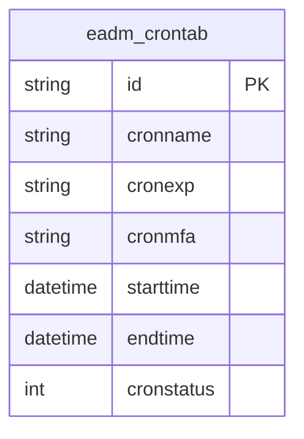
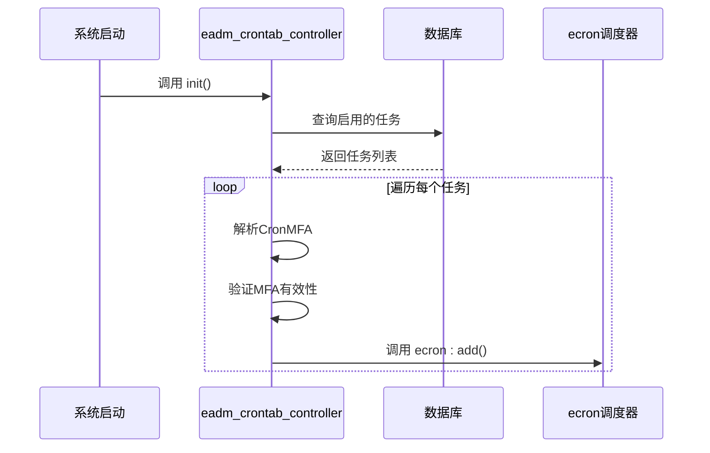

# 定时任务表结构

<cite>
**本文档引用的文件**
- [eadm_crontab_controller.erl](file://src/controllers/eadm_crontab_controller.erl)
- [DataStruct.sql](file://script/mysql/DataStruct.sql)
- [datastruct.sql](file://script/postgres/datastruct.sql)
- [datastruct.sql](file://script/kingbase/datastruct.sql)
- [DATASTRUCT.sql](file://script/oracle/DATASTRUCT.sql)
- [datastruct.sql](file://script/tidb/datastruct.sql)
</cite>

## 目录
1. [简介](#简介)
2. [表结构与核心字段](#表结构与核心字段)
3. [主键设计差异](#主键设计差异)
4. [任务调度机制](#任务调度机制)
5. [索引与性能优化](#索引与性能优化)
6. [结论](#结论)

## 简介
`eadm_crontab` 表是系统中用于管理定时任务的核心数据表。该表存储了任务的名称、执行表达式、触发时间、状态等关键信息，并通过后台调度器实现自动化执行。本文档将深入解析该表的结构设计、在不同数据库中的主键实现差异、与控制器的交互逻辑，以及其在任务调度流程中的作用。

## 表结构与核心字段
`eadm_crontab` 表定义了定时任务的元数据，其核心字段包括：

- **CronName**：任务名称，用于标识和搜索任务。
- **CronExp**：Cron表达式，定义了任务的执行周期（如 `0 0 * * *` 表示每天零点执行）。
- **CronMFA**：任务备注，实际存储了Erlang的模块、函数、参数（M:F/A）信息，用于指定任务执行的具体逻辑。
- **StartDateTime/EndDateTime**：任务的生效时间范围，调度器会根据此范围决定任务是否可执行。
- **CronStatus**：任务状态，`0` 表示启用，`1` 表示禁用。

这些字段共同构成了一个完整的定时任务定义，使得系统能够灵活地配置和管理后台作业。

**Section sources**
- [DataStruct.sql](file://script/mysql/DataStruct.sql#L288-L307)
- [datastruct.sql](file://script/postgres/datastruct.sql#L587-L606)
- [datastruct.sql](file://script/kingbase/datastruct.sql#L587-L606)
- [DATASTRUCT.sql](file://script/oracle/DATASTRUCT.sql#L479-L498)
- [datastruct.sql](file://script/tidb/datastruct.sql#L288-L307)

## 主键设计差异
`eadm_crontab` 表在不同数据库环境下的主键设计存在显著差异，体现了对不同数据库特性的适配。

- **MySQL (及TiDB)**：使用 `BIGINT NOT NULL AUTO_INCREMENT PRIMARY KEY`。这是一种典型的自增主键策略，由数据库自动维护一个递增的整数序列，简单高效，适用于高并发的写入场景。
- **PostgreSQL、Kingbase、Oracle**：使用 `CHAR(12)` 类型的自定义主键。其生成规则为前缀 `CR` 加上10位数字（不足位补零），例如 `CR0000000001`。这种设计通过数据库序列（Sequence）和触发器（Trigger）实现，提供了更灵活的主键生成逻辑，并且主键值具有一定的业务含义（`CR`代表Cron任务）。

这种差异化的主键设计，使得系统能够在不同数据库平台上保持一致的业务逻辑，同时利用各数据库的优势。

**Diagram sources**
- [DataStruct.sql](file://script/mysql/DataStruct.sql#L289)
- [datastruct.sql](file://script/postgres/datastruct.sql#L588)
- [datastruct.sql](file://script/kingbase/datastruct.sql#L588)
- [DATASTRUCT.sql](file://script/oracle/DATASTRUCT.sql#L480)
- [datastruct.sql](file://script/tidb/datastruct.sql#L289)

## 任务调度机制
定时任务的调度流程由 `eadm_crontab_controller.erl` 模块驱动，其核心流程如下：

1.  **初始化加载**：当系统启动时，`init/0` 函数被调用，它会查询数据库中所有 `cronstatus = 0`（启用）且未删除的任务。
2.  **任务解析与调度**：对于每一条查询到的任务记录，`load_and_schedule_jobs/0` 函数会调用 `schedule_job/1` 进行处理。该函数会：
    - 解析 `CronMFA` 字段，将其拆分为模块（Mod）、函数（Fun）和参数（Args）。
    - 验证模块和函数是否存在。
    - 使用 `ecron` 调度库，将 `CronExp` 作为触发条件，将解析出的函数作为执行体，注册到调度器中。
3.  **动态管理**：用户通过Web界面进行的“启用/禁用”操作，会调用控制器的 `toggle/1` 函数。该函数在更新数据库状态的同时，会调用 `ecron:delete/1` 删除旧任务，并根据新状态重新注册任务。

整个流程实现了数据库配置与后台执行的无缝衔接，确保了任务的准确触发。

**Diagram sources**
- [eadm_crontab_controller.erl](file://src/controllers/eadm_crontab_controller.erl#L25-L150)
- [eadm_crontab_controller.erl](file://src/controllers/eadm_crontab_controller.erl#L152-L250)

**Section sources**
- [eadm_crontab_controller.erl](file://src/controllers/eadm_crontab_controller.erl#L25-L250)

## 索引与性能优化
为了优化任务管理页面的查询性能，`eadm_crontab` 表在 `CronName` 字段上创建了名为 `IDX-CronName` 的索引。

- **作用**：当用户在任务管理页面通过任务名称进行搜索时，系统会执行类似 `SELECT ... FROM eadm_crontab WHERE cronname LIKE '%xxx%'` 的查询。`IDX-CronName` 索引能够极大地加速这类模糊查询，避免了全表扫描，显著提升了查询响应速度。
- **实现**：在MySQL中，该索引定义为 `KEY IDX-CronName (CronName)`。在PostgreSQL、Kingbase和Oracle中，索引名称分别为 `non_crontab_cronname` 和 `NON_CRONTAB_CRONNAME`，但其作用完全相同。

该索引是提升用户体验的关键优化点，确保了在任务数量较多时，搜索功能依然保持高效。

**Section sources**
- [DataStruct.sql](file://script/mysql/DataStruct.sql#L306)
- [datastruct.sql](file://script/postgres/datastruct.sql#L605)
- [datastruct.sql](file://script/kingbase/datastruct.sql#L605)
- [DATASTRUCT.sql](file://script/oracle/DATASTRUCT.sql#L497)

## 结论
`eadm_crontab` 表是系统定时任务功能的基石。它通过统一的核心字段定义了任务的完整生命周期，并通过差异化的主键设计适配了多种数据库。其与 `eadm_crontab_controller` 的紧密结合，实现了从数据库配置到后台执行的自动化调度。`IDX-CronName` 索引的引入，则有效保障了任务管理界面的查询性能。整体设计体现了良好的可维护性和扩展性。