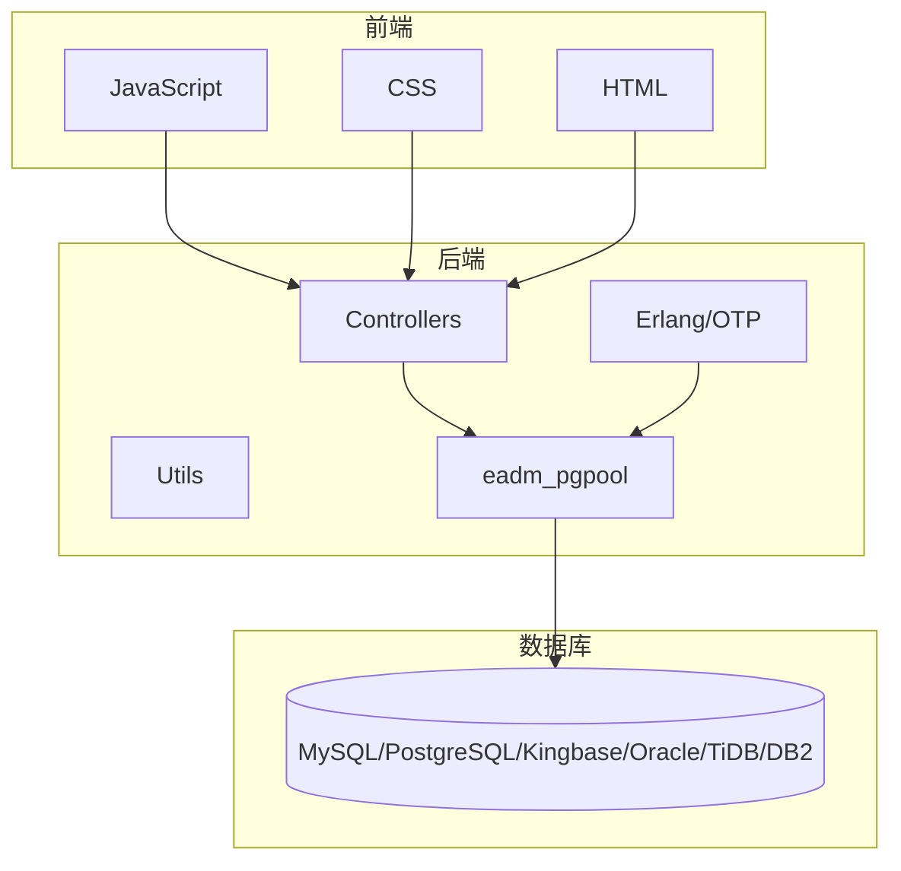
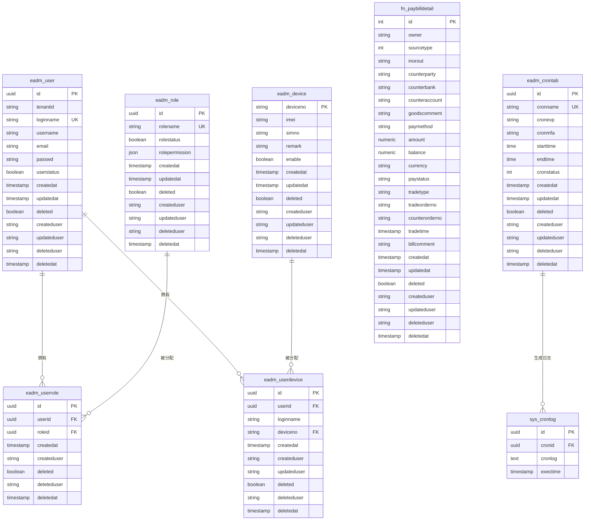
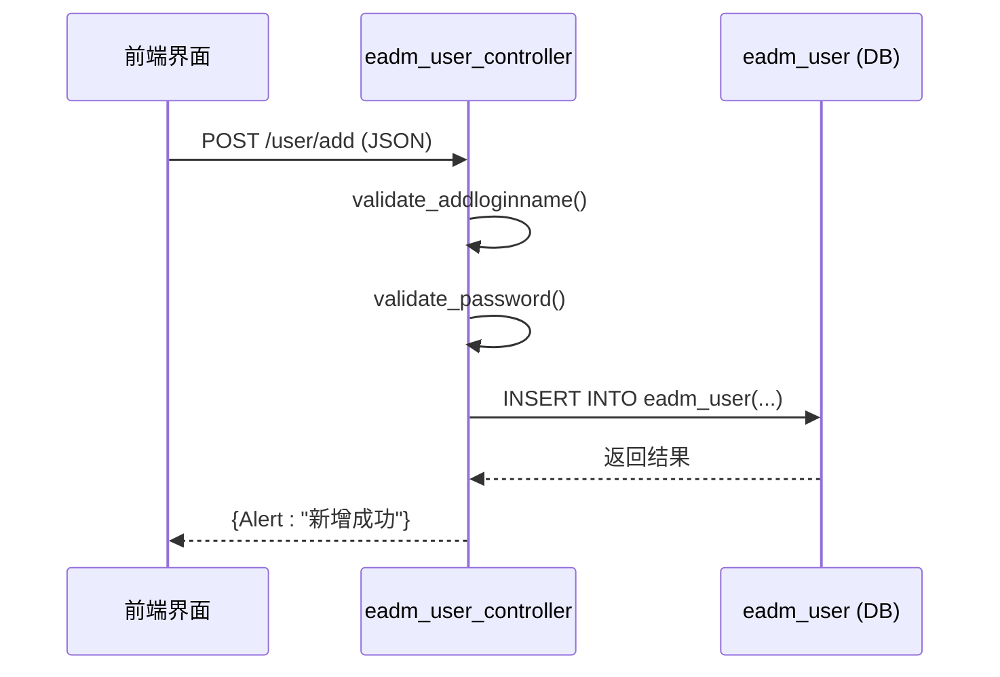
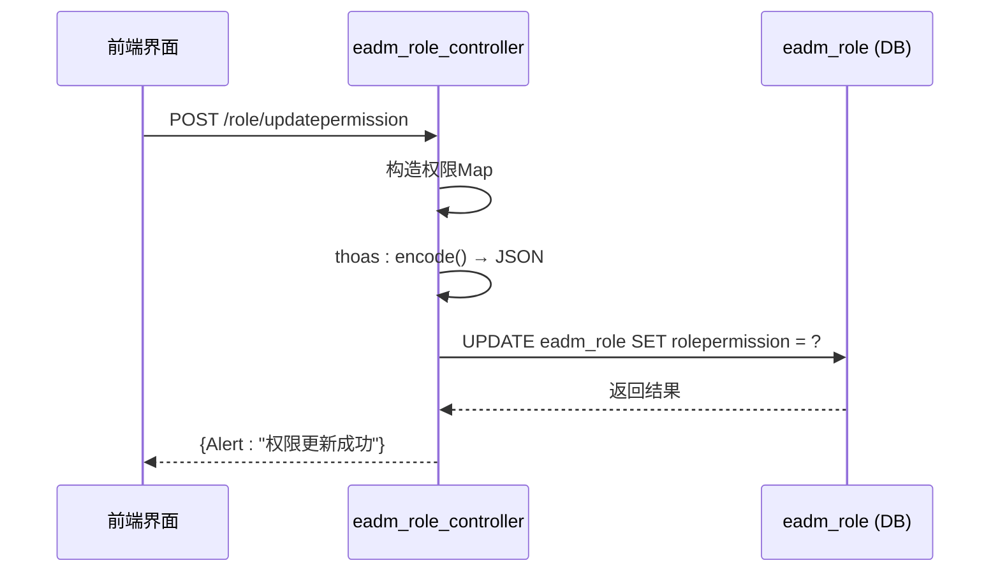

# 核心表结构详解

<cite>
**本文档引用的文件**  
- [eadm_user_controller.erl](file://src/controllers/eadm_user_controller.erl)
- [eadm_role_controller.erl](file://src/controllers/eadm_role_controller.erl)
- [eadm_device_controller.erl](file://src/controllers/eadm_device_controller.erl)
- [eadm_finance_controller.erl](file://src/controllers/eadm_finance_controller.erl)
- [eadm_crontab_controller.erl](file://src/controllers/eadm_crontab_controller.erl)
- [DataStruct.sql](file://script/mysql/DataStruct.sql)
- [datastruct.sql](file://script/postgres/datastruct.sql)
- [datastruct.sql](file://script/kingbase/datastruct.sql)
- [DATASTRUCT.sql](file://script/oracle/DATASTRUCT.sql)
- [datastruct.sql](file://script/tidb/datastruct.sql)
- [DATASTRUCT.sql](file://script/db2/DATASTRUCT.sql)
</cite>

## 目录
1. [引言](#引言)
2. [项目结构](#项目结构)
3. [核心表结构分析](#核心表结构分析)
4. [实体关系图（ERD）](#实体关系图erd)
5. [数据访问模式分析](#数据访问模式分析)
6. [字段变更建议与扩展设计](#字段变更建议与扩展设计)
7. [结论](#结论)

## 引言
本文件旨在全面解析 eadm 系统的核心数据库表结构，涵盖用户、角色、设备、财务记录和定时任务等关键实体。通过分析多个数据库平台下的 `DataStruct.sql` 文件，提取统一的表定义，并结合后端控制器代码说明其业务含义、使用场景及数据访问模式。最终提供字段优化建议与扩展表设计的最佳实践。

## 项目结构
eadm 是一个基于 Erlang/OTP 构建的管理系统，采用分层架构设计，前端使用 JavaScript 和 CSS 实现交互界面，后端通过 Erlang 模块处理业务逻辑并操作数据库。系统支持多种数据库（MySQL、PostgreSQL、Kingbase、Oracle、TiDB、DB2），并通过统一的 SQL 脚本管理数据结构。



**图示来源**  
- [eadm_user_controller.erl](file://src/controllers/eadm_user_controller.erl)
- [eadm_pgpool.erl](file://src/eadm_pgpool.erl)
- script 目录下的各类 SQL 文件

## 核心表结构分析

### 用户表（eadm_user）
用户表存储系统中所有用户的账户信息，是权限控制的基础。

**字段定义：**
- `id`: UUID，主键，唯一标识用户
- `tenantid`: 字符串，租户ID，用于多租户隔离
- `loginname`: 字符串，登录名，唯一约束，长度6-18位，仅支持英文、数字、下划线和连字符
- `username`: 字符串，显示名称
- `email`: 字符串，邮箱地址，需符合标准格式
- `passwd`: 字符串，加密后的密码
- `userstatus`: 布尔值，用户状态（启用/禁用）
- `createdat`: 时间戳，创建时间
- `updatedat`: 时间戳，更新时间
- `deleted`: 布尔值，软删除标志
- `createduser`: 字符串，创建人登录名
- `updateduser`: 字符串，最后修改人
- `deleteduser`: 字符串，删除人
- `deletedat`: 时间戳，删除时间

**索引与约束：**
- 主键：`id`
- 唯一索引：`loginname`（非删除状态下）
- 普通索引：`createdat`（用于排序）
- 视图 `vi_user` 提供用户状态的可读表示（0/1 → 启用/禁用）

**业务含义与使用场景：**
用户表是系统身份认证的核心，所有操作均需通过用户身份进行权限校验。控制器 `eadm_user_controller.erl` 提供了增删改查、密码重置、启用/禁用等功能，支持管理员对用户全生命周期的管理。

**节来源**  
- [eadm_user_controller.erl](file://src/controllers/eadm_user_controller.erl#L1-L480)
- [DataStruct.sql](file://script/mysql/DataStruct.sql)

### 角色表（eadm_role）
角色表定义系统中的权限角色，实现基于角色的访问控制（RBAC）。

**字段定义：**
- `id`: UUID，主键
- `rolename`: 字符串，角色名称，唯一
- `rolestatus`: 布尔值，角色状态（启用/禁用）
- `rolepermission`: JSON 字段，存储权限配置对象
- `createdat`: 时间戳，创建时间
- `updatedat`: 时间戳，更新时间
- `deleted`: 布尔值，软删除标志
- `createduser`: 字符串，创建人
- `updateduser`: 字符串，更新人
- `deleteduser`: 字符串，删除人
- `deletedat`: 时间戳，删除时间

**索引与约束：**
- 主键：`id`
- 唯一索引：`rolename`（非删除状态下）
- 普通索引：`createdat`

**权限结构示例：**
```json
{
  "dashboard": true,
  "health": true,
  "locate": true,
  "finance": {
    "finlist": true,
    "finimp": false,
    "findel": false
  },
  "device": {
    "devlist": true,
    "devadd": true,
    "devedit": true,
    "devdel": false,
    "devassign": true
  },
  "crontab": true,
  "usermanage": true
}
```

**业务含义与使用场景：**
角色表通过 JSON 字段灵活定义各模块的细粒度权限。`eadm_role_controller.erl` 提供角色管理接口，支持动态更新权限配置。用户通过 `eadm_userrole` 关联表与角色绑定，实现权限继承。

**节来源**  
- [eadm_role_controller.erl](file://src/controllers/eadm_role_controller.erl#L1-L247)
- [DataStruct.sql](file://script/mysql/DataStruct.sql)

### 设备表（eadm_device）
设备表管理系统的物理或虚拟设备资源。

**字段定义：**
- `deviceno`: 字符串，设备编号，主键，唯一
- `imei`: 字符串，IMEI号
- `simno`: 字符串，SIM卡号
- `remark`: 字符串，备注信息
- `enable`: 布尔值，设备启用状态
- `createdat`: 时间戳，创建时间
- `updatedat`: 时间戳，更新时间
- `deleted`: 布尔值，软删除标志
- `createduser`: 字符串，创建人
- `updateduser`: 字符串，更新人
- `deleteduser`: 字符串，删除人
- `deletedat`: 时间戳，删除时间

**索引与约束：**
- 主键：`deviceno`
- 唯一索引：`imei`, `simno`（可选）
- 普通索引：`enable`, `createdat`

**业务含义与使用场景：**
设备表用于跟踪设备的全生命周期。`eadm_device_controller.erl` 提供设备的增删改查、启用/禁用、分配/取消分配等操作。设备可被分配给用户，形成 `eadm_userdevice` 关联关系，控制用户对设备的访问权限。

**节来源**  
- [eadm_device_controller.erl](file://src/controllers/eadm_device_controller.erl#L1-L389)
- [DataStruct.sql](file://script/mysql/DataStruct.sql)

### 财务记录表（fn_paybilldetail）
财务记录表存储用户的收支明细数据。

**字段定义：**
- `id`: 整数，自增主键
- `owner`: 字符串，所有者
- `sourcetype`: 整数，来源类型（如支付宝、微信、银行）
- `inorout`: 字符串，收支类型（收入/支出/其他）
- `counterparty`: 字符串，交易对方
- `counterbank`: 字符串，对方银行
- `counteraccount`: 字符串，对方账号
- `goodscomment`: 字符串，商品说明
- `paymethod`: 字符串，支付方式
- `amount`: 数值，金额
- `balance`: 数值，余额
- `currency`: 字符串，币种
- `paystatus`: 字符串，支付状态
- `tradetype`: 字符串，交易类型
- `tradeorderno`: 字符串，交易订单号
- `counterorderno`: 字符串，对方订单号
- `tradetime`: 时间戳，交易时间
- `billcomment`: 字符串，账单备注
- `createdat`: 时间戳，创建时间
- `updatedat`: 时间戳，更新时间
- `deleted`: 布尔值，软删除标志
- `createduser`: 字符串，创建人
- `updateduser`: 字符串，更新人
- `deleteduser`: 字符串，删除人
- `deletedat`: 时间戳，删除时间

**索引与约束：**
- 主键：`id`
- 普通索引：`tradetime`, `sourcetype`, `inorout`
- 复合索引：`(tradetime, deleted)` 用于高效查询指定时间段的数据

**业务含义与使用场景：**
财务表支持多渠道账单导入与查询。`eadm_finance_controller.erl` 提供按时间、类型筛选的查询功能，支持最大366天的查询跨度限制。支持数据删除（软删除）和批量导入，满足财务审计需求。

**节来源**  
- [eadm_finance_controller.erl](file://src/controllers/eadm_finance_controller.erl#L1-L338)
- [DataStruct.sql](file://script/mysql/DataStruct.sql)

### 定时任务表（eadm_crontab）
定时任务表定义系统中的自动化任务调度。

**字段定义：**
- `id`: UUID，主键
- `cronname`: 字符串，任务名称，唯一
- `cronexp`: 字符串，Cron 表达式
- `cronmfa`: 字符串，Erlang 模块:函数/参数（MFA 格式）
- `starttime`: 时间，任务生效开始时间
- `endtime`: 时间，任务生效结束时间
- `cronstatus`: 整数，任务状态（0:启用, 1:禁用）
- `createdat`: 时间戳，创建时间
- `updatedat`: 时间戳，更新时间
- `deleted`: 布尔值，软删除标志
- `createduser`: 字符串，创建人
- `updateduser`: 字符串，更新人
- `deleteduser`: 字符串，删除人
- `deletedat`: 时间戳，删除时间

**索引与约束：**
- 主键：`id`
- 唯一索引：`cronname`（非删除状态下）
- 普通索引：`cronstatus`, `createdat`

**业务含义与使用场景：**
定时任务表通过 `ecron` 库实现 Erlang 原生任务调度。`eadm_crontab_controller.erl` 提供任务的增删改查、启停控制。系统启动时自动加载所有启用的任务并注册到调度器。任务执行日志记录在 `sys_cronlog` 表中，便于监控与审计。

**节来源**  
- [eadm_crontab_controller.erl](file://src/controllers/eadm_crontab_controller.erl#L1-L596)
- [DataStruct.sql](file://script/mysql/DataStruct.sql)

## 实体关系图（ERD）



**图示来源**  
- [DataStruct.sql](file://script/mysql/DataStruct.sql)
- [eadm_user_controller.erl](file://src/controllers/eadm_user_controller.erl)
- [eadm_device_controller.erl](file://src/controllers/eadm_device_controller.erl)
- [eadm_crontab_controller.erl](file://src/controllers/eadm_crontab_controller.erl)

## 数据访问模式分析

### 用户管理数据流


**说明：** 用户新增流程包含登录名与密码的双重校验，确保数据合法性。密码通过 `pass_encrypt` 函数加密后存储。

**图示来源**  
- [eadm_user_controller.erl](file://src/controllers/eadm_user_controller.erl#L100-L150)

### 角色权限更新流程


**说明：** 权限以嵌套 JSON 结构存储，支持模块化细粒度控制。更新时将 Erlang Map 编码为 JSON 字符串存入数据库。

**图示来源**  
- [eadm_role_controller.erl](file://src/controllers/eadm_role_controller.erl#L200-L220)

### 定时任务调度机制
```mermaid
flowchart TD
A[系统启动] --> B{ecron可用?}
B --> |是| C[加载数据库中启用的任务]
C --> D{任务存在?}
D --> |是| E[解析MFA]
E --> F{函数存在?}
F --> |是| G[ecron:add() 注册任务]
G --> H[任务运行]
H --> I[日志写入sys_cronlog]
F --> |否| J[记录错误日志]
D --> |否| K[无任务]
B --> |否| L[跳过初始化]
```

**说明：** 系统启动时自动初始化所有启用的定时任务。任务执行通过 `apply/3` 动态调用，支持高度灵活的自动化脚本。

**图示来源**  
- [eadm_crontab_controller.erl](file://src/controllers/eadm_crontab_controller.erl#L50-L150)

## 字段变更建议与扩展设计

### 字段优化建议

| 表名 | 字段名 | 当前类型 | 建议变更 | 理由 |
|------|--------|----------|----------|------|
| eadm_user | loginname | VARCHAR | VARCHAR(64) | 当前无明确长度限制，建议统一为64位以兼容更多场景 |
| eadm_user | passwd | TEXT | CHAR(60) | 若使用 bcrypt 等固定长度哈希，可优化为定长字段 |
| eadm_role | rolepermission | JSON | JSONB (PostgreSQL) | 提升 JSON 查询性能 |
| fn_paybilldetail | amount | NUMERIC | DECIMAL(15,2) | 明确精度，避免浮点误差 |
| eadm_crontab | cronstatus | INT | BOOLEAN | 状态仅两种，布尔更语义化 |

### 扩展表设计最佳实践

1. **审计日志扩展**
   - 建议为关键表（用户、角色、财务）建立独立的审计日志表，记录每次变更的完整前后状态，而非仅软删除。
   - 示例：`eadm_user_audit` 表，包含 `operation_type` (INSERT/UPDATE/DELETE), `old_values`, `new_values`。

2. **多语言支持扩展**
   - 若系统需国际化，建议将 `rolename`, `cronname` 等文本字段抽象为多语言表。
   - 设计：`eadm_i18n` (key, lang, value)，通过键值关联。

3. **配置中心化**
   - 将 `max_fin_search_span` 等硬编码配置移至数据库表 `eadm_config` (key, value, type, description)，支持运行时动态调整。

4. **设备状态历史**
   - 为 `eadm_device` 增加状态变更历史表 `eadm_device_status_log`，记录每次 `enable` 变更的时间、操作人，便于追踪设备可用性。

5. **权限模型升级**
   - 当前为 RBAC 模型，可扩展为 ABAC（基于属性的访问控制），增加 `policy` 表，支持更复杂的条件判断（如时间、IP、设备类型）。

## 结论
eadm 系统的数据库设计整体合理，采用软删除、视图封装、JSON 权限配置等现代实践，具备良好的可维护性与扩展性。通过统一的 SQL 脚本支持多数据库平台，体现了良好的兼容性设计。后端控制器与数据库交互清晰，权限控制严密。建议在审计、配置管理、多语言等方面进行扩展，以适应更复杂的业务场景。未来可考虑引入数据库迁移工具（如 Alembic 或 Ecto）来更好地管理 schema 变更。