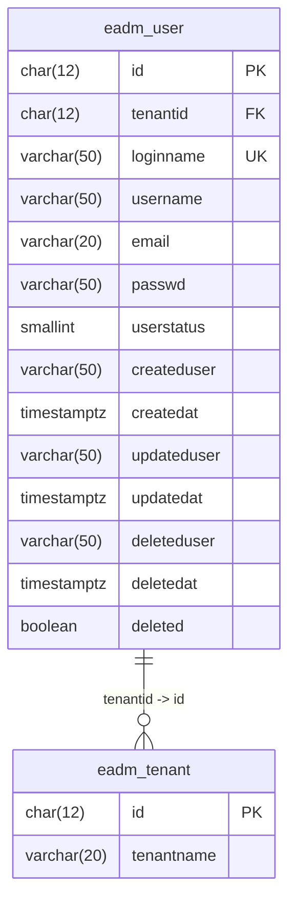

# 用户表结构

<cite>
**本文档引用的文件**
- [eadm_user_controller.erl](file://src/controllers/eadm_user_controller.erl)
- [DataStruct.sql](file://script/mysql/DataStruct.sql)
- [datastruct.sql](file://script/postgres/datastruct.sql)
- [datastruct.sql](file://script/kingbase/datastruct.sql)
</cite>

## 目录
1. [用户表结构设计](#用户表结构设计)
2. [字段定义说明](#字段定义说明)
3. [主键生成策略](#主键生成策略)
4. [外键约束与索引](#外键约束与索引)
5. [数据访问模式](#数据访问模式)
6. [用户创建SQL示例](#用户创建sql示例)

## 用户表结构设计

`eadm_user` 表是 eadm 系统中的核心用户信息表，用于存储系统中所有用户的基本信息、认证信息和状态信息。该表在多个数据库平台（MySQL、PostgreSQL、Kingbase）中均有实现，结构设计保持一致，确保了跨平台的兼容性。

**表名**: `eadm_user`  
**中文注释**: 基础信息_用户信息表



**图表来源**
- [datastruct.sql](file://script/postgres/datastruct.sql#L167-L207)
- [datastruct.sql](file://script/kingbase/datastruct.sql#L167-L219)

## 字段定义说明

`eadm_user` 表包含以下核心字段：

| 字段名 | 数据类型 | 是否为空 | 默认值 | 说明 |
| :--- | :--- | :--- | :--- | :--- |
| `Id` | CHAR(12) | 否 | - | 自定义主键，前缀为 "EU"，由 `fn_nextval` 函数或序列生成 |
| `TenantId` | CHAR(12) | 否 | - | 租户ID，外键关联 `eadm_tenant` 表的 `Id` 字段 |
| `LoginName` | VARCHAR(50) | 否 | - | 用户登录名，必须唯一，长度6-18位，仅支持英文、数字、下划线和连字符 |
| `UserName` | VARCHAR(50) | 否 | - | 用户姓名 |
| `Email` | VARCHAR(20) | 否 | - | 用户邮箱，需符合标准邮箱格式 |
| `CryptoGram/Passwd` | VARCHAR(50) | 否 | - | 密码哈希值，存储经过加密处理的密码 |
| `UserStatus` | TINYINT/SMALLINT | 否 | 0 | 用户状态，0表示启用，1表示禁用 |
| `CreatedUser` | VARCHAR(50) | 是 | NULL | 创建人 |
| `CreatedAt` | DATETIME/TIMESTAMPTZ | 否 | CURRENT_TIMESTAMP | 数据创建时间 |
| `UpdatedUser` | VARCHAR(50) | 是 | NULL | 更新人 |
| `UpdatedAt` | DATETIME/TIMESTAMPTZ | 否 | CURRENT_TIMESTAMP ON UPDATE | 数据更新时间 |
| `DeletedUser` | VARCHAR(50) | 是 | NULL | 删除人 |
| `DeletedAt` | DATETIME/TIMESTAMPTZ | 是 | NULL | 删除时间 |
| `Deleted` | TINYINT/BOOLEAN | 否 | 0/false | 软删除标志，0/false表示未删除，1/true表示已删除 |

**章节来源**
- [DataStruct.sql](file://script/mysql/DataStruct.sql#L108-L125)
- [datastruct.sql](file://script/postgres/datastruct.sql#L180-L207)
- [datastruct.sql](file://script/kingbase/datastruct.sql#L167-L219)

## 主键生成策略

`eadm_user` 表的主键 `Id` 采用自定义主键生成策略，前缀为 "EU"，后接10位数字，总长度为12位。

- **MySQL 平台**: 使用自定义函数 `fn_nextval` 和 `sys_sequence` 表来生成主键。`fn_nextval('EU')` 函数会从 `sys_sequence` 表中获取 "EU" 序列的当前值，递减后返回。
- **PostgreSQL 和 Kingbase 平台**: 使用数据库原生的 `SEQUENCE` 对象。通过 `CREATE SEQUENCE eu` 创建名为 `eu` 的序列，并在 `eadm_user` 表的 `id` 字段上使用 `nextval('eu')` 函数生成主键值。

这种设计确保了主键的全局唯一性和可预测性，同时避免了对数据库自增主键的依赖。

**章节来源**
- [DataStruct.sql](file://script/mysql/DataStruct.sql#L33-L66)
- [datastruct.sql](file://script/postgres/datastruct.sql#L167-L179)
- [datastruct.sql](file://script/kingbase/datastruct.sql#L149-L166)

## 外键约束与索引

`eadm_user` 表定义了以下约束和索引以保证数据完整性和查询性能：

- **主键约束**: `PRIMARY KEY (Id)`，确保 `Id` 字段的唯一性。
- **外键约束**: `FOREIGN KEY (TenantId) REFERENCES eadm_tenant(Id)`，确保 `TenantId` 必须存在于 `eadm_tenant` 表中。
- **唯一索引**: `UNIQUE KEY IDX-LoginName (LoginName)`，确保登录名的全局唯一性。
- **状态索引**: `KEY IDX-UserStatus (UserStatus)` (MySQL) 或 `non_user_userstatus` (PostgreSQL/Kingbase)，用于加速按用户状态（启用/禁用）的查询。
- **更新时间索引**: `KEY IDX-UpdatedAt (UpdatedAt)` (MySQL) 或 `non_user_updatedat` (PostgreSQL/Kingbase)，用于加速按更新时间排序的查询。

这些索引和约束是系统高效运行和数据一致性的关键。

**章节来源**
- [DataStruct.sql](file://script/mysql/DataStruct.sql#L120-L125)
- [datastruct.sql](file://script/postgres/datastruct.sql#L198-L207)
- [datastruct.sql](file://script/kingbase/datastruct.sql#L191-L219)

## 数据访问模式

用户数据的访问主要通过 `eadm_user_controller.erl` 模块中的 Erlang 函数实现。该模块定义了用户管理的核心API，包括创建、查询、更新、删除和权限校验等操作。

- **用户创建**: `add/1` 函数接收用户信息（登录名、姓名、邮箱、密码等），首先进行密码和登录名的格式验证，然后调用 `eadm_pgpool:equery` 执行 `INSERT` 语句，将新用户插入 `eadm_user` 表。密码在插入前会通过 `eadm_utils:pass_encrypt/1` 函数进行加密。
- **用户查询**: `search/1` 函数通过 `eadm_pgpool:equery` 执行 `SELECT` 语句，从 `vi_user` 视图中查询所有未删除的用户信息。该视图会将 `TenantId` 关联为可读的租户名称。
- **权限校验**: 所有用户管理操作（如 `add`, `edit`, `delete`）在执行前都会检查调用者的权限。例如，`add/1` 函数会检查 `auth_data` 中的 `permission` 是否包含 `<<"usermanage">> := true`，只有拥有用户管理权限的用户才能执行新增操作。

这种基于控制器的访问模式实现了业务逻辑与数据访问的分离，并集成了权限控制。

**章节来源**
- [eadm_user_controller.erl](file://src/controllers/eadm_user_controller.erl#L60-L150)

## 用户创建SQL示例

以下是在不同数据库平台上插入新用户记录的SQL示例：

**MySQL 示例**:
```sql
INSERT INTO eadm_user(Id, TenantId, LoginName, UserName, Email, CryptoGram, CreatedUser)
VALUES(fn_nextval('EU'), 'ET9999999998', 'newuser', '新用户', 'newuser@example.com', '加密后的密码哈希', 'admin');
```

**PostgreSQL/Kingbase 示例**:
```sql
INSERT INTO eadm_user(TenantId, LoginName, UserName, Email, Passwd, CreatedUser)
VALUES('et0000000001', 'newuser', '新用户', 'newuser@example.com', '加密后的密码哈希', 'admin');
-- 注意：Id 字段由 DEFAULT 值自动填充
```

**章节来源**
- [DataStruct.sql](file://script/mysql/DataStruct.sql#L130-L132)
- [datastruct.sql](file://script/postgres/datastruct.sql#L210-L212)
- [datastruct.sql](file://script/kingbase/datastruct.sql#L221-L223)