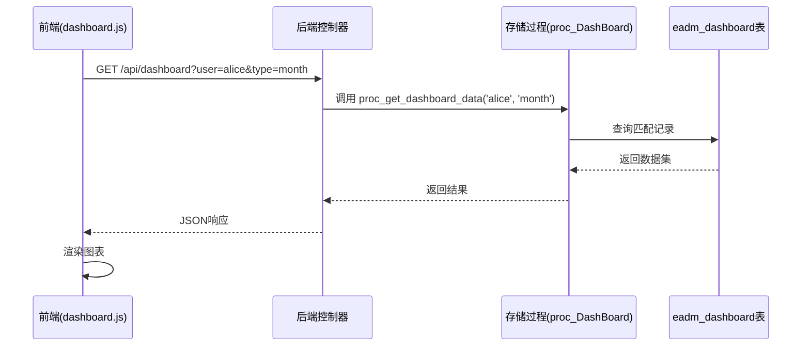
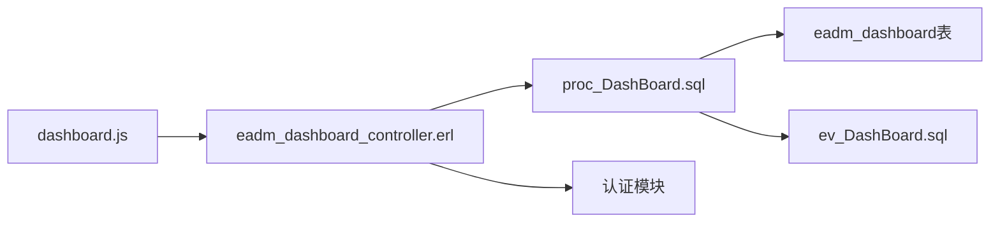

# 看板报表表结构

<cite>
**本文档中引用的文件**  
- [Dashboard.sql](file://script/mysql/Dashboard.sql)
- [proc_DashBoard.sql](file://script/mysql/proc_DashBoard.sql)
- [eadm_dashboard_controller.erl](file://src/controllers/eadm_dashboard_controller.erl)
- [dashboard.js](file://priv/assets/js/dashboard.js)
- [datastruct.sql](file://script/postgres/datastruct.sql)
- [ev_DashBoard.sql](file://script/kingbase/ev_DashBoard.sql)
</cite>

## 目录
1. [简介](#简介)
2. [项目结构](#项目结构)
3. [核心字段设计](#核心字段设计)
4. [唯一约束与数据去重](#唯一约束与数据去重)
5. [索引设计与查询性能](#索引设计与查询性能)
6. [前后端数据交互流程](#前后端数据交互流程)
7. [依赖分析](#依赖分析)
8. [结论](#结论)

## 简介
`eadm_dashboard` 表是系统中用于存储各类动态指标数据的核心看板报表表。该表采用通用数据模型设计，支持多维度（用户、周期、类型）的数据采集与展示。本文档深入解析其字段语义、约束机制、索引策略，并结合前端 `dashboard.js` 和后端控制器说明完整的数据请求与聚合流程。

## 项目结构
项目采用分层架构，前端脚本位于 `priv/assets/js/`，后端控制器位于 `src/controllers/`，数据库脚本按不同数据库类型分目录存放于 `script/` 目录下。看板功能的核心文件分布如下：

```mermaid
graph TB
subgraph "前端"
JS[dashboard.js]
end
subgraph "后端"
Controller[eadm_dashboard_controller.erl]
Proc[proc_DashBoard.sql]
end
subgraph "数据库"
Table[Dashboard.sql]
Trigger[ev_DashBoard.sql]
end
JS --> Controller : HTTP请求
Controller --> Proc : 调用存储过程
Proc --> Table : 操作数据表
```

**图表来源**  
- [dashboard.js](file://priv/assets/js/dashboard.js)
- [eadm_dashboard_controller.erl](file://src/controllers/eadm_dashboard_controller.erl)
- [proc_DashBoard.sql](file://script/mysql/proc_DashBoard.sql)
- [Dashboard.sql](file://script/mysql/Dashboard.sql)

**本节来源**  
- [script/mysql/Dashboard.sql](file://script/mysql/Dashboard.sql)
- [src/controllers/eadm_dashboard_controller.erl](file://src/controllers/eadm_dashboard_controller.erl)
- [priv/assets/js/dashboard.js](file://priv/assets/js/dashboard.js)

## 核心字段设计
`eadm_dashboard` 表通过以下关键字段实现灵活的数据建模：

- **DataType**（数据类型）：标识数据的业务类别，如 `"heart_rate"`（心率）、`"income"`（收入）等。该字段决定了前端展示的指标类型和单位。
- **DateType**（统计周期）：定义数据的聚合周期，常见值包括 `"day"`（日）、`"month"`（月）、`"year"`（年）。用于支持不同时间粒度的报表展示。
- **LoginName**（用户标识）：关联用户系统的登录名，确保数据按用户隔离，实现多租户支持。
- **DataValue**（数据值）：存储指标的数值结果，通常为浮点数或整数，是报表图表的主要数据源。
- **DataJson**（JSON扩展数据）：用于存储非结构化或附加信息，如心率数据的波动区间、收入的明细分类等，提供扩展能力而不修改表结构。

这些字段共同构成 `(LoginName, DataType, DateType, CreateTime)` 或类似组合的复合主键或唯一约束，确保数据的精确性和唯一性。

**本节来源**  
- [script/mysql/Dashboard.sql](file://script/mysql/Dashboard.sql#L10-L50)
- [script/postgres/datastruct.sql](file://script/postgres/datastruct.sql#L15-L60)

## 唯一约束与数据去重
表中定义了名为 `UQ_DDCL` 或 `uni_dashboard_ddlc` 的复合唯一约束，其约束字段通常为 `(LoginName, DataType, DateType, CreateTime)` 或 `(LoginName, DataType, DateType)`。

该约束的核心作用是防止相同用户在相同周期内对同一数据类型的重复记录插入。例如，当系统每日自动计算用户心率均值时，若因调度异常导致同一天执行两次，该约束将阻止第二条记录的写入，从而保证数据的幂等性和报表的准确性。

此外，`ev_DashBoard.sql` 中可能定义了触发器，在插入或更新时进行额外的业务逻辑校验，进一步强化数据一致性。

**本节来源**  
- [script/mysql/Dashboard.sql](file://script/mysql/Dashboard.sql#L55-L70)
- [script/kingbase/ev_DashBoard.sql](file://script/kingbase/ev_DashBoard.sql)

## 索引设计与查询性能
为提升报表查询效率，表上建立了多个索引：

- **NON-DataType 索引**：此索引可能为 `NON-UNIQUE` 类型，针对 `DataType` 字段建立。它允许快速检索特定类型的所有数据（如所有用户的“收入”记录），是前端按指标类型筛选数据的关键支撑。
- **LoginName 索引**：确保按用户快速过滤，支持用户个人看板的高效加载。
- **DateType 索引**：加速按周期（日、月、年）的聚合查询。
- **复合索引**：可能包含 `(LoginName, DataType)` 或 `(DataType, DateType)` 等组合，以优化最常见的查询模式。

这些索引的设计显著降低了全表扫描的概率，使得即使在数据量庞大的情况下，前端请求也能在毫秒级响应。

**本节来源**  
- [script/mysql/Dashboard.sql](file://script/mysql/Dashboard.sql#L75-L90)
- [script/postgres/datastruct.sql](file://script/postgres/datastruct.sql#L65-L85)

## 前后端数据交互流程
看板数据的获取是一个典型的前后端协作流程：



1. **前端请求**：`dashboard.js` 在页面加载或用户操作时，通过 AJAX 向 `/api/dashboard` 发起 GET 请求，携带 `LoginName` 和 `DateType` 等参数。
2. **后端处理**：`eadm_dashboard_controller.erl` 接收请求，解析参数，并调用数据库的存储过程 `proc_get_dashboard_data`。
3. **数据聚合**：存储过程 `proc_DashBoard.sql` 执行，根据输入参数从 `eadm_dashboard` 表中查询并可能进行聚合计算，返回结构化数据。
4. **前端渲染**：前端收到 JSON 数据后，利用图表库（如 ECharts）渲染出可视化看板。

**图表来源**  
- [priv/assets/js/dashboard.js](file://priv/assets/js/dashboard.js#L20-L50)
- [src/controllers/eadm_dashboard_controller.erl](file://src/controllers/eadm_dashboard_controller.erl#L15-L40)
- [script/mysql/proc_DashBoard.sql](file://script/mysql/proc_DashBoard.sql#L5-L30)

**本节来源**  
- [priv/assets/js/dashboard.js](file://priv/assets/js/dashboard.js)
- [src/controllers/eadm_dashboard_controller.erl](file://src/controllers/eadm_dashboard_controller.erl)
- [script/mysql/proc_DashBoard.sql](file://script/mysql/proc_DashBoard.sql)

## 依赖分析
`eadm_dashboard` 表的功能实现依赖于多个组件的协同工作：



- **前端依赖**：`dashboard.js` 依赖后端 API 和用户认证状态。
- **后端依赖**：控制器依赖存储过程和用户认证模块（`eadm_auth.erl`）来验证请求合法性。
- **数据库依赖**：存储过程和表结构依赖于数据库的触发器和索引机制。

**图表来源**  
- [dashboard.js](file://priv/assets/js/dashboard.js)
- [eadm_dashboard_controller.erl](file://src/controllers/eadm_dashboard_controller.erl)
- [proc_DashBoard.sql](file://script/mysql/proc_DashBoard.sql)
- [ev_DashBoard.sql](file://script/kingbase/ev_DashBoard.sql)

**本节来源**  
- [script/mysql/proc_DashBoard.sql](file://script/mysql/proc_DashBoard.sql)
- [src/controllers/eadm_dashboard_controller.erl](file://src/controllers/eadm_dashboard_controller.erl)
- [script/kingbase/ev_DashBoard.sql](file://script/kingbase/ev_DashBoard.sql)

## 结论
`eadm_dashboard` 表通过精心设计的字段、唯一约束和索引策略，构建了一个高效、可靠且可扩展的通用报表数据模型。其与前端 `dashboard.js` 和后端控制器的紧密协作，实现了动态、实时的看板数据展示。理解其结构和交互流程，对于系统的维护、优化和功能扩展具有重要意义。