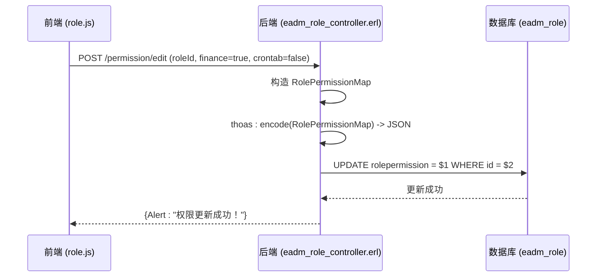

# 角色表结构

<cite>
**本文档引用文件**  
- [eadm_role_controller.erl](file://src/controllers/eadm_role_controller.erl)
- [eadm_auth.erl](file://src/eadm_auth.erl)
- [datastruct.sql](file://script/kingbase/datastruct.sql)
- [role.js](file://priv/assets/js/role.js)
- [user.js](file://priv/assets/js/user.js)
</cite>

## 目录
1. [引言](#引言)
2. [角色表核心字段设计](#角色表核心字段设计)
3. [RolePermission字段结构与权限控制](#rolepermission字段结构与权限控制)
4. [主键与索引设计](#主键与索引设计)
5. [用户-角色-权限动态映射机制](#用户-角色-权限动态映射机制)
6. [权限解析与应用流程](#权限解析与应用流程)
7. [前端权限交互逻辑](#前端权限交互逻辑)
8. [总结](#总结)

## 引言
本文档深入解析 `eadm_role` 表的数据库设计，涵盖其核心字段、权限结构、主键与索引策略，以及如何通过关联表和视图实现用户-角色-权限的动态映射。重点分析 `RolePermission` 字段的 JSON 结构及其在系统中的解析与应用流程。

**Section sources**
- [datastruct.sql](file://script/kingbase/datastruct.sql#L256-L282)

## 角色表核心字段设计
`eadm_role` 表用于存储系统中的角色信息，其核心字段包括：

- **Id**：自定义主键，格式为 `er` + 10位序列号（如 `er0000000001`），确保全局唯一性。
- **RoleName**：角色名称，非空字段，用于标识角色的语义名称（如“超级管理员”）。
- **RolePermission**：以 JSON 格式存储的角色权限配置，定义该角色对各功能模块的访问控制。
- **RoleStatus**：角色状态，`0` 表示启用，`1` 表示禁用，用于逻辑控制角色的可用性。
- **Deleted**：软删除标志，`false` 表示未删除，`true` 表示已删除，配合 `deletedat` 和 `deleteduser` 实现数据追溯。

这些字段共同构成了角色的基础信息，支持系统的权限管理体系。

**Section sources**
- [datastruct.sql](file://script/kingbase/datastruct.sql#L256-L282)

## RolePermission字段结构与权限控制
`RolePermission` 字段采用 JSON 格式存储，结构化地定义了角色在各个业务模块的权限。其典型结构如下：

```json
{
  "dashboard": true,
  "health": true,
  "locate": true,
  "finance": {
    "finlist": true,
    "finimp": true,
    "findel": true
  },
  "crontab": true,
  "usermanage": true,
  "device": {
    "devlist": true,
    "devadd": true,
    "devedit": true,
    "devdel": true,
    "devassign": true
  }
}
```

### 权限模块说明
- **finance**：财务模块，包含 `finlist`（查看）、`finimp`（导入）、`findel`（删除）等细粒度权限。
- **health**：健康数据模块，布尔值控制整体访问权限。
- **crontab**：定时任务模块，布尔值控制启用/禁用状态。
- **device**：设备管理模块，包含列表、添加、编辑、删除、分配等操作权限。

此设计支持灵活的权限组合，满足不同角色的业务需求。

**Section sources**
- [eadm_role_controller.erl](file://src/controllers/eadm_role_controller.erl#L110-L135)
- [role.js](file://priv/assets/js/role.js#L147-L176)

## 主键与索引设计
### 主键生成
主键 `Id` 采用数据库序列（`er`）结合字符串拼接的方式生成，SQL 定义如下：
```sql
id char(12) not null default ('er' || lpad((nextval('er')::varchar), 10, '0'))
```
此方式确保主键的唯一性和可读性，同时避免了自增整数主键的暴露风险。

### 索引设计
为提升查询性能，系统建立了以下索引：
- **IDX-RoleName**：在 `rolename` 字段上创建 B-Tree 索引 `non_role_rolename`，加速基于角色名称的查询。
- **状态索引**：在 `rolestatus` 字段上创建 B-Tree 索引 `non_user_rolestatus`，优化启用/禁用状态的筛选操作。

这些索引显著提升了角色管理功能的响应速度。

**Section sources**
- [datastruct.sql](file://script/kingbase/datastruct.sql#L256-L282)

## 用户-角色-权限动态映射机制
系统通过 `eadm_userrole` 关联表和 `vi_userpermission` 视图实现用户-角色-权限的动态映射。

### 关联表 `eadm_userrole`
该表建立用户与角色的多对多关系，关键字段包括：
- `userid`：外键，引用 `eadm_user.id`
- `roleid`：外键，引用 `eadm_role.id`
- `deleted`：软删除标志

### 视图 `vi_userpermission`
该视图是权限系统的核心，其定义如下：
```sql
create or replace view vi_userpermission as
select b.id, a.loginname, c.rolepermission
from eadm_user a
inner join eadm_userrole b on b.userid=a.id and b.deleted is false
inner join eadm_role c on c.id=b.roleid and c.rolestatus=0 and c.deleted is false
where a.deleted is false;
```
该视图动态聚合了**未删除用户**、**未删除且启用的角色**的权限信息，为权限校验提供实时数据源。

**Section sources**
- [datastruct.sql](file://script/kingbase/datastruct.sql#L358-L402)
- [eadm_user_controller.erl](file://src/controllers/eadm_user_controller.erl#L319-L349)

## 权限解析与应用流程
权限的解析与应用贯穿于用户会话的整个生命周期。

### 权限加载
当用户登录成功后，系统通过 `vi_userpermission` 视图查询其权限，并存入会话（Session）中：
```erlang
{ok, Permission} = nova_session:get(Req ,<<"permission">>)
```

### 权限校验
在 `eadm_auth:auth/1` 函数中，系统从会话中提取 `permission` 数据，并在后续的 API 调用中进行校验。例如，在 `eadm_role_controller` 中，通过模式匹配检查 `<<"usermanage">> := true` 来判断用户是否具有用户管理权限。

### 权限更新
管理员可通过前端界面更新角色权限。前端将表单数据（如 `finance`, `crontab` 的布尔值）提交至 `/permission/edit` 接口。后端控制器 `eadm_role_controller:updatepermission/1` 将这些参数构造成 Erlang Map，再使用 `thoas:encode/1` 转换为 JSON，最终更新到 `eadm_role` 表的 `rolepermission` 字段。



**Diagram sources**
- [eadm_role_controller.erl](file://src/controllers/eadm_role_controller.erl#L110-L135)
- [role.js](file://priv/assets/js/role.js#L147-L176)

**Section sources**
- [eadm_auth.erl](file://src/eadm_auth.erl#L0-L48)
- [eadm_role_controller.erl](file://src/controllers/eadm_role_controller.erl#L110-L151)

## 前端权限交互逻辑
前端通过 `role.js` 实现权限的可视化管理。

### 权限加载
`loadPermission(roleId)` 函数通过 `GET /permission/:roleId` 接口获取角色的权限 JSON，并将其映射到页面上的复选框控件：
```javascript
$('#finance').prop('checked', resdata.finance.finlist);
$('#crontab').prop('checked', resdata.crontab);
```

### 权限提交
`editPermission(roleId)` 函数收集所有复选框的状态，构造请求参数，并提交至后端。

此交互逻辑确保了权限配置的直观性和易用性。

**Section sources**
- [role.js](file://priv/assets/js/role.js#L147-L176)

## 总结
`eadm_role` 表的设计体现了清晰的权限管理思想。通过自定义主键、JSON 权限字段、软删除机制和视图聚合，系统实现了灵活、高效、可追溯的权限控制。`RolePermission` 的嵌套 JSON 结构支持细粒度的权限划分，而 `vi_userpermission` 视图则为动态权限映射提供了坚实的数据基础。从前端交互到后端解析，整个流程紧密配合，共同保障了系统的安全与稳定。