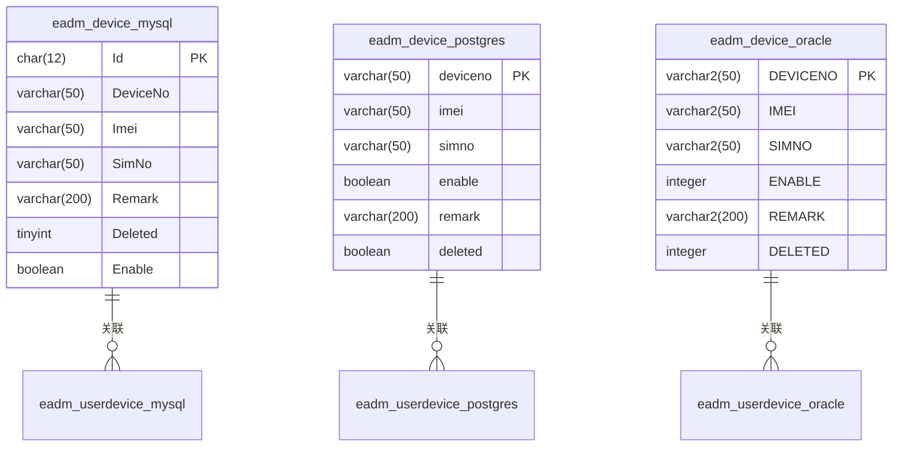
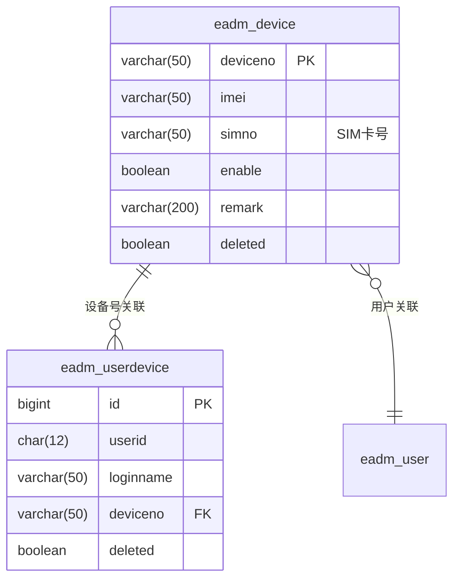
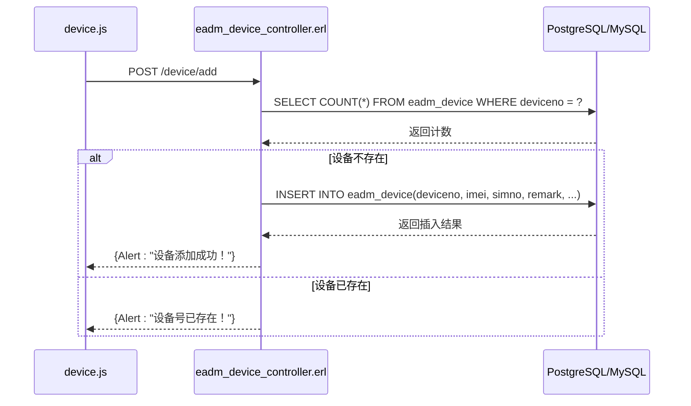
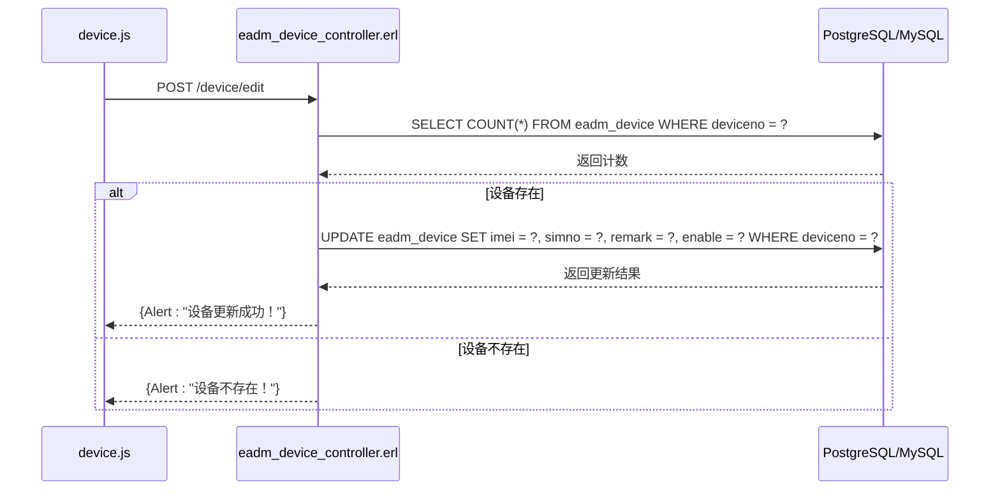
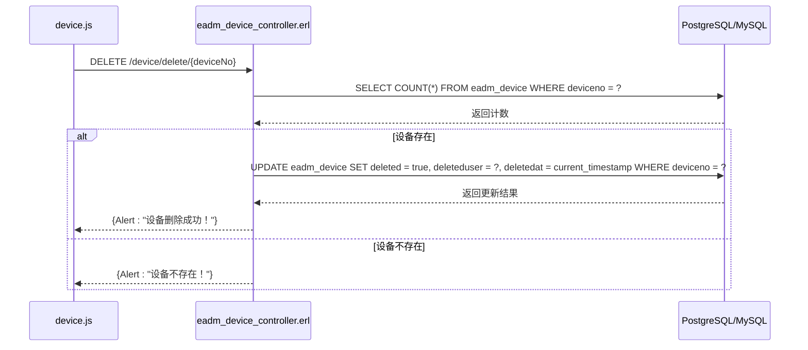
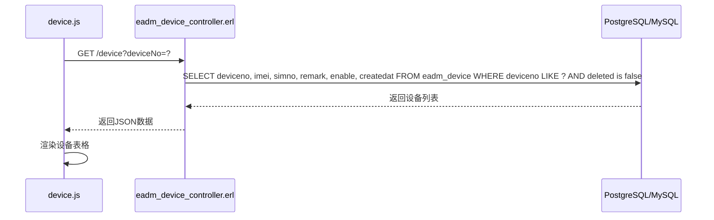
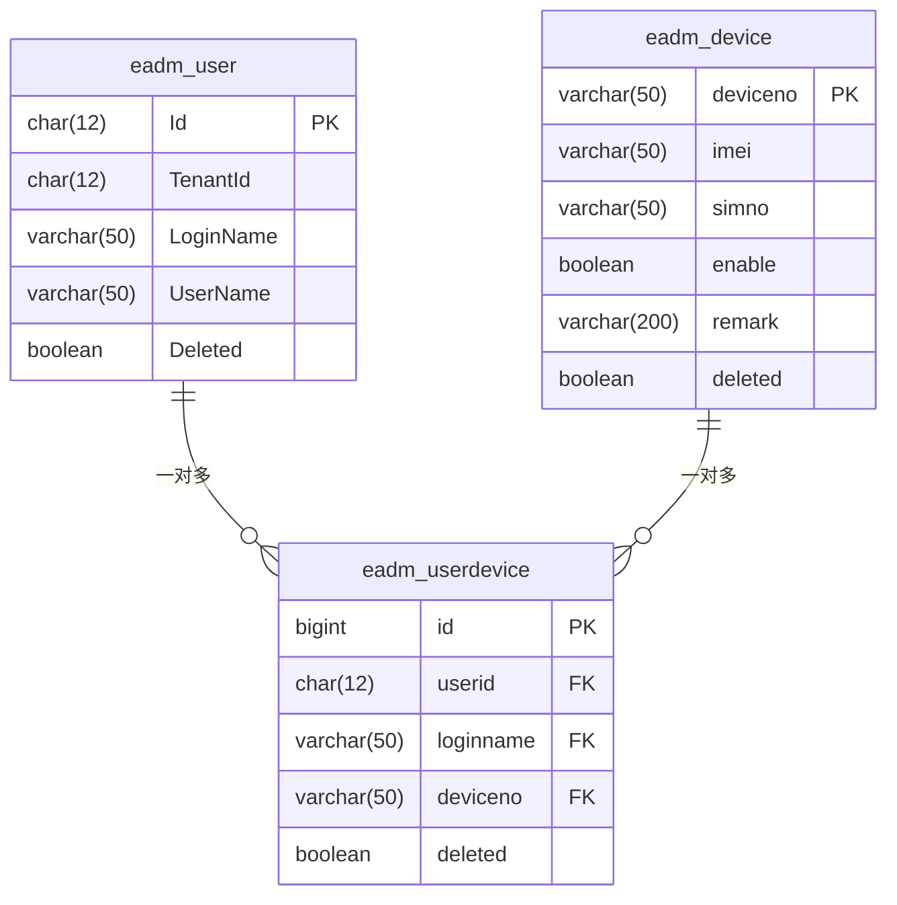
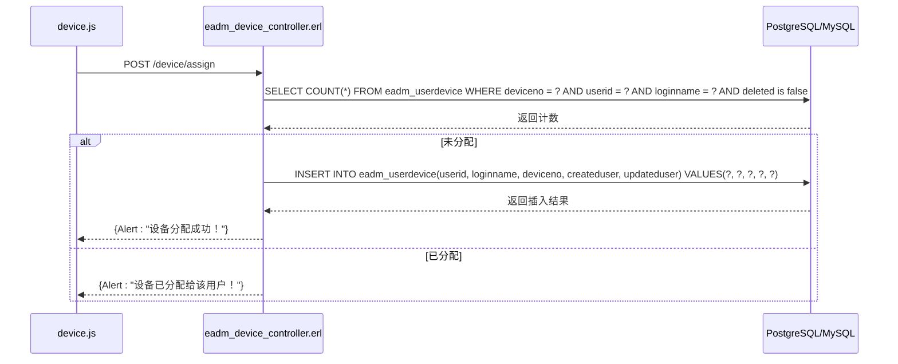
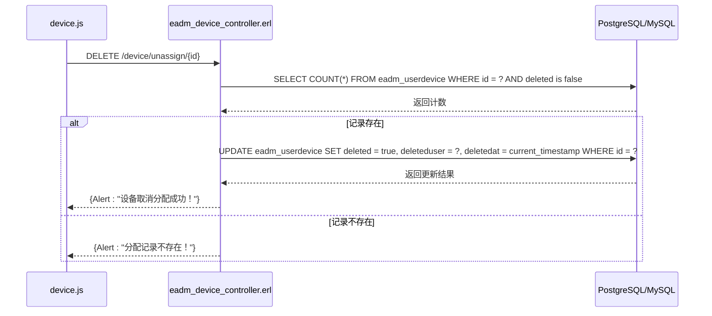

# 设备表结构

<cite>
**本文档引用的文件**
- [eadm_device_controller.erl](file://src/controllers/eadm_device_controller.erl)
- [device.js](file://priv/assets/js/device.js)
- [DataStruct.sql](file://script/mysql/DataStruct.sql)
- [datastruct.sql](file://script/postgres/datastruct.sql)
- [datastruct.sql](file://script/kingbase/datastruct.sql)
- [DATASTRUCT.sql](file://script/oracle/DATASTRUCT.sql)
</cite>

## 目录
1. [设备表结构](#设备表结构)
2. [主键设计](#主键设计)
3. [字段说明](#字段说明)
4. [数据库实现差异](#数据库实现差异)
5. [索引分析](#索引分析)
6. [设备操作与数据库交互](#设备操作与数据库交互)
7. [用户设备绑定关系](#用户设备绑定关系)

## 设备表结构

`eadm_device` 表是系统中用于存储设备信息的核心表，包含设备的基本信息、状态和描述等字段。该表在不同数据库中的实现存在差异，但核心字段保持一致。

**本文档引用的文件**
- [DataStruct.sql](file://script/mysql/DataStruct.sql#L248-L271)
- [datastruct.sql](file://script/postgres/datastruct.sql#L438-L464)
- [datastruct.sql](file://script/kingbase/datastruct.sql#L438-L464)
- [DATASTRUCT.sql](file://script/oracle/DATASTRUCT.sql#L598-L624)

## 主键设计

`eadm_device` 表的主键设计在不同数据库中有所不同：

- **MySQL**: 使用 `CHAR(12)` 类型的 `Id` 字段作为主键，通过自定义序列函数 `fn_nextval` 生成唯一值，格式为前缀加10位数字（如 `ED9999999998`）。
- **PostgreSQL/kingbase**: 使用 `VARCHAR(50)` 类型的 `DeviceNo` 字段作为主键，直接以设备号作为主键。
- **Oracle**: 使用 `VARCHAR2(50)` 类型的 `DEVICENO` 字段作为主键，同样以设备号作为主键。

这种设计差异反映了不同数据库的主键策略：MySQL采用通用的自增主键模式，而其他数据库则采用业务主键（设备号）作为主键。

**本文档引用的文件**
- [DataStruct.sql](file://script/mysql/DataStruct.sql#L249)
- [datastruct.sql](file://script/postgres/datastruct.sql#L441)
- [datastruct.sql](file://script/kingbase/datastruct.sql#L441)
- [DATASTRUCT.sql](file://script/oracle/DATASTRUCT.sql#L601)

## 字段说明

`eadm_device` 表包含以下核心字段：

- **DeviceNo/DEVICENO**: 设备号，作为设备的唯一标识。在PostgreSQL、kingbase和Oracle中作为主键，在MySQL中作为普通字段。
- **Imei**: 设备IMEI号，用于标识移动设备的国际移动设备身份码。
- **SimNo**: SIM卡号，存储设备使用的SIM卡号码。
- **Remark**: 设备描述，用于记录设备的备注信息。
- **Enable**: 设备状态，布尔类型（PostgreSQL/kingbase）或整数类型（MySQL/Oracle），表示设备是否启用（true/1）或禁用（false/0）。
- **CreatedUser/UpdatedUser/DeletedUser**: 记录创建、更新和删除操作的用户。
- **CreatedAt/UpdatedAt/DeletedAt**: 记录创建、更新和删除操作的时间戳。
- **Deleted**: 软删除标志，表示记录是否已被删除。

**本文档引用的文件**
- [DataStruct.sql](file://script/mysql/DataStruct.sql#L248-L271)
- [datastruct.sql](file://script/postgres/datastruct.sql#L438-L464)
- [datastruct.sql](file://script/kingbase/datastruct.sql#L438-L464)
- [DATASTRUCT.sql](file://script/oracle/DATASTRUCT.sql#L598-L624)

## 数据库实现差异

不同数据库对 `eadm_device` 表的实现存在显著差异：

**图表来源**
- [DataStruct.sql](file://script/mysql/DataStruct.sql#L248-L271)
- [datastruct.sql](file://script/postgres/datastruct.sql#L438-L464)
- [DATASTRUCT.sql](file://script/oracle/DATASTRUCT.sql#L598-L624)

主要差异包括：
1. **主键设计**: MySQL使用独立的 `Id` 字段作为主键，而其他数据库使用 `DeviceNo` 作为主键。
2. **数据类型**: 布尔类型在PostgreSQL/kingbase中使用 `boolean`，在MySQL中使用 `tinyint`，在Oracle中使用 `integer`。
3. **命名规范**: MySQL和Oracle使用大写或驼峰命名，PostgreSQL和kingbase使用小写命名。
4. **序列生成**: MySQL使用自定义函数 `fn_nextval` 生成主键，而其他数据库依赖触发器或序列。

**本文档引用的文件**
- [DataStruct.sql](file://script/mysql/DataStruct.sql#L248-L271)
- [datastruct.sql](file://script/postgres/datastruct.sql#L438-L464)
- [datastruct.sql](file://script/kingbase/datastruct.sql#L438-L464)
- [DATASTRUCT.sql](file://script/oracle/DATASTRUCT.sql#L598-L624)

## 索引分析

`eadm_device` 表在不同数据库中都创建了针对 `SimNo` 字段的索引，命名为 `NON-SimNo`（MySQL）或 `non_device_simno`（PostgreSQL/kingbase/Oracle）。该索引的主要用途是：

1. **加速SIM卡号查询**: 当需要根据SIM卡号查找设备时，该索引可以显著提高查询性能。
2. **支持设备管理功能**: 在设备管理界面中，可能需要根据SIM卡号进行筛选或搜索，该索引确保了这些操作的高效性。
3. **外键引用优化**: `eadm_userdevice` 表通过 `DeviceNo` 字段与 `eadm_device` 表关联，`SimNo` 索引可能用于某些特定的查询场景。

**图表来源**
- [datastruct.sql](file://script/postgres/datastruct.sql#L448)
- [datastruct.sql](file://script/kingbase/datastruct.sql#L448)
- [DataStruct.sql](file://script/mysql/DataStruct.sql#L269)
- [DATASTRUCT.sql](file://script/oracle/DATASTRUCT.sql#L618)

**本文档引用的文件**
- [DataStruct.sql](file://script/mysql/DataStruct.sql#L269)
- [datastruct.sql](file://script/postgres/datastruct.sql#L448)
- [datastruct.sql](file://script/kingbase/datastruct.sql#L448)
- [DATASTRUCT.sql](file://script/oracle/DATASTRUCT.sql#L618)

## 设备操作与数据库交互

设备的增删改查操作通过 `eadm_device_controller.erl` 控制器和 `device.js` 前端脚本协同完成，与数据库进行交互。

### 增加设备

**图表来源**
- [eadm_device_controller.erl](file://src/controllers/eadm_device_controller.erl#L108-L142)
- [device.js](file://priv/assets/js/device.js#L488-L528)

### 编辑设备

**图表来源**
- [eadm_device_controller.erl](file://src/controllers/eadm_device_controller.erl#L144-L178)
- [device.js](file://priv/assets/js/device.js#L530-L560)

### 删除设备

**图表来源**
- [eadm_device_controller.erl](file://src/controllers/eadm_device_controller.erl#L180-L214)
- [device.js](file://priv/assets/js/device.js#L562-L584)

### 查询设备

**图表来源**
- [eadm_device_controller.erl](file://src/controllers/eadm_device_controller.erl#L58-L97)
- [device.js](file://priv/assets/js/device.js#L340-L389)

**本文档引用的文件**
- [eadm_device_controller.erl](file://src/controllers/eadm_device_controller.erl#L58-L214)
- [device.js](file://priv/assets/js/device.js#L340-L584)

## 用户设备绑定关系

系统通过 `eadm_userdevice` 关联表建立用户与设备的绑定关系，实现设备分配和管理功能。

### 绑定关系模型

**图表来源**
- [datastruct.sql](file://script/postgres/datastruct.sql#L466-L494)
- [DataStruct.sql](file://script/mysql/DataStruct.sql#L273-L296)
- [DATASTRUCT.sql](file://script/oracle/DATASTRUCT.sql#L626-L651)

### 设备分配流程

**图表来源**
- [eadm_device_controller.erl](file://src/controllers/eadm_device_controller.erl#L280-L314)
- [device.js](file://priv/assets/js/device.js#L706-L747)

### 取消分配流程

**图表来源**
- [eadm_device_controller.erl](file://src/controllers/eadm_device_controller.erl#L316-L353)
- [device.js](file://priv/assets/js/device.js#L749-L777)

**本文档引用的文件**
- [eadm_device_controller.erl](file://src/controllers/eadm_device_controller.erl#L280-L353)
- [device.js](file://priv/assets/js/device.js#L706-L777)