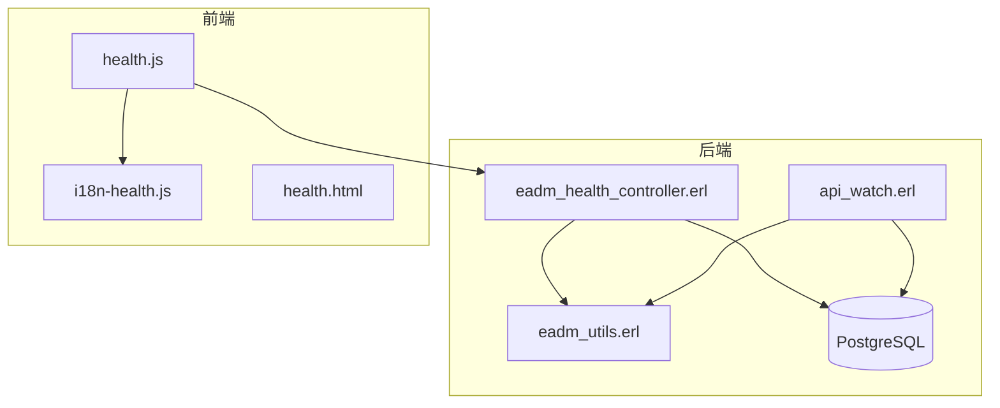
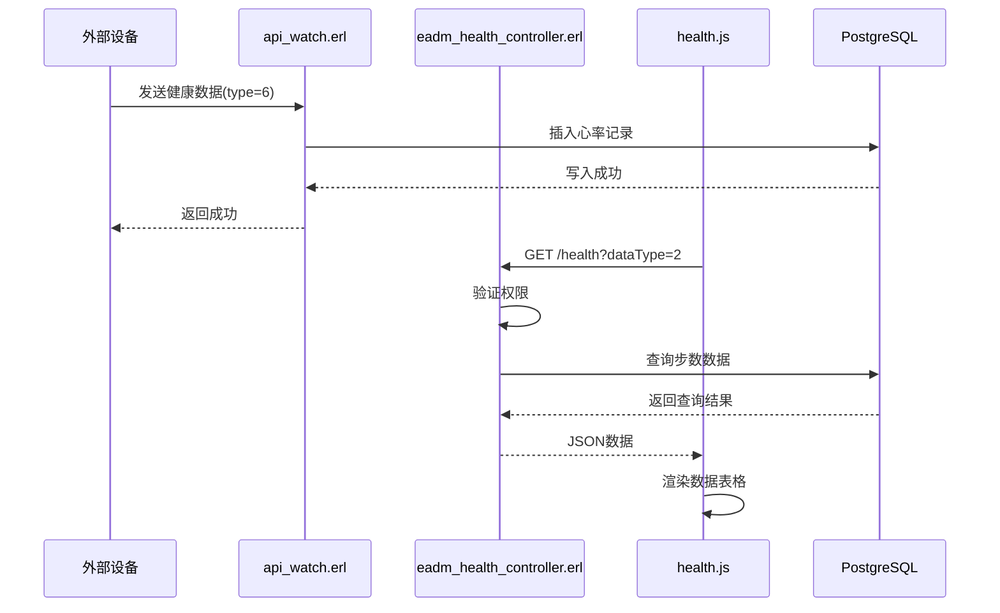
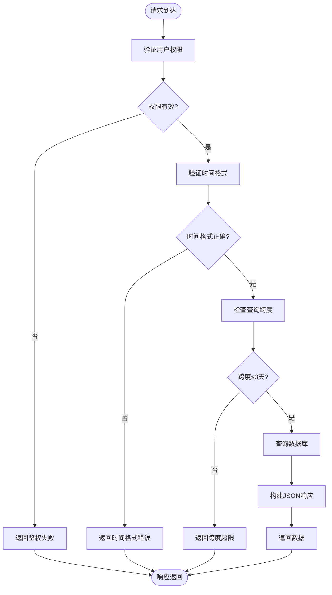
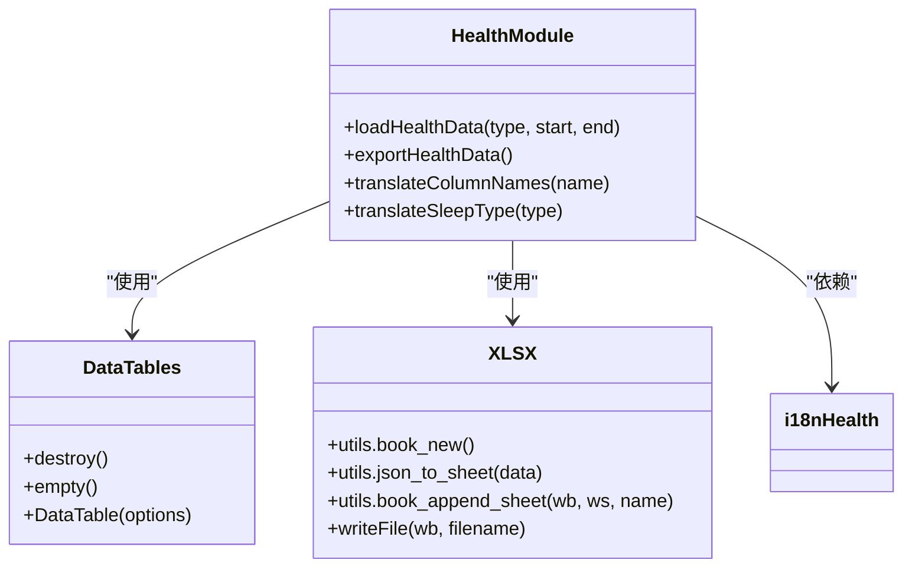
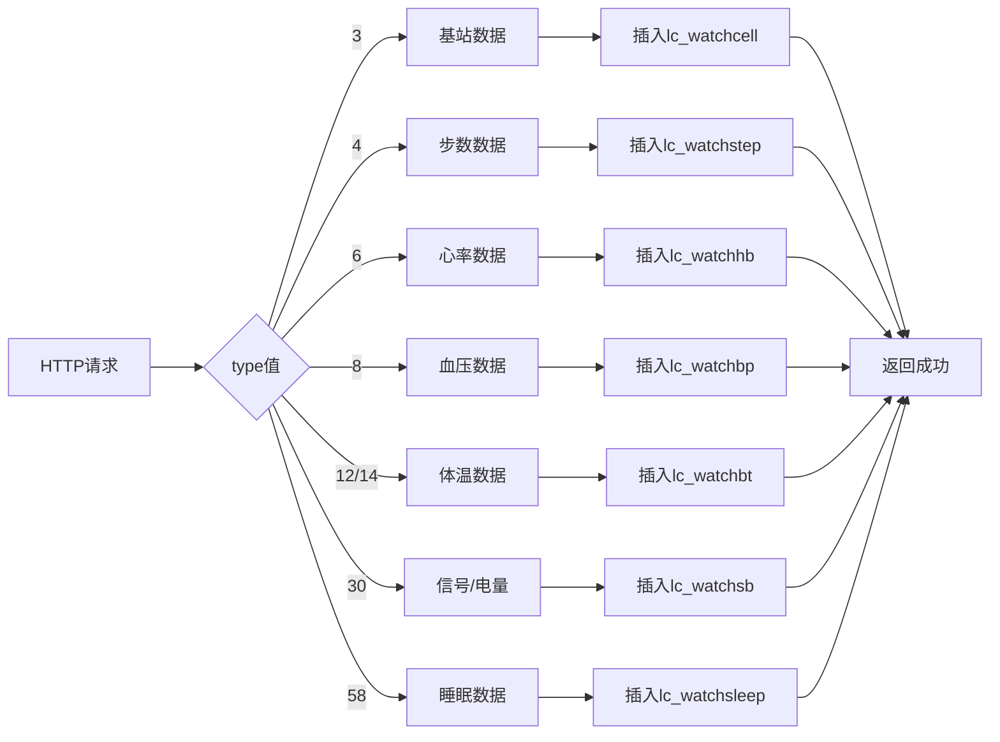
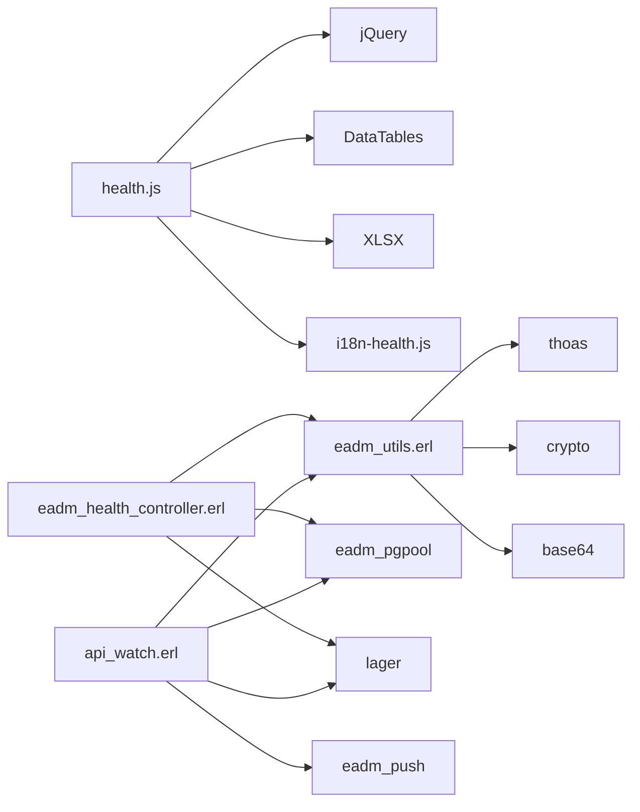

# 健康监测模块

<cite>
**本文档引用文件**  
- [eadm_health_controller.erl](file://src/controllers/eadm_health_controller.erl)
- [health.js](file://priv/assets/js/health.js)
- [api_watch.erl](file://src/apis/api_watch.erl)
- [eadm_utils.erl](file://src/eadm_utils.erl)
- [DataStruct.sql](file://script/mysql/DataStruct.sql)
</cite>

## 目录
1. [简介](#简介)
2. [项目结构](#项目结构)
3. [核心组件](#核心组件)
4. [架构概览](#架构概览)
5. [详细组件分析](#详细组件分析)
6. [依赖分析](#依赖分析)
7. [性能考虑](#性能考虑)
8. [故障排查指南](#故障排查指南)
9. [结论](#结论)

## 简介
本模块实现了一个完整的健康数据采集、展示与外部集成系统。系统通过 `eadm_health_controller.erl` 提供受权限保护的健康数据查询接口，前端 `health.js` 实现动态数据加载与可视化展示，`api_watch.erl` 作为外部数据接入探针，支持多类型健康指标的写入。整个系统围绕手表健康数据构建，涵盖心率、血压、步数、睡眠等关键指标，支持时间范围查询与数据导出功能。

## 项目结构
健康监测相关文件分布在三个主要目录中：控制器层（`src/controllers/`）、前端脚本（`priv/assets/js/`）和API接口（`src/apis/`）。数据库表结构定义在 `script/mysql/DataStruct.sql` 中，相关工具函数位于 `src/eadm_utils.erl`。

**图源**  
- [eadm_health_controller.erl](file://src/controllers/eadm_health_controller.erl)
- [api_watch.erl](file://src/apis/api_watch.erl)
- [health.js](file://priv/assets/js/health.js)
- [eadm_utils.erl](file://src/eadm_utils.erl)

**本节来源**  
- [src/controllers/](file://src/controllers/)
- [priv/assets/js/](file://priv/assets/js/)
- [src/apis/](file://src/apis/)

## 核心组件
系统由三大核心组件构成：后端控制器处理权限验证与数据查询，前端脚本实现用户交互与数据展示，API接口负责接收外部设备数据。权限系统通过 `auth_data` 字段验证用户健康模块访问权限，数据查询支持多种健康指标类型与时效性校验。

**本节来源**  
- [eadm_health_controller.erl](file://src/controllers/eadm_health_controller.erl#L1-L147)
- [health.js](file://priv/assets/js/health.js#L1-L187)
- [api_watch.erl](file://src/apis/api_watch.erl#L1-L496)

## 架构概览
系统采用典型的前后端分离架构，前端通过AJAX调用后端REST接口获取数据，后端通过数据库连接池访问PostgreSQL存储。外部设备通过API接口直接写入数据，形成完整的数据采集-存储-展示闭环。

**图源**  
- [eadm_health_controller.erl](file://src/controllers/eadm_health_controller.erl#L45-L146)
- [api_watch.erl](file://src/apis/api_watch.erl#L65-L75)
- [health.js](file://priv/assets/js/health.js#L25-L75)

## 详细组件分析

### 健康控制器分析
`eadm_health_controller.erl` 模块提供两个主要接口：`index/1` 用于权限验证，`search/1` 用于数据查询。查询功能支持六种健康数据类型，通过 `dataType` 参数区分，并对时间范围进行合法性校验。

**图源**  
- [eadm_health_controller.erl](file://src/controllers/eadm_health_controller.erl#L45-L146)
- [eadm_utils.erl](file://src/eadm_utils.erl#L100-L120)

**本节来源**  
- [eadm_health_controller.erl](file://src/controllers/eadm_health_controller.erl#L1-L147)

### 前端健康模块分析
`health.js` 实现了完整的前端健康数据管理界面，包括数据加载、表格渲染、语言翻译和数据导出功能。通过jQuery DataTables插件实现专业级数据表格展示。

**图源**  
- [health.js](file://priv/assets/js/health.js#L1-L187)
- [i18n-health.js](file://priv/assets/i18n/i18n-health.js)

**本节来源**  
- [health.js](file://priv/assets/js/health.js#L1-L187)

### API探针接口分析
`api_watch.erl` 模块作为外部监控系统的数据接入点，支持多种类型健康数据的写入，包括心率、血压、步数、体温等。每个数据类型通过 `type` 参数区分，实现数据的分类存储。

**图源**  
- [api_watch.erl](file://src/apis/api_watch.erl#L1-L496)

**本节来源**  
- [api_watch.erl](file://src/apis/api_watch.erl#L1-L496)

## 依赖分析
系统依赖关系清晰，各组件职责分明。前端依赖jQuery和DataTables库实现UI功能，后端依赖epgsql实现数据库连接，通过lager进行日志记录。权限系统与主应用集成，共享用户认证机制。

**图源**  
- [health.js](file://priv/assets/js/health.js)
- [eadm_health_controller.erl](file://src/controllers/eadm_health_controller.erl)
- [api_watch.erl](file://src/apis/api_watch.erl)
- [eadm_utils.erl](file://src/eadm_utils.erl)

**本节来源**  
- [health.js](file://priv/assets/js/health.js)
- [eadm_health_controller.erl](file://src/controllers/eadm_health_controller.erl)
- [api_watch.erl](file://src/apis/api_watch.erl)

## 性能考虑
系统在性能方面进行了多项优化：数据库查询使用连接池避免频繁连接开销，前端采用延迟渲染减少初始加载时间，查询跨度限制防止大规模数据查询导致性能下降。建议监控频率设置为每5-15分钟一次，避免过于频繁的请求影响系统稳定性。

## 故障排查指南
常见错误包括权限验证失败、时间格式错误、查询跨度超限和数据库查询失败。错误信息通过统一的 `Alert` 字段返回，前端通过 `showWarningToast` 函数展示。扩展新的健康检测项时，需在数据库创建对应表，更新 `eadm_health_controller.erl` 的查询逻辑，并在前端添加相应的数据类型选项。

**本节来源**  
- [eadm_health_controller.erl](file://src/controllers/eadm_health_controller.erl#L120-L146)
- [health.js](file://priv/assets/js/health.js#L50-L60)

## 结论
健康监测模块实现了完整的健康数据管理功能，具有良好的扩展性和稳定性。通过清晰的权限控制、灵活的数据查询和友好的用户界面，为健康数据的采集与分析提供了可靠的技术支持。建议定期审查查询性能，优化数据库索引，确保系统在大数据量下的响应速度。