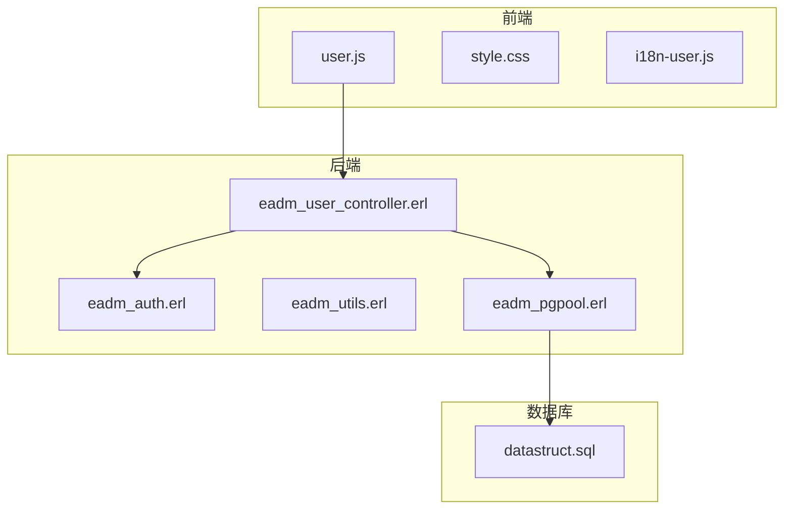
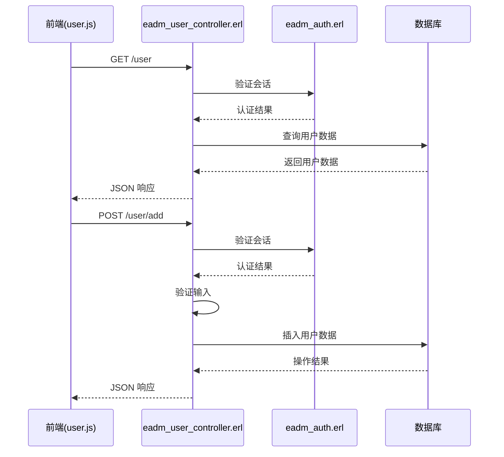
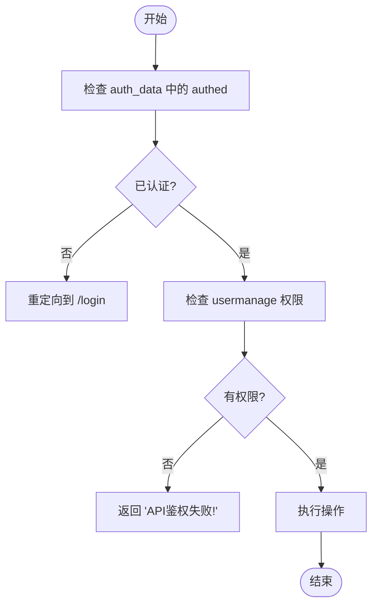
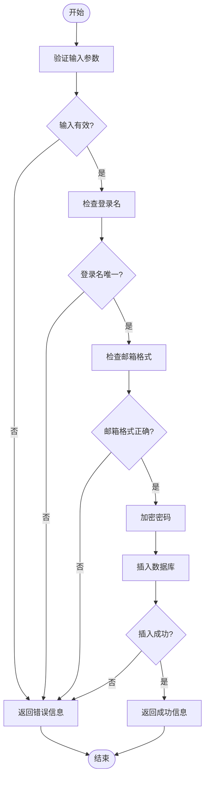
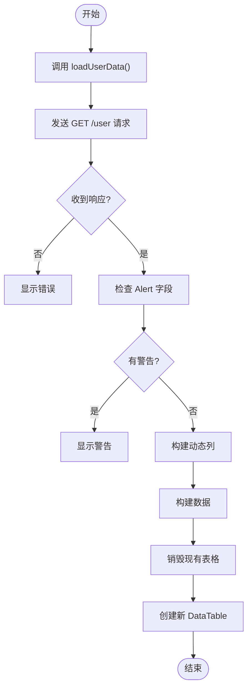
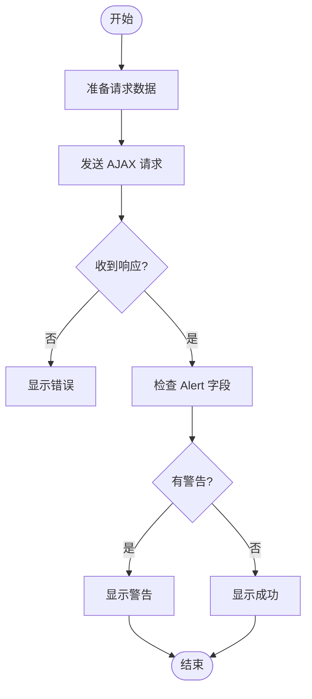
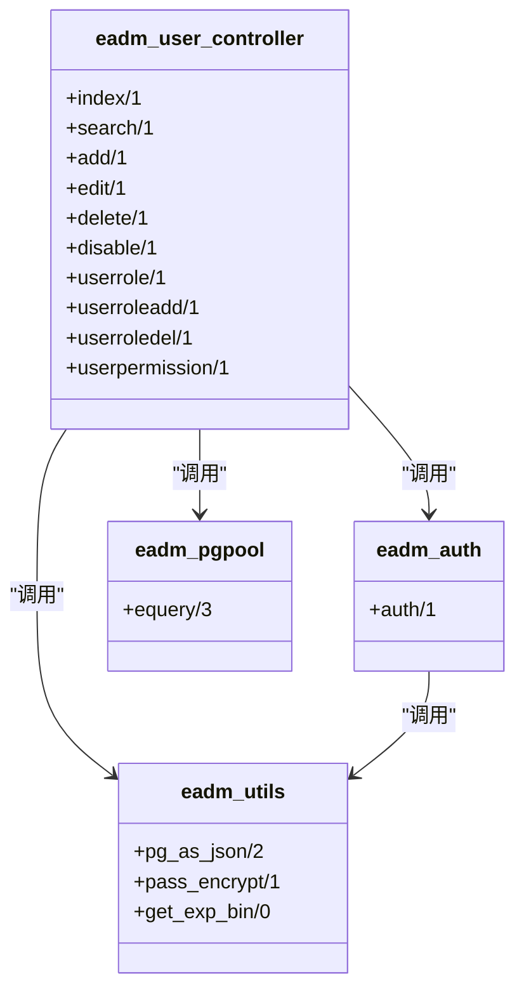

# 用户管理模块

<cite>
**本文档引用的文件**
- [eadm_user_controller.erl](file://src/controllers/eadm_user_controller.erl)
- [eadm_auth.erl](file://src/eadm_auth.erl)
- [user.js](file://priv/assets/js/user.js)
- [datastruct.sql](file://script/postgres/datastruct.sql)
</cite>

## 目录
1. [简介](#简介)
2. [项目结构](#项目结构)
3. [核心组件](#核心组件)
4. [架构概览](#架构概览)
5. [详细组件分析](#详细组件分析)
6. [依赖分析](#依赖分析)
7. [性能考虑](#性能考虑)
8. [故障排除指南](#故障排除指南)
9. [结论](#结论)

## 简介
本文档详细描述了用户管理模块的前后端实现机制。涵盖 `eadm_user_controller.erl` 如何处理用户列表查询、新增、编辑和删除请求，如何调用数据库进行 CRUD 操作，并集成 `eadm_auth.erl` 进行权限校验。同时描述前端 `user.js` 中的 AJAX 请求逻辑、表格渲染流程及分页实现方式。提供从界面操作到后端响应的完整调用链示例，说明该模块依赖的数据表结构（如 `t_user` 表字段定义），并给出典型 SQL 查询语句。为开发者提供调试建议，例如如何在日志中定位用户操作异常，并说明常见问题如会话失效导致请求拒绝的解决方案。

## 项目结构
用户管理模块的文件分布在项目的不同目录中，主要包括前端 JavaScript 文件、后端 Erlang 控制器和认证模块，以及数据库结构定义文件。

**Diagram sources**
- [user.js](file://priv/assets/js/user.js)
- [eadm_user_controller.erl](file://src/controllers/eadm_user_controller.erl)
- [eadm_auth.erl](file://src/eadm_auth.erl)
- [datastruct.sql](file://script/postgres/datastruct.sql)

**Section sources**
- [user.js](file://priv/assets/js/user.js)
- [eadm_user_controller.erl](file://src/controllers/eadm_user_controller.erl)

## 核心组件
用户管理模块的核心组件包括前端的 `user.js` 和后端的 `eadm_user_controller.erl`。`user.js` 负责处理用户界面的交互逻辑，包括 AJAX 请求的发送和表格的渲染。`eadm_user_controller.erl` 负责处理来自前端的 HTTP 请求，进行权限校验、数据库操作和响应生成。

**Section sources**
- [user.js](file://priv/assets/js/user.js#L1-L555)
- [eadm_user_controller.erl](file://src/controllers/eadm_user_controller.erl#L1-L480)

## 架构概览
用户管理模块的架构分为前端、后端和数据库三层。前端通过 AJAX 请求与后端交互，后端通过 `eadm_user_controller.erl` 处理请求，调用 `eadm_auth.erl` 进行权限校验，并通过 `eadm_pgpool` 模块与数据库进行交互。

**Diagram sources**
- [user.js](file://priv/assets/js/user.js#L1-L555)
- [eadm_user_controller.erl](file://src/controllers/eadm_user_controller.erl#L1-L480)
- [eadm_auth.erl](file://src/eadm_auth.erl#L1-L48)

## 详细组件分析

### 后端控制器分析
`eadm_user_controller.erl` 模块负责处理所有用户管理相关的 HTTP 请求。每个函数对应一个特定的操作，如查询、新增、编辑、删除等。函数首先进行权限校验，然后执行相应的数据库操作。

#### 权限校验流程

**Diagram sources**
- [eadm_user_controller.erl](file://src/controllers/eadm_user_controller.erl#L1-L480)
- [eadm_auth.erl](file://src/eadm_auth.erl#L1-L48)

#### 用户新增流程

**Diagram sources**
- [eadm_user_controller.erl](file://src/controllers/eadm_user_controller.erl#L1-L480)

**Section sources**
- [eadm_user_controller.erl](file://src/controllers/eadm_user_controller.erl#L1-L480)

### 前端逻辑分析
`user.js` 文件包含用户管理界面的所有前端逻辑，包括数据加载、表格渲染、表单提交和用户交互。

#### 表格渲染流程

**Diagram sources**
- [user.js](file://priv/assets/js/user.js#L1-L555)

#### AJAX 请求处理

**Diagram sources**
- [user.js](file://priv/assets/js/user.js#L1-L555)

**Section sources**
- [user.js](file://priv/assets/js/user.js#L1-L555)

## 依赖分析
用户管理模块依赖于多个其他模块和组件，包括认证模块、数据库连接池、工具函数等。

**Diagram sources**
- [eadm_user_controller.erl](file://src/controllers/eadm_user_controller.erl#L1-L480)
- [eadm_auth.erl](file://src/eadm_auth.erl#L1-L48)
- [eadm_pgpool.erl](file://src/eadm_pgpool.erl)
- [eadm_utils.erl](file://src/eadm_utils.erl)

**Section sources**
- [eadm_user_controller.erl](file://src/controllers/eadm_user_controller.erl#L1-L480)
- [eadm_auth.erl](file://src/eadm_auth.erl#L1-L48)

## 性能考虑
用户管理模块在设计时考虑了性能优化，包括数据库查询优化、缓存机制和异步处理。

- **数据库查询优化**：使用参数化查询防止 SQL 注入，并通过索引优化查询性能。
- **缓存机制**：通过 `nova_session` 模块缓存用户会话信息，减少数据库查询次数。
- **异步处理**：前端使用 `deferRender: true` 选项延迟渲染表格，提高页面加载速度。

## 故障排除指南
### 日志定位
当用户操作出现异常时，可以通过查看日志文件定位问题。主要日志信息包括：
- 用户查询失败：`lager:error("用户查询失败：~p~n", [Error])`
- 用户新增失败：`lager:error("用户新增失败：~p~n", [Error])`
- 用户编辑失败：`lager:error("用户编辑失败：~p~n", [Error])`
- 用户删除失败：`lager:error("用户删除失败：~p~n", [Error])`

### 常见问题
#### 会话失效
当用户会话失效时，请求会被重定向到 `/login` 页面。解决方案包括：
- 检查会话超时设置
- 确保会话数据正确存储
- 在前端增加会话过期提示

#### 权限不足
当用户权限不足时，会返回 "API鉴权失败！" 错误。解决方案包括：
- 检查用户权限配置
- 确保权限数据正确加载
- 在前端增加权限不足提示

**Section sources**
- [eadm_user_controller.erl](file://src/controllers/eadm_user_controller.erl#L1-L480)
- [eadm_auth.erl](file://src/eadm_auth.erl#L1-L48)

## 结论
用户管理模块实现了完整的用户 CRUD 操作，通过前后端协同工作，提供了高效、安全的用户管理功能。模块设计考虑了性能优化和错误处理，为开发者提供了详细的调试指南。通过本文档，开发者可以快速理解和维护用户管理模块。