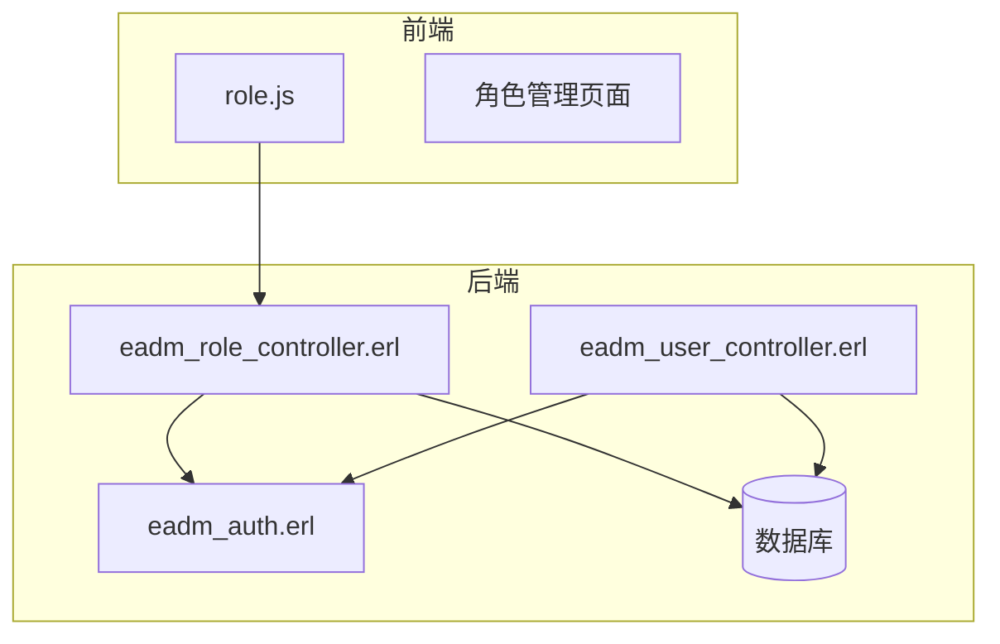
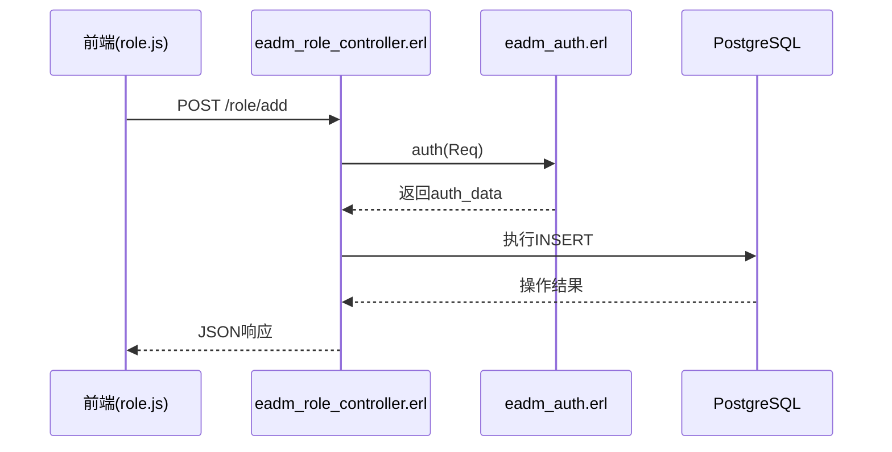
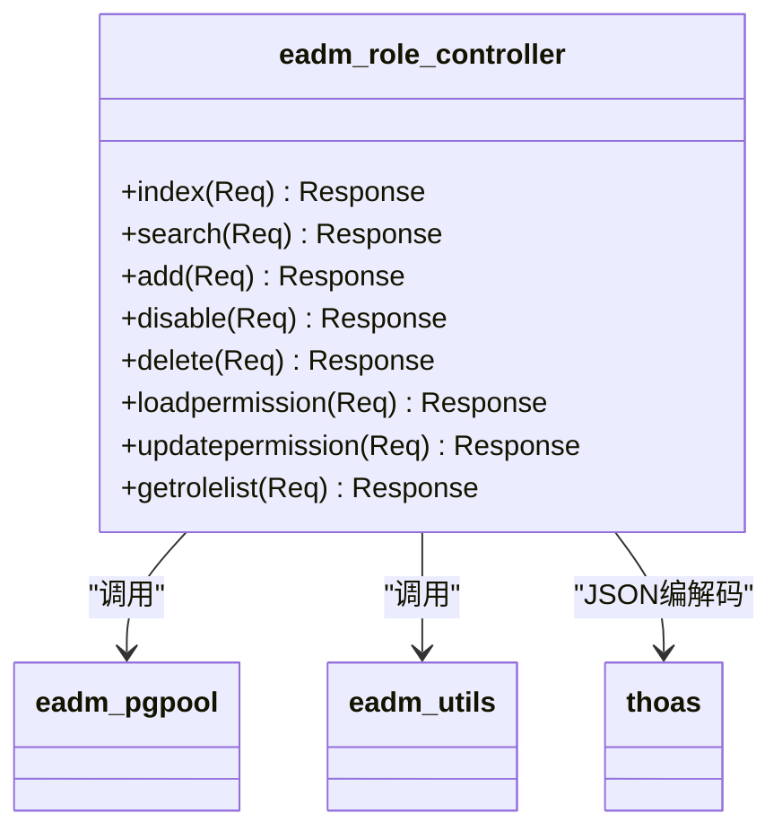
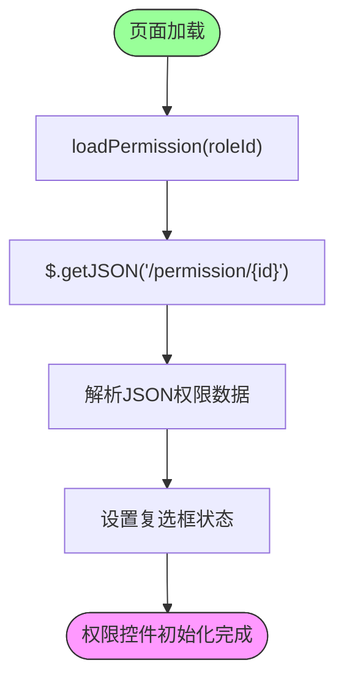
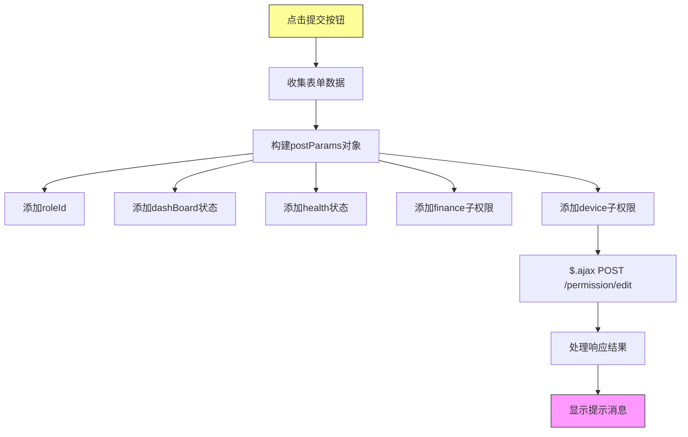
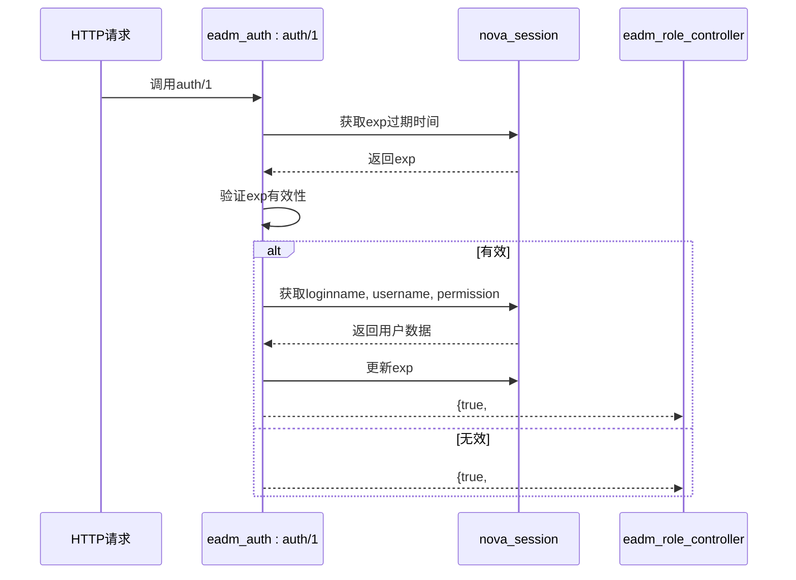
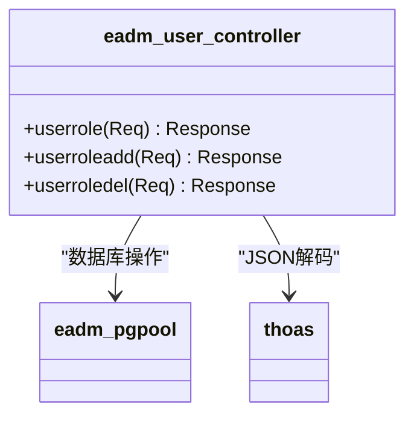
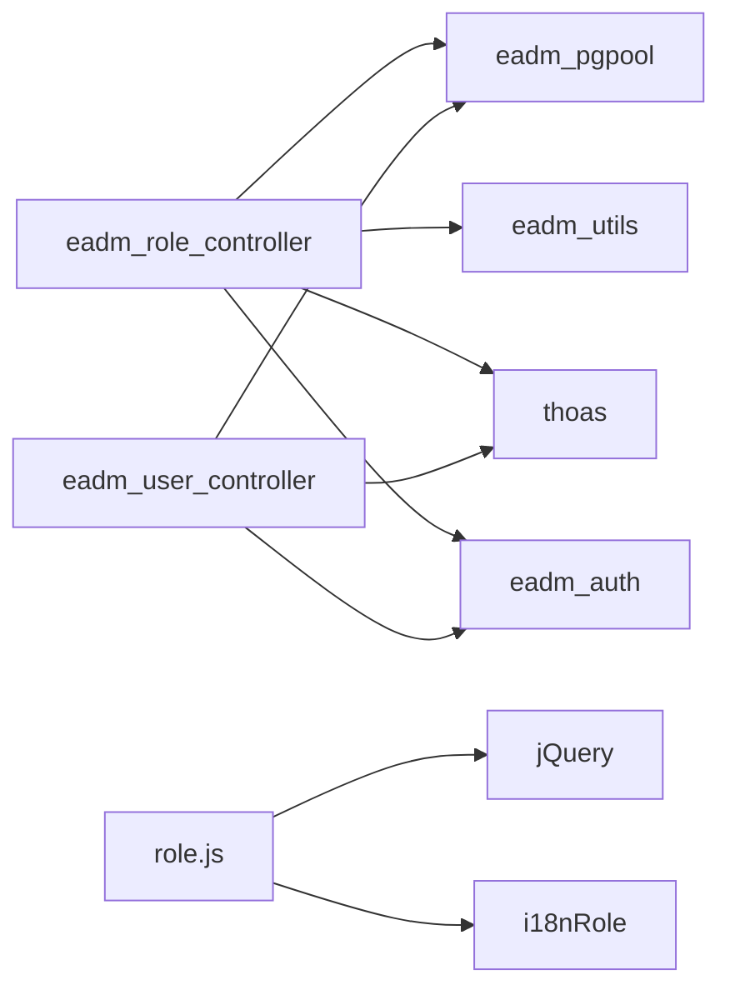

# 角色权限模块

<cite>
**本文档引用的文件**  
- [eadm_role_controller.erl](file://src/controllers/eadm_role_controller.erl)
- [role.js](file://priv/assets/js/role.js)
- [eadm_auth.erl](file://src/eadm_auth.erl)
- [eadm_user_controller.erl](file://src/controllers/eadm_user_controller.erl)
- [datastruct.sql](file://script/kingbase/datastruct.sql)
</cite>

## 目录
1. [简介](#简介)
2. [项目结构](#项目结构)
3. [核心组件](#核心组件)
4. [架构概述](#架构概述)
5. [详细组件分析](#详细组件分析)
6. [依赖分析](#依赖分析)
7. [性能考虑](#性能考虑)
8. [故障排除指南](#故障排除指南)
9. [结论](#结论)

## 简介
本模块实现基于角色的访问控制（RBAC）系统，支持角色的增删改查、权限分配与用户-角色绑定。系统通过中间表维护多对多关系，前端使用树形控件实现权限可视化配置，并通过会话机制实现权限判断。

## 项目结构
角色权限模块由后端Erlang控制器、前端JavaScript脚本、数据库表结构及权限验证服务构成，形成完整的权限管理体系。

**Diagram sources**  
- [role.js](file://priv/assets/js/role.js)
- [eadm_role_controller.erl](file://src/controllers/eadm_role_controller.erl)
- [eadm_auth.erl](file://src/eadm_auth.erl)
- [eadm_user_controller.erl](file://src/controllers/eadm_user_controller.erl)

**Section sources**  
- [eadm_role_controller.erl](file://src/controllers/eadm_role_controller.erl)
- [role.js](file://priv/assets/js/role.js)

## 核心组件
模块核心包括角色管理控制器、权限树形控件、用户-角色绑定逻辑及权限验证服务，共同实现细粒度访问控制。

**Section sources**  
- [eadm_role_controller.erl](file://src/controllers/eadm_role_controller.erl#L1-L247)
- [role.js](file://priv/assets/js/role.js#L1-L264)

## 架构概述
系统采用前后端分离架构，前端通过AJAX调用后端REST API完成角色与权限管理操作，所有请求均经过统一鉴权服务验证。

**Diagram sources**  
- [eadm_role_controller.erl](file://src/controllers/eadm_role_controller.erl#L1-L247)
- [eadm_auth.erl](file://src/eadm_auth.erl#L1-L48)
- [role.js](file://priv/assets/js/role.js#L1-L264)

## 详细组件分析

### 角色权限控制器分析
`eadm_role_controller.erl` 实现角色全生命周期管理及权限分配功能，所有接口均需通过用户管理权限校验。

#### API接口设计

**Diagram sources**  
- [eadm_role_controller.erl](file://src/controllers/eadm_role_controller.erl#L1-L247)

**Section sources**  
- [eadm_role_controller.erl](file://src/controllers/eadm_role_controller.erl#L1-L247)

### 前端权限控件分析
`role.js` 实现权限树形控件的初始化与数据交互逻辑，通过AJAX与后端通信完成权限配置。

#### 权限树初始化流程

**Diagram sources**  
- [role.js](file://priv/assets/js/role.js#L1-L264)

#### 表单提交数据组装

**Diagram sources**  
- [role.js](file://priv/assets/js/role.js#L1-L264)

**Section sources**  
- [role.js](file://priv/assets/js/role.js#L1-L264)

### 权限验证机制分析
`eadm_auth.erl` 提供统一鉴权服务，通过会话管理用户认证状态与权限信息。

#### 鉴权流程

**Diagram sources**  
- [eadm_auth.erl](file://src/eadm_auth.erl#L1-L48)

**Section sources**  
- [eadm_auth.erl](file://src/eadm_auth.erl#L1-L48)

### 用户-角色关联分析
`eadm_user_controller.erl` 实现用户与角色的绑定管理，维护用户-角色映射关系。

#### 用户角色管理接口

**Diagram sources**  
- [eadm_user_controller.erl](file://src/controllers/eadm_user_controller.erl#L1-L480)

**Section sources**  
- [eadm_user_controller.erl](file://src/controllers/eadm_user_controller.erl#L1-L480)

## 依赖分析
模块依赖数据库持久化、会话管理、JSON编解码等核心服务，形成完整的权限管理生态。

**Diagram sources**  
- [eadm_role_controller.erl](file://src/controllers/eadm_role_controller.erl#L1-L247)
- [role.js](file://priv/assets/js/role.js#L1-L264)
- [eadm_user_controller.erl](file://src/controllers/eadm_user_controller.erl#L1-L480)

**Section sources**  
- [eadm_role_controller.erl](file://src/controllers/eadm_role_controller.erl#L1-L247)
- [role.js](file://priv/assets/js/role.js#L1-L264)
- [eadm_user_controller.erl](file://src/controllers/eadm_user_controller.erl#L1-L480)

## 性能考虑
- 所有数据库查询使用连接池（pool_pg）提高并发性能
- 权限数据在用户登录时加载到会话，避免重复查询
- 前端使用DataTable插件实现高效表格渲染
- JSON编解码使用高效thoas库

## 故障排除指南
### 权限更新后界面显示不一致
**问题原因**：权限变更后会话中的权限缓存未同步更新  
**解决方案**：
1. 清除浏览器会话并重新登录
2. 或重启应用服务使所有会话失效
3. 检查`eadm_auth:auth/1`中权限更新逻辑

### 角色分配失败
**问题原因**：用户-角色中间表插入异常  
**排查步骤**：
1. 检查`eadm_userroleadd/1`函数日志
2. 验证数据库`eadm_userrole`表结构
3. 确认传入的userId和roleId有效性

### 权限树无法加载
**问题原因**：权限数据查询接口返回异常  
**处理方法**：
1. 检查`loadpermission/1`控制器逻辑
2. 验证数据库`eadm_role`表中rolepermission字段JSON格式
3. 确认roleId参数传递正确

**Section sources**  
- [eadm_role_controller.erl](file://src/controllers/eadm_role_controller.erl#L1-L247)
- [role.js](file://priv/assets/js/role.js#L1-L264)
- [eadm_user_controller.erl](file://src/controllers/eadm_user_controller.erl#L1-L480)

## 结论
本角色权限模块实现了完整的RBAC权限管理体系，通过前后端协同工作，支持细粒度的权限控制。建议在生产环境中定期清理过期会话，确保权限变更及时生效，并通过日志监控关键操作，保障系统安全稳定运行。