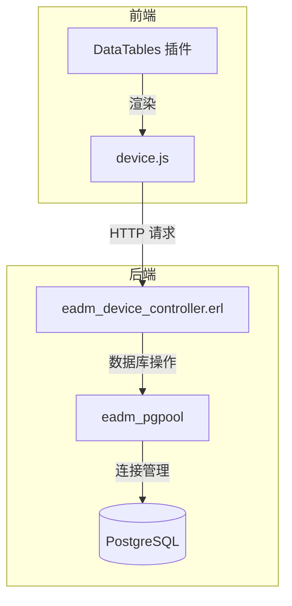
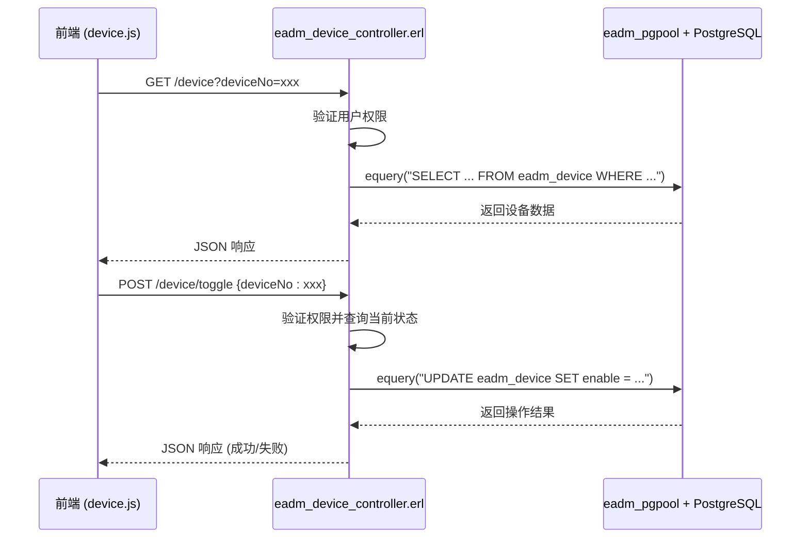
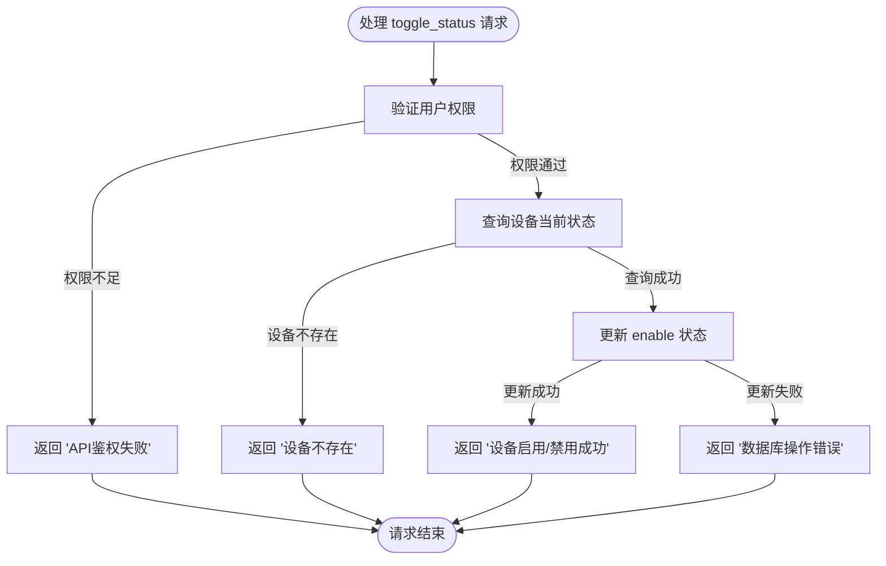
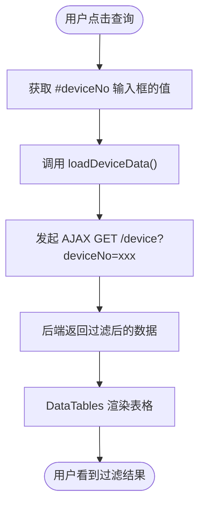
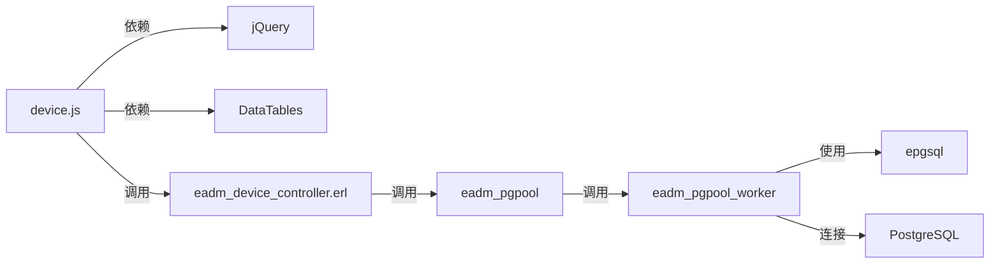

# 设备管理模块

<cite>
**本文档引用的文件**
- [eadm_device_controller.erl](file://src/controllers/eadm_device_controller.erl)
- [device.js](file://priv/assets/js/device.js)
- [eadm_pgpool.erl](file://src/eadm_pgpool.erl)
- [eadm_pgpool_worker.erl](file://src/eadm_pgpool_worker.erl)
</cite>

## 目录
1. [简介](#简介)
2. [项目结构](#项目结构)
3. [核心组件](#核心组件)
4. [架构概览](#架构概览)
5. [详细组件分析](#详细组件分析)
6. [依赖分析](#依赖分析)
7. [性能考虑](#性能考虑)
8. [故障排查指南](#故障排查指南)
9. [结论](#结论)

## 简介
本技术文档详细描述了设备管理模块的核心功能，包括设备信息的采集、展示与状态更新机制。文档重点分析了后端 `eadm_device_controller.erl` 如何处理设备注册、状态上报及数据库持久化操作，以及前端 `device.js` 如何实现设备状态轮询、列表渲染和过滤逻辑。同时，文档还说明了设备上线/离线判断机制、SQL 查询构建方式与性能优化策略，并为运维人员提供了故障排查指引。

## 项目结构
设备管理模块由前端 JavaScript 文件和后端 Erlang 控制器组成，通过 REST API 进行通信，数据持久化至 PostgreSQL 数据库。

**Diagram sources**
- [device.js](file://priv/assets/js/device.js)
- [eadm_device_controller.erl](file://src/controllers/eadm_device_controller.erl)
- [eadm_pgpool.erl](file://src/eadm_pgpool.erl)

**Section sources**
- [device.js](file://priv/assets/js/device.js)
- [eadm_device_controller.erl](file://src/controllers/eadm_device_controller.erl)

## 核心组件
本模块的核心组件包括：
- **`eadm_device_controller.erl`**：处理所有设备相关的 HTTP 请求，实现业务逻辑与数据库交互。
- **`device.js`**：前端逻辑，负责用户界面交互、数据获取与展示。
- **`eadm_pgpool`**：数据库连接池管理，提供安全、高效的数据库操作接口。

**Section sources**
- [eadm_device_controller.erl](file://src/controllers/eadm_device_controller.erl#L1-L389)
- [device.js](file://priv/assets/js/device.js#L1-L809)
- [eadm_pgpool.erl](file://src/eadm_pgpool.erl#L1-L147)

## 架构概览
系统采用典型的前后端分离架构。前端通过 AJAX 调用后端提供的 RESTful API。后端控制器接收请求，进行权限验证后，通过 `eadm_pgpool` 模块执行 SQL 语句与数据库交互，并将结果以 JSON 格式返回给前端。

**Diagram sources**
- [device.js](file://priv/assets/js/device.js#L1-L809)
- [eadm_device_controller.erl](file://src/controllers/eadm_device_controller.erl#L1-L389)

## 详细组件分析

### 后端控制器分析
`eadm_device_controller.erl` 模块是设备管理的后端核心，它导出了多个函数来处理不同的 HTTP 请求。

#### 设备注册与状态更新
控制器通过 `add/1` 和 `edit/1` 函数处理设备的添加和编辑。在执行数据库操作前，会先检查设备号是否已存在，以防止重复。状态更新（启用/禁用）由 `toggle_status/1` 函数处理，该函数首先查询设备当前的 `enable` 状态，然后将其取反并更新到数据库。

**Diagram sources**
- [eadm_device_controller.erl](file://src/controllers/eadm_device_controller.erl#L200-L290)

**Section sources**
- [eadm_device_controller.erl](file://src/controllers/eadm_device_controller.erl#L1-L389)

### 前端交互分析
`device.js` 文件负责前端的所有交互逻辑，它利用 jQuery 和 DataTables 插件来构建动态的设备管理界面。

#### 设备状态轮询与展示
前端通过 `loadDeviceData()` 函数实现设备列表的加载和刷新。该函数向 `/device` 接口发起 GET 请求，获取设备数据后，使用 DataTables 插件的 `clear().rows.add().draw()` 方法高效地渲染表格。表格中的“状态”列通过 `render` 函数将布尔值 `true/false` 转换为“启用/禁用”的标签。

#### 状态过滤逻辑
前端本身不直接进行数据过滤，而是通过修改查询参数来实现。当用户在搜索框中输入设备号并点击“查询”按钮时，`loadDeviceData()` 函数会将 `deviceNo` 参数发送给后端。后端控制器的 `search/1` 函数根据此参数构建 SQL 查询，从而实现服务端的数据过滤。

**Diagram sources**
- [device.js](file://priv/assets/js/device.js#L1-L809)

**Section sources**
- [device.js](file://priv/assets/js/device.js#L1-L809)

## 依赖分析
设备管理模块的正常运行依赖于多个内部和外部组件。

**Diagram sources**
- [device.js](file://priv/assets/js/device.js)
- [eadm_device_controller.erl](file://src/controllers/eadm_device_controller.erl)
- [eadm_pgpool.erl](file://src/eadm_pgpool.erl)
- [eadm_pgpool_worker.erl](file://src/eadm_pgpool_worker.erl)

**Section sources**
- [eadm_pgpool.erl](file://src/eadm_pgpool.erl#L1-L147)
- [eadm_pgpool_worker.erl](file://src/eadm_pgpool_worker.erl#L1-L246)

## 性能考虑
为了确保系统的高效运行，代码中采用了多项性能优化措施。

- **数据库连接池**：通过 `eadm_pgpool` 和 `eadm_pgpool_worker` 模块，系统使用了连接池技术，避免了频繁创建和销毁数据库连接的开销。
- **预编译 SQL 查询**：后端使用 `equery/3` 函数执行参数化查询，这有助于数据库对 SQL 语句进行预编译和缓存，提高查询效率。
- **前端数据渲染优化**：前端使用 DataTables 的 `deferRender: true` 选项，延迟渲染大量数据，提升页面加载速度。
- **索引使用**：虽然代码中未直接体现，但根据 SQL 查询条件（如 `WHERE deviceno = $1`），数据库表 `eadm_device` 的 `deviceno` 字段应建立索引以加速查询。

## 故障排查指南
当设备状态未按预期更新时，运维人员应按照以下步骤进行排查：

1.  **检查前端日志**：打开浏览器开发者工具，查看 `device.js` 发起的 AJAX 请求是否成功。检查请求的 URL、参数和响应状态码（如 403 权限错误、500 服务器错误）。
2.  **检查后端日志**：查看 Erlang 应用的日志文件（通常由 `lager` 库生成）。搜索关键词如 `"设备状态切换失败"`、`"数据库连接失败"` 或 `"系统内部错误"`，这些日志会明确指出错误原因。
3.  **验证数据库连接**：确认 `eadm_pgpool` 是否能成功连接到 PostgreSQL 数据库。检查数据库服务是否运行，以及连接配置（host, port, database, username）是否正确。
4.  **检查数据库状态**：直接连接数据库，查询 `eadm_device` 表，确认目标设备的记录是否存在，以及 `enable` 字段的值是否正确。
5.  **检查服务进程**：确保 Erlang 应用进程正在运行。可以使用 `ps` 或 `top` 命令查看相关进程。

**Section sources**
- [eadm_device_controller.erl](file://src/controllers/eadm_device_controller.erl#L200-L290)
- [device.js](file://priv/assets/js/device.js#L700-L809)

## 结论
设备管理模块实现了完整的设备生命周期管理功能。后端通过清晰的 Erlang 模块处理业务逻辑和数据持久化，前端通过 JavaScript 实现了友好的用户交互。系统架构清晰，依赖明确，并具备基本的性能优化和错误处理能力。通过遵循本文档的故障排查指南，运维人员可以快速定位和解决常见问题。