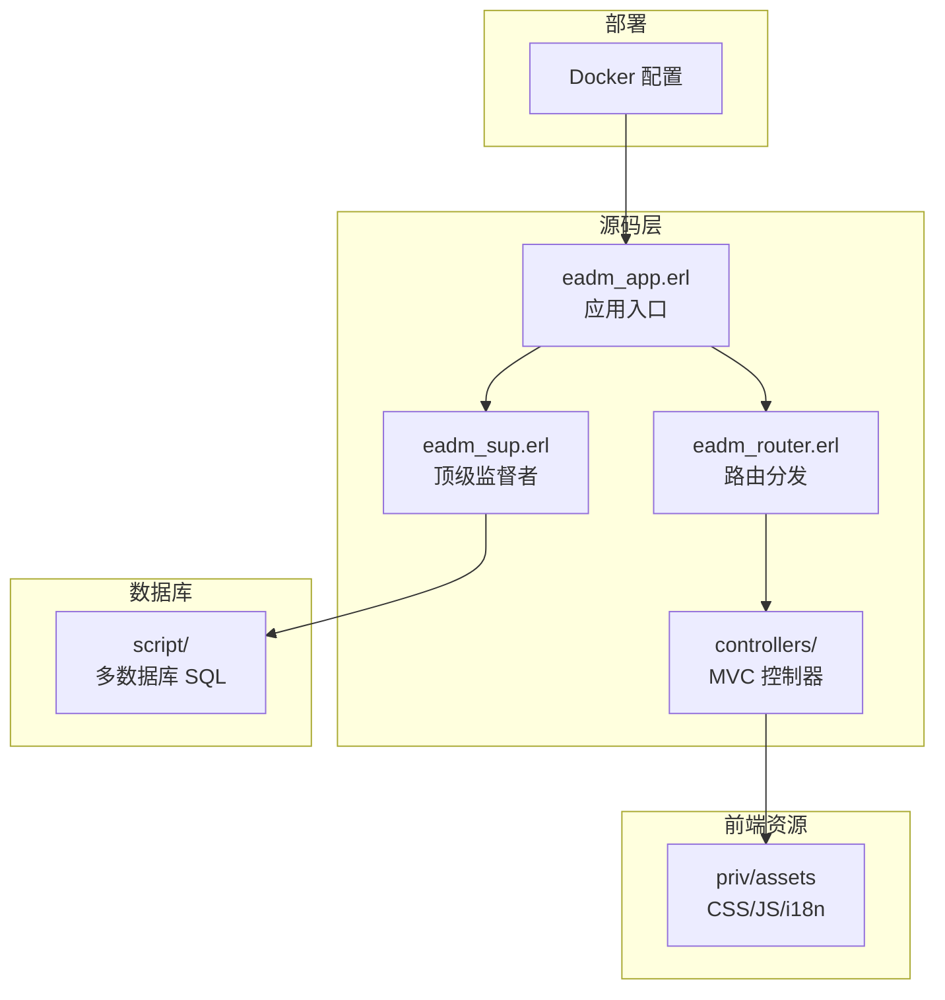
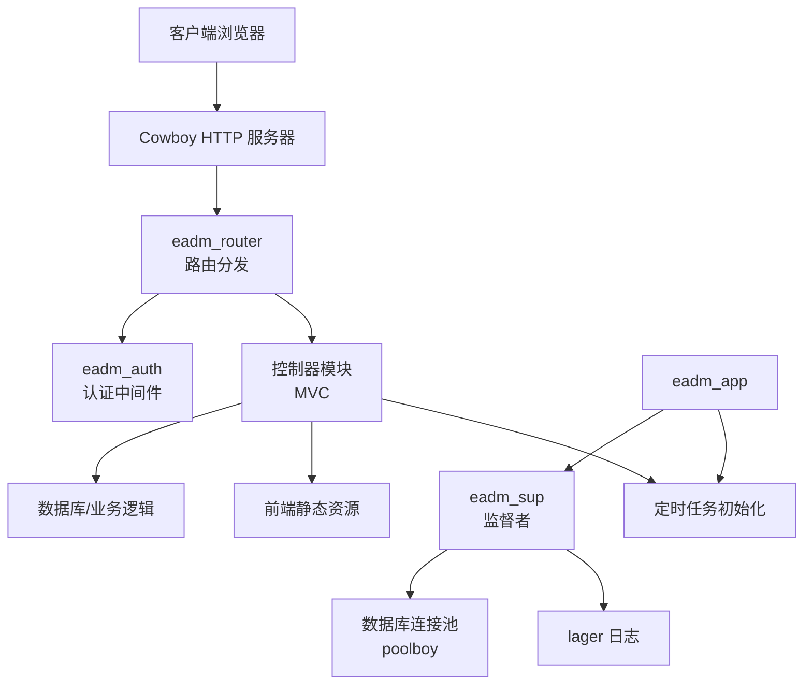
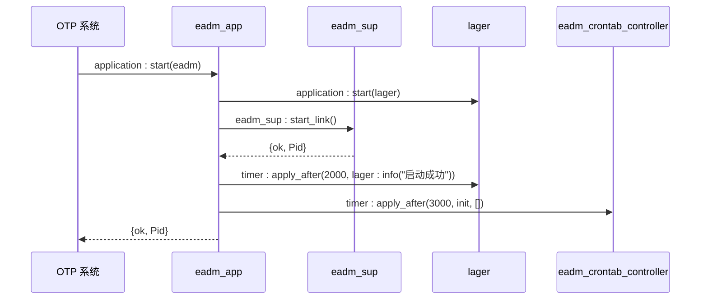
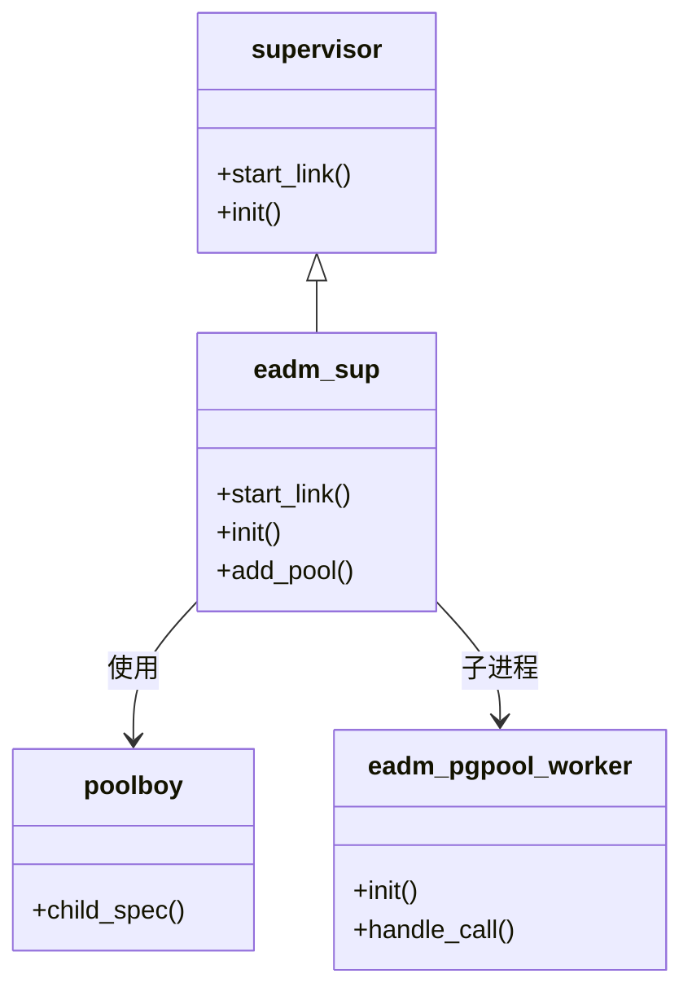
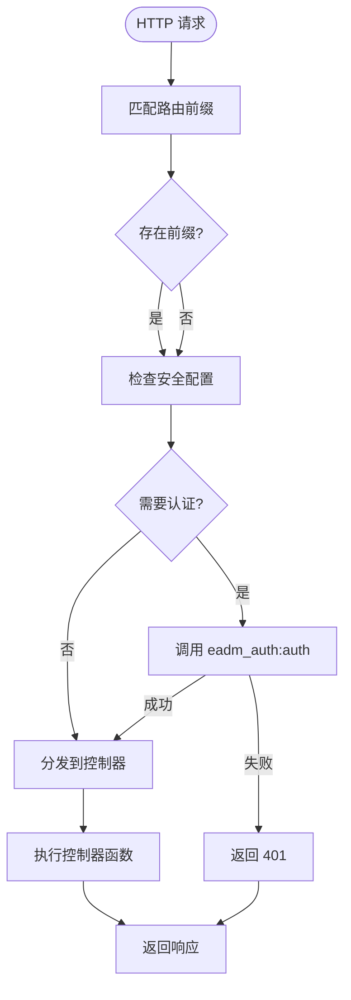
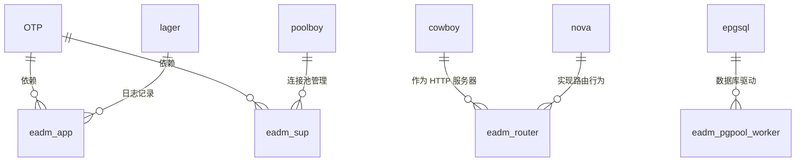

# 系统概述

<cite>
**本文档引用文件**  
- [eadm_app.erl](file://src/eadm_app.erl)
- [eadm_sup.erl](file://src/eadm_sup.erl)
- [eadm_router.erl](file://src/eadm_router.erl)
- [README.md](file://README.md)
- [priv/assets](file://priv/assets)
</cite>

## 目录
1. [简介](#简介)
2. [项目结构](#项目结构)
3. [核心组件](#核心组件)
4. [架构概览](#架构概览)
5. [详细组件分析](#详细组件分析)
6. [依赖分析](#依赖分析)
7. [性能考量](#性能考量)
8. [故障排除指南](#故障排除指南)
9. [结论](#结论)

## 简介
eadm 是一个基于 Erlang/OTP 构建的企业级全栈后台管理系统，旨在提供高可用、可扩展的管理端服务。系统采用 MVC 设计模式组织业务逻辑，并结合 OTP 监督树机制保障服务稳定性。后端使用 Cowboy 作为 HTTP 服务器，通过 Nova 框架实现路由分发，前端则由静态资源（CSS、JS、i18n）构成，支持多语言与响应式界面。系统适用于需要高并发、高可靠性的企业级后台管理场景，如设备管理、财务管理、健康监控、定时任务调度等。

**Section sources**  
- [README.md](file://README.md#L0-L2)

## 项目结构
项目采用典型的 Erlang 应用结构，分为源码、静态资源、数据库脚本和部署配置四大模块：

- `src/`：Erlang 源码目录，包含应用启动、监督者、路由及各控制器模块
- `priv/assets/`：前端静态资源，包括 CSS、JS、国际化脚本和组件样式
- `script/`：多数据库支持的 SQL 脚本（MySQL、PostgreSQL、Oracle、Kingbase 等）
- `docker/` 和 `Dockerfile`：容器化部署支持
- `release/`：发布脚本

该结构体现了前后端分离的设计理念，后端专注业务逻辑与服务稳定性，前端通过静态资源提供用户界面。

**Diagram sources**  
- [src/eadm_app.erl](file://src/eadm_app.erl#L1-L55)
- [src/eadm_sup.erl](file://src/eadm_sup.erl#L1-L61)
- [src/eadm_router.erl](file://src/eadm_router.erl#L1-L164)
- [priv/assets](file://priv/assets)

**Section sources**  
- [src/eadm_app.erl](file://src/eadm_app.erl#L1-L55)
- [src/eadm_sup.erl](file://src/eadm_sup.erl#L1-L61)
- [src/eadm_router.erl](file://src/eadm_router.erl#L1-L164)
- [priv/assets](file://priv/assets)

## 核心组件
系统核心由三大组件构成：应用启动模块（`eadm_app`）、监督者（`eadm_sup`）和路由模块（`eadm_router`）。`eadm_app:start/2` 启动应用并初始化监督树；`eadm_sup` 负责管理子进程，包括数据库连接池；`eadm_router` 定义所有 HTTP 路由规则，实现请求分发。这些组件共同构成了系统的运行基础。

**Section sources**  
- [src/eadm_app.erl](file://src/eadm_app.erl#L1-L55)
- [src/eadm_sup.erl](file://src/eadm_sup.erl#L1-L61)
- [src/eadm_router.erl](file://src/eadm_router.erl#L1-L164)

## 架构概览
eadm 采用分层架构，结合 OTP 监督树与 MVC 模式，确保系统稳定与可维护性。

**Diagram sources**  
- [src/eadm_app.erl](file://src/eadm_app.erl#L1-L55)
- [src/eadm_sup.erl](file://src/eadm_sup.erl#L1-L61)
- [src/eadm_router.erl](file://src/eadm_router.erl#L1-L164)

## 详细组件分析

### 应用启动流程分析
`eadm_app:start/2` 是系统启动的入口函数。当应用通过 `application:start/2` 启动时，该函数被调用，其主要职责是启动顶级监督者 `eadm_sup`，并安排后续初始化任务。

**Diagram sources**  
- [src/eadm_app.erl](file://src/eadm_app.erl#L15-L30)

**Section sources**  
- [src/eadm_app.erl](file://src/eadm_app.erl#L1-L55)

### 监督者树构建分析
`eadm_sup` 是系统的顶级监督者，采用 `one_for_one` 策略管理子进程。它在 `init/1` 中动态读取配置中的数据库连接池参数，并使用 `poolboy` 创建连接池子进程。这种设计实现了数据库资源的动态管理与故障隔离。

**Diagram sources**  
- [src/eadm_sup.erl](file://src/eadm_sup.erl#L1-L61)

**Section sources**  
- [src/eadm_sup.erl](file://src/eadm_sup.erl#L1-L61)

### 路由分发机制分析
`eadm_router` 实现了基于 `nova_router` 行为的路由配置。系统定义了多个路由组，每个组包含前缀、安全认证和具体路由规则。例如，`/user`、`/device` 等路径均受 `eadm_auth:auth` 认证保护，而 `/login` 和 `/api/watch` 则无需认证。

**Diagram sources**  
- [src/eadm_router.erl](file://src/eadm_router.erl#L1-L164)

**Section sources**  
- [src/eadm_router.erl](file://src/eadm_router.erl#L1-L164)

## 依赖分析
系统依赖主要分为三类：

1. **OTP 框架**：`application`、`supervisor` 行为，保障应用生命周期与进程管理
2. **第三方库**：`cowboy`（HTTP 服务器）、`nova`（Web 框架）、`lager`（日志）、`poolboy`（连接池）
3. **数据库驱动**：`epgsql`，用于 PostgreSQL 兼容数据库连接

**Diagram sources**  
- [src/eadm_app.erl](file://src/eadm_app.erl#L1-L55)
- [src/eadm_sup.erl](file://src/eadm_sup.erl#L1-L61)
- [src/eadm_router.erl](file://src/eadm_router.erl#L1-L164)

**Section sources**  
- [src/eadm_app.erl](file://src/eadm_app.erl#L1-L55)
- [src/eadm_sup.erl](file://src/eadm_sup.erl#L1-L61)
- [src/eadm_router.erl](file://src/eadm_router.erl#L1-L164)

## 性能考量
系统通过 OTP 监督树实现进程隔离与自动恢复，保障高可用性。使用 `poolboy` 管理数据库连接池，避免频繁创建连接带来的性能开销。异步定时任务初始化（`timer:apply_after`）避免阻塞启动流程。选择 Cowboy 作为 HTTP 服务器，因其在高并发场景下的卓越性能表现。

## 故障排除指南
常见问题包括：
- 启动失败：检查 `sys.config` 中数据库配置与 `epgsql` 环境变量
- 路由无法访问：确认 `eadm_router:routes/1` 中定义的路径与方法
- 认证失败：检查 `eadm_auth:auth` 实现与会话管理
- 数据库连接超时：调整 `poolboy` 连接池大小与超时设置

**Section sources**  
- [src/eadm_app.erl](file://src/eadm_app.erl#L1-L55)
- [src/eadm_sup.erl](file://src/eadm_sup.erl#L1-L61)
- [src/eadm_router.erl](file://src/eadm_router.erl#L1-L164)

## 结论
eadm 是一个结构清晰、稳定性强的企业级后台系统。通过 OTP 监督树、MVC 模式与 Cowboy 高性能服务器的结合，实现了高可用、易维护的架构设计。系统支持多数据库、多语言，适用于复杂的企业管理场景。未来可进一步集成监控、微服务治理等能力，提升系统可观测性与扩展性。