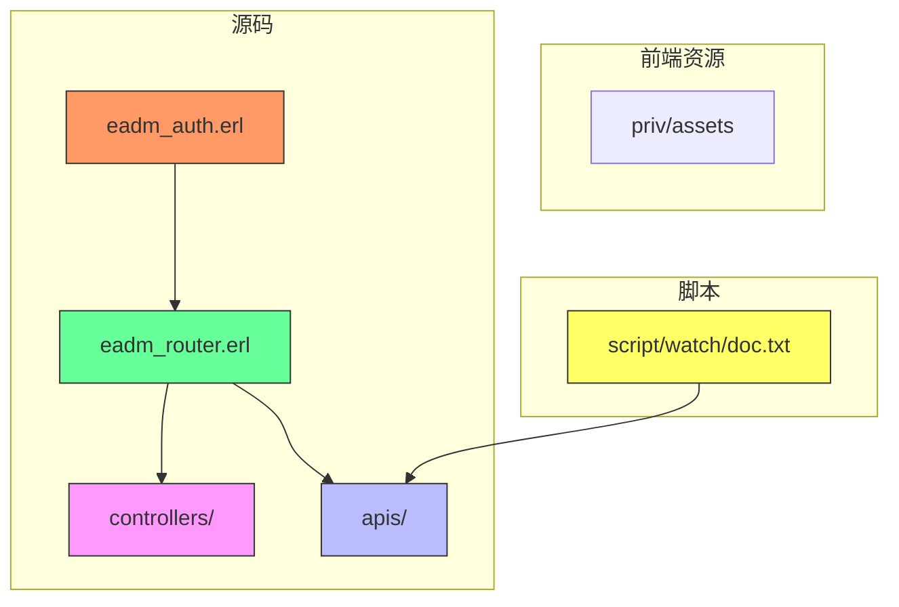
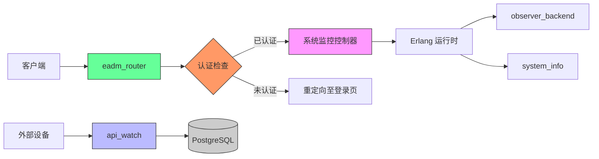
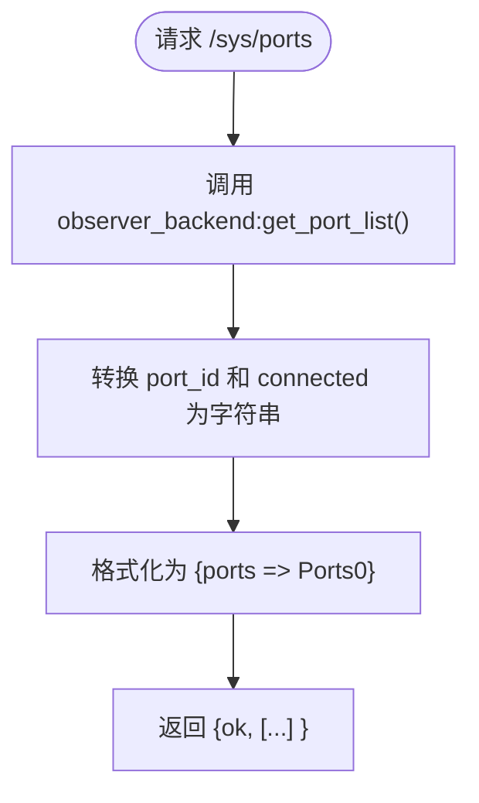
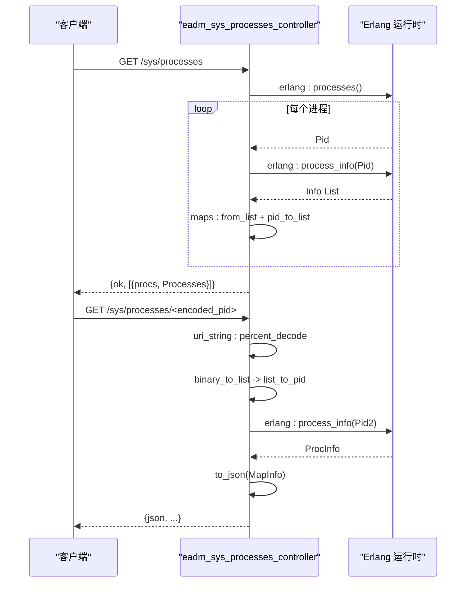
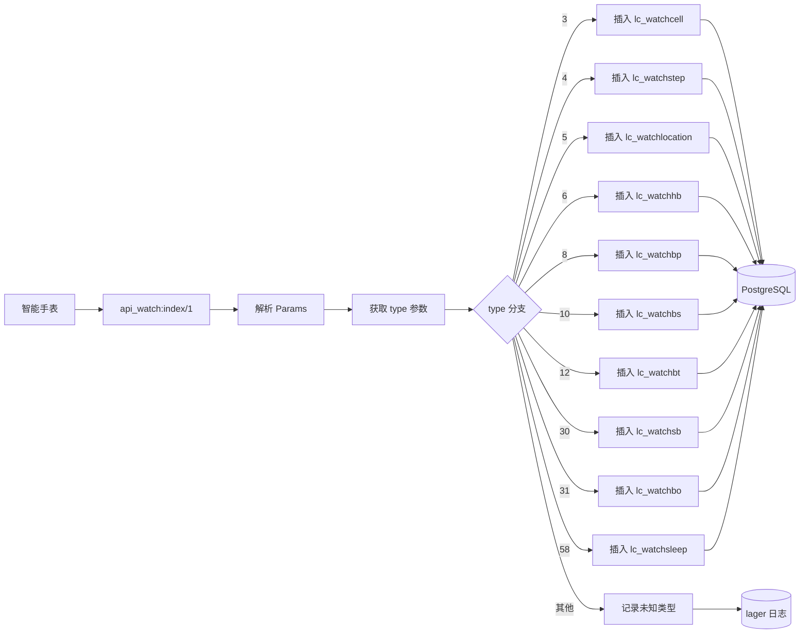
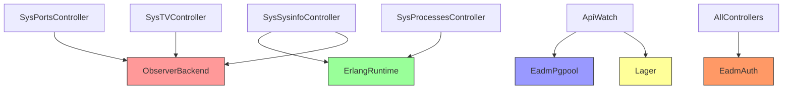

# 系统监控模块

<cite>
**本文档引用的文件**  
- [eadm_sys_ports_controller.erl](file://src/controllers/eadm_sys_ports_controller.erl)
- [eadm_sys_processes_controller.erl](file://src/controllers/eadm_sys_processes_controller.erl)
- [eadm_sys_sysinfo_controller.erl](file://src/controllers/eadm_sys_sysinfo_controller.erl)
- [eadm_sys_tv_controller.erl](file://src/controllers/eadm_sys_tv_controller.erl)
- [api_watch.erl](file://src/apis/api_watch.erl)
- [eadm_auth.erl](file://src/eadm_auth.erl)
- [eadm_router.erl](file://src/eadm_router.erl)
- [doc.txt](file://script/watch/doc.txt)
</cite>

## 目录
1. [简介](#简介)
2. [项目结构](#项目结构)
3. [核心组件](#核心组件)
4. [架构概览](#架构概览)
5. [详细组件分析](#详细组件分析)
6. [依赖分析](#依赖分析)
7. [性能考虑](#性能考虑)
8. [故障排除指南](#故障排除指南)
9. [结论](#结论)

## 简介
本系统监控模块为 `eadm` 提供了全面的服务器级监控能力，涵盖端口、进程、系统信息及 TV 控制状态等关键指标。通过一系列控制器（如 `eadm_sys_ports_controller`、`eadm_sys_processes_controller`）暴露内部运行状态，并结合安全认证机制保障访问安全。同时，`api_watch.erl` 模块提供外部探针接口，用于接收智能手表设备上传的健康与定位数据，支持多种类型的数据采集与告警通知。本文档旨在为运维人员提供完整的监控配置与使用指南，帮助其有效保障系统稳定性。

## 项目结构
系统采用典型的 Erlang/OTP 架构，模块化组织清晰。核心监控功能位于 `src/controllers` 目录下的系统控制器中，API 接口定义在 `src/apis` 中，路由由 `eadm_router.erl` 统一管理，安全认证通过 `eadm_auth.erl` 实现。外部探针数据文档存于 `script/watch/doc.txt`。



**图示来源**  
- [eadm_router.erl](file://src/eadm_router.erl#L1-L165)
- [eadm_auth.erl](file://src/eadm_auth.erl#L1-L49)

**本节来源**  
- [eadm_router.erl](file://src/eadm_router.erl#L1-L165)
- [project_structure](file://#L1-L100)

## 核心组件
系统监控功能由多个专用控制器实现，分别负责收集和暴露不同类型的系统信息。所有监控接口均受统一认证机制保护，确保仅授权用户可访问敏感数据。`api_watch.erl` 则作为外部数据接入点，接收并处理来自智能设备的实时数据流。

**本节来源**  
- [eadm_sys_ports_controller.erl](file://src/controllers/eadm_sys_ports_controller.erl#L1-L35)
- [eadm_sys_processes_controller.erl](file://src/controllers/eadm_sys_processes_controller.erl#L1-L49)
- [eadm_sys_sysinfo_controller.erl](file://src/controllers/eadm_sys_sysinfo_controller.erl#L1-L149)
- [api_watch.erl](file://src/apis/api_watch.erl#L1-L497)

## 架构概览
整个监控体系基于 RESTful 风格设计，通过 `eadm_router.erl` 定义的路由规则将 HTTP 请求分发至对应的控制器处理。系统内部利用 Erlang 原生函数（如 `erlang:system_info/1`、`observer_backend` 模块）获取运行时状态，并通过 JSON 格式返回给客户端。外部探针接口独立开放，无需认证即可接收设备上报数据。



**图示来源**  
- [eadm_router.erl](file://src/eadm_router.erl#L1-L165)
- [eadm_auth.erl](file://src/eadm_auth.erl#L1-L49)
- [eadm_sys_sysinfo_controller.erl](file://src/controllers/eadm_sys_sysinfo_controller.erl#L1-L149)

## 详细组件分析

### 系统端口监控分析
`eadm_sys_ports_controller` 负责暴露当前 Erlang 节点的所有端口信息。它调用 `observer_backend:get_port_list()` 获取原始数据，并将 `port_id` 和 `connected` 进程转换为可读字符串格式，便于前端展示。



**图示来源**  
- [eadm_sys_ports_controller.erl](file://src/controllers/eadm_sys_ports_controller.erl#L1-L35)

**本节来源**  
- [eadm_sys_ports_controller.erl](file://src/controllers/eadm_sys_ports_controller.erl#L1-L35)

### 系统进程监控分析
`eadm_sys_processes_controller` 提供两种接口：`index/1` 返回所有进程的基本信息（如内存使用、消息队列长度），`process_info/1` 可查询指定 PID 的详细信息。该模块直接使用 `erlang:processes()` 和 `erlang:process_info/1` 获取数据，并通过 URL 参数传递 PID（需 URL 解码）。



**图示来源**  
- [eadm_sys_processes_controller.erl](file://src/controllers/eadm_sys_processes_controller.erl#L1-L49)

**本节来源**  
- [eadm_sys_processes_controller.erl](file://src/controllers/eadm_sys_processes_controller.erl#L1-L49)

### 系统信息监控分析
`eadm_sys_sysinfo_controller` 收集全面的系统运行指标，包括 OTP 版本、调度器状态、内存使用、IO 统计等。`index/1` 函数整合 `erlang:system_info/1` 和 `erlang:memory/1` 的输出，并附加运行时间。`route_table/1` 则展示当前路由树结构，用于调试。

```mermaid
classDiagram
class eadm_sys_sysinfo_controller {
+index(Req) : {ok, SysInfo}
+route_table(Req) : {ok, Routes}
-flatten_routes(Tree) : List
-to_string(Segment) : Binary
}
class observer_backend {
+get_port_list() : List
+get_table_list(Type, Opts) : List
}
class erlang {
+system_info(Key) : Term
+memory(Key) : Integer
+statistics(wall_clock) : {Time, _}
}
eadm_sys_sysinfo_controller --> observer_backend : 使用
eadm_sys_sysinfo_controller --> erlang : 调用
```

**图示来源**  
- [eadm_sys_sysinfo_controller.erl](file://src/controllers/eadm_sys_sysinfo_controller.erl#L1-L149)

**本节来源**  
- [eadm_sys_sysinfo_controller.erl](file://src/controllers/eadm_sys_sysinfo_controller.erl#L1-L149)

### TV 控制状态监控分析
`eadm_sys_tv_controller` 用于监控 ETS 表状态，调用 `observer_backend:get_table_list(ets, [...])` 获取所有表信息，并将 `owner` 进程和 `id`（如为引用）转换为可读形式。此功能可用于诊断内存泄漏或资源占用问题。

```mermaid
flowchart TD
A[请求 /sys/tables] --> B[调用 get_table_list(ets, options)]
B --> C{遍历每个表}
C --> D[maps:from_list(X)]
D --> E[转换 owner 为 pid_to_list]
E --> F[转换 id: maybe_convert_id]
F --> G{是否为 ignore?}
G --> |是| H[id = ""]
G --> |否| I[id = ref_to_list]
H --> J
I --> J[构建新映射]
J --> K[收集到 Tables0]
K --> L[返回 {ok, [{tables, Tables0}]}]
```

**图示来源**  
- [eadm_sys_tv_controller.erl](file://src/controllers/eadm_sys_tv_controller.erl#L1-L53)

**本节来源**  
- [eadm_sys_tv_controller.erl](file://src/controllers/eadm_sys_tv_controller.erl#L1-L53)

### 外部探针接口分析
`api_watch.erl` 提供 `/api/watch` 接口，接收智能手表上传的各类健康与位置数据。根据 `type` 字段区分数据类型，执行相应的数据库插入操作（使用 `eadm_pgpool:equery`）。支持基站、步数、心率、血压、血糖、体温、血氧、睡眠、定位、电量、蓝牙等多种数据类型，并对异常情况记录日志。



**图示来源**  
- [api_watch.erl](file://src/apis/api_watch.erl#L1-L497)
- [doc.txt](file://script/watch/doc.txt#L1-L143)

**本节来源**  
- [api_watch.erl](file://src/apis/api_watch.erl#L1-L497)
- [doc.txt](file://script/watch/doc.txt#L1-L143)

## 依赖分析
各监控组件高度依赖 Erlang 原生运行时能力及 `observer_backend` 模块获取系统状态。`api_watch.erl` 依赖 `eadm_pgpool` 模块进行数据库操作，并通过 `lager` 记录日志。所有受保护接口均依赖 `eadm_auth.erl` 进行会话验证。



**图示来源**  
- [eadm_sys_ports_controller.erl](file://src/controllers/eadm_sys_ports_controller.erl#L1-L35)
- [eadm_sys_processes_controller.erl](file://src/controllers/eadm_sys_processes_controller.erl#L1-L49)
- [eadm_sys_sysinfo_controller.erl](file://src/controllers/eadm_sys_sysinfo_controller.erl#L1-L149)
- [eadm_sys_tv_controller.erl](file://src/controllers/eadm_sys_tv_controller.erl#L1-L53)
- [api_watch.erl](file://src/apis/api_watch.erl#L1-L497)
- [eadm_auth.erl](file://src/eadm_auth.erl#L1-L49)

**本节来源**  
- [eadm_auth.erl](file://src/eadm_auth.erl#L1-L49)
- [eadm_pgpool.erl](file://src/eadm_pgpool.erl)
- [lager](https://github.com/erlang-lager/lager)

## 性能考虑
- 所有监控接口均为同步调用，可能在高负载下影响响应速度。
- `index/1` 类接口一次性获取全部进程/端口信息，数据量大时可能造成内存压力。
- `api_watch.erl` 对每种数据类型均执行独立数据库插入，建议启用批量写入优化。
- 频繁调用 `erlang:process_info/1` 可能带来轻微性能开销，应避免高频轮询。

## 故障排除指南
- 若无法访问 `/sys/*` 接口，请检查是否已登录且会话未过期。
- 若返回空数据或异常，请查看 `lager` 日志中的错误信息。
- 若 `api_watch` 接口写入失败，检查 PostgreSQL 连接状态及表结构是否匹配。
- 若进程或端口信息不完整，确认 `observer_backend` 模块正常加载。
- 对于 `bin_to_float` 转换错误，确保传入的二进制数据格式正确。

**本节来源**  
- [eadm_auth.erl](file://src/eadm_auth.erl#L1-L49)
- [api_watch.erl](file://src/apis/api_watch.erl#L1-L497)
- [eadm_sys_processes_controller.erl](file://src/controllers/eadm_sys_processes_controller.erl#L1-L49)

## 结论
`eadm` 的系统监控模块提供了强大而灵活的服务器状态观测能力，结合外部探针接口实现了从基础设施到终端设备的全链路监控。通过标准化的控制器设计和安全访问机制，运维人员可以高效地获取系统运行指标，及时发现并处理潜在问题，从而有效保障系统的稳定性和可靠性。