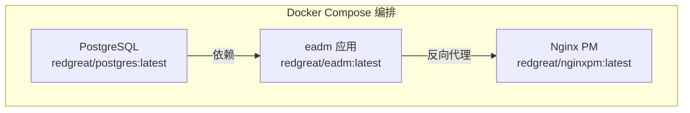

# Docker 部署指南

<cite>
**本文档引用文件**  
- [Dockerfile](file://Dockerfile)
- [docker-compose.yml](file://docker-compose.yml)
- [docker/docker-entrypoint.sh](file://docker/docker-entrypoint.sh)
- [README.Docker.md](file://README.Docker.md)
</cite>

## 目录
1. [简介](#简介)
2. [Dockerfile 多阶段构建解析](#dockerfile-多阶段构建解析)
3. [docker-compose.yml 多服务编排详解](#docker-composeyml-多服务编排详解)
4. [docker-entrypoint.sh 脚本分析](#docker-entrypointsh-脚本分析)
5. [原生命令与 Compose 部署对比](#原生命令与-compose-部署对比)
6. [部署验证步骤](#部署验证步骤)

## 简介
`eadm` 是一个基于 Erlang 开发的个人后台管理系统，采用 Nova 框架（基于 Cowboy）构建 Web 服务，前端使用 Bootstrap 5 与 jQuery。本指南详细说明其 Docker 部署全流程，涵盖镜像构建、容器编排、权限管理与部署验证等关键环节。

## Dockerfile 多阶段构建解析

`Dockerfile` 采用多阶段构建策略，分为构建阶段与运行阶段，确保最终镜像轻量且安全。

### 构建阶段（Erlang 构建镜像）
第一阶段使用 `erlang:27.2.3-alpine` 镜像作为构建环境，其主要职责包括：
- 设置工作目录 `/eadmbuild`
- 复制源码并安装 `git` 工具
- 使用 `rebar3 as prod release` 编译生成发布包（release）

该阶段完成 Erlang 项目的依赖获取、编译与打包，生成位于 `_build/prod/rel/eadm` 的可执行发布版本。

### 运行阶段（Alpine 运行时镜像）
第二阶段基于轻量级 `alpine:3.21` 镜像，仅包含运行所需依赖：
- 安装 `ncurses-libs`、`libgcc`、`libstdc++` 等基础库
- 引入 `dumb-init` 作为 PID 1 初始化进程，正确处理信号与僵尸进程
- 通过 `apk` 安装 `gosu` 实现非 root 用户权限切换
- 从构建阶段复制发布包与入口脚本 `docker-entrypoint.sh`
- 设置卷挂载点 `/opt/eadm` 并暴露服务端口 `8090`
- 配置镜像元数据（LABEL），包含版本、维护者、源码地址等信息
- 指定入口命令：`dumb-init` 启动 `docker-entrypoint.sh` 脚本

此分工模式有效分离构建环境与运行环境，显著减小镜像体积并提升安全性。

**Section sources**
- [Dockerfile](file://Dockerfile#L1-L42)

## docker-compose.yml 多服务编排详解

`docker-compose.yml` 定义了三个核心服务：`postgres`、`eadm` 和 `npm`，实现完整的应用栈编排。

### PostgreSQL 数据库服务配置
- 使用自定义镜像 `redgreat/postgres:latest`
- 设置数据库用户 `user_eadm`、密码 `iyS62bvt` 及数据库名 `eadm`
- 启用 `trust` 认证方式简化本地开发
- 数据持久化通过命名卷 `pgdata` 实现
- 映射端口 `5432:5432` 供外部访问

### eadm 应用容器配置
- 使用镜像 `redgreat/eadm:latest`
- 映射端口 `8080:8090`，将主机 8080 端口转发至容器内服务 8090 端口
- 配置多个卷挂载：
  - 配置文件：`db.config`、`sys.config.src`、`vm.args.src`
  - 日志目录：`./logs/` 挂载至 `/opt/eadm/log/`，支持读写
- 设置环境变量 `DISABLE_IPV6=true`
- 声明依赖 `depends_on: postgres`，确保数据库先于应用启动

### 资源限制与安全配置
- 内存限制：最大使用 1G（`limits.memory: 1G`）
- 内存预留：保证 500M 可用（`reservations.memory: 500M`）
- 禁用内存交换：`mem_swappiness: 0`
- 禁用 OOM 杀手：`oom_kill_disable: true`，防止关键进程被系统终止

### Nginx 反向代理服务（npm）
- 使用 `redgreat/nginxpm:latest` 镜像提供前端代理
- 映射端口 `80:8080`、`8181:8181`、`443:4443`
- 挂载配置目录 `./npmdata:/config:rw`
- 依赖 `eadm` 服务，确保后端就绪后再启动代理



**Diagram sources**
- [docker-compose.yml](file://docker-compose.yml#L1-L58)

**Section sources**
- [docker-compose.yml](file://docker-compose.yml#L1-L58)

## docker-entrypoint.sh 脚本分析

该脚本在容器启动时动态创建非 root 用户并设置权限，确保安全运行。

### 动态用户创建逻辑
- 读取 `db.config` 文件的宿主机用户与组 ID
- 若为 root（UID/GID 为 0），则默认使用 1000
- 检查用户 `eadm` 是否已存在，若不存在则创建：
  - 使用 `addgroup -S -g $GROUP_ID eadm` 创建系统组
  - 使用 `adduser -S -D -u $USER_ID -G eadm eadm` 创建无家目录的系统用户

### 文件权限与目录初始化
- 创建日志目录 `/opt/eadm/log`
- 递归修改 `/opt/eadm` 所有文件归属为 `eadm:eadm`

### 服务启动
- 使用 `gosu eadm` 切换至 `eadm` 用户身份
- 执行 `/opt/eadm/bin/eadm foreground` 以前台模式启动应用
- 结合 `dumb-init` 确保进程信号正确传递与回收

此机制避免了容器以 root 权限运行，符合最小权限原则。

**Section sources**
- [docker/docker-entrypoint.sh](file://docker/docker-entrypoint.sh#L1-L30)

## 原生命令与 Compose 部署对比

### 原生命令部署（docker run）
根据 `README.Docker.md` 提供的命令，手动运行容器：
- 显式指定资源限制（内存、CPU、OOM 策略）
- 挂载配置文件至发布版本目录（`releases/0.1.0/`）
- 映射端口 `8080:8090`
- 使用 `--restart=always` 实现自动重启

优点：灵活控制每个参数；缺点：命令冗长，易出错，难以管理多服务。

### Docker Compose 部署
通过 `docker-compose.yml` 声明式定义所有服务与配置：
- 集中管理多服务依赖与启动顺序
- 配置结构清晰，易于版本控制
- 支持一键启动 `docker-compose up -d`
- 自动处理网络与卷管理

优点：简化部署流程，适合生产环境；缺点：需额外维护 YAML 文件。

两者核心配置一致，Compose 提供更高层次的抽象与自动化。

**Section sources**
- [README.Docker.md](file://README.Docker.md#L1-L31)
- [docker-compose.yml](file://docker-compose.yml#L1-L58)

## 部署验证步骤

完成部署后，执行以下步骤验证服务正常运行：

### 1. 启动服务
```bash
docker-compose up -d
```

### 2. 检查容器状态
```bash
docker-compose ps
```
确认 `postgres`、`eadm`、`npm` 均为 `Up` 状态。

### 3. 检查端口映射
```bash
netstat -tuln | grep -E '8080|5432|80'
```
确认主机端口 `8080`（应用）、`5432`（数据库）、`80`（Nginx）已监听。

### 4. 查看应用日志
```bash
docker logs eadm
```
观察是否有启动成功日志，如 Cowboy 监听 `8090` 端口。

### 5. 访问 Web 界面
浏览器访问 `http://localhost:8080`，应能加载登录页面。

### 6. 验证数据库连接
进入 `eadm` 容器，测试数据库连通性：
```bash
docker exec -it eadm sh
# 在容器内使用 psql 或应用工具连接 PostgreSQL
```

通过以上步骤，可完整验证 `eadm` 的 Docker 部署是否成功。

**Section sources**
- [README.Docker.md](file://README.Docker.md#L1-L31)
- [docker-compose.yml](file://docker-compose.yml#L1-L58)
- [docker/docker-entrypoint.sh](file://docker/docker-entrypoint.sh#L1-L30)
- [Dockerfile](file://Dockerfile#L1-L42)