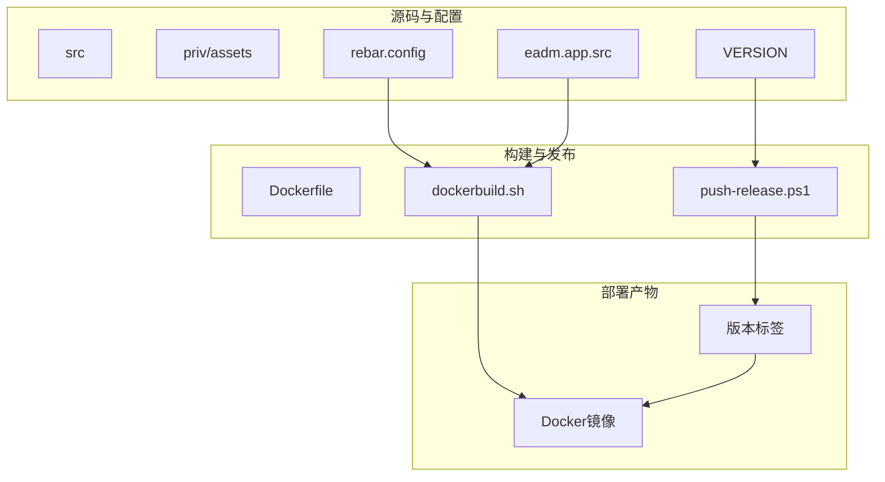
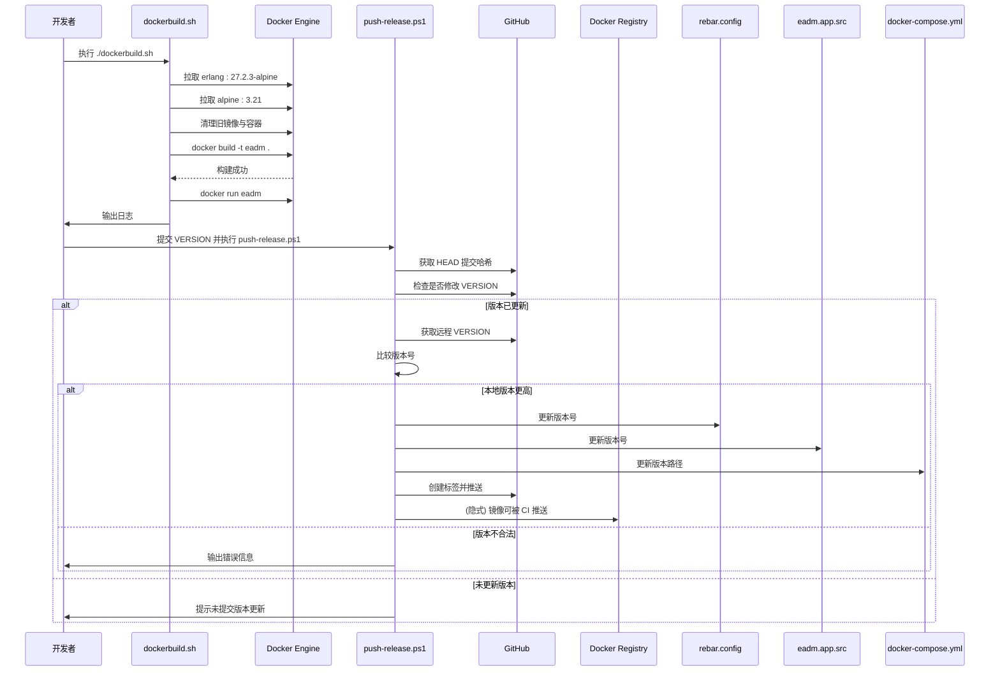
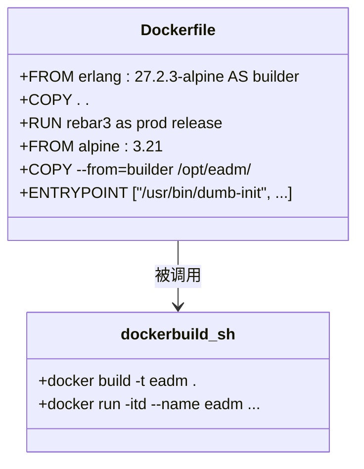
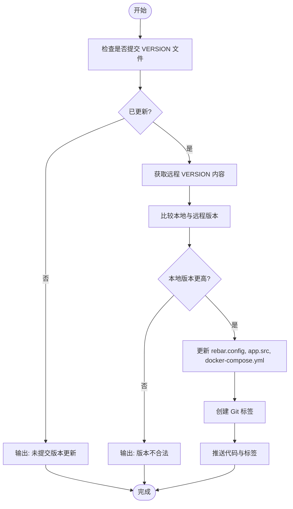

# 发布脚本说明

<cite>
**本文档引用文件**  
- [dockerbuild.sh](file://release/dockerbuild.sh)
- [push-release.ps1](file://release/push-release.ps1)
- [Dockerfile](file://Dockerfile)
- [rebar.config](file://rebar.config)
- [eadm.app.src](file://src/eadm.app.src)
- [VERSION](file://VERSION)
</cite>

## 目录
1. [简介](#简介)
2. [项目结构概述](#项目结构概述)
3. [核心发布脚本分析](#核心发布脚本分析)
4. [构建与发布流程架构](#构建与发布流程架构)
5. [详细组件分析](#详细组件分析)
6. [依赖与版本管理机制](#依赖与版本管理机制)
7. [性能与最佳实践](#性能与最佳实践)
8. [故障排查指南](#故障排查指南)
9. [结论](#结论)

## 简介
本文档全面解析 `eadm` 项目的发布脚本系统，重点分析 `dockerbuild.sh` 和 `push-release.ps1` 两个核心脚本的功能、执行逻辑及其在 CI/CD 流水线中的协同作用。涵盖从本地构建 Docker 镜像到推送带版本标签的镜像至远程仓库的完整流程，并提供执行示例与常见问题解决方案。

## 项目结构概述
项目采用典型的 Erlang/OTP 应用结构，包含源码（`src`）、静态资源（`priv/assets`）、数据库脚本（`script`）、Docker 相关配置（`docker`、`Dockerfile`）以及发布专用脚本（`release` 目录）。发布脚本集中于 `release` 文件夹，分别负责构建与推送阶段。

**Diagram sources**  
- [Dockerfile](file://Dockerfile#L1-L43)
- [dockerbuild.sh](file://release/dockerbuild.sh#L1-L27)
- [push-release.ps1](file://release/push-release.ps1#L1-L49)

**Section sources**  
- [release](file://release)
- [Dockerfile](file://Dockerfile#L1-L43)

## 核心发布脚本分析

### dockerbuild.sh 脚本功能解析
该 Bash 脚本负责在本地或构建服务器上完成 Docker 镜像的构建。其主要流程包括：
1. 预拉取基础镜像（Erlang 与 Alpine）
2. 清理旧容器与镜像以避免冲突
3. 调用 `docker build` 命令，基于 `Dockerfile` 构建名为 `eadm` 的镜像
4. 启动容器并输出日志以验证构建结果

脚本通过多阶段构建策略，在 `builder` 阶段使用 `rebar3 as prod release` 生成生产环境发布包，并在最终镜像中仅包含运行时所需文件，实现镜像轻量化。

**Section sources**  
- [dockerbuild.sh](file://release/dockerbuild.sh#L1-L27)
- [Dockerfile](file://Dockerfile#L1-L43)

### push-release.ps1 脚本功能解析
该 PowerShell 脚本专为 Windows 环境设计，负责将构建好的镜像推送到远程仓库。其核心逻辑如下：
1. 获取当前提交的哈希值
2. 检查最近一次提交是否包含 `VERSION` 文件变更
3. 若版本更新，则拉取远程 `VERSION` 内容进行比较
4. 若本地版本更高，则同步更新 `rebar.config`、`eadm.app.src` 和 `docker-compose.yml` 中的版本号
5. 创建 Git 标签并推送代码与标签至远程仓库

该脚本实现了版本一致性校验与自动化版本发布，确保镜像标签与代码版本严格对应。

**Section sources**  
- [push-release.ps1](file://release/push-release.ps1#L1-L49)
- [rebar.config](file://rebar.config#L1-L77)
- [eadm.app.src](file://src/eadm.app.src#L1-L25)
- [VERSION](file://VERSION#L1-L2)

## 构建与发布流程架构

**Diagram sources**  
- [dockerbuild.sh](file://release/dockerbuild.sh#L1-L27)
- [push-release.ps1](file://release/push-release.ps1#L1-L49)

## 详细组件分析

### 构建阶段组件分析
`Dockerfile` 采用多阶段构建，第一阶段使用 `erlang:27.2.3-alpine` 安装依赖并执行 `rebar3 as prod release`，生成位于 `_build/prod/rel/eadm` 的发布包。第二阶段基于轻量 `alpine:3.21` 镜像，仅复制运行时所需文件，显著减小最终镜像体积。

**Diagram sources**  
- [Dockerfile](file://Dockerfile#L1-L43)
- [dockerbuild.sh](file://release/dockerbuild.sh#L1-L27)

### 版本管理组件分析
版本控制系统依赖 `VERSION` 文件作为单一事实源。`push-release.ps1` 脚本通过 Git 命令检测版本变更，并自动同步至 `rebar.config`（发布版本）、`eadm.app.src`（应用版本）和 `docker-compose.yml`（部署路径），确保全项目版本一致性。

**Diagram sources**  
- [push-release.ps1](file://release/push-release.ps1#L1-L49)
- [VERSION](file://VERSION#L1-L2)

## 依赖与版本管理机制
项目通过 `rebar.config` 管理 Erlang 依赖，使用 Git 直接引用外部库。Docker 构建依赖 `erlang:27.2.3-alpine` 和 `alpine:3.21` 作为基础镜像。版本号统一由 `VERSION` 文件控制，经由脚本同步至各配置文件，避免手动修改导致的不一致。

**Section sources**  
- [rebar.config](file://rebar.config#L1-L77)
- [Dockerfile](file://Dockerfile#L1-L43)
- [VERSION](file://VERSION#L1-L2)

## 性能与最佳实践
- **镜像优化**：使用多阶段构建，仅包含运行时依赖，减小镜像体积
- **缓存利用**：`dockerbuild.sh` 注释了 `--no-cache`，可启用以加速反复构建
- **版本自动化**：避免手动修改版本号，通过脚本确保一致性
- **资源清理**：构建前清理旧容器与镜像，防止资源占用

## 故障排查指南
### 常见错误与解决方案
| 错误现象 | 可能原因 | 解决方法 |
|--------|--------|--------|
| 构建失败，rebar3 报错 | 网络问题导致依赖下载失败 | 检查网络，或配置 Git 代理 |
| 镜像无法启动 | 端口 8090 被占用 | 更换宿主机端口或终止占用进程 |
| 推送脚本无反应 | Windows PowerShell 执行策略限制 | 以管理员身份运行 `Set-ExecutionPolicy RemoteSigned` |
| 版本未更新 | 提交未包含 VERSION 文件 | 确保提交时包含 VERSION 文件变更 |
| 认证失败 | Git 凭据未配置 | 配置 Git 凭据管理器或使用 SSH 密钥 |

**Section sources**  
- [dockerbuild.sh](file://release/dockerbuild.sh#L1-L27)
- [push-release.ps1](file://release/push-release.ps1#L1-L49)

## 结论
`dockerbuild.sh` 与 `push-release.ps1` 构成了 `eadm` 项目完整的发布流水线。前者负责构建轻量化的 Docker 镜像，后者实现基于 Git 提交的自动化版本管理与发布。两者协同工作，确保了从代码到部署的高效、可靠与一致性，适用于本地开发测试及 CI/CD 自动化场景。