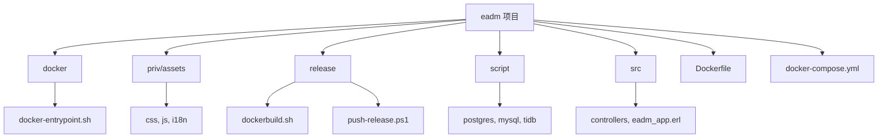
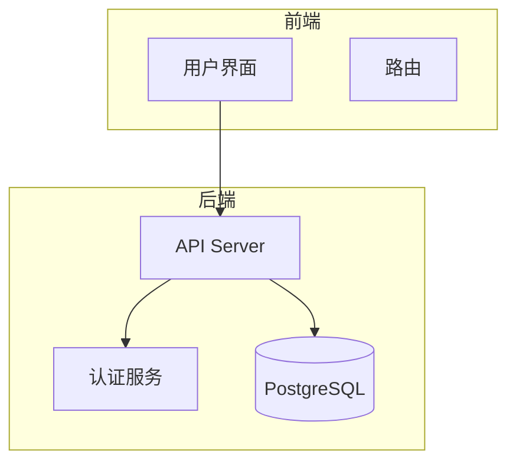
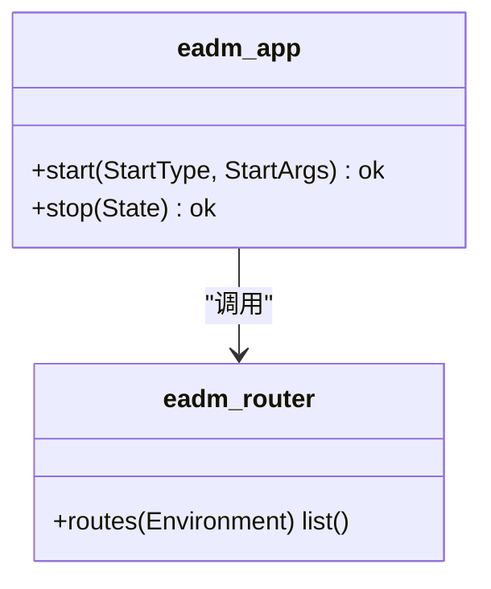
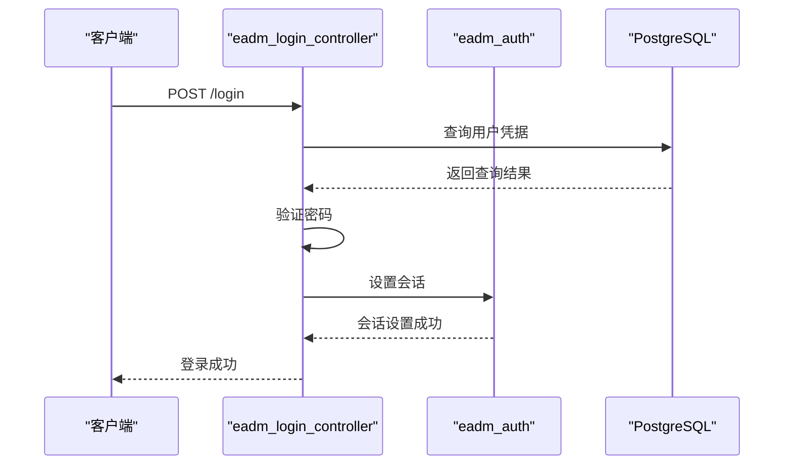
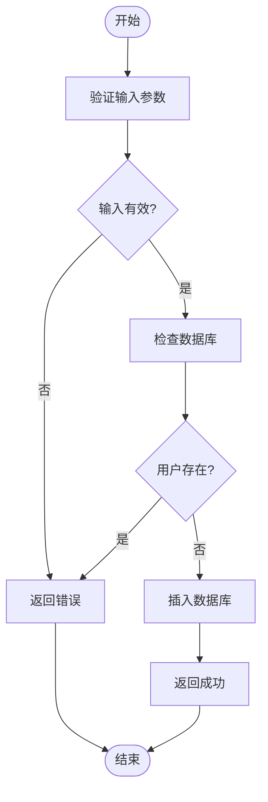
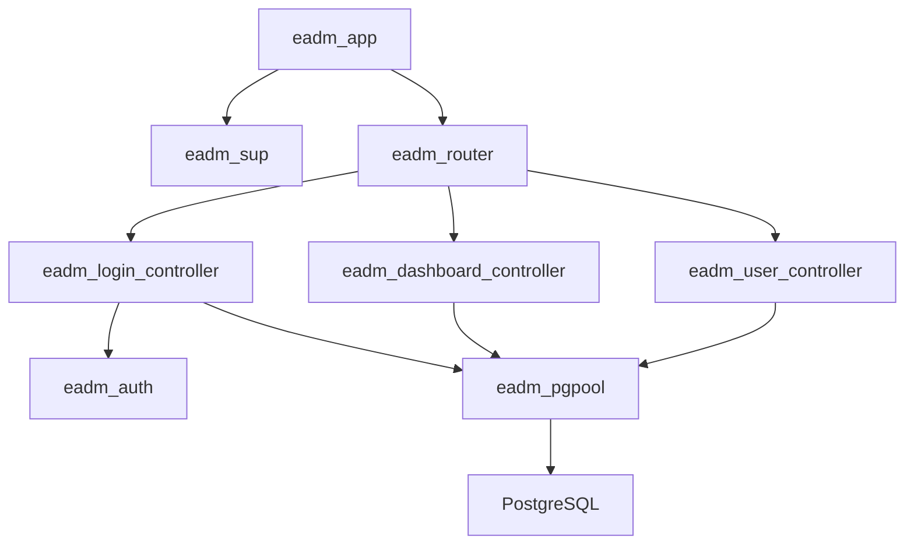

# 部署与运维

<cite>
**本文档引用的文件**
- [Dockerfile](file://Dockerfile)
- [docker-compose.yml](file://docker-compose.yml)
- [docker-entrypoint.sh](file://docker/docker-entrypoint.sh)
- [dockerbuild.sh](file://release/dockerbuild.sh)
- [push-release.ps1](file://release/push-release.ps1)
- [eadm_app.erl](file://src/eadm_app.erl)
- [eadm_router.erl](file://src/eadm_router.erl)
- [eadm_auth.erl](file://src/eadm_auth.erl)
- [eadm_login_controller.erl](file://src/controllers/eadm_login_controller.erl)
- [eadm_dashboard_controller.erl](file://src/controllers/eadm_dashboard_controller.erl)
- [eadm_user_controller.erl](file://src/controllers/eadm_user_controller.erl)
- [datastruct.sql](file://script/postgres/datastruct.sql)
</cite>

## 目录
1. [简介](#简介)
2. [项目结构](#项目结构)
3. [核心组件](#核心组件)
4. [架构概述](#架构概述)
5. [详细组件分析](#详细组件分析)
6. [依赖分析](#依赖分析)
7. [性能考虑](#性能考虑)
8. [故障排除指南](#故障排除指南)
9. [结论](#结论)
10. [附录](#附录)

## 简介
本文档为 eadm 系统提供完整的部署与运维指南。文档详细说明了基于 Docker 的部署流程，包括 Dockerfile 的构建指令、docker-compose.yml 的服务编排配置以及 docker-entrypoint.sh 的初始化逻辑。同时提供了 `dockerbuild.sh` 和 `push-release.ps1` 脚本的使用说明，解释其在 CI/CD 流程中的作用。涵盖了多环境（开发、测试、生产）的配置方法，为运维团队提供从零开始部署系统、进行版本升级和日常维护的标准化操作手册。

## 项目结构
eadm 项目采用模块化设计，主要包含以下几个核心目录：

- **docker/**: 包含容器化部署所需的脚本文件，特别是 `docker-entrypoint.sh`，用于容器启动时的初始化工作。
- **priv/assets/**: 存放前端静态资源，包括 CSS、JavaScript、国际化文件等。
- **release/**: 包含构建和发布相关的脚本，如 `dockerbuild.sh` 和 `push-release.ps1`。
- **script/**: 存放数据库初始化脚本，支持多种数据库（PostgreSQL、MySQL、TiDB 等）。
- **src/**: 核心 Erlang 源代码目录，包含应用逻辑、控制器、路由和认证模块。
- **根目录文件**: `Dockerfile` 定义了镜像构建过程，`docker-compose.yml` 定义了多容器服务编排。



**Diagram sources**
- [Dockerfile](file://Dockerfile)
- [docker-compose.yml](file://docker-compose.yml)

**Section sources**
- [Dockerfile](file://Dockerfile)
- [docker-compose.yml](file://docker-compose.yml)

## 核心组件
eadm 的核心组件由 Erlang/OTP 构建，主要包含应用启动、路由分发、用户认证和数据库交互等模块。

**Section sources**
- [eadm_app.erl](file://src/eadm_app.erl)
- [eadm_router.erl](file://src/eadm_router.erl)
- [eadm_auth.erl](file://src/eadm_auth.erl)

## 架构概述
eadm 采用典型的前后端分离架构，后端基于 Erlang 的 Cowboy 框架（通过 Nova 封装），前端使用 Bootstrap 5 和 jQuery。系统通过 Docker 容器化部署，由 `docker-compose` 管理 PostgreSQL 数据库、Erlang 应用和 Nginx 反向代理三个服务。



**Diagram sources**
- [eadm_router.erl](file://src/eadm_router.erl)
- [docker-compose.yml](file://docker-compose.yml)

## 详细组件分析

### 应用启动与路由分析
`eadm_app.erl` 是应用的入口点，实现了 `application` 行为。`start/2` 函数负责启动应用监督树，并在启动后两秒打印访问地址。`eadm_router.erl` 定义了系统的 URL 路由规则，将不同的 HTTP 请求分发到相应的控制器。



**Diagram sources**
- [eadm_app.erl](file://src/eadm_app.erl#L1-L55)
- [eadm_router.erl](file://src/eadm_router.erl#L1-L164)

### 用户认证与权限分析
`eadm_auth.erl` 实现了基于会话的认证逻辑。`auth/1` 函数检查会话中的过期时间，验证用户是否已登录。`eadm_login_controller.erl` 处理登录、登出和用户信息查询，通过 `eadm_pgpool` 模块与数据库交互验证用户凭据。



**Diagram sources**
- [eadm_auth.erl](file://src/eadm_auth.erl#L1-L48)
- [eadm_login_controller.erl](file://src/controllers/eadm_login_controller.erl#L1-L244)

### 用户管理功能分析
`eadm_user_controller.erl` 提供了完整的用户管理功能，包括用户的增、删、改、查以及角色分配。该模块通过 `validate_addloginname/1` 和 `validate_editloginname/2` 函数确保用户名的唯一性和格式正确性。



**Diagram sources**
- [eadm_user_controller.erl](file://src/controllers/eadm_user_controller.erl#L1-L480)

## 依赖分析
eadm 项目的依赖关系清晰，主要分为内部模块依赖和外部服务依赖。



**Diagram sources**
- [go.mod](file://go.mod)
- [Dockerfile](file://Dockerfile)

**Section sources**
- [Dockerfile](file://Dockerfile)
- [docker-compose.yml](file://docker-compose.yml)

## 性能考虑
从代码分析，系统在性能方面有以下考虑：
- 使用 `lager` 进行日志记录，便于调试和监控。
- 数据库查询使用参数化查询，防止 SQL 注入。
- 对用户输入进行严格的正则表达式验证，确保数据完整性。
- 在 `docker-compose.yml` 中为 `eadm` 服务设置了内存限制和保留，防止资源耗尽。

## 故障排除指南
当系统出现故障时，可按以下步骤进行排查：

**Section sources**
- [eadm_app.erl](file://src/eadm_app.erl#L1-L55)
- [eadm_login_controller.erl](file://src/controllers/eadm_login_controller.erl#L1-L244)

## 结论
本文档详细阐述了 eadm 系统的部署与运维流程。通过 Docker 容器化技术，实现了环境的一致性和部署的便捷性。系统的 Erlang 后端架构稳定，模块职责清晰。运维团队可依据本手册完成系统的部署、升级和日常维护工作。

## 附录
### 数据库表结构 (PostgreSQL)
```sql
-- 基础信息_用户信息表
CREATE TABLE eadm_user (
  id char(12) NOT NULL PRIMARY KEY,
  tenantid char(12) NOT NULL,
  loginname varchar(50) NOT NULL,
  username varchar(50) NOT NULL,
  email varchar(20),
  passwd varchar(50) NOT NULL,
  userstatus smallint NOT NULL DEFAULT 0,
  ...
);
```

**Section sources**
- [script/postgres/datastruct.sql](file://script/postgres/datastruct.sql)