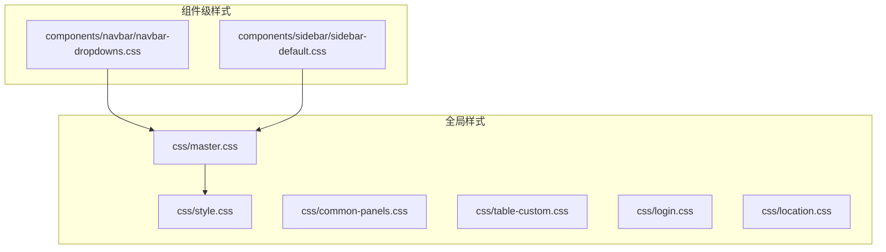
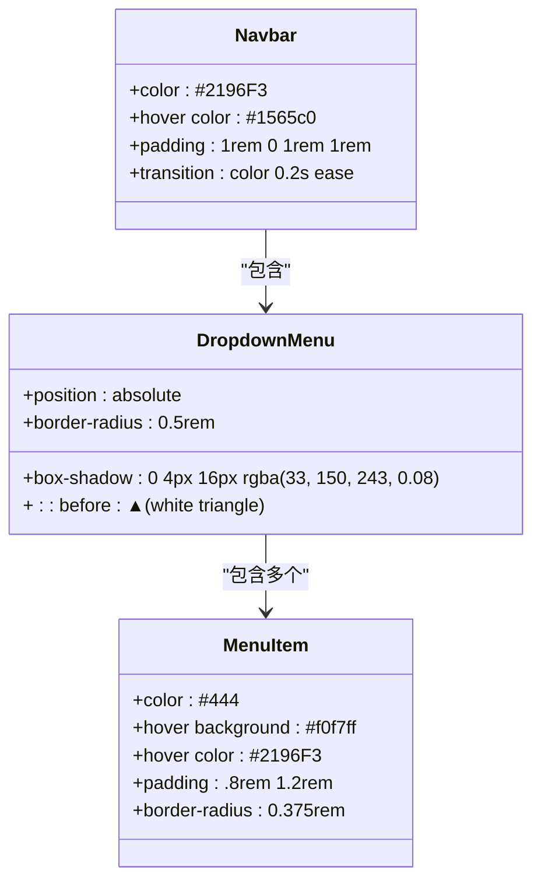
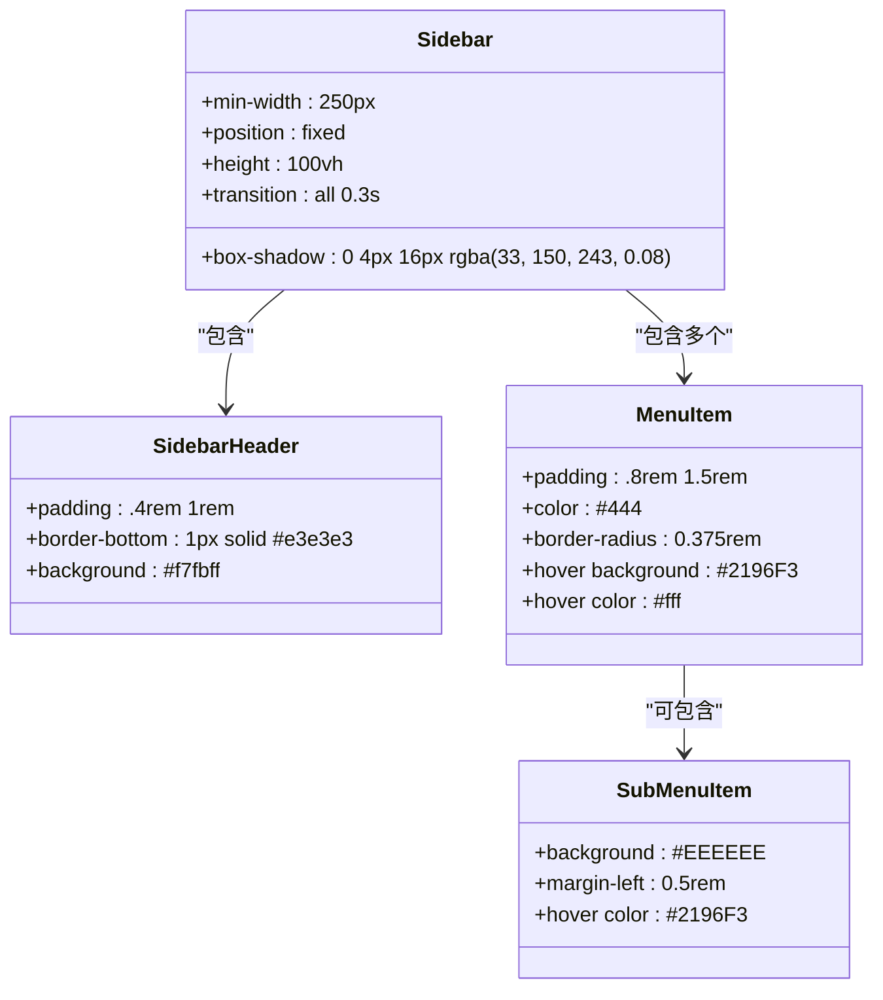
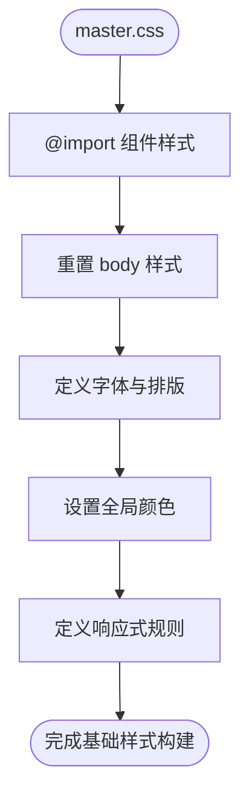
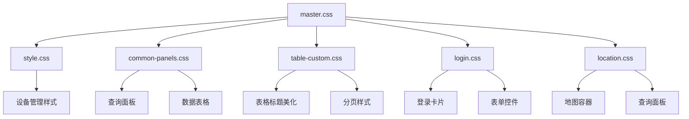
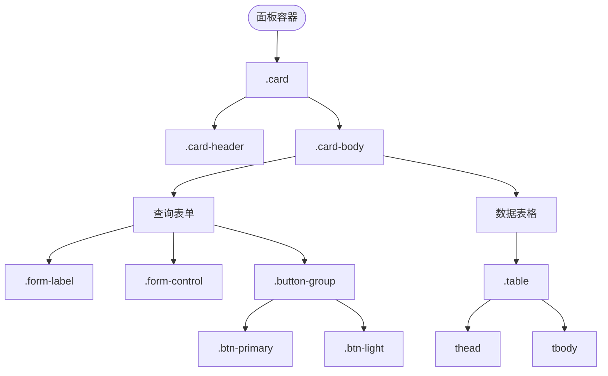
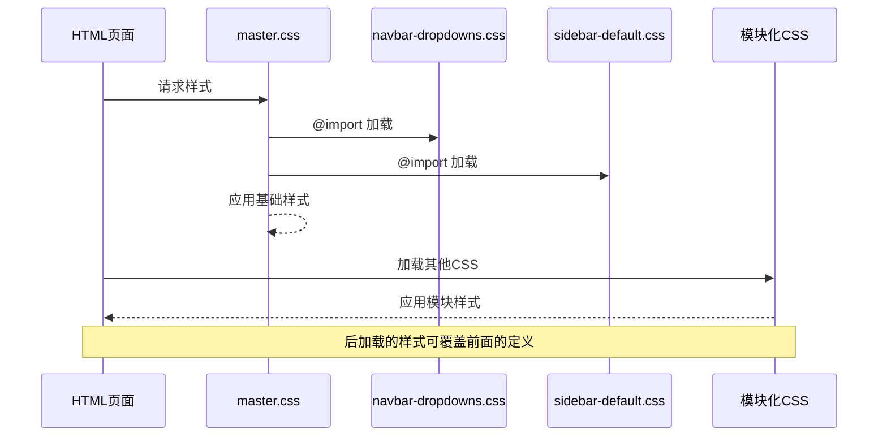
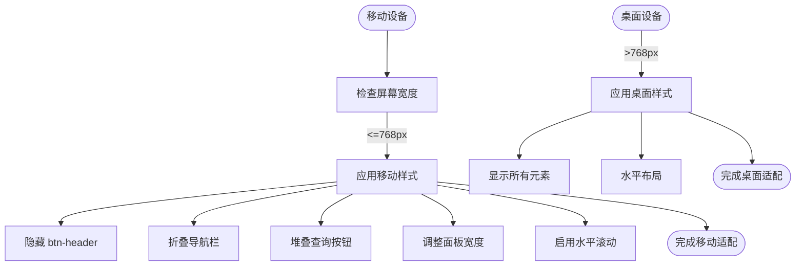
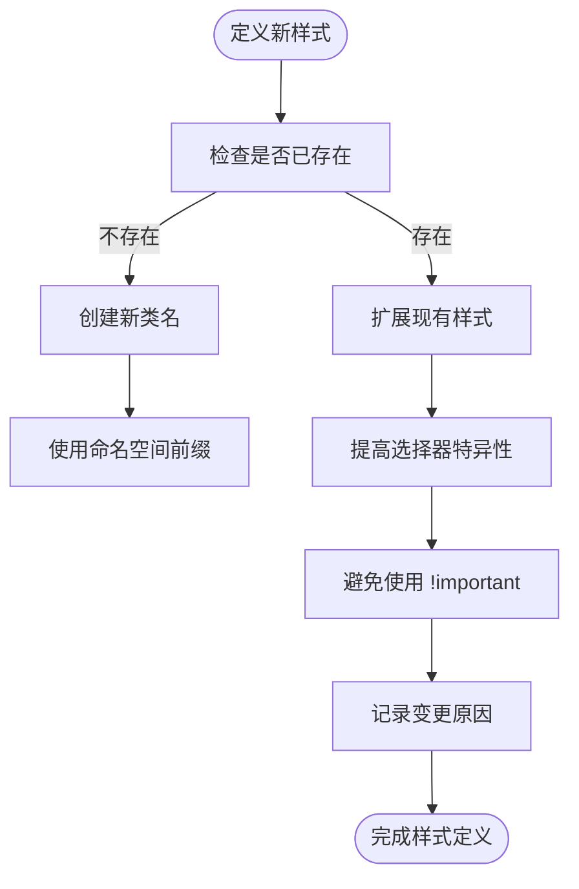

# CSS结构

<cite>
**本文档中引用的文件**  
- [navbar-dropdowns.css](file://priv/assets/components/navbar/navbar-dropdowns.css)
- [sidebar-default.css](file://priv/assets/components/sidebar/sidebar-default.css)
- [login.css](file://priv/assets/css/login.css)
- [location.css](file://priv/assets/css/location.css)
- [master.css](file://priv/assets/css/master.css)
- [style.css](file://priv/assets/css/style.css)
- [common-panels.css](file://priv/assets/css/common-panels.css)
- [table-custom.css](file://priv/assets/css/table-custom.css)
</cite>

## 目录
1. [简介](#简介)
2. [项目结构与CSS组织](#项目结构与css组织)
3. [组件级样式设计](#组件级样式设计)
4. [全局样式架构](#全局样式架构)
5. [模块化CSS职责划分](#模块化css职责划分)
6. [通用界面元素定制](#通用界面元素定制)
7. [CSS加载与优先级控制](#css加载与优先级控制)
8. [响应式适配策略](#响应式适配策略)
9. [样式扩展与覆盖最佳实践](#样式扩展与覆盖最佳实践)
10. [常见布局问题调试方法](#常见布局问题调试方法)
11. [结论](#结论)

## 简介
本文档深入解析`eadm`项目的前端CSS架构设计，涵盖组件级样式与全局样式的分层管理机制。通过分析`components/`和`css/`目录下的核心样式文件，阐述导航栏、侧边栏等UI组件的封装复用原则，解析`master.css`基础重置与`style.css`全局入口的组织逻辑，并提供样式扩展与调试的实用指南。

## 项目结构与CSS组织
项目采用清晰的CSS分层架构，将样式文件分为组件级（`components/`）和全局级（`css/`）两大类。组件样式独立封装于`components/`目录下，实现高内聚低耦合；全局样式集中于`css/`目录，按功能模块划分，便于维护与扩展。



**图示来源**  
- [master.css](file://priv/assets/css/master.css#L3-L4)
- [navbar-dropdowns.css](file://priv/assets/components/navbar/navbar-dropdowns.css)
- [sidebar-default.css](file://priv/assets/components/sidebar/sidebar-default.css)

**本节来源**  
- [master.css](file://priv/assets/css/master.css#L3-L4)

## 组件级样式设计
### 导航栏组件化设计
`navbar-dropdowns.css`实现了顶部导航栏的独立封装，采用`.nav-dropdown`类作为命名空间，确保样式隔离。通过绝对定位实现下拉菜单的层叠展示，利用`::before`伪元素创建指向箭头，提升用户体验。菜单项采用圆角设计与悬停高亮，增强交互反馈。



**图示来源**  
- [navbar-dropdowns.css](file://priv/assets/components/navbar/navbar-dropdowns.css#L10-L83)

**本节来源**  
- [navbar-dropdowns.css](file://priv/assets/components/navbar/navbar-dropdowns.css#L10-L83)

### 侧边栏独立封装
`sidebar-default.css`定义了左侧固定导航栏的完整样式，使用`#sidebar`作为主容器，通过`position: fixed`实现固定定位。支持折叠状态（`.active`类控制），具备平滑过渡动画。菜单项采用层级缩进设计，子菜单背景色区分，提升可读性。



**图示来源**  
- [sidebar-default.css](file://priv/assets/components/sidebar/sidebar-default.css#L10-L99)

**本节来源**  
- [sidebar-default.css](file://priv/assets/components/sidebar/sidebar-default.css#L10-L99)

## 全局样式架构
### master.css基础重置
`master.css`作为基础样式文件，承担CSS重置与全局默认样式的职责。通过`@import`引入导航栏和侧边栏组件样式，形成样式依赖链。定义了字体、颜色、盒模型等全局属性，并包含响应式断点规则，为整个应用提供一致的视觉基础。



**图示来源**  
- [master.css](file://priv/assets/css/master.css#L3-L480)

**本节来源**  
- [master.css](file://priv/assets/css/master.css#L3-L480)

### style.css全局入口
`style.css`作为全局样式入口，不直接定义基础样式，而是提供特定页面或功能的补充样式。例如定义设备状态徽章（`.device-status-badge`）和操作列样式（`.action-column`），这些样式可被多个页面复用，避免重复定义。

```mermaid
classDiagram
class DeviceStatusBadge {
+display : inline-block
+padding : 0.25em 0.6em
+font-size : 75%
+border-radius : 0.25rem
}
class EnabledStatus {
+background-color : #28a745
+color : #fff
}
class DisabledStatus {
+background-color : #dc3545
+color : #fff
}
class ActionColumn {
+white-space : nowrap
+text-align : center
}
DeviceStatusBadge --> EnabledStatus : "扩展"
DeviceStatusBadge --> DisabledStatus : "扩展"
ActionColumn --> ".btn" : "包含"
```

**图示来源**  
- [style.css](file://priv/assets/css/style.css#L1-L37)

**本节来源**  
- [style.css](file://priv/assets/css/style.css#L1-L37)

## 模块化CSS职责划分
各模块化CSS文件按功能垂直划分，职责明确：
- `login.css`：专用于登录页面的布局与表单样式
- `location.css`：轨迹回放页面的专用样式，覆盖默认布局
- `common-panels.css`：通用查询与数据面板
- `table-custom.css`：表格展示定制

这种划分方式实现了样式的高内聚与低耦合，便于团队协作与维护。



**图示来源**  
- [master.css](file://priv/assets/css/master.css#L3-L4)
- [login.css](file://priv/assets/css/login.css)
- [location.css](file://priv/assets/css/location.css)
- [common-panels.css](file://priv/assets/css/common-panels.css)
- [table-custom.css](file://priv/assets/css/table-custom.css)

**本节来源**  
- [login.css](file://priv/assets/css/login.css)
- [location.css](file://priv/assets/css/location.css)

## 通用界面元素定制
### common-panels.css应用模式
该文件定义了统一的查询面板（`.query-panel`）和数据展示面板（`.data-panel`）样式。采用卡片式设计，包含标题区、表单区和按钮组，支持响应式布局。通过`.btn-primary`和`.btn-light`区分主次操作，提升用户体验一致性。



**图示来源**  
- [common-panels.css](file://priv/assets/css/common-panels.css#L1-L215)

**本节来源**  
- [common-panels.css](file://priv/assets/css/common-panels.css#L1-L215)

### table-custom.css定制策略
该文件专注于表格展示的视觉优化，包括：
- 表头背景色与悬停效果
- 分页按钮样式统一
- 排序图标颜色调整
- 表格信息显示控制

通过精细化控制`DataTables`插件的各类选择器，实现专业级的数据展示效果。

```mermaid
classDiagram
class TableHeader {
+background : #f8f9fa
+hover background : #e9ecef
+border-bottom : 2px solid #dee2e6
}
class Pagination {
+current background : #2196F3
+hover background : #e9ecef
+border-radius : 4px
}
class TableInfo {
+visibility : visible
+color : #6c757d
+font-size : 0.875rem
}
class SearchInput {
+border : 1px solid #ced4da
+padding : 6px 12px
+border-radius : 4px
}
TableHeader --> ".table thead th"
Pagination --> ".paginate_button"
TableInfo --> ".dataTables_info"
SearchInput --> ".dataTables_filter input"
```

**图示来源**  
- [table-custom.css](file://priv/assets/css/table-custom.css#L1-L101)

**本节来源**  
- [table-custom.css](file://priv/assets/css/table-custom.css#L1-L101)

## CSS加载与优先级控制
项目通过`master.css`中的`@import`语句实现样式加载，确保组件样式优先于全局样式。具体加载顺序为：
1. 组件样式（navbar, sidebar）
2. 基础重置（master.css）
3. 模块化样式（login.css, location.css等）
4. 全局入口（style.css）

这种顺序保证了组件封装性，同时允许后续样式覆盖前面的定义，实现灵活的优先级控制。



**图示来源**  
- [master.css](file://priv/assets/css/master.css#L3-L4)

**本节来源**  
- [master.css](file://priv/assets/css/master.css#L3-L4)

## 响应式适配策略
项目采用移动优先的响应式设计，在多个CSS文件中定义了媒体查询规则：
- `master.css`：处理导航栏折叠与按钮隐藏
- `common-panels.css`：调整查询表单布局
- `location.css`：优化小屏幕上的查询面板

断点主要集中在`max-width: 768px`，确保在移动设备上有良好的用户体验。



**图示来源**  
- [master.css](file://priv/assets/css/master.css#L450-L475)
- [common-panels.css](file://priv/assets/css/common-panels.css#L200-L215)
- [location.css](file://priv/assets/css/location.css#L135-L154)

**本节来源**  
- [master.css](file://priv/assets/css/master.css#L450-L475)
- [common-panels.css](file://priv/assets/css/common-panels.css#L200-L215)
- [location.css](file://priv/assets/css/location.css#L135-L154)

## 样式扩展与覆盖最佳实践
### 扩展原则
1. **命名空间隔离**：新组件使用独立类名前缀
2. **避免!important**：通过选择器优先级控制
3. **继承而非覆盖**：尽量复用现有样式类
4. **模块化引入**：按需加载样式文件

### 覆盖策略
当需要覆盖默认样式时，应：
1. 在`style.css`中定义新规则
2. 使用更具体的选择器（如增加父级类名）
3. 避免修改`master.css`等基础文件
4. 记录覆盖原因与影响范围



**本节来源**  
- [style.css](file://priv/assets/css/style.css)
- [master.css](file://priv/assets/css/master.css)

## 常见布局问题调试方法
### 调试步骤
1. **检查CSS加载顺序**：确保依赖关系正确
2. **验证选择器优先级**：使用开发者工具检查
3. **审查盒模型**：确认边距、填充与边框
4. **测试响应式断点**：在不同屏幕尺寸下验证
5. **清除缓存**：排除浏览器缓存干扰

### 常见问题与解决方案
| 问题现象 | 可能原因 | 解决方案 |
|---------|---------|---------|
| 组件样式未生效 | 加载顺序错误 | 调整@import顺序 |
| 响应式布局错乱 | 媒体查询冲突 | 检查断点设置 |
| 按钮样式异常 | 特异性不足 | 增加选择器层级 |
| 表格显示异常 | 插件样式冲突 | 调整table-custom.css |

**本节来源**  
- [master.css](file://priv/assets/css/master.css)
- [common-panels.css](file://priv/assets/css/common-panels.css)

## 结论
本项目CSS架构采用组件化与模块化相结合的设计，通过`components/`目录实现UI组件的独立封装与复用，利用`css/`目录进行功能模块划分。`master.css`作为基础样式入口，`style.css`作为全局扩展点，形成了清晰的样式层级。响应式设计贯穿始终，为开发者提供了良好的扩展性与维护性。建议遵循命名空间隔离与优先级控制原则，确保样式的可维护性。