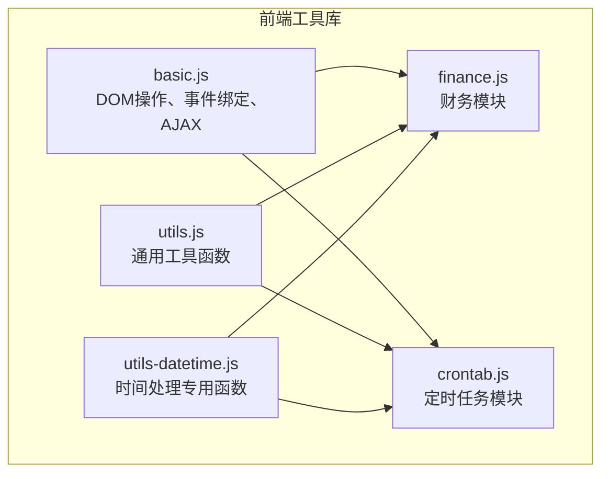
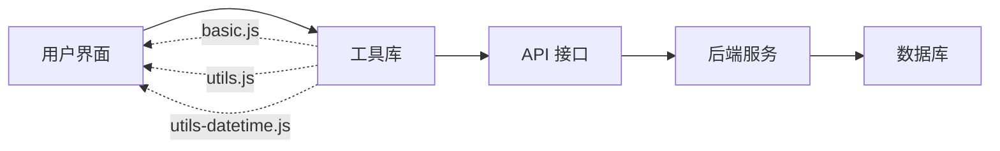
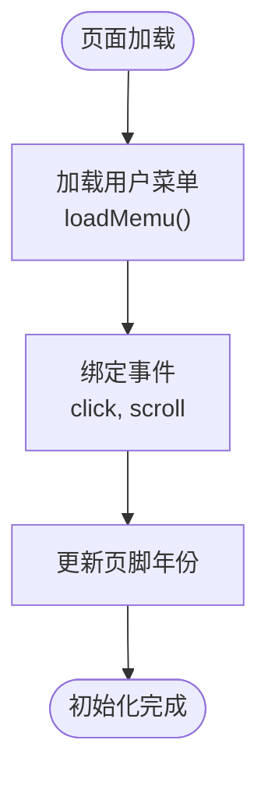
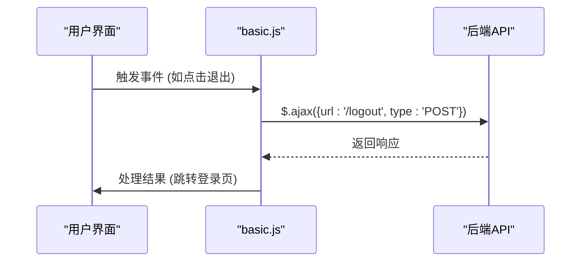
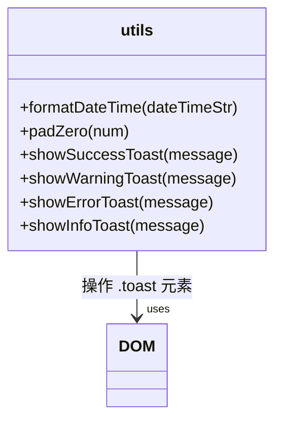
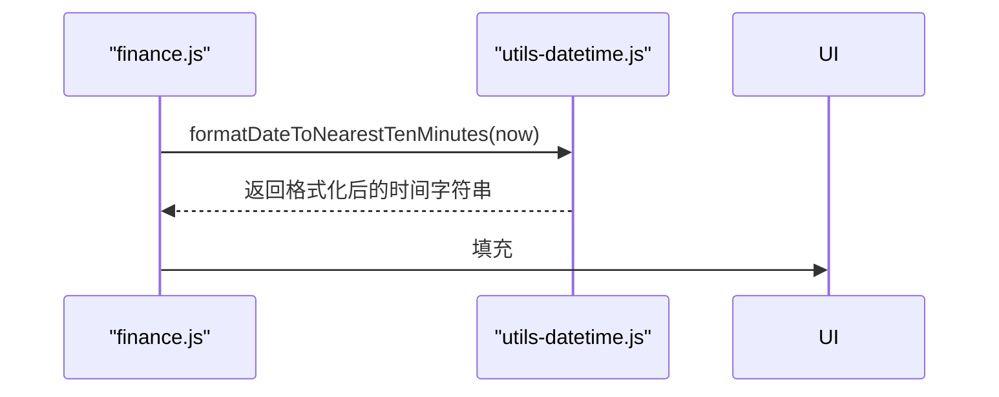
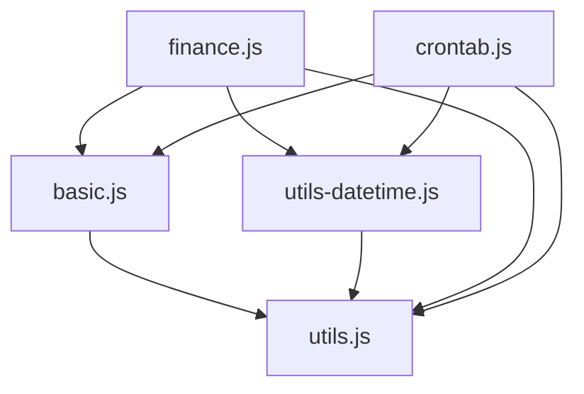

# 基础工具库

<cite>
**本文档中引用的文件**  
- [basic.js](file://priv/assets/js/basic.js)
- [utils.js](file://priv/assets/js/utils.js)
- [utils-datetime.js](file://priv/assets/js/utils-datetime.js)
- [finance.js](file://priv/assets/js/finance.js)
- [crontab.js](file://priv/assets/js/crontab.js)
</cite>

## 目录
1. [简介](#简介)
2. [项目结构](#项目结构)
3. [核心组件](#核心组件)
4. [架构概览](#架构概览)
5. [详细组件分析](#详细组件分析)
6. [依赖分析](#依赖分析)
7. [性能考虑](#性能考虑)
8. [故障排除指南](#故障排除指南)
9. [结论](#结论)

## 简介
本文档深入解析前端核心工具库 `basic.js` 和 `utils.js` 的设计与实现。重点阐述 `basic.js` 中封装的 DOM 操作、事件绑定与 AJAX 请求方法，分析 `utils.js` 提供的数据验证、字符串处理和对象扩展等通用函数，以及 `utils-datetime.js` 在时间格式化、时区处理和日期计算方面的实现逻辑。结合 `finance.js` 和 `crontab.js` 的实际调用场景，说明工具函数的使用方式，并提供扩展规范与性能优化建议。

## 项目结构
前端工具库集中于 `priv/assets/js/` 目录下，采用模块化设计，各文件职责明确，便于维护与扩展。

**Diagram sources**
- [basic.js](file://priv/assets/js/basic.js)
- [utils.js](file://priv/assets/js/utils.js)
- [utils-datetime.js](file://priv/assets/js/utils-datetime.js)
- [finance.js](file://priv/assets/js/finance.js)
- [crontab.js](file://priv/assets/js/crontab.js)

**Section sources**
- [basic.js](file://priv/assets/js/basic.js)
- [utils.js](file://priv/assets/js/utils.js)
- [utils-datetime.js](file://priv/assets/js/utils-datetime.js)

## 核心组件

`basic.js` 作为基础功能的入口，负责页面初始化、菜单加载、事件绑定和全局 AJAX 交互。`utils.js` 提供了可复用的通用函数，如数据格式化和消息提示。`utils-datetime.js` 专注于时间处理，为业务模块提供精确的时间计算支持。

**Section sources**
- [basic.js](file://priv/assets/js/basic.js#L1-L153)
- [utils.js](file://priv/assets/js/utils.js#L1-L135)
- [utils-datetime.js](file://priv/assets/js/utils-datetime.js#L1-L39)

## 架构概览

系统采用分层架构，前端通过工具库与后端 API 交互，实现数据驱动的动态页面。

**Diagram sources**
- [basic.js](file://priv/assets/js/basic.js)
- [utils.js](file://priv/assets/js/utils.js)
- [utils-datetime.js](file://priv/assets/js/utils-datetime.js)

## 详细组件分析

### basic.js 分析
`basic.js` 封装了核心的 DOM 操作和事件处理逻辑，是前端功能的基石。

#### DOM 操作与事件绑定
该文件在 `$(document).ready` 中初始化页面，动态加载用户菜单，绑定侧边栏折叠、滚动监听和页脚年份更新等事件。

**Diagram sources**
- [basic.js](file://priv/assets/js/basic.js#L1-L153)

#### AJAX 请求通用方法
`basic.js` 使用 jQuery 的 `$.getJSON` 和 `$.ajax` 方法实现与后端的通信，如用户信息获取、密码修改和退出登录。

**Diagram sources**
- [basic.js](file://priv/assets/js/basic.js#L1-L153)

**Section sources**
- [basic.js](file://priv/assets/js/basic.js#L1-L153)

### utils.js 分析
`utils.js` 提供了一系列全局可用的辅助函数，增强了代码的可维护性。

#### 数据验证与格式化
包含 `padZero` 等数字补零函数，以及 `formatDateTime` 时间格式化函数，确保数据展示的一致性。

#### 消息提示机制
实现了 `showSuccessToast`, `showWarningToast`, `showErrorToast`, `showInfoToast` 四种消息提示，通过操作 DOM 元素 `.toast` 实现统一的用户反馈。

**Diagram sources**
- [utils.js](file://priv/assets/js/utils.js#L1-L135)

**Section sources**
- [utils.js](file://priv/assets/js/utils.js#L1-L135)

### utils-datetime.js 分析
该模块专用于处理时间相关的复杂逻辑。

#### 时间格式化与舍入
`formatDateToNearestTenMinutes` 函数将时间舍入到最近的十分钟，用于设置默认的查询时间范围。

#### 实际调用场景
在 `finance.js` 和 `crontab.js` 中，该函数被用于初始化时间选择器的默认值。

**Diagram sources**
- [utils-datetime.js](file://priv/assets/js/utils-datetime.js#L1-L39)
- [finance.js](file://priv/assets/js/finance.js#L1-L799)
- [crontab.js](file://priv/assets/js/crontab.js#L1-L545)

**Section sources**
- [utils-datetime.js](file://priv/assets/js/utils-datetime.js#L1-L39)
- [finance.js](file://priv/assets/js/finance.js#L1-L799)
- [crontab.js](file://priv/assets/js/crontab.js#L1-L545)

## 依赖分析

工具库之间存在明确的依赖关系，业务模块依赖工具库。

**Diagram sources**
- [basic.js](file://priv/assets/js/basic.js)
- [utils.js](file://priv/assets/js/utils.js)
- [utils-datetime.js](file://priv/assets/js/utils-datetime.js)
- [finance.js](file://priv/assets/js/finance.js)
- [crontab.js](file://priv/assets/js/crontab.js)

**Section sources**
- [basic.js](file://priv/assets/js/basic.js)
- [utils.js](file://priv/assets/js/utils.js)
- [utils-datetime.js](file://priv/assets/js/utils-datetime.js)

## 性能考虑

- **避免重复计算**：`formatDateToNearestTenMinutes` 等函数应缓存计算结果，避免在循环中重复调用。
- **合理使用缓存**：对于频繁调用且结果不变的函数（如 `padZero`），可考虑在首次调用后缓存结果。
- **减少 DOM 操作**：批量更新 DOM，避免在循环中频繁修改元素。
- **异步加载**：非关键工具函数可考虑异步加载，减少首屏加载时间。

## 故障排除指南

- **工具函数未定义**：检查是否已正确引入 `utils.js` 或 `utils-datetime.js`。
- **时间格式错误**：确认输入的时间字符串格式是否符合函数预期。
- **AJAX 请求失败**：检查网络连接、API 路径和后端服务状态。
- **消息提示不显示**：确认页面中存在 `.toast` 元素，并检查 Bootstrap JS 是否加载。

**Section sources**
- [basic.js](file://priv/assets/js/basic.js#L1-L153)
- [utils.js](file://priv/assets/js/utils.js#L1-L135)
- [utils-datetime.js](file://priv/assets/js/utils-datetime.js#L1-L39)

## 结论

`basic.js` 和 `utils.js` 构成了前端应用的核心工具库，提供了稳定、可复用的基础功能。通过模块化设计和清晰的职责划分，保证了代码的可维护性和扩展性。开发者在新增或修改工具函数时，应遵循命名约定，确保向后兼容，并进行充分的测试。