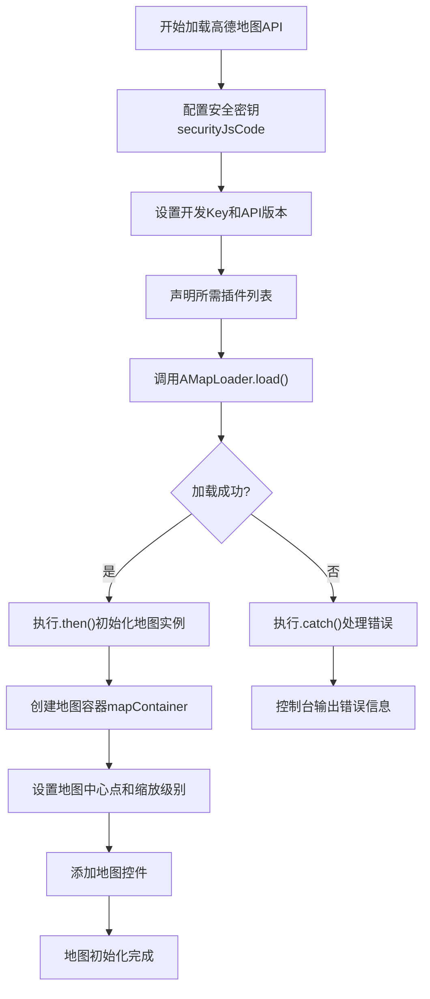
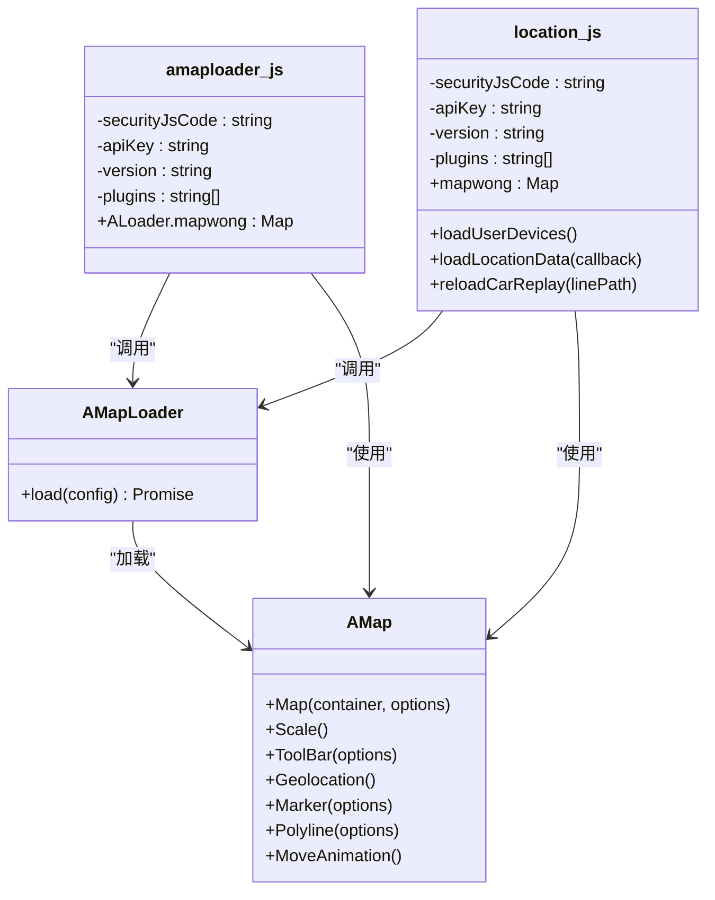
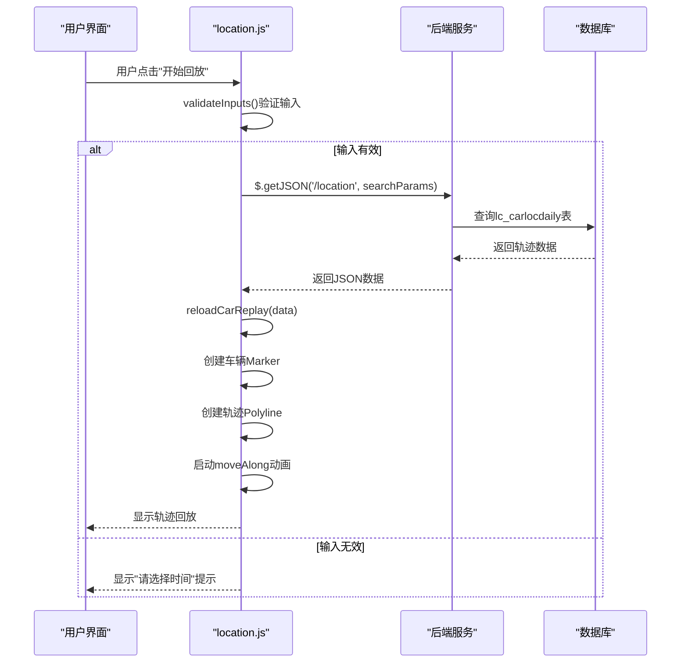
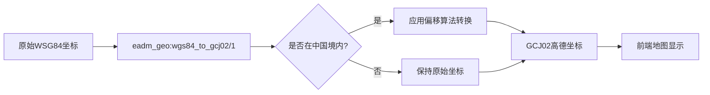
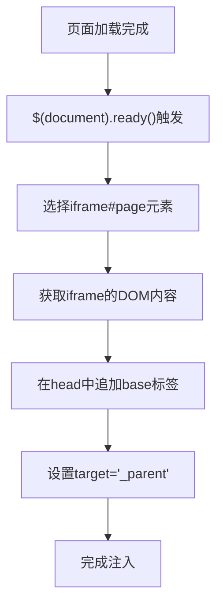
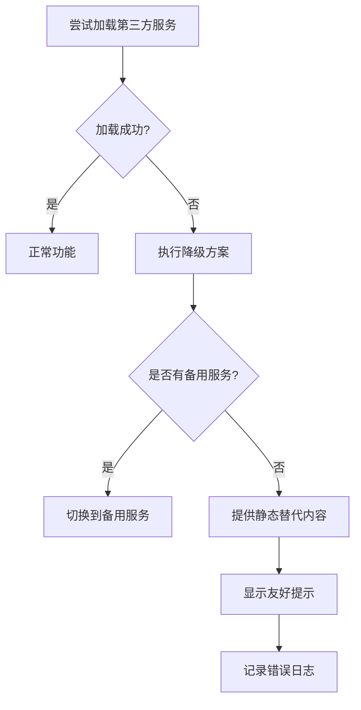

# 外部服务集成

<cite>
**本文档引用的文件**  
- [amaploader.js](file://priv/assets/js/amaploader.js)
- [location.js](file://priv/assets/js/location.js)
- [debug-toolbar.js](file://priv/assets/js/debug-toolbar.js)
- [eadm_location_controller.erl](file://src/controllers/eadm_location_controller.erl)
- [eadm_geo.erl](file://src/eadm_geo.erl)
- [eadm_debug_toolbar_controller.erl](file://src/controllers/eadm_debug_toolbar_controller.erl)
</cite>

## 目录
1. [高德地图集成机制](#高德地图集成机制)
2. [amaploader.js加载与初始化](#amaploaderjs加载与初始化)
3. [location.js与地图服务通信](#locationjs与地图服务通信)
4. [调试工具栏实现机制](#调试工具栏实现机制)
5. [第三方服务集成规范](#第三方服务集成规范)

## 高德地图集成机制

本系统通过高德地图JavaScript API实现地理信息可视化功能，主要应用于轨迹回放、设备定位等场景。集成机制采用模块化设计，通过`amaploader.js`统一管理地图API的异步加载与配置，`location.js`负责具体业务逻辑实现与地图实例交互。系统实现了安全密钥管理、插件按需加载、错误处理等关键机制，确保地图服务的稳定性和安全性。

**Section sources**
- [amaploader.js](file://priv/assets/js/amaploader.js#L1-L63)
- [location.js](file://priv/assets/js/location.js#L1-L364)

## amaploader.js加载与初始化

`amaploader.js`作为高德地图的核心加载器，实现了API的异步加载、密钥配置和地图实例初始化。该模块采用Promise模式处理异步加载流程，确保地图资源在完全加载后才进行实例化操作。

### 异步加载机制

模块通过`AMapLoader.load()`方法异步加载高德地图JavaScript API，该方法返回Promise对象，成功时传递AMap实例，失败时捕获异常。加载过程包含以下关键配置：

- **安全密钥配置**：通过`window._AMapSecurityConfig`设置安全密钥`securityJsCode`，防止API密钥泄露
- **开发密钥设置**：指定Web端开发Key，用于身份验证和配额管理
- **版本控制**：明确指定API版本为"2.0"，确保接口兼容性
- **插件按需加载**：根据业务需求配置所需插件列表，包括比例尺、工具条、定位、标记点等

**Diagram sources**
- [amaploader.js](file://priv/assets/js/amaploader.js#L10-L63)

### 地图实例初始化

加载成功后，在`.then()`回调中完成地图实例的初始化配置：

- **容器绑定**：将地图实例绑定到ID为"mapContainer"的DOM元素
- **视图模式**：设置为2D模式
- **初始状态**：配置初始缩放级别为11，中心点坐标为[120.527112, 36.411864]
- **样式设置**：应用"amap://styles/fresh"主题样式
- **控件添加**：动态添加比例尺、缩放工具条和定位控件

系统通过`window.ALoader`全局对象暴露地图实例，实现跨模块访问，其中`ALoader.mapwong`存储地图对象引用。

**Section sources**
- [amaploader.js](file://priv/assets/js/amaploader.js#L46-L63)

## location.js与地图服务通信

`location.js`模块负责实现轨迹回放等具体业务功能，与`amaploader.js`存在紧密的依赖关系和通信机制。

### 模块依赖关系

`location.js`直接依赖高德地图API，通过相同的加载机制获取地图实例。两个模块在配置上存在差异：

- **插件差异**：`location.js`额外加载了"AMap.moveAnimation"插件用于轨迹回放动画
- **独立实例**：`location.js`创建独立的`mapwong`地图实例，不直接复用`amaploader.js`的实例
- **重复配置**：两个模块均配置了相同的安全密钥和开发Key，存在配置冗余

**Diagram sources**
- [amaploader.js](file://priv/assets/js/amaploader.js#L1-L63)
- [location.js](file://priv/assets/js/location.js#L1-L364)

### 功能调用流程

`location.js`实现了完整的轨迹回放功能，其调用流程如下：

1. **用户交互**：用户通过UI界面选择时间范围和设备
2. **参数验证**：验证开始时间和结束时间是否已选择
3. **数据请求**：通过`loadLocationData()`方法向后端API `/location` 发送GET请求
4. **数据处理**：接收轨迹数据（经纬度坐标数组）并传递给回放函数
5. **动画回放**：调用`reloadCarReplay()`创建车辆Marker和轨迹Polyline，启动移动动画

**Diagram sources**
- [location.js](file://priv/assets/js/location.js#L286-L332)
- [eadm_location_controller.erl](file://src/controllers/eadm_location_controller.erl#L50-L116)

### 地理编码功能

系统通过`eadm_geo.erl`模块实现坐标系转换功能，将国际WSG84坐标系转换为国内GCJ02高德坐标系（火星坐标系）。该功能由Erlang后端实现，确保坐标数据的合规性。

**Diagram sources**
- [eadm_geo.erl](file://src/eadm_geo.erl#L1-L87)

**Section sources**
- [location.js](file://priv/assets/js/location.js#L107-L144)
- [eadm_location_controller.erl](file://src/controllers/eadm_location_controller.erl#L50-L116)
- [eadm_geo.erl](file://src/eadm_geo.erl#L1-L87)

## 调试工具栏实现机制

`debug-toolbar.js`实现了开发环境专用的调试工具，提供页面调试能力。

### 注入方式与UI结构

调试工具栏通过在页面加载完成后动态注入`<base target="_parent">`标签实现，该标签确保iframe中的链接在父窗口打开，便于调试嵌套页面。

**Diagram sources**
- [debug-toolbar.js](file://priv/assets/js/debug-toolbar.js#L1-L5)

### 功能特性

当前版本的调试工具栏功能较为基础，主要实现：

- **请求监控**：通过浏览器开发者工具间接实现，代码中未直接提供监控功能
- **状态查看**：未实现专门的状态查看功能
- **日志输出**：依赖`console.error()`进行错误输出，如地图加载失败时的错误提示

### 安全控制策略

系统通过条件加载机制实现环境区分，确保调试工具仅在开发环境启用：

- **文件命名约定**：调试相关文件明确标识用途
- **部署控制**：生产环境部署时可选择不包含调试文件
- **功能简单**：当前功能不涉及敏感操作，降低安全风险

尽管目前没有显式的环境判断逻辑，但通过构建和部署流程的控制，可确保`debug-toolbar.js`仅在开发环境中加载。

**Section sources**
- [debug-toolbar.js](file://priv/assets/js/debug-toolbar.js#L1-L5)
- [eadm_debug_toolbar_controller.erl](file://src/controllers/eadm_debug_toolbar_controller.erl#L1-L30)

## 第三方服务集成规范

基于本系统的实现，总结出第三方服务集成的通用规范。

### 脚本加载最佳实践

1. **异步加载**：使用Promise或回调机制确保资源加载完成后再使用
2. **错误处理**：必须包含`.catch()`或错误回调，避免因第三方服务不可用导致页面崩溃
3. **超时机制**：建议设置加载超时，提供降级方案
4. **缓存策略**：利用浏览器缓存，避免重复加载大型库文件

### 安全配置规范

1. **密钥管理**：API密钥不应硬编码在前端代码中，建议通过后端代理或环境变量注入
2. **安全验证**：使用安全密钥（如`securityJsCode`）防止API滥用
3. **域名限制**：在第三方服务控制台配置合法调用域名
4. **HTTPS强制**：确保所有第三方资源通过HTTPS加载

### 降级方案设计

当第三方服务不可用时，应提供合理的降级体验：

### 性能优化策略

1. **延迟加载**：仅在需要时加载第三方脚本，避免阻塞页面渲染
2. **按需加载**：只加载必需的插件和功能模块
3. **资源压缩**：使用压缩版本的第三方库
4. **CDN选择**：选择地理位置近的CDN节点，减少延迟

**Section sources**
- [amaploader.js](file://priv/assets/js/amaploader.js#L1-L63)
- [location.js](file://priv/assets/js/location.js#L1-L364)
- [debug-toolbar.js](file://priv/assets/js/debug-toolbar.js#L1-L5)