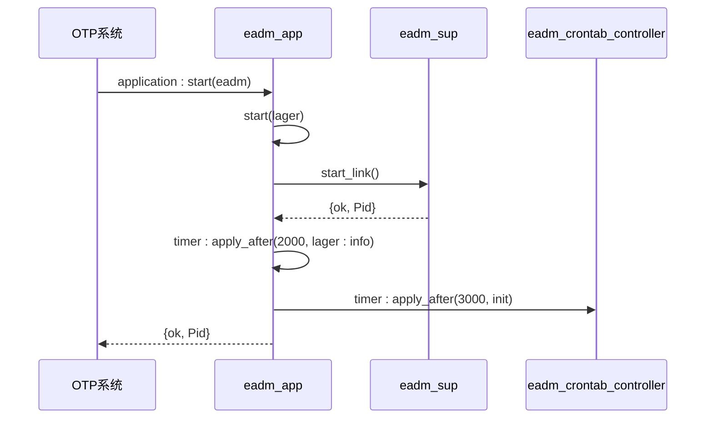
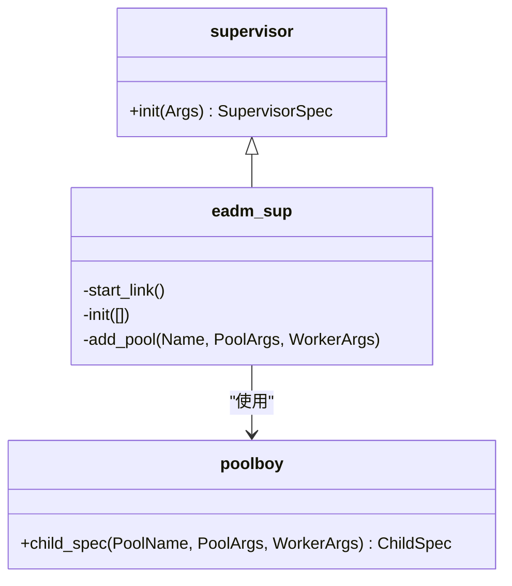
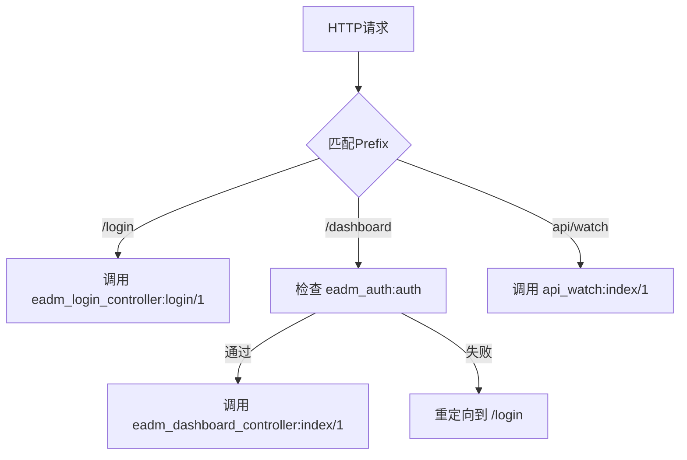

# 后端源码结构

<cite>
**本文档引用的文件**  
- [eadm_app.erl](file://src/eadm_app.erl)
- [eadm_sup.erl](file://src/eadm_sup.erl)
- [eadm_router.erl](file://src/eadm_router.erl)
- [eadm_auth.erl](file://src/eadm_auth.erl)
- [api_payment.erl](file://src/apis/api_payment.erl)
- [api_watch.erl](file://src/apis/api_watch.erl)
- [eadm_geo.erl](file://src/eadm_geo.erl)
- [eadm_wechat.erl](file://src/eadm_wechat.erl)
- [eadm_xlsx.erl](file://src/eadm_xlsx.erl)
- [eadm_crontab_controller.erl](file://src/controllers/eadm_crontab_controller.erl)
- [eadm_dashboard_controller.erl](file://src/controllers/eadm_dashboard_controller.erl)
- [eadm_device_controller.erl](file://src/controllers/eadm_device_controller.erl)
- [eadm_finance_controller.erl](file://src/controllers/eadm_finance_controller.erl)
- [eadm_health_controller.erl](file://src/controllers/eadm_health_controller.erl)
- [eadm_location_controller.erl](file://src/controllers/eadm_location_controller.erl)
- [eadm_login_controller.erl](file://src/controllers/eadm_login_controller.erl)
- [eadm_payment_controller.erl](file://src/controllers/eadm_payment_controller.erl)
- [eadm_role_controller.erl](file://src/controllers/eadm_role_controller.erl)
- [eadm_sys_ports_controller.erl](file://src/controllers/eadm_sys_ports_controller.erl)
- [eadm_sys_processes_controller.erl](file://src/controllers/eadm_sys_processes_controller.erl)
- [eadm_sys_sysinfo_controller.erl](file://src/controllers/eadm_sys_sysinfo_controller.erl)
- [eadm_sys_tv_controller.erl](file://src/controllers/eadm_sys_tv_controller.erl)
- [eadm_user_controller.erl](file://src/controllers/eadm_user_controller.erl)
</cite>

## 目录
1. [应用入口与启动流程](#应用入口与启动流程)
2. [监督树与数据库连接池管理](#监督树与数据库连接池管理)
3. [路由分发机制](#路由分发机制)
4. [控制器与HTTP请求处理](#控制器与http请求处理)
5. [外部接口服务](#外部接口服务)
6. [核心服务模块](#核心服务模块)
7. [系统信息与调试接口](#系统信息与调试接口)

## 应用入口与启动流程

`eadm_app.erl` 是整个Erlang应用程序的入口模块，实现了 `application` 行为。其 `start/2` 函数在应用启动时被调用，负责初始化整个系统。

该函数首先启动 `lager` 日志系统，然后调用 `eadm_sup:start_link()` 启动顶级监督者进程。启动成功后，通过 `timer:apply_after/2` 调度两个异步任务：一是延迟2秒后打印系统启动成功的日志信息，二是延迟3秒后调用 `eadm_crontab_controller:init/0` 函数来初始化定时任务系统。这种延迟启动的设计避免了初始化过程阻塞主应用的启动。



**图源**
- [eadm_app.erl](file://src/eadm_app.erl#L25-L35)

**章节源**
- [eadm_app.erl](file://src/eadm_app.erl#L25-L35)

## 监督树与数据库连接池管理

`eadm_sup.erl` 模块是应用的顶级监督者，遵循OTP的监督树规范。它实现了 `supervisor` 行为，其 `init/1` 函数负责定义子进程的启动规范。

监督者的初始化过程会从应用环境变量 `epgsql` 中读取 `pools` 配置。该配置是一个包含连接池名称、大小参数和工作进程参数的元组列表。`init/1` 函数使用 `lists:map/2` 遍历此列表，为每个池调用 `poolboy:child_spec/3` 生成一个子进程规范（Child Specification），最终形成一个由多个数据库连接池组成的监督树。监督策略为 `one_for_one`，表示任何一个子进程崩溃时，只重启该子进程本身。

此外，`eadm_sup` 还提供了 `add_pool/3` 动态API，允许在运行时向监督树中添加新的数据库连接池，这为系统提供了良好的扩展性。



**图源**
- [eadm_sup.erl](file://src/eadm_sup.erl#L45-L60)

**章节源**
- [eadm_sup.erl](file://src/eadm_sup.erl#L45-L60)

## 路由分发机制

`eadm_router.erl` 模块实现了 `nova_router` 行为，是整个系统的路由中枢。其核心函数 `routes/1` 定义了一个复杂的路由规则列表。

路由规则以 `prefix`（前缀）和 `security`（安全策略）为维度进行分组。例如，`prefix` 为 `"menu"` 的路由组会自动应用 `eadm_auth, auth` 的安全策略，即所有请求都必须通过 `eadm_auth` 模块的 `auth` 函数进行身份验证。而 `prefix` 为空的路由组（如登录、登出）则设置 `security` 为 `false`，表示无需认证。

每个路由规则是一个映射（map），包含路径（如 `"/login"`）、处理函数（如 `fun eadm_login_controller:login/1`）和HTTP方法限制（如 `#{methods => [get, post, options]}`）。Nova框架会根据请求的URL和方法，匹配到相应的处理函数并执行。



**图源**
- [eadm_router.erl](file://src/eadm_router.erl#L30-L160)

**章节源**
- [eadm_router.erl](file://src/eadm_router.erl#L30-L160)

## 控制器与HTTP请求处理

`controllers/` 目录下的每个 `eadm_*_controller.erl` 文件都对应一个业务模块的HTTP请求处理逻辑。所有控制器函数都遵循相同的模式：接收一个包含请求信息的映射（Map），并返回 `{ok, Data}`、`{json, JsonData}` 或 `{redirect, Path}` 等元组。

### 权限校验

几乎所有需要认证的控制器函数都会在函数头使用模式匹配来校验权限。例如，`eadm_dashboard_controller:index/1` 的函数头为：
```erlang
index(#{auth_data := #{<<"authed">> := true, <<"username">> := UserName}})
```
这表示只有 `auth_data` 中 `authed` 为 `true` 的已认证用户才能访问。更精细的权限控制则通过嵌套的 `permission` 映射实现，如 `eadm_finance_controller:search/1` 要求用户必须拥有 `<<"finance">>` -> `<<"finlist">>` 的权限。

### 业务逻辑处理

控制器函数内部通过调用 `eadm_pgpool:equery/3` 执行数据库查询，并使用 `eadm_utils` 模块中的辅助函数（如 `pg_as_json/2`）将查询结果转换为JSON格式返回给前端。例如，`eadm_device_controller:search/1` 会查询 `eadm_device` 表，并根据查询参数返回设备列表。

**章节源**
- [eadm_auth.erl](file://src/eadm_auth.erl#L15-L45)
- [eadm_dashboard_controller.erl](file://src/controllers/eadm_dashboard_controller.erl#L25-L30)
- [eadm_finance_controller.erl](file://src/controllers/eadm_finance_controller.erl#L35-L40)
- [eadm_device_controller.erl](file://src/controllers/eadm_device_controller.erl#L45-L55)

## 外部接口服务

`apis/` 目录提供了系统对外的API服务。

### api_payment.erl

该模块封装了与支付宝和微信支付的API交互。它提供了 `fetch_alipay_transactions/2` 和 `fetch_wechat_transactions/2` 函数，用于从第三方支付平台拉取交易记录。这些函数会从应用配置中读取必要的API密钥和URL，构建符合API规范的请求（包括签名），发送HTTP请求，并解析返回的JSON数据。`schedule_transaction_sync/0` 函数则用于定时同步交易数据。

### api_watch.erl

该模块作为手表数据的接收端点。`index/1` 函数根据请求参数中的 `type` 字段，将不同类型的手表数据（如心率、血压、定位、提醒等）写入到PostgreSQL数据库的相应表中。例如，当 `type` 为 `"6"` 时，会将心率数据插入 `lc_watchhb` 表。对于提醒类数据，还会调用 `eadm_push:send_msg/1` 发送推送通知。

**章节源**
- [api_payment.erl](file://src/apis/api_payment.erl#L30-L250)
- [api_watch.erl](file://src/apis/api_watch.erl#L30-L490)

## 核心服务模块

### eadm_geo.erl

提供地理坐标转换服务。`wgs84_to_gcj02/1` 函数实现了从国际标准的WGS84坐标系到中国国内的GCJ02（火星坐标系）的转换。该函数首先检查坐标点是否在中国境内，然后应用一系列复杂的数学公式进行偏移计算，以满足国内地图服务的要求。

### eadm_wechat.erl

实现微信消息推送功能。`send_msg/1` 函数将消息内容通过企业微信的Webhook API发送出去。它会构造符合企业微信要求的JSON数据包，并使用 `httpc:request/4` 发送POST请求。

### eadm_xlsx.erl

提供Excel文件解析功能。`load/1` 函数接收一个XLSX文件的二进制数据，使用 `zip:unzip/2` 解压缩，然后通过 `xmerl_scan:string/1` 解析XML格式的共享字符串和工作表数据，最终将表格内容转换为Erlang的列表或元组结构，便于后续处理。

**章节源**
- [eadm_geo.erl](file://src/eadm_geo.erl#L25-L80)
- [eadm_wechat.erl](file://src/eadm_wechat.erl#L25-L45)
- [eadm_xlsx.erl](file://src/eadm_xlsx.erl#L25-L150)

## 系统信息与调试接口

系统提供了一系列用于监控和调试的控制器，它们位于 `controllers/` 目录下，以 `eadm_sys_*` 命名。

- `eadm_sys_sysinfo_controller.erl`：通过调用 `erlang:system_info/1` 和 `erlang:memory/1` 等BIF，收集并返回Erlang虚拟机的系统信息，如OTP版本、CPU核心数、内存使用情况和运行时间。
- `eadm_sys_processes_controller.erl`：列出当前系统中的所有进程，并提供查询单个进程详细信息的接口。
- `eadm_sys_ports_controller.erl`：列出系统中的所有端口（Port）信息。
- `eadm_sys_tv_controller.erl`：列出系统中的所有ETS表。

这些接口为开发者提供了强大的运行时诊断能力，是系统运维的重要工具。

**章节源**
- [eadm_sys_sysinfo_controller.erl](file://src/controllers/eadm_sys_sysinfo_controller.erl#L25-L140)
- [eadm_sys_processes_controller.erl](file://src/controllers/eadm_sys_processes_controller.erl#L25-L45)
- [eadm_sys_ports_controller.erl](file://src/controllers/eadm_sys_ports_controller.erl#L25-L30)
- [eadm_sys_tv_controller.erl](file://src/controllers/eadm_sys_tv_controller.erl#L25-L45)