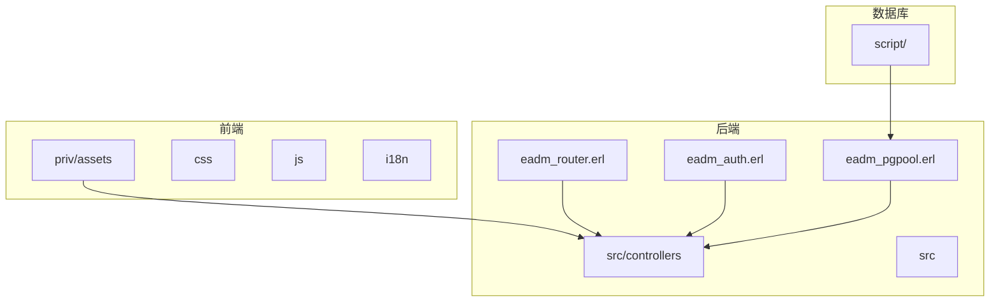
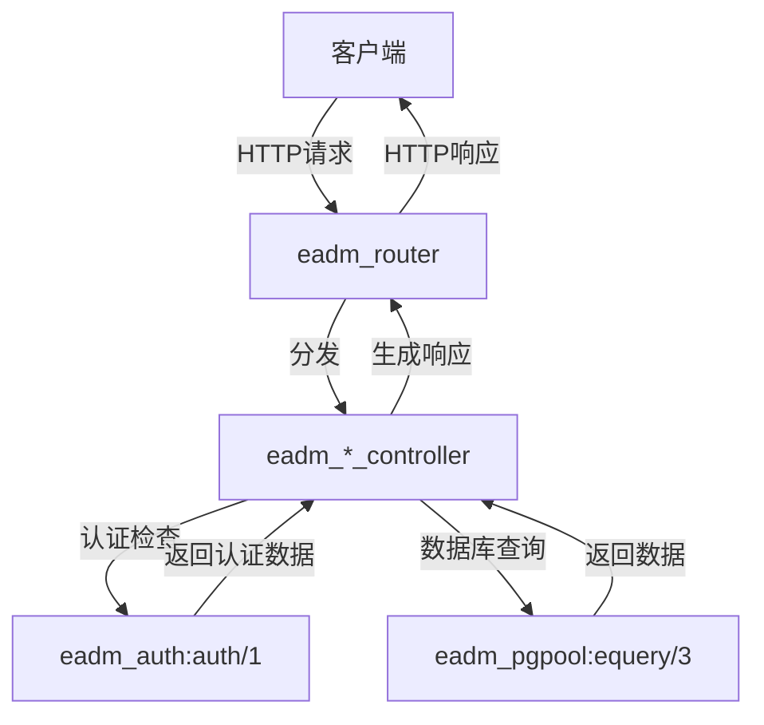
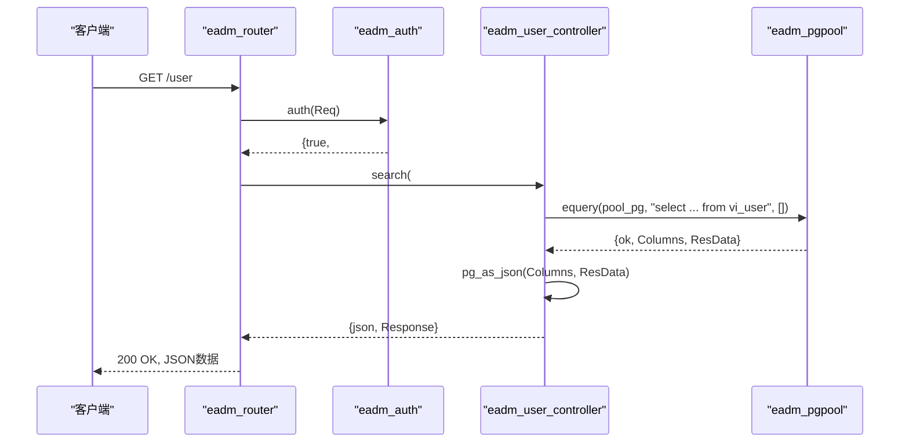
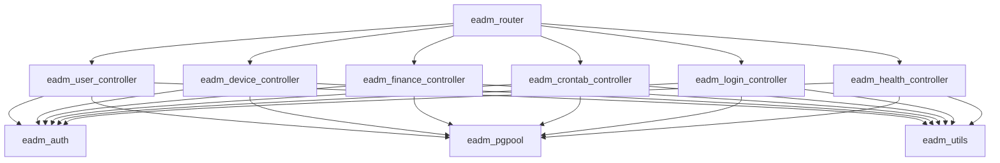

# 控制器模块

<cite>
**本文档中引用的文件**  
- [eadm_router.erl](file://src/eadm_router.erl)
- [eadm_auth.erl](file://src/eadm_auth.erl)
- [eadm_user_controller.erl](file://src/controllers/eadm_user_controller.erl)
- [eadm_login_controller.erl](file://src/controllers/eadm_login_controller.erl)
- [eadm_device_controller.erl](file://src/controllers/eadm_device_controller.erl)
- [eadm_finance_controller.erl](file://src/controllers/eadm_finance_controller.erl)
- [eadm_health_controller.erl](file://src/controllers/eadm_health_controller.erl)
- [eadm_crontab_controller.erl](file://src/controllers/eadm_crontab_controller.erl)
</cite>

## 目录
1. [简介](#简介)
2. [项目结构](#项目结构)
3. [核心组件](#核心组件)
4. [架构概览](#架构概览)
5. [详细组件分析](#详细组件分析)
6. [依赖分析](#依赖分析)
7. [性能考虑](#性能考虑)
8. [故障排除指南](#故障排除指南)
9. [结论](#结论)

## 简介
本文档旨在系统性地解释 `eadm_*_controller.erl` 系列控制器模块的职责与实现机制。这些模块构成了系统的核心业务逻辑处理层，遵循MVC（Model-View-Controller）模式，负责处理所有HTTP请求。文档将详细说明请求的完整生命周期，包括路径映射、参数解析、会话验证、数据库交互及响应生成。通过分析 `eadm_user_controller.erl` 等具体实例，揭示各控制器共有的设计模式，如统一的错误处理、日志记录和认证前置检查，为新功能开发提供模板参考。

## 项目结构
系统采用分层架构，控制器模块集中存放在 `src/controllers/` 目录下，每个控制器文件负责一个特定业务领域的请求处理。前端静态资源（CSS、JS、i18n）位于 `priv/assets/`，数据库脚本位于 `script/` 目录。核心逻辑由 `src/` 目录下的Erlang模块实现，其中 `eadm_router.erl` 负责全局路由分发，`eadm_auth.erl` 提供认证服务，`eadm_pgpool.erl` 处理数据库连接。

**图示来源**
- [eadm_router.erl](file://src/eadm_router.erl)
- [eadm_auth.erl](file://src/eadm_auth.erl)
- [eadm_pgpool.erl](file://src/eadm_pgpool.erl)

**本节来源**
- [eadm_router.erl](file://src/eadm_router.erl)
- [eadm_auth.erl](file://src/eadm_auth.erl)

## 核心组件
核心组件包括路由分发器 `eadm_router`、认证服务 `eadm_auth` 和一系列业务控制器。`eadm_router` 根据请求路径和方法，将请求精准地分发到对应的控制器函数。`eadm_auth` 模块通过 `auth/1` 函数实现会话验证，检查用户登录状态和权限。各 `eadm_*_controller` 模块则封装了具体的业务逻辑，如用户管理、设备控制、财务查询等，它们通过调用 `eadm_pgpool` 模块与数据库进行交互。

**本节来源**
- [eadm_router.erl](file://src/eadm_router.erl)
- [eadm_auth.erl](file://src/eadm_auth.erl)
- [eadm_user_controller.erl](file://src/controllers/eadm_user_controller.erl)

## 架构概览
系统采用基于Cowboy的Web服务器，通过 `nova_router` 行为模式实现路由。整体架构遵循MVC模式，`eadm_router` 作为路由层，`eadm_*_controller` 作为控制器层，`eadm_pgpool` 作为模型层与数据库交互。认证机制通过 `security` 钩子集成，确保受保护的路由在执行前完成权限校验。

**图示来源**
- [eadm_router.erl](file://src/eadm_router.erl)
- [eadm_auth.erl](file://src/eadm_auth.erl)
- [eadm_user_controller.erl](file://src/controllers/eadm_user_controller.erl)

## 详细组件分析
本节将深入分析各个控制器模块的实现细节，揭示其共有的设计模式和处理流程。

### 用户控制器分析
`eadm_user_controller.erl` 是处理用户管理的核心模块，其功能边界涵盖用户列表查询、增删改查、密码重置、角色分配等。

#### 路径映射与MVC处理流程
以用户列表查询为例，展示完整的MVC处理流程：
1.  **路径映射**：当客户端发起 `GET /user` 请求时，`eadm_router` 根据路由规则 `#{prefix => "", security => {eadm_auth, auth}, routes => [{"/user", fun eadm_user_controller:search/1, ...}]}`，将请求分发到 `eadm_user_controller:search/1` 函数。
2.  **会话验证**：由于该路由配置了 `security => {eadm_auth, auth}`，`eadm_auth:auth/1` 函数会在 `search/1` 执行前被调用。它检查会话中的 `exp`（过期时间）和 `loginname` 等信息，验证用户是否已登录。
3.  **权限校验与业务逻辑**：`search/1` 函数接收一个包含 `auth_data` 的请求映射。它首先模式匹配 `auth_data`，确保用户已认证且拥有 `usermanage` 权限。若校验通过，则调用 `eadm_pgpool:equery/3` 执行SQL查询 `select id, tenantname, loginname, username, email, userstatus, createdat from vi_user order by createdat;`。
4.  **响应生成**：查询结果通过 `eadm_utils:pg_as_json/2` 转换为JSON格式，并以 `{json, Response}` 的元组形式返回，最终由框架序列化为HTTP响应。

**图示来源**
- [eadm_router.erl](file://src/eadm_router.erl#L37-L63)
- [eadm_auth.erl](file://src/eadm_auth.erl#L15-L48)
- [eadm_user_controller.erl](file://src/controllers/eadm_user_controller.erl#L60-L80)

#### 共有设计模式
所有控制器模块都遵循以下统一的设计模式：
-   **统一的错误处理结构**：每个API函数都使用 `try...catch` 块包裹核心逻辑。捕获到异常后，使用 `lager:error/2` 记录错误日志，并返回一个包含用户友好提示的JSON响应，如 `{json, [#{<<"Alert">> => unicode:characters_to_binary("用户查询失败！", utf8)}]}`。
-   **日志记录方式**：广泛使用 `lager` 模块进行日志记录，`lager:info/2` 用于记录操作成功或流程信息，`lager:error/2` 用于记录错误和异常，便于问题追踪和系统监控。
-   **认证前置检查**：通过 `eadm_router` 的 `security` 钩子，实现了认证的集中化管理。控制器函数通过模式匹配 `#{auth_data := #{<<"authed">> := true}}` 来确保只有通过认证的请求才能执行后续逻辑，未认证的请求会被重定向到 `/login`。

**本节来源**
- [eadm_user_controller.erl](file://src/controllers/eadm_user_controller.erl)
- [eadm_login_controller.erl](file://src/controllers/eadm_login_controller.erl)
- [eadm_device_controller.erl](file://src/controllers/eadm_device_controller.erl)

### 其他控制器功能边界与调用关系
-   **登录控制器 (`eadm_login_controller.erl`)**：负责用户登录 (`login/1`)、退出 (`logout/1`)、个人信息查询 (`userinfo/1`) 和密码修改 (`userpwd/1`)。它是所有受保护资源访问的入口。
-   **设备控制器 (`eadm_device_controller.erl`)**：管理设备的全生命周期，包括增删改查 (`add/1`, `delete/1`, `edit/1`)、状态切换 (`toggle_status/1`) 以及设备与用户的分配关系 (`assign/1`, `unassign/1`)。
-   **财务控制器 (`eadm_finance_controller.erl`)**：提供财务数据的查询 (`search/1`, `searchdetail/1`)、删除 (`delete/1`) 和批量导入 (`upload/1`) 功能，支持按时间、类型等条件筛选。
-   **健康控制器 (`eadm_health_controller.erl`)**：查询用户的健康数据，如步数、心率、体温等，数据来源为可穿戴设备。
-   **定时任务控制器 (`eadm_crontab_controller.erl`)**：管理系统的定时任务，支持任务的增删改查、状态切换（启用/禁用）和日志查看。其 `init/0` 函数在应用启动时加载并调度所有激活的任务。
-   **系统监控控制器**：`eadm_sys_*_controller.erl` 系列模块提供系统级别的信息查询，如进程、端口、系统信息等，用于系统监控和维护。

这些控制器通过 `eadm_router` 定义的路由相互关联，共同构成了系统的业务功能网络。例如，用户管理功能需要与角色、权限等模块协同工作。

**本节来源**
- [eadm_router.erl](file://src/eadm_router.erl)
- [eadm_login_controller.erl](file://src/controllers/eadm_login_controller.erl)
- [eadm_device_controller.erl](file://src/controllers/eadm_device_controller.erl)
- [eadm_finance_controller.erl](file://src/controllers/eadm_finance_controller.erl)
- [eadm_health_controller.erl](file://src/controllers/eadm_health_controller.erl)
- [eadm_crontab_controller.erl](file://src/controllers/eadm_crontab_controller.erl)

## 依赖分析
控制器模块的依赖关系清晰，体现了良好的分层设计。

**图示来源**
- [eadm_router.erl](file://src/eadm_router.erl)
- [eadm_auth.erl](file://src/eadm_auth.erl)
- [eadm_user_controller.erl](file://src/controllers/eadm_user_controller.erl)

**本节来源**
- [eadm_router.erl](file://src/eadm_router.erl)
- [eadm_auth.erl](file://src/eadm_auth.erl)
- [eadm_user_controller.erl](file://src/controllers/eadm_user_controller.erl)

## 性能考虑
-   **数据库查询**：所有数据操作都通过 `eadm_pgpool` 进行连接池管理，避免了频繁创建和销毁数据库连接的开销。
-   **权限缓存**：用户的权限信息在登录时查询并存储在会话中，后续请求无需重复查询数据库，提高了响应速度。
-   **输入验证**：在执行数据库操作前，控制器会对输入参数进行严格验证（如 `validate_password/1`），防止无效或恶意数据进入系统，保障了数据库的稳定性和安全性。

## 故障排除指南
-   **API鉴权失败**：检查请求是否携带了有效的会话Cookie，或用户是否拥有执行该操作的权限。
-   **数据库操作失败**：查看 `lager` 日志中的错误信息，确认SQL语句、参数或数据库连接是否存在问题。
-   **功能无响应**：确认 `eadm_router` 中的路由配置是否正确，目标控制器函数是否存在。

**本节来源**
- [eadm_auth.erl](file://src/eadm_auth.erl)
- [eadm_user_controller.erl](file://src/controllers/eadm_user_controller.erl)

## 结论
`eadm_*_controller.erl` 模块通过遵循MVC模式和统一的设计规范，实现了清晰、可维护的业务逻辑。`eadm_router` 提供了灵活的路由配置，`eadm_auth` 确保了系统的安全性。新增一个控制器的流程简单：创建新的 `.erl` 文件，导出处理函数，在 `eadm_router.erl` 中添加相应的路由规则，并确保其遵循已有的错误处理和认证检查模式。这种设计极大地提升了开发效率和代码质量。