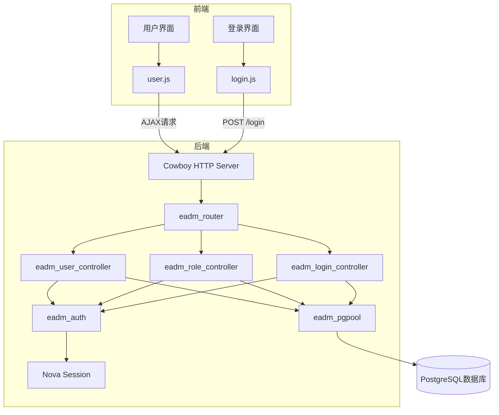
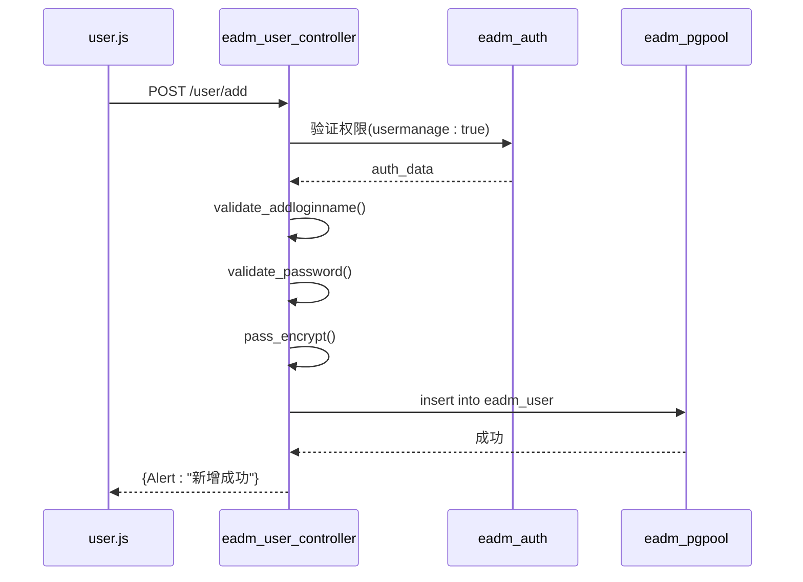
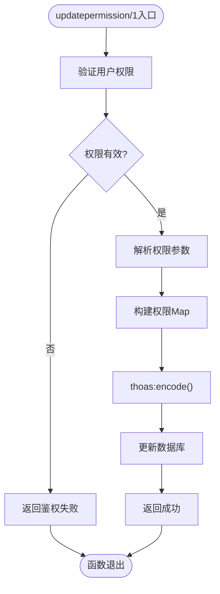
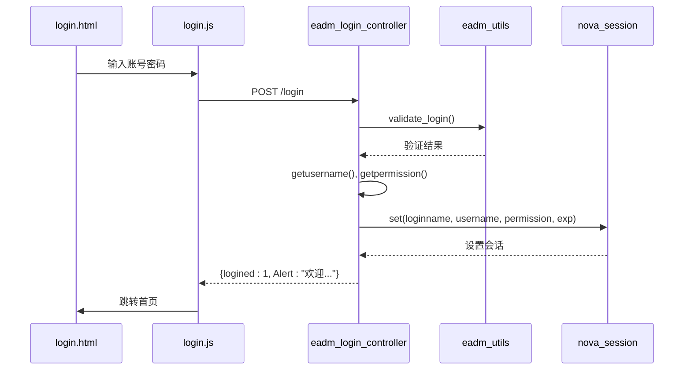
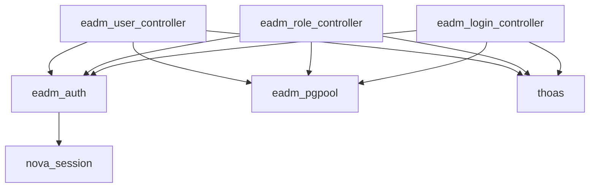

# 用户管理控制器

<cite>
**本文档中引用的文件**  
- [eadm_user_controller.erl](file://src/controllers/eadm_user_controller.erl)
- [eadm_role_controller.erl](file://src/controllers/eadm_role_controller.erl)
- [eadm_login_controller.erl](file://src/controllers/eadm_login_controller.erl)
- [eadm_auth.erl](file://src/eadm_auth.erl)
- [user.js](file://priv/assets/js/user.js)
- [login.js](file://priv/assets/js/login.js)
</cite>

## 目录
1. [简介](#简介)
2. [项目结构](#项目结构)
3. [核心组件](#核心组件)
4. [架构概述](#架构概述)
5. [详细组件分析](#详细组件分析)
6. [依赖分析](#依赖分析)
7. [性能考虑](#性能考虑)
8. [故障排除指南](#故障排除指南)
9. [结论](#结论)

## 简介
本文档深入分析用户管理系统中的三个核心控制器：`eadm_user_controller.erl`、`eadm_role_controller.erl` 和 `eadm_login_controller.erl`。重点阐述其职责划分、前后端交互流程、权限控制机制及安全防护措施，旨在为开发人员提供全面的技术参考。

## 项目结构
用户管理功能分布在后端Erlang控制器与前端JavaScript脚本中，通过RESTful API进行通信。系统采用模块化设计，职责清晰。

**中文(中文)**
- [eadm_user_controller.erl](file://src/controllers/eadm_user_controller.erl)：处理用户信息的增删改查及角色分配
- [eadm_role_controller.erl](file://src/controllers/eadm_role_controller.erl)：管理角色定义与权限配置
- [eadm_login_controller.erl](file://src/controllers/eadm_login_controller.erl)：实现登录认证与会话管理
- [eadm_auth.erl](file://src/eadm_auth.erl)：提供统一的身份验证中间件
- [user.js](file://priv/assets/js/user.js)：用户管理页面的前端交互逻辑
- [login.js](file://priv/assets/js/login.js)：登录页面的前端行为控制

## 核心组件
系统围绕用户、角色和登录三大核心功能构建，通过RBAC权限模型实现细粒度访问控制。

**中文(中文)**
- 用户管理：支持用户全生命周期操作（增删改查、启禁用、密码重置）
- 角色权限：实现基于角色的权限分配与更新
- 登录认证：完成表单提交、身份验证、会话创建全过程
- 统一鉴权：通过`eadm_auth`模块实现跨控制器的权限校验

## 架构概述
系统采用典型的前后端分离架构，前端通过AJAX调用后端REST API，后端基于Cowboy Web框架处理请求，并通过`eadm_pgpool`与PostgreSQL数据库交互。



**中文(中文)**
- [eadm_user_controller.erl](file://src/controllers/eadm_user_controller.erl#L1-L480)
- [eadm_role_controller.erl](file://src/controllers/eadm_role_controller.erl#L1-L247)
- [eadm_login_controller.erl](file://src/controllers/eadm_login_controller.erl#L1-L244)
- [eadm_auth.erl](file://src/eadm_auth.erl#L1-L48)
- [user.js](file://priv/assets/js/user.js#L1-L555)
- [login.js](file://priv/assets/js/login.js#L1-L75)

## 详细组件分析

### 用户控制器分析
`eadm_user_controller.erl`负责用户信息的全生命周期管理，包括增删改查、启禁用、密码重置及角色分配等操作。

#### 功能职责
- **用户查询**：通过`search/1`函数实现用户列表分页展示
- **用户新增**：`add/1`函数处理用户注册，包含密码加密存储
- **用户编辑**：`edit/1`函数更新用户基本信息
- **密码重置**：`reset/1`函数将密码重置为默认值"123456"
- **启禁用操作**：`disable/1`函数切换用户状态
- **删除操作**：`delete/1`函数执行软删除
- **角色管理**：`userroleadd/1`和`userroledel/1`处理用户-角色关联



**中文(中文)**
- [eadm_user_controller.erl](file://src/controllers/eadm_user_controller.erl#L1-L480)
- [user.js](file://priv/assets/js/user.js#L1-L555)

### 角色控制器分析
`eadm_role_controller.erl`专注于角色与权限的管理，支持角色的增删改查及权限配置。

#### 权限模型
系统采用嵌套Map结构表示权限体系：
```erlang
#{<<"dashboard">> => true,
  <<"health">> => true,
  <<"finance">> => #{<<"finlist">> => true, <<"finimp">> => false, <<"findel">> => false},
  <<"device">> => #{<<"devlist">> => true, <<"devadd">> => false, <<"devedit">> => false, <<"devdel">> => false, <<"devassign">> => false},
  <<"crontab">> => true,
  <<"usermanage">> => true}
```



**中文(中文)**
- [eadm_role_controller.erl](file://src/controllers/eadm_role_controller.erl#L1-L247)
- [eadm_utils.erl](file://src/eadm_utils.erl)

### 登录控制器分析
`eadm_login_controller.erl`处理用户登录、登出及个人信息管理，是系统安全的第一道防线。

#### 登录流程


**中文(中文)**
- [eadm_login_controller.erl](file://src/controllers/eadm_login_controller.erl#L1-L244)
- [login.js](file://priv/assets/js/login.js#L1-L75)
- [eadm_utils.erl](file://src/eadm_utils.erl)

### 前端交互分析
前端通过jQuery实现丰富的用户交互体验，与后端API无缝对接。

#### AJAX请求示例
```javascript
$.ajax({
    url: '/user/add',
    type: 'POST',
    data: {
        loginName: 'testuser',
        email: 'test@example.com',
        userName: '测试用户',
        password: '123456'
    },
    success: function(resdata) {
        // 处理响应
    }
});
```

#### JSON响应结构
```json
[
    {
        "Alert": "用户【测试用户】新增成功！"
    }
]
```

错误响应：
```json
[
    {
        "Alert": "API鉴权失败！"
    }
]
```

**中文(中文)**
- [user.js](file://priv/assets/js/user.js#L1-L555)
- [login.js](file://priv/assets/js/login.js#L1-L75)

## 依赖分析
各组件之间存在明确的依赖关系，形成完整的用户管理体系。



**中文(中文)**
- [eadm_auth.erl](file://src/eadm_auth.erl#L1-L48)
- [eadm_pgpool.erl](file://src/eadm_pgpool.erl)
- [thoas](https://github.com/talentdeficit/thoas)

## 性能考虑
- **数据库查询优化**：使用连接池`pool_pg`提高数据库访问效率
- **会话管理**：通过`nova_session`实现高效会话存储与刷新机制
- **密码加密**：采用标准加密算法确保密码安全
- **前端渲染**：使用DataTables实现大数据量下的流畅分页展示

## 故障排除指南
### 常见问题
1. **登录失败**：检查账号密码是否正确，用户是否被禁用
2. **权限不足**：确认当前用户是否具有`usermanage`权限
3. **数据未更新**：检查数据库事务是否提交，前端是否刷新
4. **会话超时**：系统会话有效期由`eadm_utils:get_exp_bin()`控制

### 错误码设计
- `200`：操作成功，返回Alert信息
- `302`：未登录，重定向到登录页
- `403`：权限不足，返回"API鉴权失败！"
- 服务端异常：返回具体错误描述

**中文(中文)**
- [eadm_user_controller.erl](file://src/controllers/eadm_user_controller.erl#L1-L480)
- [eadm_role_controller.erl](file://src/controllers/eadm_role_controller.erl#L1-L247)
- [eadm_login_controller.erl](file://src/controllers/eadm_login_controller.erl#L1-L244)

## 结论
本系统通过三个核心控制器实现了完整的用户管理功能，采用RBAC权限模型确保安全性，前后端分离架构提升可维护性。代码结构清晰，职责分明，具备良好的扩展性和稳定性，为系统权限管理提供了坚实基础。