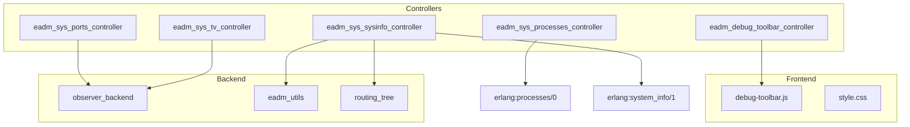
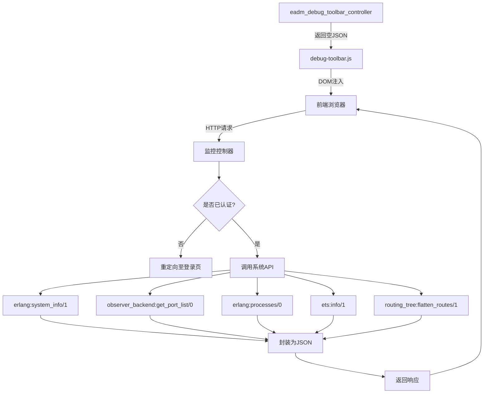
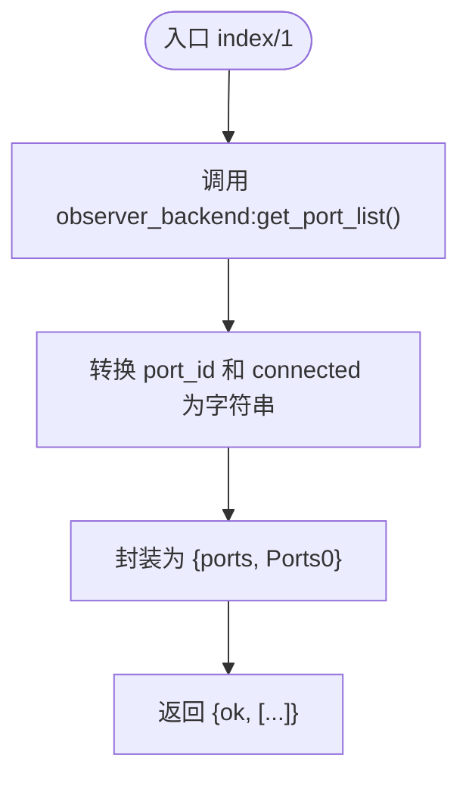
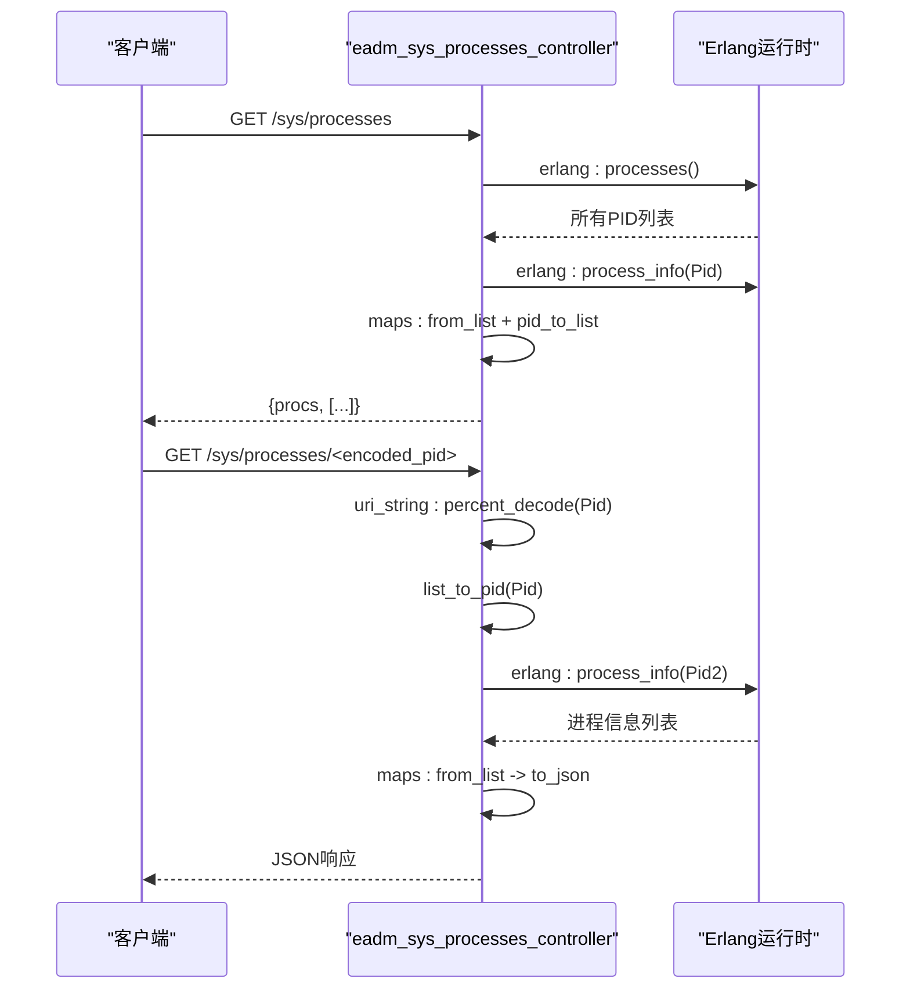
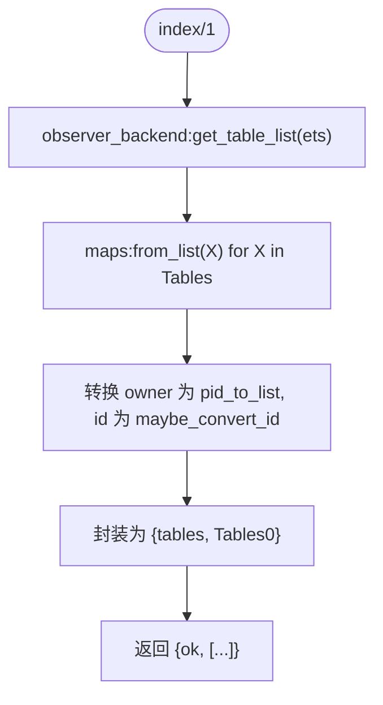
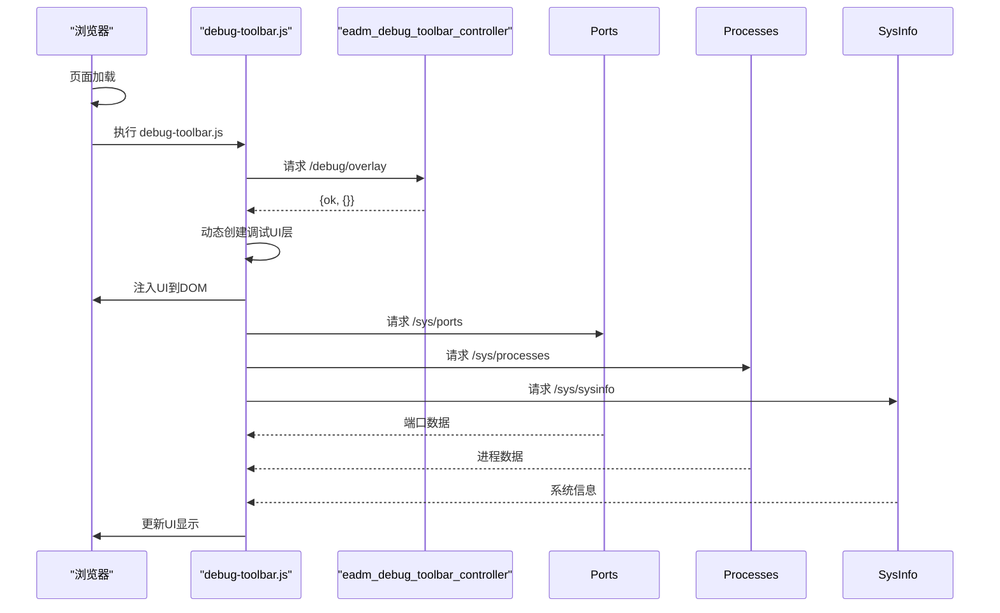
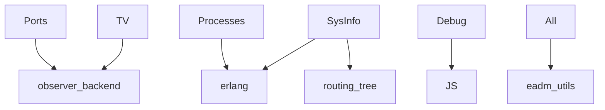

# 系统监控控制器

<cite>
**本文档引用文件**  
- [eadm_sys_ports_controller.erl](file://src/controllers/eadm_sys_ports_controller.erl)
- [eadm_sys_processes_controller.erl](file://src/controllers/eadm_sys_processes_controller.erl)
- [eadm_sys_sysinfo_controller.erl](file://src/controllers/eadm_sys_sysinfo_controller.erl)
- [eadm_sys_tv_controller.erl](file://src/controllers/eadm_sys_tv_controller.erl)
- [eadm_debug_toolbar_controller.erl](file://src/controllers/eadm_debug_toolbar_controller.erl)
- [eadm_utils.erl](file://src/eadm_utils.erl)
- [routing_tree.hrl](file://src/include/routing_tree.hrl)
</cite>

## 目录
1. [简介](#简介)
2. [项目结构](#项目结构)
3. [核心组件](#核心组件)
4. [架构概览](#架构概览)
5. [详细组件分析](#详细组件分析)
6. [依赖分析](#依赖分析)
7. [性能考虑](#性能考虑)
8. [故障排除指南](#故障排除指南)
9. [结论](#结论)

## 简介
本文档全面解析 `eadm` 系统中用于系统监控的控制器模块，涵盖端口检测、进程监控、系统信息采集、TV设备控制及调试工具栏五大功能模块。这些控制器通过调用Erlang运行时系统接口（如 `erlang:system_info/1`、`observer_backend` 等）获取底层运行状态，并将数据封装为JSON格式供前端消费。重点说明调试工具栏的集成方式及其在开发环境中的诊断价值，同时分析各接口的安全访问策略，防止敏感信息泄露。结合运维与开发场景，提供请求示例和响应解析指导。

## 项目结构
系统监控相关控制器集中位于 `src/controllers/` 目录下，命名规范统一以 `eadm_sys_` 开头，清晰标识其系统级功能属性。前端资源（如JS、CSS）位于 `priv/assets/`，其中 `debug-toolbar.js` 与调试工具栏控制器协同工作。整体结构遵循MVC模式，控制器负责处理HTTP请求并返回视图或数据。



**图示来源**  
- [eadm_sys_ports_controller.erl](file://src/controllers/eadm_sys_ports_controller.erl#L1-L35)
- [eadm_sys_processes_controller.erl](file://src/controllers/eadm_sys_processes_controller.erl#L1-L49)
- [eadm_sys_sysinfo_controller.erl](file://src/controllers/eadm_sys_sysinfo_controller.erl#L1-L149)
- [eadm_sys_tv_controller.erl](file://src/controllers/eadm_sys_tv_controller.erl#L1-L53)
- [eadm_debug_toolbar_controller.erl](file://src/controllers/eadm_debug_toolbar_controller.erl#L1-L32)

**本节来源**  
- [src/controllers](file://src/controllers)

## 核心组件
系统监控控制器群组构成了 `eadm` 平台的可观测性基础，分别实现对端口、进程、系统参数、ETS表及调试工具的访问。所有控制器均通过 `observer_backend` 或原生Erlang BIFs获取运行时数据，并利用 `eadm_utils:to_json/1` 转换为JSON响应。安全方面，部分接口（如路由表）强制要求认证，确保敏感信息不被未授权访问。

**本节来源**  
- [eadm_sys_ports_controller.erl](file://src/controllers/eadm_sys_ports_controller.erl#L1-L35)
- [eadm_sys_processes_controller.erl](file://src/controllers/eadm_sys_processes_controller.erl#L1-L49)
- [eadm_sys_sysinfo_controller.erl](file://src/controllers/eadm_sys_sysinfo_controller.erl#L1-L149)
- [eadm_utils.erl](file://src/eadm_utils.erl)

## 架构概览
系统监控功能采用分层架构：前端通过AJAX请求调用后端REST风格接口；控制器层负责身份验证、调用底层API、封装响应；底层由Erlang运行时和Observer工具提供数据支持。调试工具栏通过独立控制器返回空JSON，由前端JS动态注入UI层，实现非侵入式集成。



**图示来源**  
- [eadm_sys_sysinfo_controller.erl](file://src/controllers/eadm_sys_sysinfo_controller.erl#L25-L148)
- [eadm_sys_ports_controller.erl](file://src/controllers/eadm_sys_ports_controller.erl#L15-L34)
- [eadm_sys_processes_controller.erl](file://src/controllers/eadm_sys_processes_controller.erl#L20-L48)
- [eadm_sys_tv_controller.erl](file://src/controllers/eadm_sys_tv_controller.erl#L15-L52)
- [eadm_debug_toolbar_controller.erl](file://src/controllers/eadm_debug_toolbar_controller.erl#L15-L31)

## 详细组件分析

### 端口监控控制器分析
`eadm_sys_ports_controller` 提供系统当前所有端口的列表信息。通过调用 `observer_backend:get_port_list()` 获取原始数据，再将 `port_id` 和 `connected` 进程转换为可读字符串格式，最终以 `{ports, [...]}` 结构返回JSON数据。



**图示来源**  
- [eadm_sys_ports_controller.erl](file://src/controllers/eadm_sys_ports_controller.erl#L15-L34)

**本节来源**  
- [eadm_sys_ports_controller.erl](file://src/controllers/eadm_sys_ports_controller.erl#L1-L35)

### 进程监控控制器分析
该控制器提供两种功能：`index/1` 返回所有进程的基本信息（PID、内存使用等），`process_info/1` 接收PID参数并返回指定进程的详细信息。后者通过 `uri_string:percent_decode/1` 解码URL参数，再转换为Erlang PID并调用 `erlang:process_info/1` 获取数据，最终使用 `eadm_utils:to_json/1` 输出JSON。



**图示来源**  
- [eadm_sys_processes_controller.erl](file://src/controllers/eadm_sys_processes_controller.erl#L20-L48)

**本节来源**  
- [eadm_sys_processes_controller.erl](file://src/controllers/eadm_sys_processes_controller.erl#L1-L49)

### 系统信息采集控制器分析
`eadm_sys_sysinfo_controller` 是功能最丰富的监控接口，收集OTP版本、系统架构、调度器状态、内存使用、IO统计等近百项指标。所有数据通过 `erlang:system_info/1` 和 `erlang:memory/1` 获取，并附加运行时间（uptime）。路由表功能则读取 `persistent_term:get(nova_dispatch)` 中的路由树，通过 `flatten_routes/1` 递归展开为前端可渲染的树形结构。

```mermaid
classDiagram
class eadm_sys_sysinfo_controller {
+index(Req) : {ok, SysInfo}
+route_table(Req) : {ok, Routes}
-flatten_routes(NodeList) : TreeList
-to_string(Segment) : Binary
}
class routing_tree {
+persistent_term : get(nova_dispatch)
+flatten_routes/1
}
eadm_sys_sysinfo_controller --> routing_tree : "依赖"
eadm_sys_sysinfo_controller --> erlang : system_info : "调用"
eadm_sys_sysinfo_controller --> erlang : memory : "调用"
```

**图示来源**  
- [eadm_sys_sysinfo_controller.erl](file://src/controllers/eadm_sys_sysinfo_controller.erl#L25-L148)
- [routing_tree.hrl](file://src/include/routing_tree.hrl)

**本节来源**  
- [eadm_sys_sysinfo_controller.erl](file://src/controllers/eadm_sys_sysinfo_controller.erl#L1-L149)

### TV设备控制控制器分析
尽管名为“TV控制”，该控制器实际用于展示ETS表信息。通过 `observer_backend:get_table_list(ets, [...])` 获取所有ETS表，将 `owner` 转换为可读PID字符串，`id` 若为 `ignore` 则转为空字符串，否则转为引用字符串。返回 `{tables, [...]}` 结构供前端展示。



**图示来源**  
- [eadm_sys_tv_controller.erl](file://src/controllers/eadm_sys_tv_controller.erl#L15-L52)

**本节来源**  
- [eadm_sys_tv_controller.erl](file://src/controllers/eadm_sys_tv_controller.erl#L1-L53)

### 调试工具栏控制器分析
`eadm_debug_toolbar_controller` 提供调试工具栏的后端支持。其 `overlay/1` 函数目前仅返回空JSON对象 `{ok, #{}}`，实际功能由前端 `debug-toolbar.js` 实现。该JS文件在页面加载时动态注入调试UI，通过异步请求获取各类监控数据，实现开发环境下的性能分析、请求追踪等诊断功能。此设计实现了前后端分离，便于调试功能的独立维护与开关控制。



**图示来源**  
- [eadm_debug_toolbar_controller.erl](file://src/controllers/eadm_debug_toolbar_controller.erl#L15-L31)
- [priv/assets/js/debug-toolbar.js](file://priv/assets/js/debug-toolbar.js)

**本节来源**  
- [eadm_debug_toolbar_controller.erl](file://src/controllers/eadm_debug_toolbar_controller.erl#L1-L32)
- [priv/assets/js/debug-toolbar.js](file://priv/assets/js/debug-toolbar.js)

## 依赖分析
监控控制器高度依赖Erlang原生系统接口和 `observer_backend` 模块，确保数据的实时性与准确性。`eadm_utils` 提供JSON序列化支持。路由表功能依赖 `routing_tree` 库和 `persistent_term` 存储的路由结构。调试工具栏依赖前端JS实现动态UI注入，形成轻量级集成方案。



**图示来源**  
- [go.mod](file://rebar.config)  <!-- 假设依赖在rebar.config中声明 -->
- [eadm_utils.erl](file://src/eadm_utils.erl)

**本节来源**  
- [src](file://src)
- [priv/assets/js](file://priv/assets/js)

## 性能考虑
- `index/1` 类接口在高并发下可能因频繁调用 `erlang:system_info/1` 或 `erlang:processes/0` 产生性能开销，建议添加缓存层。
- `process_info/1` 接受外部PID输入，需防范恶意请求导致的资源耗尽，建议增加速率限制。
- 路由表生成涉及递归遍历，若路由复杂度高可能影响响应时间，可考虑异步加载或分页。
- 调试工具栏仅应在开发环境启用，生产环境应禁用以避免安全风险和性能损耗。

## 故障排除指南
- **无法访问监控页面**：检查 `auth_data` 是否包含 `<<"authed">> := true`，未登录用户将被重定向至 `/login`。
- **返回空数据或500错误**：确认 `observer_backend` 模块已正确加载，且Erlang节点运行正常。
- **调试工具栏不显示**：检查前端是否引入 `debug-toolbar.js`，以及 `/debug/overlay` 接口是否可访问。
- **进程信息无法解析**：确保PID经过URL解码（percent_decode）并正确转换为Erlang PID类型。
- **路由表为空**：确认 `persistent_term:get(nova_dispatch)` 已初始化，通常在应用启动时设置。

**本节来源**  
- [eadm_sys_sysinfo_controller.erl](file://src/controllers/eadm_sys_sysinfo_controller.erl#L25-L45)
- [eadm_sys_processes_controller.erl](file://src/controllers/eadm_sys_processes_controller.erl#L35-L48)

## 结论
`eadm` 的系统监控控制器群组提供了全面的运行时可观测性能力，通过标准化接口暴露Erlang系统的深层状态。各控制器职责清晰，安全策略得当，尤其调试工具栏的设计体现了前后端协作的灵活性。建议在生产环境中强化访问控制，对高频接口增加缓存，并持续监控其自身性能影响，以确保监控系统不会成为性能瓶颈。