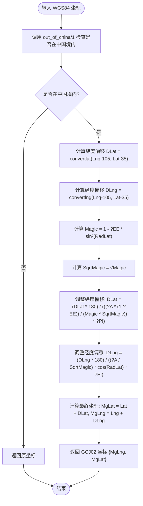

# 工具支持

<cite>
**本文档引用的文件**  
- [eadm_utils.erl](file://src/eadm_utils.erl)
- [eadm_geo.erl](file://src/eadm_geo.erl)
</cite>

## 目录
1. [简介](#简介)
2. [核心工具函数模块 (eadm_utils)](#核心工具函数模块-eadm_utils)
3. [地理坐标转换模块 (eadm_geo)](#地理坐标转换模块-eadm_geo)
4. [使用示例](#使用示例)
5. [总结](#总结)

## 简介
本技术文档旨在全面解析 `eadm_utils.erl` 和 `eadm_geo.erl` 两个核心模块的功能与实现机制。`eadm_utils.erl` 提供了通用的数据结构转换、时间处理、密码加密、日志记录等工具函数；`eadm_geo.erl` 实现了从国际标准 WGS84 坐标系到中国国家标准 GCJ02（火星坐标系）的坐标转换算法。本文档将详细说明各函数的用途、实现逻辑及使用方式，为开发者提供清晰的技术参考。

## 核心工具函数模块 eadm_utils

该模块封装了系统中广泛使用的通用功能，涵盖数据格式转换、数据库结果处理、时间操作、安全加密和日志管理等方面。

### 数据结构与JSON转换
`to_json/1` 函数递归地将 Erlang 原生数据结构（如列表、元组、映射、PID、端口、引用等）转换为 JSON 兼容的格式。它通过模式匹配识别不同类型的数据，并进行相应的转换处理，确保复杂嵌套结构也能被正确序列化。

**Section sources**
- [eadm_utils.erl](file://src/eadm_utils.erl#L33-L48)

### 会话过期时间计算
`get_exp_bin/0` 函数用于获取当前时间加上配置的会话过期时长后的绝对时间戳（以秒为单位）。该函数读取应用配置 `nova` 中的 `session_expire` 参数（默认为3600秒），并将其加到当前系统时间上，常用于生成 session token 的过期时间。

**Section sources**
- [eadm_utils.erl](file://src/eadm_utils.erl#L51-L55)

### 数据库查询结果转换
`as_map/3` 和 `return_as_map/2` 函数用于将数据库查询返回的列名和行数据转换为 Erlang 的 map 结构，便于后续处理。`as_map/3` 将每一行数据与列名配对，生成一个 map 列表；`return_as_map/2` 在此基础上封装，返回包含 `"data"` 键的标准响应格式。

**Section sources**
- [eadm_utils.erl](file://src/eadm_utils.erl#L58-L84)

### 时间字符串处理
`validate_date_time/1` 使用正则表达式 `?DATE_TIME_PATTERN` 验证输入的二进制字符串是否符合 `YYYY-MM-DD HH:MM:SS` 格式。`parse_date_time/1` 则将符合格式的时间字符串解析为 Erlang 的 `{{Year, Month, Day}, {Hour, Minute, Second}}` 时间元组，供后续时间计算使用。

**Section sources**
- [eadm_utils.erl](file://src/eadm_utils.erl#L124-L134)
- [eadm_utils.erl](file://src/eadm_utils.erl#L177-L188)

### 密码加盐哈希
`pass_encrypt/1` 和 `verify_password/2` 实现了基于 SHA256 的密码加密与验证。加密时，函数从应用配置中获取 `secret_key`，将其与原始密码拼接后进行哈希运算，并将结果 Base64 编码存储。验证时，对输入密码执行相同操作，并与数据库中存储的哈希值进行比较，确保安全性。

**Section sources**
- [eadm_utils.erl](file://src/eadm_utils.erl#L199-L218)

### 日志记录
`log_info/1` 函数实现了多目标日志输出。它首先将消息记录到 Lager 日志系统，然后尝试将消息插入数据库的 `sys_cronlog` 表中。函数会自动获取当前任务 ID（通过 `erlang:get(current_job_id)`），并在捕获异常时记录错误信息，确保日志的完整性和可追溯性。

**Section sources**
- [eadm_utils.erl](file://src/eadm_utils.erl#L220-L258)

## 地理坐标转换模块 eadm_geo

该模块实现了从国际通用的 WGS84 坐标系到中国国内使用的 GCJ02（火星坐标系）的转换算法，主要用于地图服务的坐标纠偏。

### 坐标转换主函数
`wgs84_to_gcj02/1` 是核心转换函数，接收一个 `{经度, 纬度}` 的元组作为输入。它首先调用 `out_of_china/1` 判断该坐标点是否位于中国境内。若不在境内，则直接返回原坐标；若在境内，则通过 `convertlat/2` 和 `convertlng/2` 计算经纬度偏移量，并结合地球椭球参数进行复杂的数学运算，最终返回转换后的 GCJ02 坐标。



**Diagram sources**
- [eadm_geo.erl](file://src/eadm_geo.erl#L32-L48)

### 内部算法函数与常量
- `out_of_china/1`：根据中国地理边界（经度 73.66~135.05，纬度 3.86~53.55）判断坐标点是否位于中国境内。
- `convertlat/2` 和 `convertlng/2`：基于多项式和正弦函数的复杂算法，计算 WGS84 到 GCJ02 的经纬度偏移量。
- `sin_convert/3` 和 `sin_convert/4`：辅助正弦计算函数，用于增强偏移算法的非线性特征。
- `?PI`：圆周率 π 的高精度近似值。
- `?X_PI`：3 倍的 π，用于某些内部计算。
- `?A`：地球椭球体的长半轴（赤道半径），单位为米。
- `?EE`：地球椭球体的第一偏心率平方，用于描述地球的扁率。

**Section sources**
- [eadm_geo.erl](file://src/eadm_geo.erl#L19-L48)

## 使用示例

### 工具函数使用示例
```erlang
% 将数据结构转换为JSON
Data = #{name => <<"张三">>, age => 30},
JsonData = eadm_utils:to_json(Data).

% 验证时间格式
Valid = eadm_utils:validate_date_time(<<"2024-01-01 12:00:00">>).

% 加密密码
EncryptedPwd = eadm_utils:pass_encrypt(<<"mypassword">>).

% 记录定时任务日志
erlang:put(current_job_id, <<"job_001">>),
eadm_utils:log_info("任务执行完成").
```

### 坐标转换使用示例
```erlang
% 将WGS84坐标转换为GCJ02
Wgs84Coord = {116.397026, 39.90906}, % 北京天安门
Gcj02Coord = eadm_geo:wgs84_to_gcj02(Wgs84Coord).
% Gcj02Coord 将返回转换后的高德地图坐标
```

**Section sources**
- [eadm_utils.erl](file://src/eadm_utils.erl)
- [eadm_geo.erl](file://src/eadm_geo.erl)

## 总结
`eadm_utils.erl` 和 `eadm_geo.erl` 模块为系统提供了强大且可靠的底层支持。`eadm_utils` 模块通过一系列精心设计的函数，解决了数据处理、安全和日志等通用问题，提高了代码的复用性和可维护性。`eadm_geo` 模块则实现了精确的地理坐标转换，确保了地图服务在中国境内的合规性和准确性。这两个模块的结合，为整个系统的稳定运行和功能实现奠定了坚实的基础。