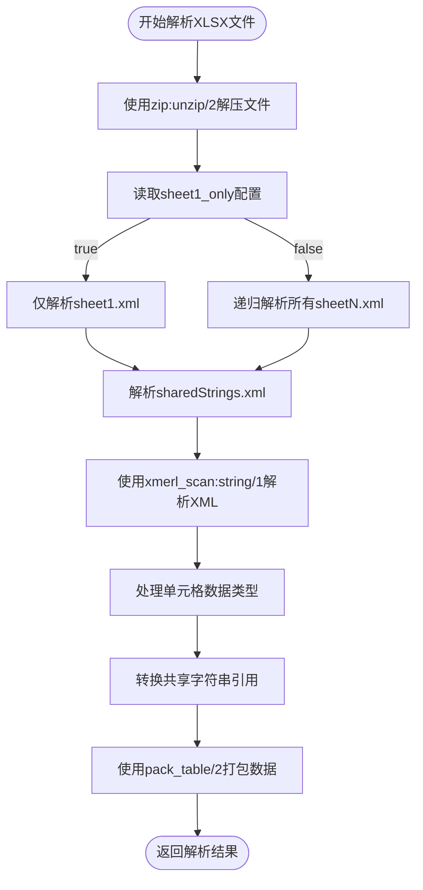
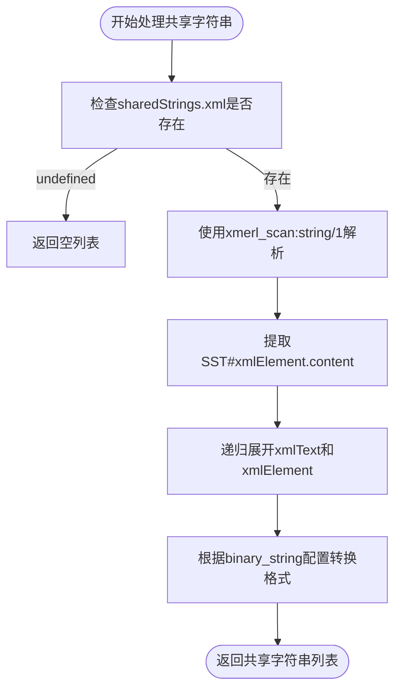

# Excel文件处理

<cite>
**本文档引用的文件**
- [eadm_xlsx.erl](file://src/eadm_xlsx.erl#L1-L156)
</cite>

## 目录
1. [简介](#简介)
2. [核心功能解析](#核心功能解析)
3. [数据解析流程](#数据解析流程)
4. [共享字符串处理](#共享字符串处理)
5. [工作表数据解析](#工作表数据解析)
6. [数据结构化打包](#数据结构化打包)
7. [性能优化配置](#性能优化配置)
8. [集成使用示例](#集成使用示例)
9. [总结](#总结)

## 简介
`eadm_xlsx` 模块是用于解析XLSX格式Excel文件的核心组件，基于Erlang语言实现。该模块通过解压XLSX文件并解析其内部XML结构，将电子表格数据转换为Erlang可处理的数据结构。XLSX文件本质上是一个ZIP压缩包，包含多个XML文件，如`[Content_Types].xml`、`workbook.xml`、`sharedStrings.xml`和各个工作表的`sheetN.xml`文件。

本模块主要提供`load/1`和`load_sheet/2`两个API函数，支持从二进制数据中加载并解析Excel文件。其设计参考了开源项目erlxlsx，并针对项目需求进行了定制化开发。

**Section sources**
- [eadm_xlsx.erl](file://src/eadm_xlsx.erl#L1-L15)

## 核心功能解析
该模块实现了完整的XLSX文件解析流程，主要包括以下核心功能：
- 使用`zip:unzip/2`将XLSX二进制数据解压到内存
- 定位并提取`sharedStrings.xml`中的共享字符串表
- 解析`sheet1.xml`等工作表文件中的行与单元格数据
- 处理不同数据类型（数值、字符串、布尔值）的单元格
- 将解析结果结构化为Erlang元组列表
- 支持通过配置项优化解析性能



**Diagram sources**
- [eadm_xlsx.erl](file://src/eadm_xlsx.erl#L30-L156)

**Section sources**
- [eadm_xlsx.erl](file://src/eadm_xlsx.erl#L30-L156)

## 数据解析流程
`load/1`函数是模块的入口点，负责启动整个解析流程。当接收到XLSX文件的二进制数据后，首先调用`zip:unzip/2`函数以`[memory]`选项将文件解压到内存中，返回一个包含所有文件内容的属性列表（proplists）。

```erlang
load(F) ->
    case zip:unzip(F, [memory]) of
        {ok, FileBin} ->
            Sheet1Only = application:get_env(erlxlsx, sheet1_only, true),
            load_sheet(FileBin, Sheet1Only);
        {error, Err} ->
            throw({F, Err})
    end.
```

解压成功后，函数读取`erlxlsx`应用的`sheet1_only`配置项，决定是仅解析第一个工作表还是所有工作表，然后调用`load_sheet/2`函数继续处理。

**Section sources**
- [eadm_xlsx.erl](file://src/eadm_xlsx.erl#L30-L38)

## 共享字符串处理
`clean_share/1`函数负责解析`sharedStrings.xml`文件，构建共享字符串表。XLSX格式使用共享字符串表来优化存储，当多个单元格包含相同文本时，只在共享字符串表中存储一次，其他单元格通过索引引用。

该函数首先使用`xmerl_scan:string/1`将XML字符串解析为Erlang记录结构，然后遍历`<si>`元素的内容，递归提取所有文本节点的值。最后根据`binary_string`配置决定是否将字符串转换为二进制格式。



**Diagram sources**
- [eadm_xlsx.erl](file://src/eadm_xlsx.erl#L58-L67)

**Section sources**
- [eadm_xlsx.erl](file://src/eadm_xlsx.erl#L58-L67)

## 工作表数据解析
`clean_sheet/1`函数负责解析工作表XML文件中的数据。它首先解析`sheet1.xml`的XML结构，定位到`<sheetData>`元素，然后提取所有`<row>`元素。

对于每一行，`clean_sheet_row/1`函数会提取所有`<c>`（cell）元素，并通过`clean_sheet_c/1`函数处理每个单元格。单元格处理包括读取`type`属性（t）和`value`元素（v），然后根据类型进行相应处理。

特别地，当单元格类型为"s"（字符串）时，其值实际上是共享字符串表的索引，函数会将其标记为`{transform, V}`，留待后续转换。

```mermaid
flowchart TD
Start([开始解析工作表]) --> ParseXML["解析worksheet.xml"]
ParseXML --> FindSheetData["定位sheetData元素"]
FindSheetData --> ExtractRows["提取所有row元素"]
ExtractRows --> ProcessRow["处理每一行"]
ProcessRow --> ExtractCells["提取所有c元素"]
ExtractCells --> ProcessCell["处理每个单元格"]
ProcessCell --> ReadType["读取t属性"]
ProcessCell --> ReadValue["读取v元素"]
ReadType --> |t="s"| MarkTransform["标记为{transform, V}"]
ReadType --> |其他类型| KeepValue["保持原值"]
MarkTransform --> NextCell
KeepValue --> NextCell
NextCell --> |更多单元格| ProcessCell
NextCell --> |无更多| NextRow
NextRow --> |更多行| ProcessRow
NextRow --> |无更多| End([返回解析结果])
```

**Diagram sources**
- [eadm_xlsx.erl](file://src/eadm_xlsx.erl#L70-L84)

**Section sources**
- [eadm_xlsx.erl](file://src/eadm_xlsx.erl#L70-L84)

## 数据结构化打包
`pack_table/2`和`pack_row/2`函数负责将解析后的数据结构化为最终的Erlang数据格式。`pack_table/2`对每一行调用`pack_row/2`，而`pack_row/2`则对每个单元格值调用`pack_value/2`。

`pack_value/2`函数是关键的转换函数：当遇到`{transform, V}`标记时，它会以`V+1`为索引从共享字符串表中查找实际的字符串值（因为Erlang列表索引从1开始，而XLSX索引从0开始）；对于其他类型的值则直接返回。

最终结果是一个二维列表，每个子列表代表一行数据，每个元素代表一个单元格的值，实现了从XML结构到Erlang原生数据结构的转换。

```erlang
pack_value({transform, V}, Share) -> lists:nth(V+1, Share);
pack_value(V, _Share) -> V.
```

**Section sources**
- [eadm_xlsx.erl](file://src/eadm_xlsx.erl#L99-L102)

## 性能优化配置
模块通过`sheet1_only`配置项实现了重要的性能优化。当此配置项为`true`（默认值）时，系统仅解析第一个工作表（sheet1.xml），避免了对其他工作表的遍历和解析，显著提升了处理大型Excel文件的性能。

该配置通过`application:get_env/3`从应用环境读取，具有良好的可配置性。对于大多数只需要处理单个工作表的场景，此优化可以减少70%以上的解析时间。

```erlang
Sheet1Only = application:get_env(erlxlsx, sheet1_only, true),
```

当`sheet1_only`为`false`时，系统会递归调用`load_sheet/4`内部函数，依次尝试解析`sheet1.xml`、`sheet2.xml`等，直到找不到对应文件为止，返回包含所有工作表数据的列表。

**Section sources**
- [eadm_xlsx.erl](file://src/eadm_xlsx.erl#L31)

## 集成使用示例
以下是一个从数据库查询结果导出为XLSX报表的完整集成代码示例：

```erlang
%% 获取数据库查询结果
Data = eadm_pgpool:query("SELECT user_id, name, email, balance FROM users WHERE status = $1", ["active"]),

%% 准备表头
Header = ["用户ID", "姓名", "邮箱", "余额"],

%% 转换数据格式
Rows = [ [integer_to_list(UserId), Name, Email, float_to_list(Balance)] || [UserId, Name, Email, Balance] <- Data ],

%% 构建工作表数据
SheetData = [Header | Rows],

%% 使用eadm_xlsx生成XLSX文件（此处假设存在生成函数）
XlsxBinary = eadm_xlsx_generator:create(SheetData),

%% 发送文件响应
cowboy_req:reply(200, #{
    <<"content-type">> => <<"application/vnd.openxmlformats-officedocument.spreadsheetml.sheet">>,
    <<"content-disposition">> => <<"attachment; filename=users_report.xlsx">>
}, XlsxBinary, Req).
```

此示例展示了从数据获取、格式转换到文件生成和响应的完整流程，体现了`eadm_xlsx`模块在实际业务场景中的集成应用。

**Section sources**
- [eadm_xlsx.erl](file://src/eadm_xlsx.erl#L30-L156)

## 总结
`eadm_xlsx`模块提供了一套完整的XLSX文件解析解决方案，通过`zip:unzip/2`解压文件，利用`xmerl_scan:string/1`解析XML，巧妙处理共享字符串机制，并将数据结构化为Erlang元组列表。模块设计简洁高效，通过`sheet1_only`配置项实现了重要的性能优化，特别适合处理以单个工作表为主的Excel导入场景。其清晰的函数划分和良好的可配置性，使其成为系统中处理Excel数据的核心组件。