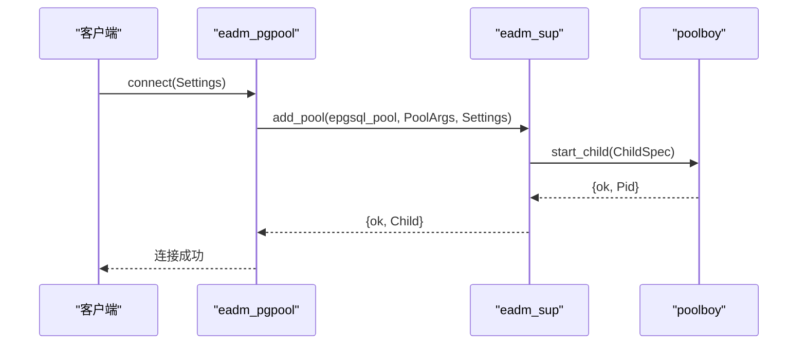
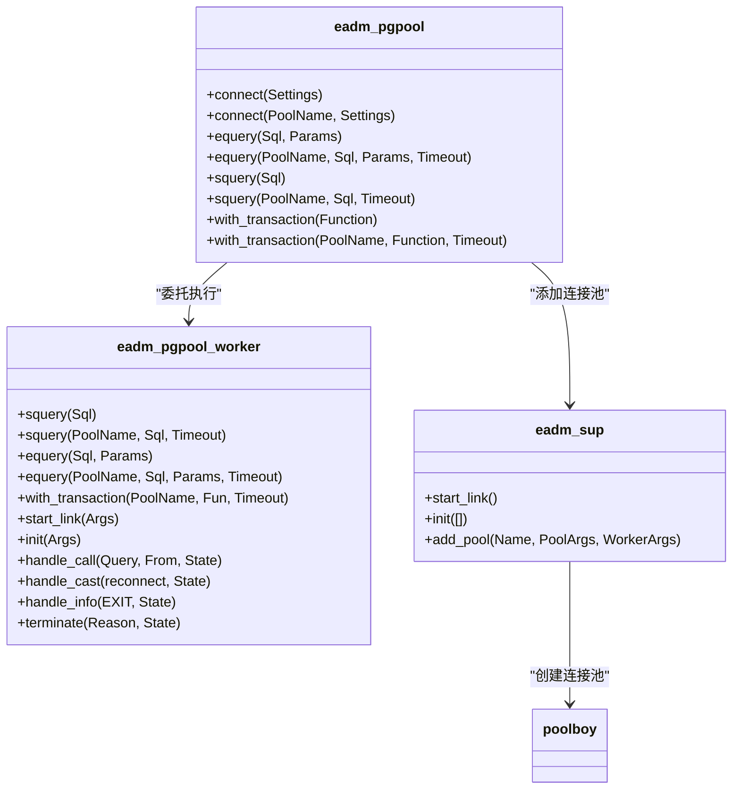
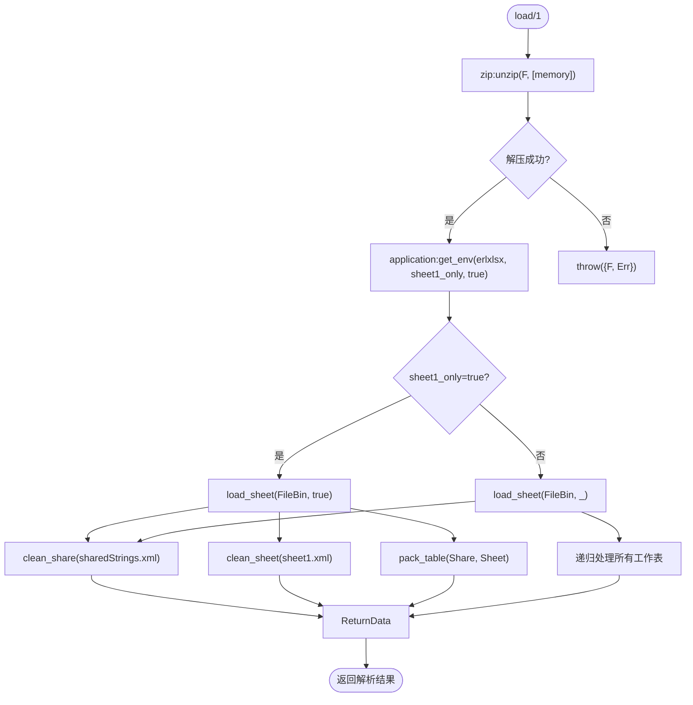
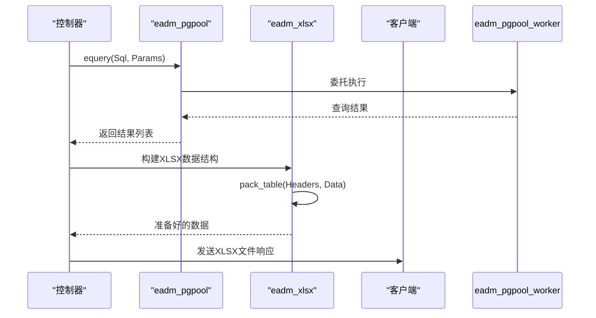
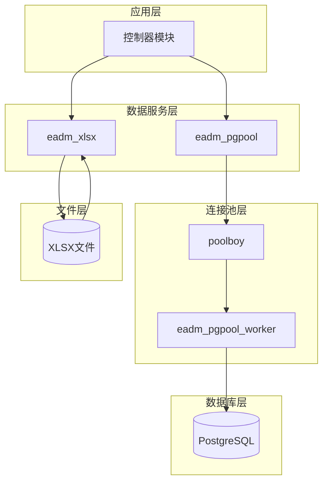
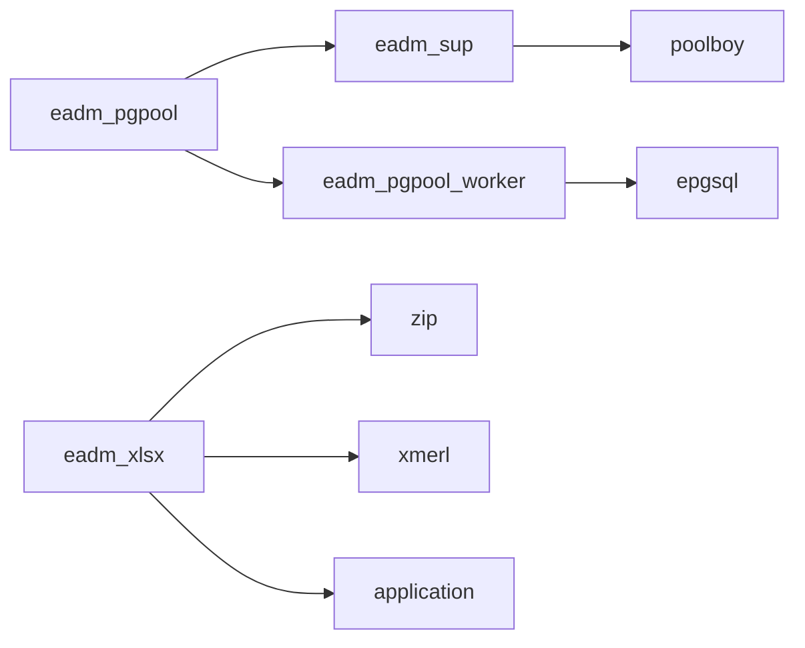

# 数据服务

<cite>
**本文档引用的文件**
- [eadm_pgpool.erl](file://src/eadm_pgpool.erl)
- [eadm_pgpool_worker.erl](file://src/eadm_pgpool_worker.erl)
- [eadm_sup.erl](file://src/eadm_sup.erl)
- [eadm_xlsx.erl](file://src/eadm_xlsx.erl)
</cite>

## 目录
1. [简介](#简介)
2. [数据库连接池功能](#数据库连接池功能)
3. [Excel文件处理功能](#excel文件处理功能)
4. [集成示例](#集成示例)
5. [架构概览](#架构概览)
6. [依赖分析](#依赖分析)

## 简介
本文档详细说明了`eadm`系统中数据服务模块的两大核心功能：数据库连接池管理和Excel文件处理。文档深入分析了`eadm_pgpool.erl`模块如何作为数据库访问入口，通过`poolboy`实现连接池管理，并解析了`eadm_xlsx.erl`模块如何处理XLSX文件的解析与数据提取。通过本技术文档，开发者可以全面理解系统数据层的设计原理和使用方法。

## 数据库连接池功能

`eadm_pgpool.erl`模块作为系统数据库访问的核心入口，实现了基于`poolboy`的连接池管理机制。该模块通过与顶级监督者`eadm_sup`协作，动态创建和管理数据库连接池，为应用程序提供高效、可靠的数据库访问能力。

### 连接池初始化与管理

数据库连接池的创建通过`connect/1`和`connect/2`函数实现。当调用`connect(Settings)`时，系统使用默认连接池名称`epgsql_pool`；而`connect(PoolName, Settings)`则允许指定自定义的连接池名称。

**Diagram sources**
- [eadm_pgpool.erl](file://src/eadm_pgpool.erl#L35-L50)
- [eadm_sup.erl](file://src/eadm_sup.erl#L55-L61)

**Section sources**
- [eadm_pgpool.erl](file://src/eadm_pgpool.erl#L35-L50)
- [eadm_sup.erl](file://src/eadm_sup.erl#L55-L61)

### 连接池参数配置

`connect/2`函数从`Settings`参数中提取连接池配置：
- `size`: 连接池大小，默认值为5
- `max_overflow`: 最大溢出连接数，默认值为5

这些参数与`PoolName`一起构建成`PoolArgs`，并通过`eadm_sup:add_pool/4`调用传递给顶级监督者。`eadm_sup`模块的`add_pool/3`函数利用`poolboy:child_spec/3`创建子进程规范，并通过`supervisor:start_child/2`动态添加连接池到监督树中。

### 数据库操作API

`eadm_pgpool`提供了丰富的数据库操作API，这些API函数最终都委托给`eadm_pgpool_worker`模块执行。

#### 参数化查询 (equery)

`equery/3`和`equery/4`函数用于执行参数化SQL查询：
- `equery(Sql, Params)`: 使用默认连接池执行参数化查询
- `equery(PoolName, Sql, Params)`: 指定连接池执行参数化查询
- `equery(PoolName, Sql, Params, Timeout)`: 指定连接池和超时时间执行参数化查询

**Diagram sources**
- [eadm_pgpool.erl](file://src/eadm_pgpool.erl#L52-L82)
- [eadm_pgpool_worker.erl](file://src/eadm_pgpool_worker.erl#L45-L75)

**Section sources**
- [eadm_pgpool.erl](file://src/eadm_pgpool.erl#L52-L82)
- [eadm_pgpool_worker.erl](file://src/eadm_pgpool_worker.erl#L45-L75)

#### 简单查询 (squery)

`squery/2`和`squery/3`函数用于执行简单SQL查询：
- `squery(Sql)`: 使用默认连接池执行简单查询
- `squery(PoolName, Sql)`: 指定连接池执行简单查询
- `squery(PoolName, Sql, Timeout)`: 指定连接池和超时时间执行简单查询

#### 事务处理 (with_transaction)

`with_transaction/2`和`with_transaction/3`函数用于在事务中执行函数：
- `with_transaction(Function)`: 在默认连接池的事务中执行函数
- `with_transaction(PoolName, Function)`: 在指定连接池的事务中执行函数
- `with_transaction(PoolName, Function, Timeout)`: 在指定连接池和超时时间的事务中执行函数

### 连接池工作进程

`eadm_pgpool_worker.erl`模块实现了`poolboy_worker`行为，作为连接池中的工作进程。该模块包含以下关键功能：

1. **连接管理**: `init/1`函数初始化时调用`connect/1`建立数据库连接，`handle_info/2`处理连接断开时的重新连接逻辑
2. **查询执行**: `handle_call/3`处理来自客户端的查询请求，直接调用`epgsql`库执行SQL
3. **事务支持**: `with_transaction/3`函数通过`middle_man_transaction/3`实现事务的隔离执行
4. **错误恢复**: 采用指数退避策略进行连接重试，延迟时间从500ms开始，每次加倍，最大不超过5分钟

## Excel文件处理功能

`eadm_xlsx.erl`模块负责处理XLSX文件的解析和数据提取，将复杂的Excel文件结构转换为易于处理的Erlang数据结构。

### XLSX文件加载与解压

`load/1`函数是XLSX文件处理的入口点，它接收二进制格式的XLSX文件数据，并使用Erlang标准库中的`zip:unzip/2`函数将其解压为内存中的二进制数据列表。

**Diagram sources**
- [eadm_xlsx.erl](file://src/eadm_xlsx.erl#L25-L35)
- [eadm_xlsx.erl](file://src/eadm_xlsx.erl#L37-L55)

**Section sources**
- [eadm_xlsx.erl](file://src/eadm_xlsx.erl#L25-L55)

### 共享字符串处理

XLSX文件使用共享字符串表来优化存储，`clean_share/1`函数负责解析`xl/sharedStrings.xml`文件中的共享字符串：

1. 使用`xmerl_scan:string/1`将XML字符串解析为Erlang记录
2. 遍历XML元素，提取所有文本内容
3. 根据`binary_string`配置将字符串转换为二进制格式

### 工作表数据解析

`clean_sheet/1`函数解析`xl/worksheets/sheet1.xml`中的表格数据：

1. 使用`xmerl_scan:string/1`解析工作表XML
2. 定位`sheetData`元素，提取所有`row`元素
3. 对每一行调用`clean_sheet_row/1`处理

`clean_sheet_row/1`和`clean_sheet_c/1`函数进一步解析行和单元格数据，提取单元格的类型和值。

### 数据结构化

解析后的数据通过`pack_table/2`和`pack_row/2`函数进行结构化：

- `pack_table/2`: 将整张工作表的数据打包，对每一行调用`pack_row/2`
- `pack_row/2`: 处理一行中的每个单元格，如果单元格值需要转换（标记为`{transform, V}`），则从共享字符串表中获取实际值

### 性能优化配置

`sheet1_only`配置项对性能有显著影响：
- 当设置为`true`（默认值）时，系统只解析第一个工作表，大大减少处理时间和内存消耗
- 当设置为`false`时，系统递归解析所有工作表，适用于需要处理多工作表的场景，但性能开销较大

## 集成示例

以下示例展示了如何从数据库查询数据并导出为XLSX文件的完整流程：

**Diagram sources**
- [eadm_pgpool.erl](file://src/eadm_pgpool.erl#L52-L82)
- [eadm_xlsx.erl](file://src/eadm_xlsx.erl#L75-L95)

**Section sources**
- [eadm_pgpool.erl](file://src/eadm_pgpool.erl#L52-L82)
- [eadm_xlsx.erl](file://src/eadm_xlsx.erl#L75-L95)

## 架构概览

**Diagram sources**
- [eadm_pgpool.erl](file://src/eadm_pgpool.erl)
- [eadm_xlsx.erl](file://src/eadm_xlsx.erl)
- [eadm_pgpool_worker.erl](file://src/eadm_pgpool_worker.erl)

## 依赖分析

**Diagram sources**
- [eadm_pgpool.erl](file://src/eadm_pgpool.erl#L35-L50)
- [eadm_sup.erl](file://src/eadm_sup.erl#L55-L61)
- [eadm_xlsx.erl](file://src/eadm_xlsx.erl#L25-L35)

**Section sources**
- [eadm_pgpool.erl](file://src/eadm_pgpool.erl#L35-L50)
- [eadm_sup.erl](file://src/eadm_sup.erl#L55-L61)
- [eadm_xlsx.erl](file://src/eadm_xlsx.erl#L25-L35)