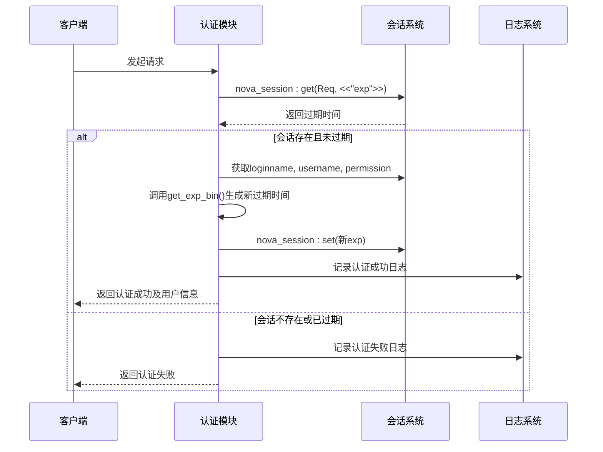
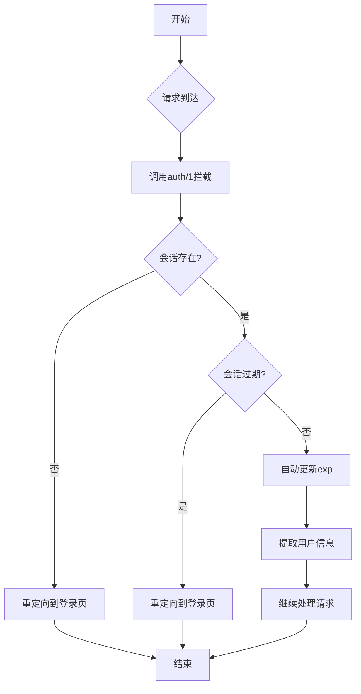
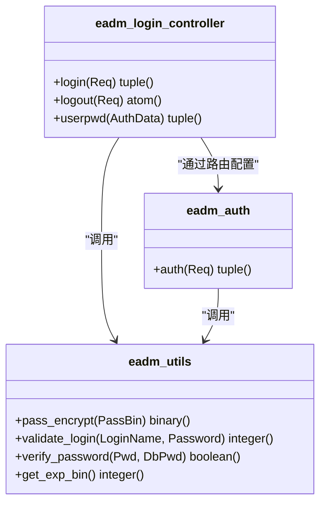
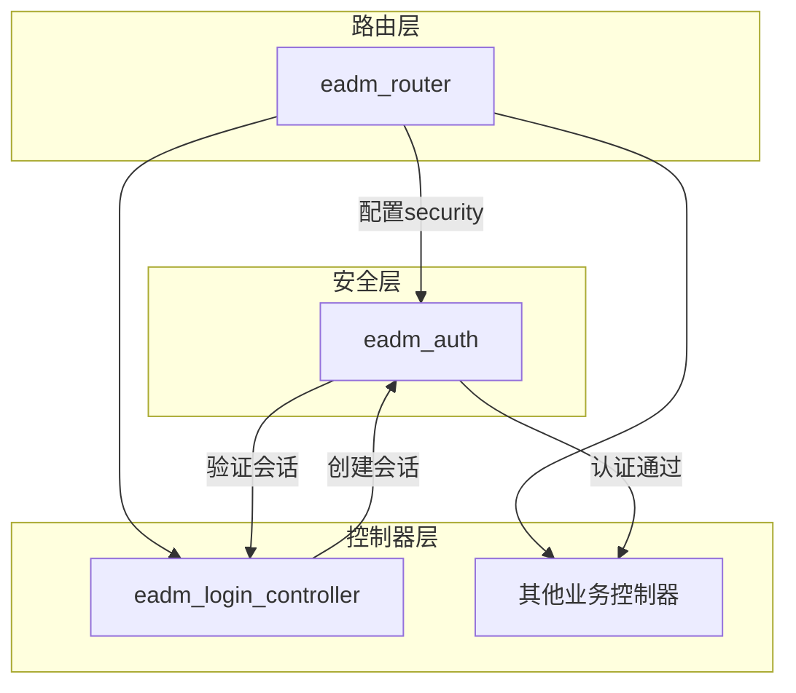

# 认证与安全

<cite>
**本文档引用的文件**  
- [eadm_auth.erl](file://src/eadm_auth.erl)
- [eadm_utils.erl](file://src/eadm_utils.erl)
- [eadm_login_controller.erl](file://src/controllers/eadm_login_controller.erl)
- [eadm_router.erl](file://src/eadm_router.erl)
</cite>

## 目录
1. [简介](#简介)
2. [认证流程详解](#认证流程详解)
3. [会话管理机制](#会话管理机制)
4. [密码加密与验证](#密码加密与验证)
5. [日志记录设计](#日志记录设计)
6. [MVC架构中的角色分析](#mvc架构中的角色分析)
7. [配置管理](#配置管理)
8. [调用示例](#调用示例)
9. [结论](#结论)

## 简介
本技术文档详细阐述了基于Nova框架的认证与安全模块实现机制。重点分析`eadm_auth.erl`中的`auth/1`函数如何通过Nova会话系统实现用户身份验证、自动续期和权限管理。同时结合`eadm_utils.erl`和`eadm_login_controller.erl`，全面说明密码加密存储、会话生命周期管理和系统集成方式。

## 认证流程详解

`eadm_auth:auth/1`函数是整个认证系统的核心入口，负责验证用户会话的有效性并提取关键用户信息。

该函数首先通过`nova_session:get/2`尝试获取会话中的过期时间（`exp`）字段。如果获取成功且该时间戳为整数类型，并且大于当前系统时间，则认为会话有效。此时，函数会继续获取用户的登录名（`loginname`）、用户名（`username`）和权限（`permission`）等信息。

在验证通过后，系统会调用`eadm_utils:get_exp_bin/0`生成一个新的过期时间，并通过`nova_session:set/3`更新会话中的`exp`字段，从而实现会话的自动续期功能。

如果会话已过期或不存在，函数将返回认证失败的结果，并通过Lager日志系统记录相应的错误信息。

**图示来源**
- [eadm_auth.erl](file://src/eadm_auth.erl#L34-L48)
- [eadm_utils.erl](file://src/eadm_utils.erl#L29-L35)

**章节来源**
- [eadm_auth.erl](file://src/eadm_auth.erl#L34-L48)

## 会话管理机制

系统采用基于时间戳的会话管理机制，通过`exp`字段控制会话生命周期。会话数据存储在Nova框架的会话系统中，包含以下关键字段：

- `exp`: 会话过期时间戳（Unix时间）
- `loginname`: 用户登录名
- `username`: 用户显示名称
- `permission`: 用户权限数据

会话的创建发生在用户成功登录时，由`eadm_login_controller:login/1`函数完成。该函数在验证用户凭证后，会设置所有会话字段，包括最新的过期时间。

会话的销毁通过`eadm_login_controller:logout/1`函数实现，调用`nova_session:delete/1`清除所有会话数据。

**图示来源**
- [eadm_auth.erl](file://src/eadm_auth.erl#L34-L48)
- [eadm_login_controller.erl](file://src/controllers/eadm_login_controller.erl#L35-L55)

**章节来源**
- [eadm_auth.erl](file://src/eadm_auth.erl#L34-L48)
- [eadm_login_controller.erl](file://src/controllers/eadm_login_controller.erl#L35-L55)

## 密码加密与验证

系统采用SHA256加盐哈希算法存储用户密码，确保密码安全。相关功能由`eadm_utils.erl`中的`pass_encrypt/1`和`validate_login/2`函数实现。

`pass_encrypt/1`函数首先从应用配置中获取`secret_key`，然后将该密钥与用户密码进行拼接，最后通过SHA256哈希并Base64编码生成最终的加密密码。

`validate_login/2`函数负责验证用户登录凭证。它首先查询数据库获取用户的加密密码，然后使用相同的加盐哈希算法对用户输入的密码进行处理，最后比较两个哈希值是否相等。

**图示来源**
- [eadm_utils.erl](file://src/eadm_utils.erl#L281-L287)
- [eadm_login_controller.erl](file://src/controllers/eadm_login_controller.erl#L45-L55)

**章节来源**
- [eadm_utils.erl](file://src/eadm_utils.erl#L281-L287)
- [eadm_login_controller.erl](file://src/controllers/eadm_login_controller.erl#L45-L55)

## 日志记录设计

系统采用Lager日志框架记录认证状态和安全事件。在关键操作点都设置了日志记录：

- 认证成功时记录用户信息和会话更新情况
- 认证失败时记录失败原因（会话过期或不存在）
- 登录成功和失败时记录相应事件
- 密码修改等敏感操作记录审计日志

日志信息包含时间戳、进程ID、用户信息和操作详情，便于系统监控和故障排查。所有日志输出都采用结构化格式，便于后续分析和处理。

**章节来源**
- [eadm_auth.erl](file://src/eadm_auth.erl#L42-L46)
- [eadm_login_controller.erl](file://src/controllers/eadm_login_controller.erl#L48-L52)

## MVC架构中的角色分析

在MVC架构中，`eadm_auth`模块作为控制器的前置拦截器（security interceptor）发挥作用。通过`eadm_router.erl`中的路由配置，为需要认证的路由组设置安全策略。

所有以`security => {eadm_auth, auth}`配置的路由，在执行目标控制器函数前，都会先调用`eadm_auth:auth/1`进行认证检查。如果认证失败，请求将被重定向到登录页面；如果认证成功，用户信息将被注入到请求上下文中，供后续处理使用。

`eadm_login_controller`作为专门处理用户认证的控制器，与`eadm_auth`形成协同工作关系：前者负责会话的创建和销毁，后者负责会话的验证和维护。

**图示来源**
- [eadm_router.erl](file://src/eadm_router.erl#L37-L164)
- [eadm_auth.erl](file://src/eadm_auth.erl#L34-L48)

**章节来源**
- [eadm_router.erl](file://src/eadm_router.erl#L37-L164)

## 配置管理

会话过期时间通过Erlang应用环境变量进行配置。系统调用`application:get_env(nova, session_expire, 3600)`获取配置值，如果未设置则使用默认值3600秒（1小时）。

该配置可以在`sys.config`文件中进行设置，实现了配置与代码的分离，便于在不同环境中调整会话策略。密钥（`secret_key`）也采用相同的配置管理方式，确保系统的安全性和可维护性。

**章节来源**
- [eadm_utils.erl](file://src/eadm_utils.erl#L29-L35)
- [eadm_utils.erl](file://src/eadm_utils.erl#L281-L287)

## 调用示例

以下是会话管理的完整调用流程示例：

1. **会话创建**：用户登录时，`login/1`函数设置所有会话字段
2. **会话验证**：访问受保护路由时，`auth/1`自动验证并续期
3. **会话销毁**：用户登出时，`logout/1`函数清除会话

这些操作共同构成了完整的会话生命周期管理。

**章节来源**
- [eadm_login_controller.erl](file://src/controllers/eadm_login_controller.erl#L35-L55)
- [eadm_auth.erl](file://src/eadm_auth.erl#L34-L48)

## 结论

本认证与安全模块基于Nova框架的会话机制，实现了完整的用户身份验证解决方案。通过自动续期机制提升了用户体验，通过加盐哈希算法保障了密码安全，通过Lager日志系统提供了完善的审计能力。模块在MVC架构中作为前置拦截器，与登录控制器协同工作，构成了系统安全的第一道防线。